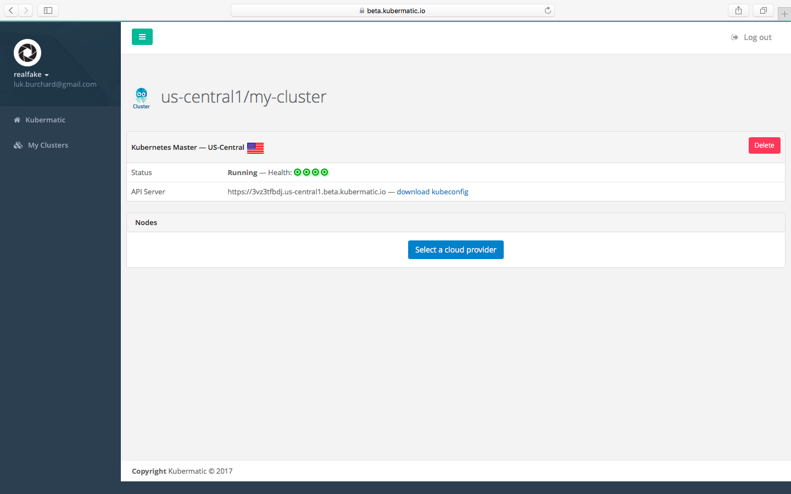
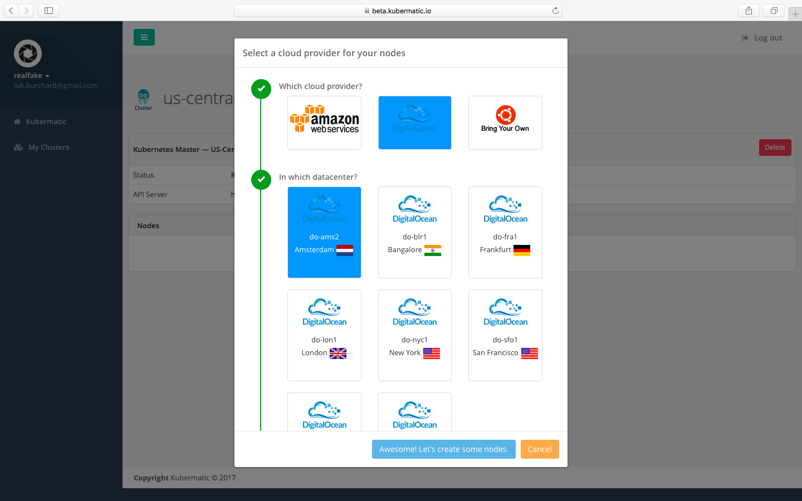
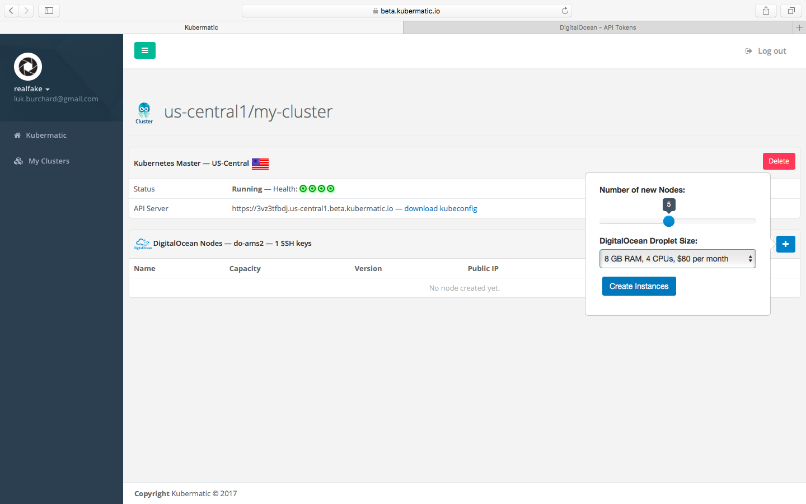
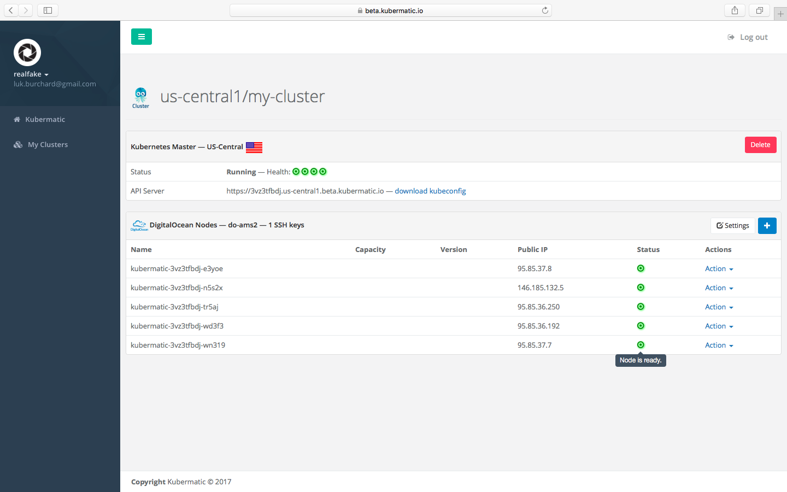
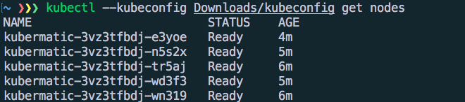

# Outline
Create and overview and architecture docu for users:

Let's start with the following topics:

* What is Kubermatic
  * Differenciate between SaaS and Hosted
* Architecture
* Features
* Usage
  * Create/delete cluster
  * Add/remove nodes
* Launch Stages (similar https://cloud.google.com/terms/launch-stages or https://dcos.io/docs/1.8/overview/feature-maturity/)

Examples for similar documentations are:
http://docs.rancher.com/rancher/v1.3/en/
https://dcos.io/docs/1.8/overview/
https://docs.docker.com/datacenter/ucp/2.0/guides/

-------------

# About Kubermatic
Kubermatic is a Cluster-as-a-Service that provides managed Kubernetes for your infrastructure. 

With Kubermatic, you can set up Kubernetes clusters deployed at the click of button. 
While Kubermatic makes sure that your cluster is available and up-to-date at all times, you can focus on developing your services. 

Kubermatic is directly integrated with leading cloud providers DigitalOcean and Amazon Web Services, as well as any provider offering Ubuntu 16.04 or greater, even in your own datacenter. 

The following description mainly refers to the beta release of Kubermatic, which is publicly available under https://beta.kubermatic.io.

# Architecture
Coverage{

* Rely on Kubernetes to manage Kubernetes
  * High AV
  * Stability
* API is on master cluster
* Master speeks with Seed clusters
  * Seed is in local datacenter
  * Seed is self managed
* Seed deploys customer components
  * Customer components are fully managed by Kubernetes
* Drawing

}

Kubermatic's infrastructure consists of three main components that provide maximum availability without compromising on flexibility.

#### Master cluster
The master cluster runs all user facing services such as the API or the dashboard. 
All components run using Kubernetes to make them fault-tolerant and scalable to support even high load scenarios.

#### Seed cluster
The seed cluster runs in a Google Cloud datacenter to provide low latency and a highly reliable internet connection. 
It's purpose is to deploy the final customer clusters.
The seed cluster itself is likewise managed by Kubernetes.
The master cluster communicates with a selected seed cluster to deploy a customer cluster.

### Customer cluster
The customer cluster provides all needed components to run a Kubernetes cluster such as etcd and the Kubernetes master.
The services will be proxied to the nodes of the customer which are located in their datacenter.

# Features
Coverage{

* Install Kubernetes (obviously)
* Update Kubernetes
* Manage nodes
  * Manage Network
  * Init cloud provider

}

# With Kubermatic you can:
#### Use Kubernetes
By providing managed Kubernetes clusters for your infrastructure, Kubermatic makes Kubernetes as easy as it can be.
Kubermatic empowers you to take advantage of all the advanced features that Kubernetes hast to offer and increases the speed, flexibility and scalability of your cloud deployment workflow. 

#### Update Kubernetes
Kubermatic provides live updates of your Kubernetes cluster without disrupting your daily business.
Use all new features of Kubernetes as you increase scale.

#### Scale your cluster
You can add and remove nodes in our easy to use dashboard. 
Just specify the amount of nodes in your Kubernetes cluster, and Kubermatic scales the cluster up or down to your needs.

# Feature Majority
Coverage {
  * Alpha
  * Beta
  * Public
  * Depreciated

}

#### Alpha
Alpha is an early stage product for which we cant offer any SLA's or API stability. However the workflow of the product is defined but still it is missing features.
It is only available to a small group of customers.

#### Beta
Beta is open to every customer. We provide an API with minor changes in a few cases. All features should be ready to use. This release is mainly used to profile real world usage and performance as well as spotting the last bugs.

#### Public
This release is stable, feature complete and provides a SLA. It is publicly available and meant to be used in production.

#### Deprecated
Those products/features will be removed in a specified time. There is also to further support.

# Roadmap
Coverage {
  * More Node Providers
    * Google Cloud
    * Need more for the roadmap
  * Local Seeds
  * Automatic Scaling
  * Addons

}

We are constantly developing Kubermatic to provide the best service to our customers. Some of the upcoming Kubermatic features are:

#### More cloud providers
We are constantly adding new cloud providers to offer customers a wide range of platforms to chose from.  

#### Automated Scaling
Reacting on fast growing loads can be a difficult task. Therefore,  we will offer automated scaling of your Kubernetes cluster.
By analyzing and predicting your workload, we scale your cluster on demand to ensure customers never have to wait for you and vice versa.

# Usage
Coverage{

* Pics ....

}
### Login:
Navigate to the dashboard on `https://beta.kubermatic.io`and login using your Github or Google profile.

Click on the `Create Kubernets Cluster` button.

Type in a name for the cluster.
Select the locality of the seed cluster and click `Create Kubernets Cluster`.
This will create the Kubernetes master components.

Your cluster is displayed as following:

You can see that the components are not running yet, because the status icons are marked in blue. 

After a few minutes, the status icons swich to green and your cluster is ready to go.

Click `Select a cloud provider`to determine where the actual nodes should run.
In this example, we choose a DigitalOcean datacenter in Amsterdam to demonstrate the independence of the seed cluster and the customer's nodes.

You now have to provide a DigitalOcean token with `Read` and `Write` access and select SSH keys saved in the DigitalOcean account to access them later over SSH.

Select the number and size of nodes to add to the cluster.

The dashboard will indicate `Node Ready` as soon as they are. This can take a few minutes.

Download the kubeconfig by clicking `download kubeconfig` to connect to your newly deployed Kubernetes server via kubectl.

Happy Hacking!
