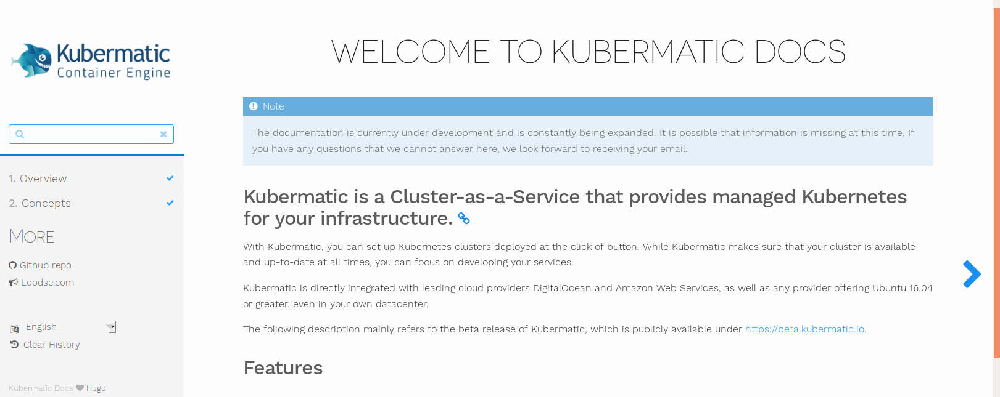

# Kubermatic Documentation



Kubermatic is a Cluster-as-a-Service that provides managed Kubernetes for your infrastructure.

With Kubermatic, you can set up Kubernetes clusters deployed at the click of button. While Kubermatic makes sure that your cluster is available and up-to-date at all times, you can focus on developing your services.

## Generate Kubermatic Docs locally

To generate the documentation you will need to download and install the [hugo](https://gohugo.io/overview/installing/) static website engine.

Clone the repository to your local device and create a new feature branch.

```
git clone https://github.com/kubermatic/docs
git checkout -b my-new-contribution
```

Generate and serve the documentation at `localhost:1313`:

```
hugo server -b localhost:1313 -w
```

For further information please have a look at our contribution guide [here](https://docs.kubermatic.io/contributing/contributing/).
