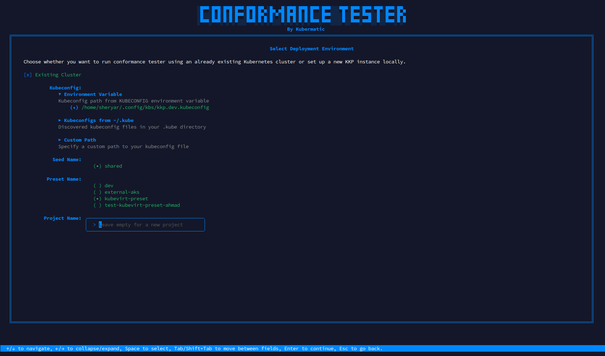
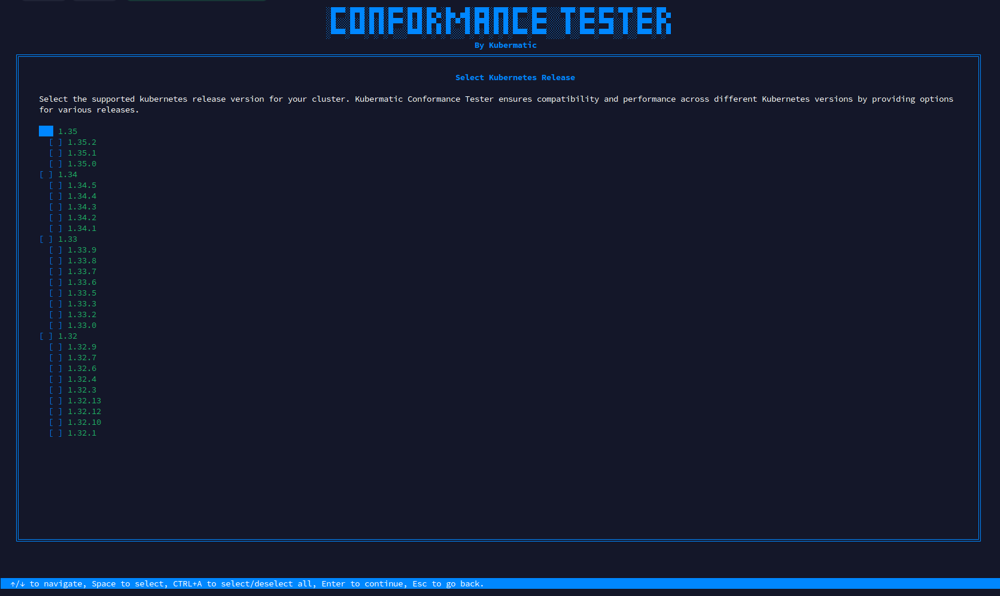
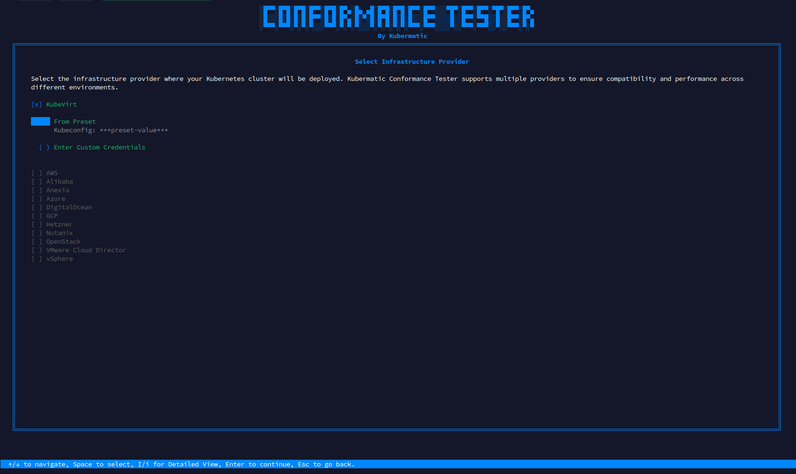
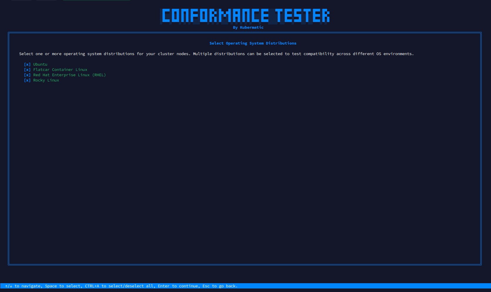
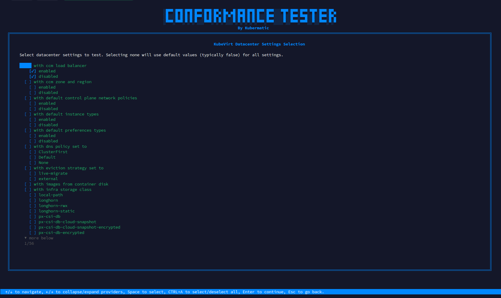
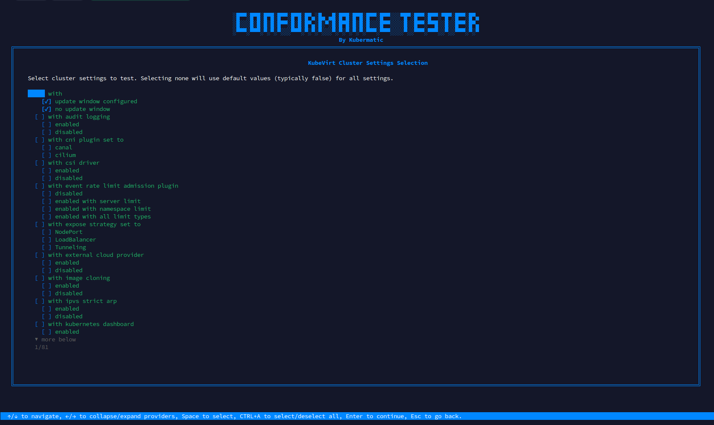
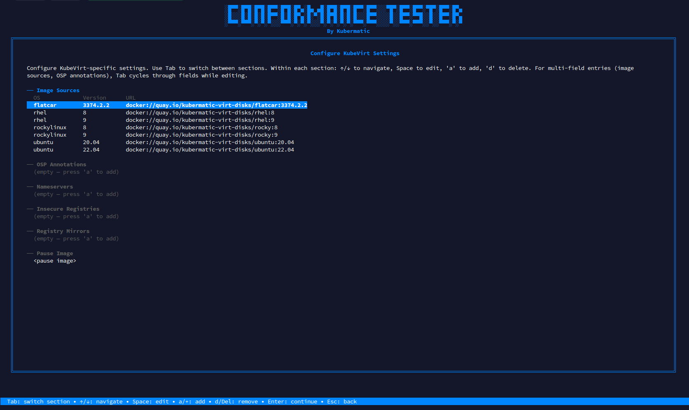
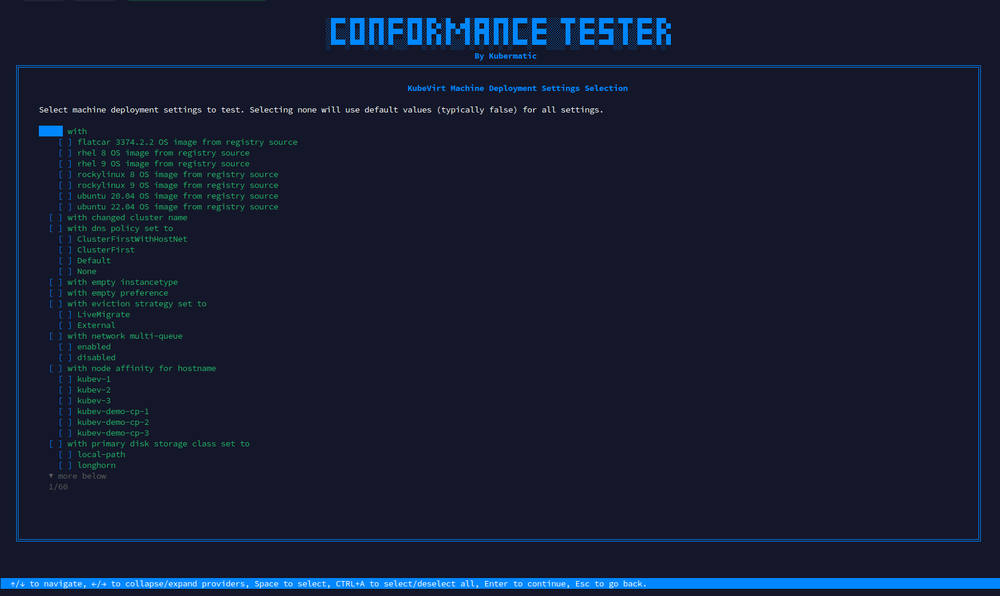
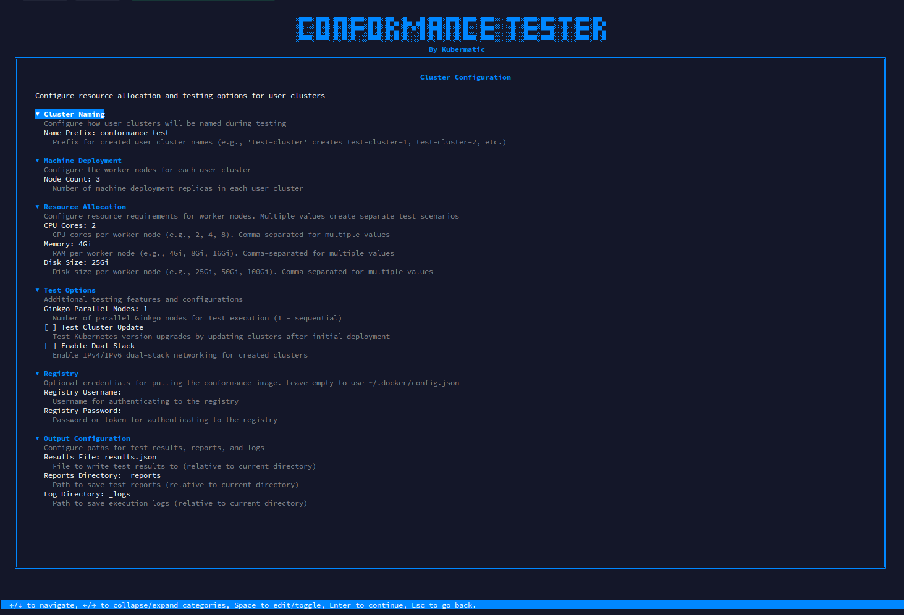
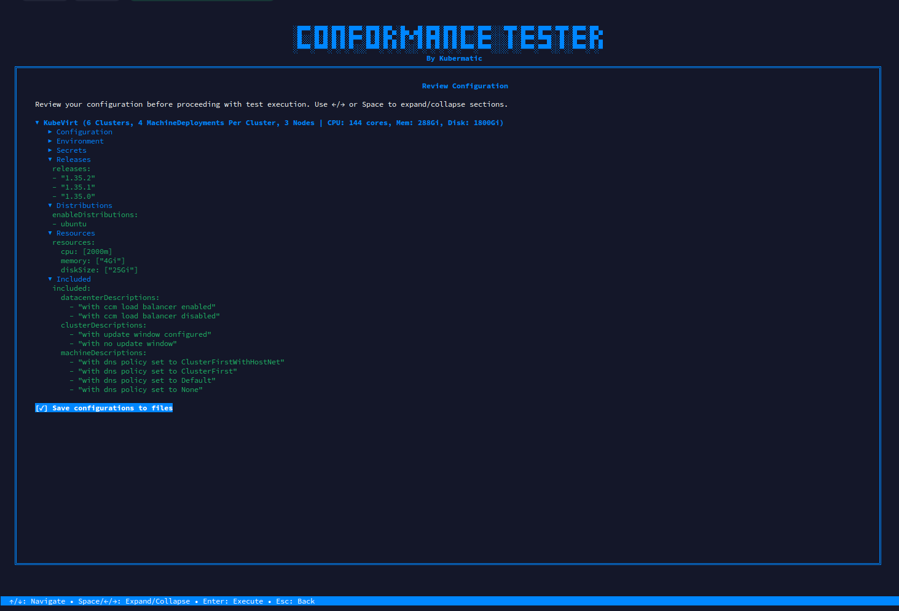

+++
title = "Running Your First Test"
date = 2026-03-17T10:07:15+02:00
weight = 10
+++

This guide walks you through running your first conformance test using the Conformance Tester interactive TUI.

## Prerequisites

Before starting, ensure you have:

- A running KKP installation with at least one KubeVirt datacenter configured
- A kubeconfig with access to the KKP seed cluster
- The `kubermatic-ee-downloader` tool ([download]())
- The conformance-tester binary downloaded via `kubermatic-ee-downloader get conformance-tester`

## Launch the TUI

Start the interactive wizard:

```bash
./conformance-tester
```

The TUI guides you through each configuration step before running any tests.

## Step 1: Select Your Environment

Choose **Existing Cluster** to connect to a running KKP installation. The TUI will let you pick the kubeconfig source — from the `KUBECONFIG` environment variable, a discovered file in your home directory, or a custom path.

After selecting the kubeconfig, the TUI fetches available seeds and presets from your cluster. Select the seed and preset that match your KubeVirt datacenter.



{}
Use **Tab** / **Shift+Tab** to move between fields and **Enter** to confirm your selection.
{}

## Step 2: Select Kubernetes Release

Choose the Kubernetes version to test. The TUI displays all supported releases grouped by minor version. Select one or more patch versions using **Space**, or use **Ctrl+A** to toggle all versions in a minor release group.

For a first test, select a single recent patch release to keep the test matrix small.



Press **Enter** to continue.

## Step 3: Select Infrastructure Provider

Select **KubeVirt** as the infrastructure provider. Once selected, choose how to supply credentials:

- **From Preset** — uses the preset selected in Step 1 (recommended)
- **Enter Custom Credentials** — manually provide a kubeconfig for KubeVirt



Press **I** to expand the detailed credential view for any provider. Press **Enter** to continue.

## Step 4: Select OS Distributions

Choose one or more operating system distributions for cluster nodes. For a minimal first test, select **Ubuntu** only. You can select additional distributions (Flatcar, RHEL, Rocky Linux) to expand coverage once your basic setup is confirmed.



Use **Space** to toggle selections and **Enter** to continue.

## Step 5: Configure Datacenter Settings

Select the KubeVirt-specific datacenter settings to include in the test matrix. Leaving none selected uses default values for all settings, which is recommended for a first run.



Press **Enter** to accept defaults and continue.

## Step 6: Configure Cluster Settings

Select cluster-level settings to vary across test runs — for example, CNI plugin, admission controllers, or feature gates. Leaving none selected uses defaults for all settings.



Press **Enter** to continue.

## Step 7: Configure OS Image Sources

This step is specific to KubeVirt. Map each selected OS distribution and version to a container image source. The table shows columns for OS, version, and image path.

Use **Tab** to switch between sections, **↑/↓** to navigate rows, **A** or **+** to add an entry, and **D** or **Delete** to remove one.



{}
Images must be accessible from the KubeVirt infrastructure. Use `docker://` URIs pointing to a registry reachable from the seed cluster.
{}

## Step 8: Configure Machine Deployment Settings

Select machine deployment options to vary across test runs, such as disk type or network configuration. Defaults are used for any unselected settings.



Press **Enter** to continue.

## Step 9: Configure Cluster Parameters

Set the resource allocation and runtime options for test clusters:

- **Cluster Name** — prefix used for all created clusters
- **Machine Deployment** — number of worker nodes and resource sizes (CPU, memory, disk)
- **Test Options** — parallel test runners, test focus/skip filters
- **Registry** — optional mirror for pulling test images
- **Results** — output directory for JUnit XML reports



Use **↑/↓** to navigate fields and **Space** to edit or toggle a value.

## Step 10: Review and Execute

The final screen shows a YAML summary of your complete configuration. Review all settings before proceeding. Use **↑/↓** and **←/→** to scroll and expand sections.



Press **Enter** to start the conformance tests. The TUI switches to a live log view as test jobs are submitted to the cluster. Press **Ctrl+C** to cancel execution.

## Reviewing Results

After tests complete, JUnit XML reports are written to the results directory you configured:

```text
reports/
├── junit.with_kubernetes_1.35.2_and_ubuntu_22.04_and_canal.xml
└── ...
```

These files can be imported into any CI system that supports JUnit XML format.

## Troubleshooting

### Cluster Creation Timeout

If cluster creation exceeds the timeout:

- Verify the KKP API is accessible from the test pod
- Check KKP controller logs for provisioning errors
- Ensure the cloud provider has sufficient quota

### Node Not Ready

If worker nodes fail to reach Ready state:

- Check machine controller logs in the user cluster
- Verify the OS image is accessible from the KubeVirt infrastructure
- Ensure the storage class exists and has available capacity
