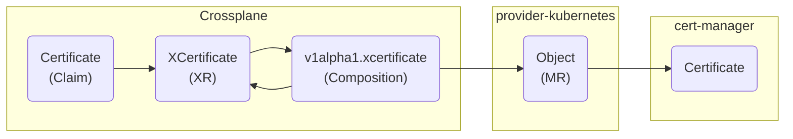
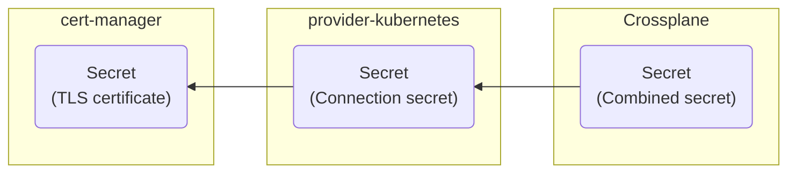

+++
title = "Publishing Resources using Crossplane"
linkTitle = "Using Crossplane"
weight = 2
+++

This guide describes the process of leveraging Crossplane as a service provider to make Crossplane
claims available as `PublishedResources` for use in KDP. This involves installing Crossplane -
including all required Crossplane [providers][crossplane/docs/providers] and
[configuration packages][crossplane/docs/configurations] - and
[publishing]() (a subset of) the Crossplane claims.

## Overview

The [api-syncagent]() is responsible for synchronizing objects from
KDP to the local service cluster where the service provider is in charge of processing these
synchronized objects to provide the actual functionality of a service. One possibility is to leverage
Crossplane to create new abstractions and custom APIs, which can be published to KDP and consumed by
platform users.

> [!NOTE]
> While this guide is not intended to be a comprehensive Crossplane guide, it is useful to be aware
> of the most common terms:
>
> - **Providers** are pluggable building blocks to provision and manage resources via a third-party API (e.g. AWS provider)
> - **Managed resources** (MRs) are representations of actual, provider-specific resources (e.g. EC2 instance)
> - **Composite resource definitions** (XRDs) are Crossplane-specific definitions of API resources (similar to CRDs)
> - **Composite resources** (XRs) and **Claims** are Crossplane-specific custom resources created from XRD objects (similar to CRs)
> - **Compositions** are Crossplane-specific templates for transforming a XR object into one or more MR object(s)

This guide will show you how to install Crossplane and all required providers on a service cluster
and provide a stripped-down `Certificate` resource in KDP. While we ultimately use cert-manager to
provide the actual TLS certificates, we will expose only a very limited number of fields of the
cert-manager `Certificate` to the platform users - in fact a single field to set the desired common
name.

> [!NOTE]
> The [Upbound marketplace][upbound/marketplace/configurations] provides a list of available
> configuration packages (reusable packages of compositions and XRDs), but at the time of writing
> no suitable configuration package that relies only on the Kubernetes / Helm provider and works
> out of the box was available.

## Install Crossplane

First we need to install Crossplane via the [official Helm chart][crossplane/github/chart]. By
default, Crossplane does not require any special configuration so we will just use the default
values provided by the Helm chart.

```bash
helm upgrade crossplane crossplane \
  --install \
  --create-namespace \
  --namespace=crossplane-system \
  --repo=https://charts.crossplane.io/stable \
  --version=1.20.0 \
  --wait
```

Once the installation is done, verify the status with the following command:

```bash
kubectl get pods --namespace=crossplane-system
NAME                                       READY   STATUS    RESTARTS   AGE
crossplane-6494656b8b-bflcf                1/1     Running   0          45s
crossplane-rbac-manager-8458557cdd-sls58   1/1     Running   0          45s
```

## Install Crossplane providers

With Crossplane up and running, we can continue and install the necessary Crossplane packages
(providers), composite resource definitions, and compositions.

In order to manage arbitrary Kubernetes objects with Crossplane (and leverage cert-manager to
issue TLS certificates), we are going to install the `provider-kubernetes` on the service cluster.
Additionally (and for the sake of simplicity), we create a `DeploymentRuntimeConfig` to assign the
provider a specific service account, which can be used to assign the required permissions.

```bash
kubectl apply --filename=- <<EOF
---
apiVersion: pkg.crossplane.io/v1beta1
kind: DeploymentRuntimeConfig
metadata:
  name: crossplane-provider-kubernetes
spec:
  serviceAccountTemplate:
    metadata:
      name: crossplane-provider-kubernetes
---
apiVersion: pkg.crossplane.io/v1
kind: Provider
metadata:
  name: crossplane-provider-kubernetes
  labels:
    app.kubernetes.io/component: provider
spec:
  package: xpkg.crossplane.io/crossplane-contrib/provider-kubernetes:v0.17.1
  runtimeConfigRef:
    name: crossplane-provider-kubernetes
EOF
```

Once the provider is installed, verify the provider status with the following command:

```bash
kubectl get providers crossplane-provider-kubernetes
NAME                             INSTALLED   HEALTHY   PACKAGE                                                          AGE
crossplane-provider-kubernetes   True        True      xpkg.crossplane.io/crossplane-contrib/provider-kubernetes:v0.17.1   104s
```

With the `provider-kubernetes` in place, we assign the provider-specific service account
cluster-admin permissions (you know, for the sake of simplicity) and create a `ProviderConfig`
to instruct the provider to use the provided service account token for authentication.

```bash
kubectl apply --filename=- <<EOF
---
apiVersion: rbac.authorization.k8s.io/v1
kind: ClusterRoleBinding
metadata:
  name: crossplane:provider:crossplane-provider-kubernetes:cluster-admin
roleRef:
  apiGroup: rbac.authorization.k8s.io
  kind: ClusterRole
  name: cluster-admin
subjects:
  - kind: ServiceAccount
    name: crossplane-provider-kubernetes
    namespace: crossplane-system
---
apiVersion: kubernetes.crossplane.io/v1alpha1
kind: ProviderConfig
metadata:
  name: in-cluster
spec:
  credentials:
    source: InjectedIdentity
EOF
```

## Install cert-manager

Now that Crossplane and all required providers are installed and properly configured, we can
install cert-manager and apply our own `CompositeResourceDefinition` to the service cluster.

We install cert-manager via the [official Helm chart][cert-manager/github/chart] including all CRDs.

```bash
helm upgrade cert-manager cert-manager \
  --install --create-namespace \
  --namespace=cert-manager \
  --repo=https://charts.jetstack.io \
  --version=v1.18.2 \
  --set=installCRDs=true \
  --wait
```

## Define Crossplane claims

Once cert-manager is installed, we can finally define our own stripped-down `Certificate` resource
and provide a default Crossplane composition, which creates a cert-manager `Certificate` for each
Crossplane specific `Certificate` object.

Create and apply the following three manifests to your service cluster (you can safely ignore the
misleading warnings from Crossplane regarding the validation of the composition). This will

- bootstrap a cert-manager `ClusterIssuer` named "default-ca",
- create a Crossplane `CompositeResourceDefinition` that defines our `Certificate` resource (which exposes only the requested common name),
- create a Crossplane `Composition` that uses cert-manager and the created "default-ca" to issue the requested certificate

```bash
kubectl apply --filename=cluster-issuer.yaml
kubectl apply --filename=definition.yaml
kubectl apply --filename=composition.yaml
```



```yaml
---
apiVersion: cert-manager.io/v1
kind: Issuer
metadata:
  name: default-bootstrap-ca
  namespace: cert-manager
spec:
  selfSigned: {}
---
apiVersion: cert-manager.io/v1
kind: Certificate
metadata:
  name: default-ca
  namespace: cert-manager
spec:
  isCA: true
  commonName: default-ca
  secretName: default-ca
  privateKey:
    algorithm: ECDSA
    size: 256
  issuerRef:
    group: cert-manager.io
    kind: Issuer
    name: default-bootstrap-ca
---
apiVersion: cert-manager.io/v1
kind: ClusterIssuer
metadata:
  name: default-ca
spec:
  ca:
    secretName: default-ca
```





```yaml
apiVersion: apiextensions.crossplane.io/v1
kind: CompositeResourceDefinition
metadata:
  name: xcertificates.pki.xaas.k8c.io
spec:
  group: pki.xaas.k8c.io
  names:
    kind: XCertificate
    plural: xcertificates
  claimNames:
    kind: Certificate
    plural: certificates
  connectionSecretKeys:
    - ca.crt
    - tls.crt
    - tls.key
  versions:
    - name: v1alpha1
      served: true
      referenceable: true
      schema:
        openAPIV3Schema:
          type: object
          properties:
            spec:
              type: object
              required:
                - parameters
              properties:
                parameters:
                  type: object
                  required:
                    - commonName
                  properties:
                    commonName:
                      description: "Requested common name X509 certificate subject attribute. More info: https://datatracker.ietf.org/doc/html/rfc5280#section-4.1.2.6 NOTE: TLS clients will ignore this value when any subject alternative name is set (see https://tools.ietf.org/html/rfc6125#section-6.4.4). \n Should have a length of 64 characters or fewer to avoid generating invalid CSRs. Cannot be set if the `literalSubject` field is set."
                      type: string
                      minLength: 1
```





```yaml
apiVersion: apiextensions.crossplane.io/v1
kind: Composition
metadata:
  name: v1alpha1.xcertificates.cert-manager.pki.xaas.k8c.io
  labels:
    xaas.k8c.io/provider-name: cert-manager
spec:
  compositeTypeRef:
    apiVersion: pki.xaas.k8c.io/v1alpha1
    kind: XCertificate
  resources:
    - name: certificate
      base:
        apiVersion: kubernetes.crossplane.io/v1alpha2
        kind: Object
        spec:
          forProvider:
            manifest:
              apiVersion: cert-manager.io/v1
              kind: Certificate
              spec:
                issuerRef:
                  group: cert-manager.io
                  kind: ClusterIssuer
                  name: default-ca
          readiness:
            policy: DeriveFromObject
          providerConfigRef:
            name: in-cluster
          connectionDetails:
            - apiVersion: v1
              kind: Secret
              namespace: __PATCHED__
              name: __PATCHED__
              fieldPath: data['ca.crt']
              toConnectionSecretKey: ca.crt
            - apiVersion: v1
              kind: Secret
              namespace: __PATCHED__
              name: __PATCHED__
              fieldPath: data['tls.crt']
              toConnectionSecretKey: tls.crt
            - apiVersion: v1
              kind: Secret
              namespace: __PATCHED__
              name: __PATCHED__
              fieldPath: data['tls.key']
              toConnectionSecretKey: tls.key
          writeConnectionSecretToRef:
            namespace: crossplane-system
      patches:
        # spec.forProvider.manifest.metadata
        - type: FromCompositeFieldPath
          fromFieldPath: spec.claimRef.namespace
          toFieldPath: spec.forProvider.manifest.metadata.namespace
          policy:
            fromFieldPath: Required
        # spec.forProvider.manifest.spec
        - type: FromCompositeFieldPath
          fromFieldPath: spec.parameters.commonName
          toFieldPath: spec.forProvider.manifest.spec.commonName
          policy:
            fromFieldPath: Required
        - type: FromCompositeFieldPath
          fromFieldPath: metadata.name
          toFieldPath: spec.forProvider.manifest.spec.secretName
          policy:
            fromFieldPath: Required
        # spec.connectionDetails
        - type: FromCompositeFieldPath
          fromFieldPath: spec.claimRef.namespace
          toFieldPath: spec.connectionDetails[*].namespace
          policy:
            fromFieldPath: Required
        - type: FromCompositeFieldPath
          fromFieldPath: metadata.name
          toFieldPath: spec.connectionDetails[*].name
          policy:
            fromFieldPath: Required
        # spec.writeConnectionSecretToRef
        - type: FromCompositeFieldPath
          fromFieldPath: metadata.uid
          toFieldPath: spec.writeConnectionSecretToRef.name
          policy:
            fromFieldPath: Required
          transforms:
            - type: string
              string:
                type: Format
                fmt: "%s-certificate"
      connectionDetails:
        - name: ca.crt
          type: FromConnectionSecretKey
          fromConnectionSecretKey: ca.crt
        - name: tls.crt
          type: FromConnectionSecretKey
          fromConnectionSecretKey: tls.crt
        - name: tls.key
          type: FromConnectionSecretKey
          fromConnectionSecretKey: tls.key
  writeConnectionSecretsToNamespace: crossplane-system
```



Afterwards verify the status of the composite resource definition and the composition with the
following command:

```bash
kubectl get compositeresourcedefinitions,compositions
NAME                            ESTABLISHED   OFFERED   AGE
xcertificates.pki.xaas.k8c.io   True          True      10s

NAME                                                  XR-KIND        XR-APIVERSION              AGE
v1alpha1.xcertificates.cert-manager.pki.xaas.k8c.io   XCertificate   pki.xaas.k8c.io/v1alpha1   17s
```

Additionally before we continue and publish our `Certificate` resource to KDP, you can verify that
everything is working as expected on the service cluster by applying the following example
certificate manifest:

```bash
kubectl apply --filename=- <<EOF
apiVersion: pki.xaas.k8c.io/v1alpha1
kind: Certificate
metadata:
  name: www-example-com
spec:
  parameters:
    commonName: www.example.com
  writeConnectionSecretToRef:
    name: www-example-com
EOF
```

Crossplane will (stay with me) pick up the `Certificate` object (claim), create a corresponding
`XCertificate` object (composite resource), apply our created composition to the composite resource,
which in turn will create a `Object` object (managed resource), which is picked up by the
`provider-kubernetes`, which will create finally a cert-manager `Certificate` object (halfway through).



Now `provider-kubernetes` will wait for the secret containing the actual signed TLS certificate
issued by cert-manager, copy it into an intermediate secret (connection secret) in the
`crossplane-system` namespace for further processing, that will be picked up by Crossplane, which
will copy the information into the secret (combined secret) defined in the `Certificate` object by
`spec.writeConnectionSecretToRef.name` (phew you made it).



If everything worked out, you should get all relevant objects with the following command:

```bash
kubectl get claim,composite,managed,certificate
NAME                                          SYNCED   READY   CONNECTION-SECRET   AGE
certificate.pki.xaas.k8c.io/www-example-com   True     True    www-example-com     21m

NAME                                                 SYNCED   READY   COMPOSITION                                           AGE
xcertificate.pki.xaas.k8c.io/www-example-com-z59kn   True     True    v1alpha1.xcertificates.cert-manager.pki.xaas.k8c.io   21m

NAME                                                          KIND          PROVIDERCONFIG   SYNCED   READY   AGE
object.kubernetes.crossplane.io/www-example-com-z59kn-8wcmd   Certificate   in-cluster       True     True    21m

NAME                                                      READY   SECRET                  AGE
certificate.cert-manager.io/www-example-com-z59kn-8wcmd   True    www-example-com-z59kn   21m
```

## Publish Crossplane claims

Now onto the final step: making our custom `Certificate` available in KDP. This can be achieved by
simply applying the following manifest to the service cluster.

```bash
kubectl apply --filename=- <<'EOF'
apiVersion: syncagent.kcp.io/v1alpha1
kind: PublishedResource
metadata:
  name: v1alpha1.certificate.pki.xaas.k8c.io
spec:
  naming:
    name: "{{ .Object.metadata.name }}"
    namespace: "certs-{{ .ClusterName }}-{{ .Object.metadata.namespace | sha3short }}"
  related:
    - identifier: tls-secret
      kind: Secret
      origin: service
      object:
        reference:
          path: spec.writeConnectionSecretToRef.name
  resource:
    apiGroup: pki.xaas.k8c.io
    kind: Certificate
    versions: [v1alpha1]
EOF
```

And done! The api-syncagent will pick up the `PublishedResource` object, set up the corresponding kcp
`APIExport` and `APIResourceSchema` and begin syncing objects from KDP to your service cluster.

For more information, see the guide on [publishing resources]().

[cert-manager/github/chart]: https://github.com/cert-manager/cert-manager/tree/v1.18.2/deploy/charts/cert-manager
[crossplane/docs/providers]: https://docs.crossplane.io/latest/concepts/providers/
[crossplane/docs/configurations]: https://docs.crossplane.io/latest/concepts/packages/
[crossplane/github/chart]: https://github.com/crossplane/crossplane/tree/v1.20.0/cluster/charts/crossplane
[upbound/marketplace/configurations]: https://marketplace.upbound.io/configurations
