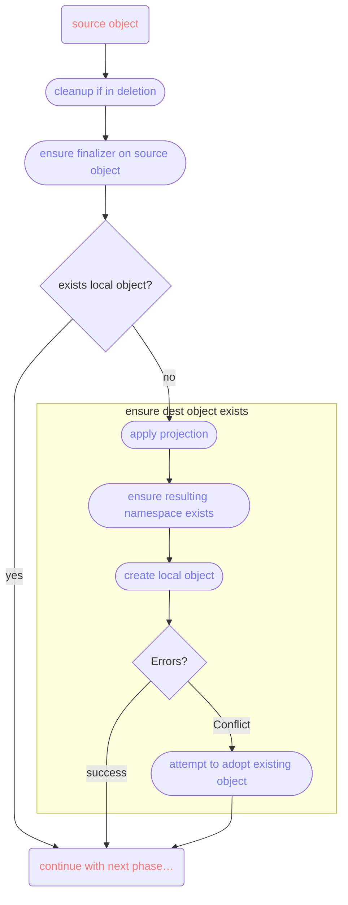

+++
title = "Publishing Resources using Crossplane"
linkTitle = "Using Crossplane"
weight = 2
+++

The guide describes the process of making a resource (usually defined by a CustomResourceDefinition)
of one Kubernetes cluster (the "service cluster" or "local cluster") available for use in the KDP
platform (the "platform cluster" or "KDP workspaces"). This involves setting up a KDP Service and
then installing the KDP Servlet and defining `PublishedResources` in the local cluster.

All of the documentation and API types are worded and named from the perspective of a service owner,
the person(s) who own a service and want to make it available to consumers in the KDP platform.

## High-level Overview

A "service" in KDP comprises a set of resources within a single Kubernetes API group. It doesn't
need to be _all_ of the resources in that group, service owners are free and encouraged to only make
a subset of resources (i.e. a subset of CRDs) available for use in the platform.

For each of the CRDs on the service cluster that should be published, the service owner creates a
`PublishedResource` object, which will contain both which CRD to publish, as well as numerous other
important settings that influence the behaviour around handling the CRD.

When publishing a resource (CRD), exactly one version is published. All others are ignored from the
standpoint of the resource synchronization logic.

All published resources together form the KDP Service. When a service is enabled in a workspace
(i.e. it is bound to it), users can manage objects for the projected resources described by the
published resources. These objects will be synced from the workspace onto the service cluster,
where they are meant to be processed in whatever way the service owners desire. Any possible
status information (in the `status` subresource) will in turn be synced back up into the workspace
where the user can inspect it.

Additionally, a published resource can describe additional so-called "related resources". These
usually originate on the service cluster and could be for example connection detail secrets created
by Crossplane, but could also originate in the user workspace and just be additional, auxiliary
resources that need to be synced down to the service cluster.

### `PublishedResource`

In its simplest form (which is rarely practical) a `PublishedResource` looks like this:

```yaml
apiVersion: services.kdp.k8c.io/v1alpha1
kind: PublishedResource
metadata:
  name: publish-certmanager-certs # name can be freely chosen
spec:
  resource:
    kind: Certificate
    apiGroup: cert-manager.io
    version: v1
```

However, you will most likely apply more configuration and use features described below.

### Filtering

The Servlet can be instructed to only work on a subset of resources in the KDP platform. This
can be restricted by namespace and/or label selector.

```yaml
apiVersion: services.kdp.k8c.io/v1alpha1
kind: PublishedResource
metadata:
  name: publish-certmanager-certs # name can be freely chosen
spec:
  resource: ...
  filter:
    namespace: my-app
    resource:
      matchLabels:
        foo: bar
```

### Schema

**Warning:** The actual CRD schema is always copied verbatim. All projections <!--, mutations -->
etc. have to take into account that the resource contents must be expressible without changes to the
schema.

### Projection

For stronger separation of concerns and to enable whitelabelling of services, the type meta for
can be projected, i.e. changed between the local service cluster and the KDP platform. You could
for example rename `Certificate` from cert-manager to `Zertifikat` inside the platform.

Note that the API group of all published resources is always changed to the one defined in the
KDP `Service` object (meaning 1 Servlet serves all the published resources under the same API group).
That is why changing the API group cannot be configured in the projection.

Besides renaming the Kind and Version, dependent fields like Plural, ShortNames and Categories
can be adjusted to fit the desired naming scheme in the platform. The Plural name is computed
automatically, but can be overridden. ShortNames and Categories are copied unless overwritten in the
`PublishedResource`.

It is also possible to change the scope of resources, i.e. turning a namespaced resource into a
cluster-wide. This should be used carefully and might require extensive mutations.

```yaml
apiVersion: services.kdp.k8c.io/v1alpha1
kind: PublishedResource
metadata:
  name: publish-certmanager-certs # name can be freely chosen
spec:
  resource: ...
  projection:
    version: v1beta1
    kind: Zertifikat
    plural: Zertifikate
    shortNames: [zerts]
    # categories: [management]
    # scope: Namespaced # change only when you know what you're doing
```

Consumers (end users) in the platform would then ultimately see projected names only. Note that GVK
projection applies only to the synced object itself and has no effect on the contents of these
objects. To change the contents, use external solutions like Crossplane to transform objects.
<!-- To change the contents, use *Mutations*. -->

### Naming

Since the Servlet ingests resources from many different Kubernetes clusters (workspaces) and combines
them onto a single cluster, resources have to be renamed to prevent collisions and also follow the
conventions of whatever tooling ultimately processes the resources locally.

The renaming is configured in `spec.naming`. In there, renaming patterns are configured, where
pre-defined placeholders can be used, for example `foo-$placeholder`. The following placeholders
are available:

* `$remoteClusterName` – the KDP workspace's cluster name (e.g. "1084s8ceexsehjm2")
* `$remoteNamespace` – the original namespace used by the consumer inside the KDP workspace
* `$remoteNamespaceHash` – first 20 hex characters of the SHA-1 hash of `$remoteNamespace`
* `$remoteName` – the original name of the object inside the KDP workspace (rarely used to construct
  local namespace names)
* `$remoteNameHash` – first 20 hex characters of the SHA-1 hash of `$remoteName`

If nothing is configured, the default ensures that no collisions will happen: Each workspace in
the platform will create a namespace on the local cluster, with a combination of namespace and
name hashes used for the actual resource names.

```yaml
apiVersion: services.kdp.k8c.io/v1alpha1
kind: PublishedResource
metadata:
  name: publish-certmanager-certs # name can be freely chosen
spec:
  resource: ...
  naming:
    namespace: "$remoteClusterName"
    name: "cert-$remoteNamespaceHash-$remoteNameHash"
```

### Related Resources

The processing of resources on the service cluster often leads to additional resources being
created, like a `Secret` for each cert-manager `Certificate` or a connection detail secret created
by Crossplane. These need to be made available to the user in their workspaces.

Likewise it's possible for auxiliary resources having to be created by the user, for example when
the user has to provide credentials.

To handle these cases, a `PublishedResource` can define multiple "related resources". Each related
resource currently represents exactly one object to synchronize between user workspace and service
cluster (i.e. you cannot express "sync all Secrets"). While the main published resource sync is
always workspace->service cluster, related resources can originate on either side and so either can
work as the source of truth.

At the moment, only `ConfigMaps` and `Secrets` are allowed related resource kinds.

For each related resource, the servlet needs to be told the name/namespace. This is done by selecting
a field in the main resource (for a `Certificate` this would mean `spec.secretName`). Both name and
namespace need to be part of the main object (or be fixed values, like a hardcoded `kube-system`
namespace).

The path expressions for name and namespace are evaluated against the main object on either side
to determine their values. So if you had a `Certificate` in your workspace with
`spec.secretName = "my-cert"` and after syncing it down, the copy on the service cluster has a
rewritten/mutated `spec.secretName = "jk23h4wz47329rz2r72r92-cert"` (e.g. to prevent naming
collisions), the expression `spec.secretName` would yield `"my-cert"` for the name in the workspace
and `"jk...."` as the name on the service cluster. Once the object exists with that name on the
originating side, the servlet will begin to sync it to the other side.

```yaml
apiVersion: services.kdp.k8c.io/v1alpha1
kind: PublishedResource
metadata:
  name: publish-certmanager-certs
spec:
  resource:
    kind: Certificate
    apiGroup: cert-manager.io
    version: v1

  naming:
    # this is where our CA and Issuer live in this example
    namespace: kube-system
    # need to adjust it to prevent collions (normally clustername is the namespace)
    name: "$remoteClusterName-$remoteNamespaceHash-$remoteNameHash"

  related:
    - origin: service # service or platform
      kind: Secret # for now, only "Secret" and "ConfigMap" are supported;
                   # there is no GVK projection for related resources

      # configure where in the parent object we can find
      # the name/namespace of the related resource (the child)
      reference:
        name:
          # This path is evaluated in both the local and remote objects, to figure out
          # the local and remote names for the related object. This saves us from having
          # to remember mutated fields before their mutation (similar to the last-known
          # annotation).
          path: spec.secretName

        # namespace part is optional; if not configured,
        # servlet assumes the same namespace as the owning resource
        #
        # namespace:
        #   path: spec.secretName
        #   regex:
        #     pattern: '...'
        #     replacement: '...'
        #
        # to inject static values, select a meaningless string value
        # and leave the pattern empty
        #
        # namespace:
        #   path: metadata.uid
        #   regex:
        #     replacement: kube-system
```

## Examples

### Provide Certificates

This combination of `Service` and `PublishedResource` make cert-manager certificates available in
kcp. The `Service` needs to be created in a workspace, most likely in an organization workspace.
The `PublishedResource` is created wherever the Servlet and cert-manager are running.

```yaml
apiVersion: core.kdp.k8c.io/v1alpha1
kind: Service
metadata:
  name: certificate-management
spec:
  apiGroup: certificates.example.corp
  catalogMetadata:
    title: Certificate Management
    description: Acquire certificates signed by Example Corp's internal CA.
```

```yaml
apiVersion: services.kdp.k8c.io/v1alpha1
kind: PublishedResource
metadata:
  name: publish-certmanager-certs
spec:
  resource:
    kind: Certificate
    apiGroup: cert-manager.io
    version: v1

  naming:
    # this is where our CA and Issuer live in this example
    namespace: kube-system
    # need to adjust it to prevent collions (normally clustername is the namespace)
    name: "$remoteClusterName-$remoteNamespaceHash-$remoteNameHash"

  related:
    - origin: service # service or platform
      kind: Secret # for now, only "Secret" and "ConfigMap" are supported;
                   # there is no GVK projection for related resources

      # configure where in the parent object we can find
      # the name/namespace of the related resource (the child)
      reference:
        name:
          # This path is evaluated in both the local and remote objects, to figure out
          # the local and remote names for the related object. This saves us from having
          # to remember mutated fields before their mutation (similar to the last-known
          # annotation).
          path: spec.secretName
        # namespace part is optional; if not configured,
        # servlet assumes the same namespace as the owning resource
        # namespace:
        #   path: spec.secretName
        #   regex:
        #     pattern: '...'
        #     replacement: '...'
```

## Technical Details

The following sections go into more details of the behind the scenes magic.

### Synchronization

Even though the whole configuration is written from the standpoint of the service owner, the actual
synchronization logic considers the platform side as the canonical source of truth. The Servlet
continuously tries to make the local objects look like the ones in the platform, while pushing
status updates back into the platform (if the given `PublishedResource` (i.e. CRD) has a `status`
subresource enabled).

### Local <-> Remote Connection

The Servlet tries to keep KDP-related metadata on the service cluster, away from the consumers. This
is both to prevent vandalism and to hide implementation details.

To ensure stability against future changes, once KDP has determined how a local object should be
named, it will remember this decision in its metadata. This is so that on future reconciliations,
the (potentially costly, but probably not) renaming logic does not need to be applied again. This
allows the Servlet to change defaults and also allows the service owner to make changes to the
naming rules without breaking existing objects.

Since we do not want to store metadata on the platform side, we instead rely on label selectors on
the local objects. Each local object has a label for the remote cluster name, namespace and object
name, and when trying to find the matching local object, the Servlet simply does a label-based
search.

There is currently no sync-related metadata available on source objects, as this would either be
annotations (untyped strings...) or require schema changes to allow additional fields in basically
random CRDs.

Note that fields like `generation` or `resourceVersion` are not relevant for any of the sync logic.

### Reconcile Loop

The sync loop can be divided into 5 parts:

1. find the local object
2. handle deletion
3. ensure the destination object exists
4. ensure the destination object's content matches the source object
5. synchronize related resources the same way (repeat 1-4 for each related resource)

#### Phase 1: Find the Local Object

For this, as mentioned in the connection chapter above, the Servlet tries to follow label selectors
on the local cluster. This helps prevent cluttering with consumer workspaces with KDP metadata.
If no object is found to match the labels, that's fine and the loop will continue with phase 2,
in which a possible Conflict error (if labels broke) is handled gracefully.

The remote object in the workspace becomes the `source object` and its local equivalent is called
the `destination object`.

#### Phase 2: Handle Deletion

A finalizer is used in the platform workspaces to prevent orphans in the service cluster side. This
is the only real evidence in the platform side that the Servlet is even doing things. When a remote
(source) object is deleted, the corresponding local object is deleted as well. Once the local object
is gone, the finalizer is removed from the source object.

#### Phase 3: Ensure Object Existence

We have a source object and now need to create the destination. This chart shows what's happening.



After we followed through with these steps, both the source and destination objects exists and we
can continue with phase 4.

Resource adoption happens when creation of the initial local object fails. This can happen when labels
get mangled. If such a conflict happens, the Servlet will "adopt" the existing local object by
adding / fixing the labels on it, so that for the next reconciliation it will be found and updated.

#### Phase 4: Content Synchronization

Content synchronization is rather simple, really.

First the source "spec" is used to patch the local object. Note that this step is called "spec", but
should actually be called "all top-level elements besides `apiVersion`, `kind`, `status` and
`metadata`, but still including some labels and annotations"; so if you were to publish RBAC objects,
the syncer would include `roleRef` field, for example).

To allow proper patch generation, a `last-known-state` annotation is kept on the local object. This
functions just like the one kubectl uses and is required for the Servlet to properly detect changes
made by mutation webhooks.

If the published resource (CRD) has a `status` subresource enabled (not just a `status` field in its
scheme, it must be a real subresource), then the Servlet will copy the status from the local object
back up to the remote (source) object.

#### Phase 5: Sync Related Resources

The same logic for synchronizing the main published resource applies to their related resources as
well. The only difference is that the source side can be either remote (workspace) or local
(service cluster).

This currently also means that sync-related metadata, which is always kept on the object's copy,
will end up in the user workspace when a related object originates on the service cluster (the
most common usecase). In a future version it could be nice to keep the sync state only on the
service cluster side, away from the users.
# Publishing resources with Crossplane

This guide describes the process of leveraging Crossplane as a service provider to make Crossplane
claims available as `PublishedResources` for use in KDP. This involves installing Crossplane -
including all required Crossplane [providers][crossplane/docs/providers] and
[configuration packages][crossplane/docs/configurations] - and
[publishing]() (a subset of) the Crossplane claims.

## Overview

The KDP [Servlet]() is responsible for synchronizing objects from KDP to
the local service cluster where the service provider is in charge of processing these synchronized
objects to provide the actual functionality of a service. One possibility is to leverage Crossplane
to create new abstractions and custom APIs, which can be published to KDP and consumed by platform
users.

> [!NOTE]
> While this guide is not intended to be a comprehensive Crossplane guide, it is useful to be aware
> of the most common terms:
>
> * **Providers** are pluggable building blocks to provision and manage resources via a third-party API (e.g. AWS provider)
> * **Managed resources** (MRs) are representations of actual, provider-specific resources (e.g. EC2 instance)
> * **Composite resource definitions** (XRDs) are Crossplane-specific definitions of API resources (similar to CRDs)
> * **Composite resources** (XRs) and **Claims** are Crossplane-specific custom resources created from XRD objects (similar to CRs)
> * **Compositions** are Crossplane-specific templates for transforming a XR object into one or more MR object(s)

This guide will show you how to install Crossplane and all required providers on a service cluster
and provide a stripped-down `Certificate` resource in KDP. While we ultimately use cert-manager to
provide the actual TLS certificates, we will expose only a very limited number of fields of the
cert-manager `Certificate` to the platform users - in fact a single field to set the desired common
name.

> [!NOTE]
> The [Upbound marketplace][upbound/marketplace/configurations] provides a list of available
> configuration packages (reusable packages of compositions and XRDs), but at the time of writing
> no suitable configuration package that relies only on the Kubernetes / Helm provider and works
> out of the box was available.

## Install Crossplane

First we need to install Crossplane via the [official Helm chart][crossplane/github/chart]. By
default, Crossplane does not require any special configuration so we will just use the default
values provided by the Helm chart.

```bash
helm upgrade crossplane crossplane \
  --install \
  --create-namespace \
  --namespace=crossplane-system \
  --repo=https://charts.crossplane.io/stable \
  --version=1.15.0 \
  --wait
```

Once the installation is done, verify the status with the following command:

```bash
$ kubectl get pods --namespace=crossplane-system
NAME                                       READY   STATUS    RESTARTS   AGE
crossplane-6494656b8b-bflcf                1/1     Running   0          45s
crossplane-rbac-manager-8458557cdd-sls58   1/1     Running   0          45s
```

## Install Crossplane providers

With Crossplane up and running, we can continue and install the necessary Crossplane packages
(providers), composite resource definitions, and compositions.

In order to manage arbitrary Kubernetes objects with Crossplane (and leverage cert-manager to
issue TLS certificates), we are going to install the `provider-kubernetes` on the service cluster.
Additionally (and for the sake of simplicity), we create a `DeploymentRuntimeConfig` to assign the
provider a specific service account, which can be used to assign the required permissions.

```bash
kubectl apply --filename=- <<EOF
---
apiVersion: pkg.crossplane.io/v1beta1
kind: DeploymentRuntimeConfig
metadata:
  name: crossplane-provider-kubernetes
spec:
  serviceAccountTemplate:
    metadata:
      name: crossplane-provider-kubernetes
---
apiVersion: pkg.crossplane.io/v1
kind: Provider
metadata:
  name: crossplane-provider-kubernetes
  labels:
    app.kubernetes.io/component: provider
spec:
  package: xpkg.upbound.io/crossplane-contrib/provider-kubernetes:v0.11.1
  runtimeConfigRef:
    name: crossplane-provider-kubernetes
EOF
```

Once the provider is installed, verify the provider status with the following command:

```bash
$ kubectl get providers crossplane-provider-kubernetes
NAME                             INSTALLED   HEALTHY   PACKAGE                                                          AGE
crossplane-provider-kubernetes   True        True      xpkg.upbound.io/crossplane-contrib/provider-kubernetes:v0.11.1   104s
```

With the `provider-kubernetes` in place, we assign the provider-specific service account
cluster-admin permissions (you know, for the sake of simplicity) and create a `ProviderConfig`
to instruct the provider to use the provided service account token for authentication.

```bash
kubectl apply --filename=- <<EOF
---
apiVersion: rbac.authorization.k8s.io/v1
kind: ClusterRoleBinding
metadata:
  name: crossplane:provider:crossplane-provider-kubernetes:cluster-admin
roleRef:
  apiGroup: rbac.authorization.k8s.io
  kind: ClusterRole
  name: cluster-admin
subjects:
  - kind: ServiceAccount
    name: crossplane-provider-kubernetes
    namespace: crossplane-system
---
apiVersion: kubernetes.crossplane.io/v1alpha1
kind: ProviderConfig
metadata:
  name: in-cluster
spec:
  credentials:
    source: InjectedIdentity
EOF
```

## Install cert-manager

Now that Crossplane and all required providers are installed and properly configured, we can
install cert-manager and apply our own `CompositeResourceDefinition` to the service cluster.

We install cert-manager via the [official Helm chart][cert-manager/github/chart] including all CRDs.

```bash
helm upgrade cert-manager cert-manager \
  --install --create-namespace \
  --namespace=cert-manager \
  --repo=https://charts.jetstack.io \
  --version=v1.14.2 \
  --set=installCRDs=true \
  --wait
```

## Define Crossplane claims

Once cert-manager is installed, we can finally define our own stripped-down `Certificate` resource
and provide a default Crossplane composition, which creates a cert-manager `Certificate` for each
Crossplane specific `Certificate` object.

Create and apply the following three manifests to your service cluster (you can safely ignore the
misleading warnings from Crossplane regarding the validation of the composition). This will

* bootstrap a cert-manager `ClusterIssuer` named "default-ca",
* create a Crossplane `CompositeResourceDefinition` that defines our `Certificate` resource (which exposes only the requested common name),
* create a Crossplane `Composition` that uses cert-manager and the created "default-ca" to issue the requested certificate

```bash
kubectl apply --filename=cluster-issuer.yaml
kubectl apply --filename=definition.yaml
kubectl apply --filename=composition.yaml
```

<details>
  <summary>cluster-issuer.yaml</summary>

```yaml
---
apiVersion: cert-manager.io/v1
kind: Issuer
metadata:
  name: default-bootstrap-ca
  namespace: cert-manager
spec:
  selfSigned: {}
---
apiVersion: cert-manager.io/v1
kind: Certificate
metadata:
  name: default-ca
  namespace: cert-manager
spec:
  isCA: true
  commonName: default-ca
  secretName: default-ca
  privateKey:
    algorithm: ECDSA
    size: 256
  issuerRef:
    group: cert-manager.io
    kind: Issuer
    name: default-bootstrap-ca
---
apiVersion: cert-manager.io/v1
kind: ClusterIssuer
metadata:
  name: default-ca
spec:
  ca:
    secretName: default-ca
```
</details>

<details>
  <summary>definition.yaml</summary>

```yaml
apiVersion: apiextensions.crossplane.io/v1
kind: CompositeResourceDefinition
metadata:
  name: xcertificates.pki.xaas.k8c.io
spec:
  group: pki.xaas.k8c.io
  names:
    kind: XCertificate
    plural: xcertificates
  claimNames:
    kind: Certificate
    plural: certificates
  connectionSecretKeys:
    - ca.crt
    - tls.crt
    - tls.key
  versions:
    - name: v1alpha1
      served: true
      referenceable: true
      schema:
        openAPIV3Schema:
          type: object
          properties:
            spec:
              type: object
              required:
                - parameters
              properties:
                parameters:
                  type: object
                  required:
                    - commonName
                  properties:
                    commonName:
                      description: "Requested common name X509 certificate subject attribute. More info: https://datatracker.ietf.org/doc/html/rfc5280#section-4.1.2.6 NOTE: TLS clients will ignore this value when any subject alternative name is set (see https://tools.ietf.org/html/rfc6125#section-6.4.4). \n Should have a length of 64 characters or fewer to avoid generating invalid CSRs. Cannot be set if the `literalSubject` field is set."
                      type: string
                      minLength: 1
```
</details>

<details>
  <summary>composition.yaml</summary>

```yaml
apiVersion: apiextensions.crossplane.io/v1
kind: Composition
metadata:
  name: v1alpha1.xcertificates.cert-manager.pki.xaas.k8c.io
  labels:
    xaas.k8c.io/provider-name: cert-manager
spec:
  compositeTypeRef:
    apiVersion: pki.xaas.k8c.io/v1alpha1
    kind: XCertificate
  resources:
    - name: certificate
      base:
        apiVersion: kubernetes.crossplane.io/v1alpha2
        kind: Object
        spec:
          forProvider:
            manifest:
              apiVersion: cert-manager.io/v1
              kind: Certificate
              spec:
                issuerRef:
                  group: cert-manager.io
                  kind: ClusterIssuer
                  name: default-ca
          readiness:
            policy: DeriveFromObject
          providerConfigRef:
            name: in-cluster
          connectionDetails:
            - apiVersion: v1
              kind: Secret
              namespace: __PATCHED__
              name: __PATCHED__
              fieldPath: data['ca.crt']
              toConnectionSecretKey: ca.crt
            - apiVersion: v1
              kind: Secret
              namespace: __PATCHED__
              name: __PATCHED__
              fieldPath: data['tls.crt']
              toConnectionSecretKey: tls.crt
            - apiVersion: v1
              kind: Secret
              namespace: __PATCHED__
              name: __PATCHED__
              fieldPath: data['tls.key']
              toConnectionSecretKey: tls.key
          writeConnectionSecretToRef:
            namespace: crossplane-system
      patches:
        # spec.forProvider.manifest.metadata
        - type: FromCompositeFieldPath
          fromFieldPath: spec.claimRef.namespace
          toFieldPath: spec.forProvider.manifest.metadata.namespace
          policy:
            fromFieldPath: Required
        # spec.forProvider.manifest.spec
        - type: FromCompositeFieldPath
          fromFieldPath: spec.parameters.commonName
          toFieldPath: spec.forProvider.manifest.spec.commonName
          policy:
            fromFieldPath: Required
        - type: FromCompositeFieldPath
          fromFieldPath: metadata.name
          toFieldPath: spec.forProvider.manifest.spec.secretName
          policy:
            fromFieldPath: Required
        # spec.connectionDetails
        - type: FromCompositeFieldPath
          fromFieldPath: spec.claimRef.namespace
          toFieldPath: spec.connectionDetails[*].namespace
          policy:
            fromFieldPath: Required
        - type: FromCompositeFieldPath
          fromFieldPath: metadata.name
          toFieldPath: spec.connectionDetails[*].name
          policy:
            fromFieldPath: Required
        # spec.writeConnectionSecretToRef
        - type: FromCompositeFieldPath
          fromFieldPath: metadata.uid
          toFieldPath: spec.writeConnectionSecretToRef.name
          policy:
            fromFieldPath: Required
          transforms:
            - type: string
              string:
                type: Format
                fmt: "%s-certificate"
      connectionDetails:
        - name: ca.crt
          type: FromConnectionSecretKey
          fromConnectionSecretKey: ca.crt
        - name: tls.crt
          type: FromConnectionSecretKey
          fromConnectionSecretKey: tls.crt
        - name: tls.key
          type: FromConnectionSecretKey
          fromConnectionSecretKey: tls.key
  writeConnectionSecretsToNamespace: crossplane-system
```
</details>

Afterwards verify the status of the composite resource definition and the composition with the
following command:

```bash
$ kubectl get compositeresourcedefinitions,compositions
NAME                            ESTABLISHED   OFFERED   AGE
xcertificates.pki.xaas.k8c.io   True          True      10s

NAME                                                  XR-KIND        XR-APIVERSION              AGE
v1alpha1.xcertificates.cert-manager.pki.xaas.k8c.io   XCertificate   pki.xaas.k8c.io/v1alpha1   17s
```

Additionally before we continue and publish our `Certificate` resource to KDP, you can verify that
everything is working as expected on the service cluster by applying the following example
certificate manifest:

```bash
kubectl apply --filename=- <<EOF
apiVersion: pki.xaas.k8c.io/v1alpha1
kind: Certificate
metadata:
  name: www-example-com
spec:
  parameters:
    commonName: www.example.com
  writeConnectionSecretToRef:
    name: www-example-com
EOF
```

Crossplane will (stay with me) pick up the `Certificate` object (claim), create a corresponding
`XCertificate` object (composite resource), apply our created composition to the composite resource,
which in turn will create a `Object` object (managed resource), which is picked up by the
`provider-kubernetes`, which will create finally a cert-manager `Certificate` object (halfway through).


Now `provider-kubernetes` will wait for the secret containing the actual signed TLS certificate
issued by cert-manager, copy it into an intermediate secret (connection secret) in the
`crossplane-system` namespace for further processing, that will be picked up by Crossplane, which
will copy the information into the secret (combined secret) defined in the `Certificate` object by
`spec.writeConnectionSecretToRef.name` (phew you made it).


If everything worked out, you should get all relevant objects with the following command:

```bash
$ kubectl get claim,composite,managed,certificate
NAME                                          SYNCED   READY   CONNECTION-SECRET   AGE
certificate.pki.xaas.k8c.io/www-example-com   True     True    www-example-com     21m

NAME                                                 SYNCED   READY   COMPOSITION                                           AGE
xcertificate.pki.xaas.k8c.io/www-example-com-z59kn   True     True    v1alpha1.xcertificates.cert-manager.pki.xaas.k8c.io   21m

NAME                                                          KIND          PROVIDERCONFIG   SYNCED   READY   AGE
object.kubernetes.crossplane.io/www-example-com-z59kn-8wcmd   Certificate   in-cluster       True     True    21m

NAME                                                      READY   SECRET                  AGE
certificate.cert-manager.io/www-example-com-z59kn-8wcmd   True    www-example-com-z59kn   21m
```

## Publish Crossplane claims

Now onto the final step: making our custom `Certificate` available in KDP. This can be achieved by
simply applying the following manifest to the service cluster.

```bash
kubectl apply --filename=- <<'EOF'
apiVersion: services.kdp.k8c.io/v1alpha1
kind: PublishedResource
metadata:
  name: v1alpha1.certificate.pki.xaas.k8c.io
spec:
  naming:
    name: $remoteName
    namespace: certs-$remoteClusterName-$remoteNamespaceHash
  related:
    - kind: Secret
      origin: service
      reference:
        name:
          path: spec.writeConnectionSecretToRef.name
  resource:
    apiGroup: pki.xaas.k8c.io
    kind: Certificate
    version: v1alpha1
EOF
```

And done! The Servlet will pick up the `PublishedResource` object, set up the corresponding kcp
`APIExport` and `APIResourceSchema` and begin syncing objects from KDP to your service cluster.

For more information, see the guide on [publishing resources]().

[cert-manager/github/chart]: https://github.com/cert-manager/cert-manager/tree/v1.14.2/deploy/charts/cert-manager
[crossplane/docs/providers]: https://docs.crossplane.io/latest/concepts/providers/
[crossplane/docs/configurations]: https://docs.crossplane.io/latest/concepts/packages/
[crossplane/github/chart]: https://github.com/crossplane/crossplane/tree/v1.15.0/cluster/charts/crossplane
[upbound/marketplace/configurations]: https://marketplace.upbound.io/configurations
