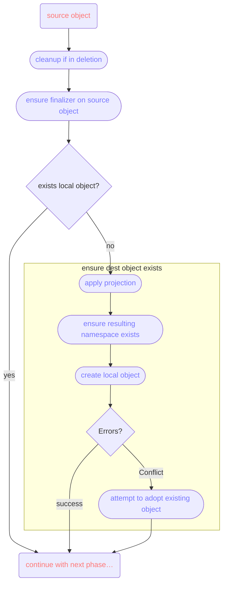

+++
title = "Publishing Resources"
weight = 1
+++

The guide describes the process of making a resource (usually defined by a CustomResourceDefinition)
of one Kubernetes cluster (the "service cluster" or "local cluster") available for use in the KDP
platform (the "platform cluster" or "KDP workspaces"). This involves setting up a KDP Service and
then installing the KDP Servlet and defining `PublishedResources` in the local cluster.

All of the documentation and API types are worded and named from the perspective of a service owner,
the person(s) who own a service and want to make it available to consumers in the KDP platform.

## High-level Overview

A "service" in KDP comprises a set of resources within a single Kubernetes API group. It doesn't
need to be _all_ of the resources in that group, service owners are free and encouraged to only make
a subset of resources (i.e. a subset of CRDs) available for use in the platform.

For each of the CRDs on the service cluster that should be published, the service owner creates a
`PublishedResource` object, which will contain both which CRD to publish, as well as numerous other
important settings that influence the behaviour around handling the CRD.

When publishing a resource (CRD), exactly one version is published. All others are ignored from the
standpoint of the resource synchronization logic.

All published resources together form the KDP Service. When a service is enabled in a workspace
(i.e. it is bound to it), users can manage objects for the projected resources described by the
published resources. These objects will be synced from the workspace onto the service cluster,
where they are meant to be processed in whatever way the service owners desire. Any possible
status information (in the `status` subresource) will in turn be synced back up into the workspace
where the user can inspect it.

Additionally, a published resource can describe additional so-called "related resources". These
usually originate on the service cluster and could be for example connection detail secrets created
by Crossplane, but could also originate in the user workspace and just be additional, auxiliary
resources that need to be synced down to the service cluster.

### `PublishedResource`

In its simplest form (which is rarely practical) a `PublishedResource` looks like this:

```yaml
apiVersion: services.kdp.k8c.io/v1alpha1
kind: PublishedResource
metadata:
  name: publish-certmanager-certs # name can be freely chosen
spec:
  resource:
    kind: Certificate
    apiGroup: cert-manager.io
    version: v1
```

However, you will most likely apply more configuration and use features described below.

### Filtering

The Servlet can be instructed to only work on a subset of resources in the KDP platform. This
can be restricted by namespace and/or label selector.

```yaml
apiVersion: services.kdp.k8c.io/v1alpha1
kind: PublishedResource
metadata:
  name: publish-certmanager-certs # name can be freely chosen
spec:
  resource: ...
  filter:
    namespace: my-app
    resource:
      matchLabels:
        foo: bar
```

### Schema

**Warning:** The actual CRD schema is always copied verbatim. All projections <!--, mutations -->
etc. have to take into account that the resource contents must be expressible without changes to the
schema.

### Projection

For stronger separation of concerns and to enable whitelabelling of services, the type meta for
can be projected, i.e. changed between the local service cluster and the KDP platform. You could
for example rename `Certificate` from cert-manager to `Zertifikat` inside the platform.

Note that the API group of all published resources is always changed to the one defined in the
KDP `Service` object (meaning 1 Servlet serves all the [selected] published resources under the
same API group). That is why changing the API group cannot be configured in the projection.

Besides renaming the Kind and Version, dependent fields like Plural, ShortNames and Categories
can be adjusted to fit the desired naming scheme in the platform. The Plural name is computed
automatically, but can be overridden. ShortNames and Categories are copied unless overwritten in the
`PublishedResource`.

It is also possible to change the scope of resources, i.e. turning a namespaced resource into a
cluster-wide. This should be used carefully and might require extensive mutations.

```yaml
apiVersion: services.kdp.k8c.io/v1alpha1
kind: PublishedResource
metadata:
  name: publish-certmanager-certs # name can be freely chosen
spec:
  resource: ...
  projection:
    version: v1beta1
    kind: Zertifikat
    plural: Zertifikate
    shortNames: [zerts]
    # categories: [management]
    # scope: Namespaced # change only when you know what you're doing
```

Consumers (end users) in the platform would then ultimately see projected names only. Note that GVK
projection applies only to the synced object itself and has no effect on the contents of these
objects. To change the contents, use external solutions like Crossplane to transform objects.
<!-- To change the contents, use *Mutations*. -->

### Naming

Since the Servlet ingests resources from many different Kubernetes clusters (workspaces) and combines
them onto a single cluster, resources have to be renamed to prevent collisions and also follow the
conventions of whatever tooling ultimately processes the resources locally.

The renaming is configured in `spec.naming`. In there, renaming patterns are configured, where
pre-defined placeholders can be used, for example `foo-$placeholder`. The following placeholders
are available:

* `$remoteClusterName` – the KDP workspace's cluster name (e.g. "1084s8ceexsehjm2")
* `$remoteNamespace` – the original namespace used by the consumer inside the KDP workspace
* `$remoteNamespaceHash` – first 20 hex characters of the SHA-1 hash of `$remoteNamespace`
* `$remoteName` – the original name of the object inside the KDP workspace (rarely used to construct
  local namespace names)
* `$remoteNameHash` – first 20 hex characters of the SHA-1 hash of `$remoteName`

If nothing is configured, the default ensures that no collisions will happen: Each workspace in
the platform will create a namespace on the local cluster, with a combination of namespace and
name hashes used for the actual resource names.

```yaml
apiVersion: services.kdp.k8c.io/v1alpha1
kind: PublishedResource
metadata:
  name: publish-certmanager-certs # name can be freely chosen
spec:
  resource: ...
  naming:
    namespace: "$remoteClusterName"
    name: "cert-$remoteNamespaceHash-$remoteNameHash"
```

<!--
### Mutation

Besides projecting the type meta, changes to object contents are also nearly always required.
These can be configured in a number of way in the `PublishedResource`.

Configuration happens `spec.mutation` and there are two fields:

* `spec` contains the mutation rules when syncing the desired state (often in `spec`, but can also
  be other top-level fields) from the remote side to the local side. Use this to apply defaulting,
  normalising, and enforcing rules.
* `status` contains the mutation rules when syncing the `status` subresource back from the local
  cluster up into the platform. Use this to normalize names and values (e.g. if you rewrote
  `.spec.secretName` from `"foo"` to `"dfkbssbfh"`, make sure the status does not "leak" this name
  by accident).

Mutation is always done as a series of steps. Each step does exactly one thing and only one must
be configured per step.

```yaml
apiVersion: services.kdp.k8c.io/v1alpha1
kind: PublishedResource
metadata:
  name: publish-certmanager-certs # name can be freely chosen
spec:
  resource: ...
  mutation:
    spec:
      # choose one per step
      - regex: ...
        template: ...
        delete: ...
        rudi: ...
```

#### Regex

```yaml
regex:
  path: "json.path[expression]"
  pattern: "(.+)"
  replacement: "foo-\\1"
```

This mutation applies a regular expression to a single value inside the document. JSON path is the
usual path, without a leading dot.

#### Template

```yaml
template:
  path: "json.path[expression]"
  template: "{{ .LocalObject.ObjectMeta.Namespace }}"
```

This mutation applies a Go template expression to a single value inside the document. JSON path is the
usual path, without a leading dot.

#### Delete

```yaml
delete:
  path: "json.path[expression]"
```

This mutation simply removes the value at the given path from the document. JSON path is the
usual path, without a leading dot.

#### Rudi

```yaml
rudi:
  script: |
    (set! .metadata.name (concat "-" [$localObj.metadata.name "foo"]))
```

This mutation runs a [Rudi](https://github.com/xrstf/rudi) program on the document. Note that in
Rudi, in contrast to all the other mutation types, JSON paths _do_ begin with leading dot if you
refer to the main document. Just `metadata.name` would be invalid.
-->

### Related Resources

The processing of resources on the service cluster often leads to additional resources being
created, like a `Secret` for each cert-manager `Certificate` or a connection detail secret created
by Crossplane. These need to be made available to the user in their workspaces.

Likewise it's possible for auxiliary resources having to be created by the user, for example when
the user has to provide credentials.

To handle these cases, a `PublishedResource` can define multiple "related resources". Each related
resource currently represents exactly one object to synchronize between user workspace and service
cluster (i.e. you cannot express "sync all Secrets"). While the main published resource sync is
always workspace->service cluster, related resources can originate on either side and so either can
work as the source of truth.

At the moment, only `ConfigMaps` and `Secrets` are allowed related resource kinds.

For each related resource, the servlet needs to be told the name/namespace. This is done by selecting
a field in the main resource (for a `Certificate` this would mean `spec.secretName`). Both name and
namespace need to be part of the main object (or be fixed values, like a hardcoded `kube-system`
namespace).

The path expressions for name and namespace are evaluated against the main object on either side
to determine their values. So if you had a `Certificate` in your workspace with
`spec.secretName = "my-cert"` and after syncing it down, the copy on the service cluster has a
rewritten/mutated `spec.secretName = "jk23h4wz47329rz2r72r92-cert"` (e.g. to prevent naming
collisions), the expression `spec.secretName` would yield `"my-cert"` for the name in the workspace
and `"jk...."` as the name on the service cluster. Once the object exists with that name on the
originating side, the servlet will begin to sync it to the other side.

```yaml
apiVersion: services.kdp.k8c.io/v1alpha1
kind: PublishedResource
metadata:
  name: publish-certmanager-certs
spec:
  resource:
    kind: Certificate
    apiGroup: cert-manager.io
    version: v1

  naming:
    # this is where our CA and Issuer live in this example
    namespace: kube-system
    # need to adjust it to prevent collions (normally clustername is the namespace)
    name: "$remoteClusterName-$remoteNamespaceHash-$remoteNameHash"

  related:
    - origin: service # service or platform
      kind: Secret # for now, only "Secret" and "ConfigMap" are supported;
                   # there is no GVK projection for related resources

      # configure where in the parent object we can find
      # the name/namespace of the related resource (the child)
      reference:
        name:
          # This path is evaluated in both the local and remote objects, to figure out
          # the local and remote names for the related object. This saves us from having
          # to remember mutated fields before their mutation (similar to the last-known
          # annotation).
          path: spec.secretName

        # namespace part is optional; if not configured,
        # servlet assumes the same namespace as the owning resource
        #
        # namespace:
        #   path: spec.secretName
        #   regex:
        #     pattern: '...'
        #     replacement: '...'
        #
        # to inject static values, select a meaningless string value
        # and leave the pattern empty
        #
        # namespace:
        #   path: metadata.uid
        #   regex:
        #     replacement: kube-system
```

## Examples

### Provide Certificates

This combination of `Service` and `PublishedResource` make cert-manager certificates available in
kcp. The `Service` needs to be created in a workspace, most likely in an organization workspace.
The `PublishedResource` is created wherever the Servlet and cert-manager are running.

```yaml
apiVersion: core.kdp.k8c.io/v1alpha1
kind: Service
metadata:
  name: certificate-management
spec:
  apiGroup: certificates.example.corp
  catalogMetadata:
    title: Certificate Management
    description: Acquire certificates signed by Example Corp's internal CA.
```

```yaml
apiVersion: services.kdp.k8c.io/v1alpha1
kind: PublishedResource
metadata:
  name: publish-certmanager-certs
spec:
  resource:
    kind: Certificate
    apiGroup: cert-manager.io
    version: v1

  naming:
    # this is where our CA and Issuer live in this example
    namespace: kube-system
    # need to adjust it to prevent collions (normally clustername is the namespace)
    name: "$remoteClusterName-$remoteNamespaceHash-$remoteNameHash"

  related:
    - origin: service # service or platform
      kind: Secret # for now, only "Secret" and "ConfigMap" are supported;
                   # there is no GVK projection for related resources

      # configure where in the parent object we can find
      # the name/namespace of the related resource (the child)
      reference:
        name:
          # This path is evaluated in both the local and remote objects, to figure out
          # the local and remote names for the related object. This saves us from having
          # to remember mutated fields before their mutation (similar to the last-known
          # annotation).
          path: spec.secretName
        # namespace part is optional; if not configured,
        # servlet assumes the same namespace as the owning resource
        # namespace:
        #   path: spec.secretName
        #   regex:
        #     pattern: '...'
        #     replacement: '...'
```

## Technical Details

The following sections go into more details of the behind the scenes magic.

### Synchronization

Even though the whole configuration is written from the standpoint of the service owner, the actual
synchronization logic considers the platform side as the canonical source of truth. The Servlet
continuously tries to make the local objects look like the ones in the platform, while pushing
status updates back into the platform (if the given `PublishedResource` (i.e. CRD) has a `status`
subresource enabled).

### Local <-> Remote Connection

The Servlet tries to keep KDP-related metadata on the service cluster, away from the consumers. This
is both to prevent vandalism and to hide implementation details.

To ensure stability against future changes, once KDP has determined how a local object should be
named, it will remember this decision in its metadata. This is so that on future reconciliations,
the (potentially costly, but probably not) renaming logic does not need to be applied again. This
allows the Servlet to change defaults and also allows the service owner to make changes to the
naming rules without breaking existing objects.

Since we do not want to store metadata on the platform side, we instead rely on label selectors on
the local objects. Each local object has a label for the remote cluster name, namespace and object
name, and when trying to find the matching local object, the Servlet simply does a label-based
search.

There is currently no sync-related metadata available on source objects, as this would either be
annotations (untyped strings...) or require schema changes to allow additional fields in basically
random CRDs.

Note that fields like `generation` or `resourceVersion` are not relevant for any of the sync logic.

### Reconcile Loop

The sync loop can be divided into 5 parts:

1. find the local object
2. handle deletion
3. ensure the destination object exists
4. ensure the destination object's content matches the source object
5. synchronize related resources the same way (repeat 1-4 for each related resource)

#### Phase 1: Find the Local Object

For this, as mentioned in the connection chapter above, the Servlet tries to follow label selectors
on the local cluster. This helps prevent cluttering with consumer workspaces with KDP metadata.
If no object is found to match the labels, that's fine and the loop will continue with phase 2,
in which a possible Conflict error (if labels broke) is handled gracefully.

The remote object in the workspace becomes the `source object` and its local equivalent is called
the `destination object`.

#### Phase 2: Handle Deletion

A finalizer is used in the platform workspaces to prevent orphans in the service cluster side. This
is the only real evidence in the platform side that the Servlet is even doing things. When a remote
(source) object is deleted, the corresponding local object is deleted as well. Once the local object
is gone, the finalizer is removed from the source object.

#### Phase 3: Ensure Object Existence

We have a source object and now need to create the destination. This chart shows what's happening.



After we followed through with these steps, both the source and destination objects exists and we
can continue with phase 4.

Resource adoption happens when creation of the initial local object fails. This can happen when labels
get mangled. If such a conflict happens, the Servlet will "adopt" the existing local object by
adding / fixing the labels on it, so that for the next reconciliation it will be found and updated.

#### Phase 4: Content Synchronization

Content synchronization is rather simple, really.

First the source "spec" is used to patch the local object. Note that this step is called "spec", but
should actually be called "all top-level elements besides `apiVersion`, `kind`, `status` and
`metadata`, but still including some labels and annotations"; so if you were to publish RBAC objects,
the syncer would include `roleRef` field, for example).

To allow proper patch generation, a `last-known-state` annotation is kept on the local object. This
functions just like the one kubectl uses and is required for the Servlet to properly detect changes
made by mutation webhooks.

If the published resource (CRD) has a `status` subresource enabled (not just a `status` field in its
scheme, it must be a real subresource), then the Servlet will copy the status from the local object
back up to the remote (source) object.

#### Phase 5: Sync Related Resources

The same logic for synchronizing the main published resource applies to their related resources as
well. The only difference is that the source side can be either remote (workspace) or local
(service cluster).

This currently also means that sync-related metadata, which is always kept on the object's copy,
will end up in the user workspace when a related object originates on the service cluster (the
most common usecase). In a future version it could be nice to keep the sync state only on the
service cluster side, away from the users.
