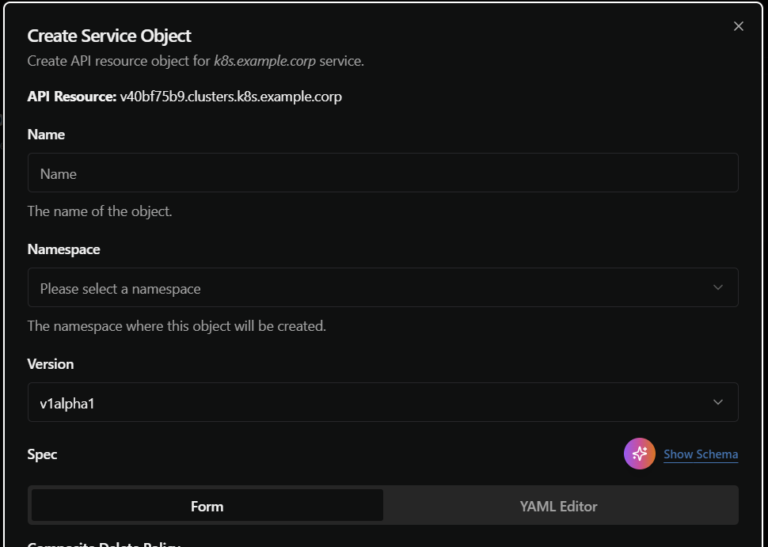
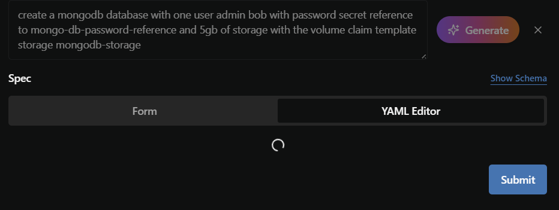
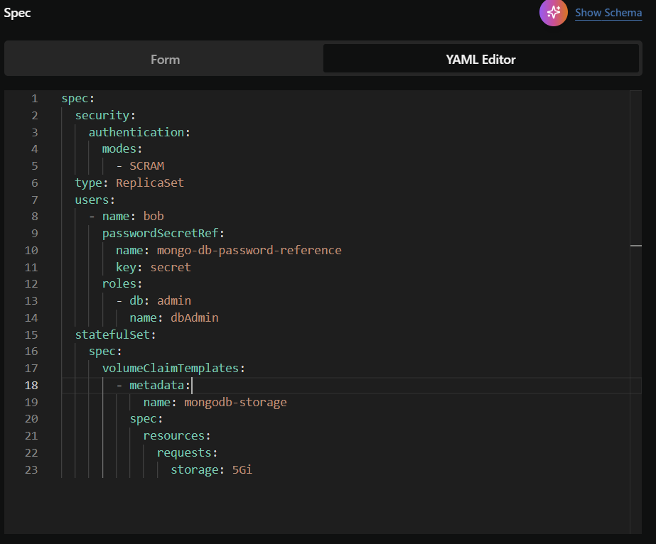

+++
title = "AI Agent"
weight = 3
+++

## Overview

The Kubermatic Developer Platform AI Agent is a specialized assistant that helps users generate Kubernetes resource YAML files through natural language within KDP workspaces. It converts requests in natural language into properly formatted Kubernetes manifests, eliminating the need to manually write lengthy YAML files from scratch.

## Prerequisites

Before installing the AI Agent, ensure you have:

- A running KDP installation on your Kubernetes cluster
- OpenAI API key for the language model capabilities
- OIDC provider configured (same one used by KDP)

## Installation

The AI Agent is deployed using Helm. Follow these steps to install it:

### Prepare the Configuration

Create a `ai-agent.values.yaml` file with your specific configuration:

```yaml
aiAgent:
  imagePullSecret: |
    {
      "auths": {
        "quay.io": {
          "auth": "<PULL_CREDENTIALS>",
          "email": ""
        }
      }
    }


  config:
    oidc:
        clientID: kdp-kubelogin
        clientSecret: <OIDC_CLIENT_SECRET>
        issuerURL: https://login.<DOMAIN>
    kubernetes_api_url: https://api.<DOMAIN>
    openai_api_key: "<OPEN_API_KEY>"  # OpenAI API key for the language model

  ingress:
    create: true
    host: ai-agent.<DOMAIN>
    certIssuer:
      kind: ClusterIssuer
      name: letsencrypt-prod

```

Before deploying the KDP dashboard, you need to replace the following placeholder variables in the `ai-agent.values.yaml` file with your own values:

* `<OPEN_API_KEY>`
* `<DOMAIN>`
* `<OIDC_CLIENT_SECRET>`

The `<OIDC_CLIENT_SECRET>` placeholder **must** be replaced with the value set in Dex and configured in the `dex.values.yaml` file.

### Install with Helm

Now that all placeholders are replaced, deploy the KDP AI Agent Helm chart.
To log into the Helm registry, use your email address as the username and the license key you received as the password.

```bash
$ helm registry login quay.io
$ helm upgrade --install kdp-ai-agent \
    oci://quay.io/kubermatic/helm-charts/developer-platform-ai-agent \
    --version=0.9.0 \
    --create-namespace \
    --namespace=kdp-system \
    --values=ai-agent.values.yaml
```

### Configure DNS record

You need to create a DNS record pointing to the load balancer of your Kubernetes cluster.

Create a DNS record that directs traffic from `ai-agent.<DOMAIN>` to your cluster's NGINX ingress controller.

Assuming you installed the NGINX ingress controller into the `ingress-nginx` namespace, use the following command to the retrieve the external IP address or DNS name of the load balancer (in column "EXTERNAL-IP"):

```bash
$ kubectl --namespace=ingress-nginx get service ingress-nginx-controller
NAME                       TYPE           CLUSTER-IP      EXTERNAL-IP                                                    PORT(S)                      AGE
ingress-nginx-controller   LoadBalancer   10.47.248.232   4cdd93dfab834ed9a78858c7f2633380.eu-west-1.elb.amazonaws.com   80:30807/TCP,443:30184/TCP   449d
```

### Configure the Dashboard

To make the AI Agent accessible from the KDP Dashboard, you need to update the `values.yaml` file for your **dashboard deployment**. Assuming you followed the quickstart, this file would be `kdp-dashboard.values.yaml`.

You will need to edit it to activate the AI Agent feature and set the backend url.


```yaml
dashboard:
  config:
    features:
      aiAgent:
        enabled: true
        generatorURL: ai-agent.<DOMAIN>
```


You'll need to replace `<DOMAIN>`.

Then after this update the release of your kdp dashboard. If you followed the Quickstart it will be called `kdp-dashboard` in the `kdp-system` namespace, so the command would look like this to first login and then update:

```bash
$ helm registry login quay.io
$ helm upgrade --install kdp-dashboard \
    oci://quay.io/kubermatic/helm-charts/developer-platform-dashboard \
    --version=0.9.0 \
    --create-namespace \
    --namespace=kdp-system \
    --values=kdp-dashboard.values.yaml
```

### Verify the Installation

Once the pods start, you can use the AI Agent in the frontend.

A purple button should be visible in the form to create a new service object within a workspace.



Then, once clicked, a text field will be visible were you can describe how you want your resource to be.

Here is an example after writing a prompt and clicking on `Generate`:



After a few seconds you should get the result:



You can then edit and modify if you like, from the form or directly in the YAML. 

You also do not have to worry about getting a wrong schema since it is getting validated in the backend. You can be sure there are no hallucinated fields nor missing required fields.