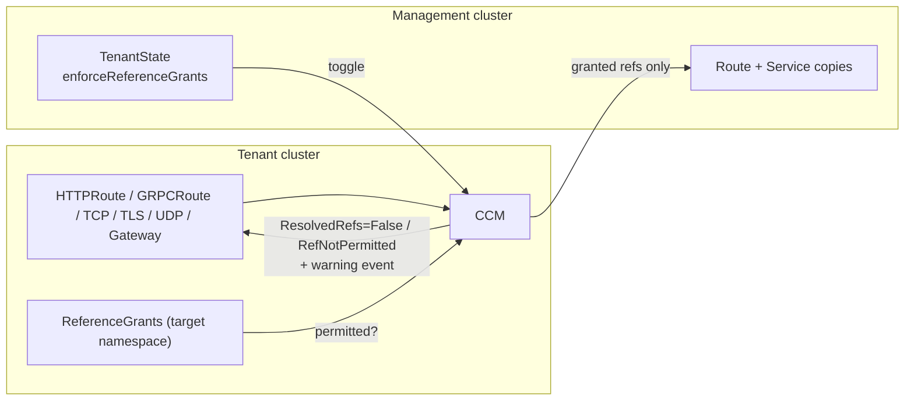

+++
title = "Gateway API"
linkTitle = "Gateway API"
date = 2023-10-27T10:07:15+02:00
weight = 4
+++

Set up Layer 7 load balancing with the Gateway API.

Gateway API targets three [personas](https://gateway-api.sigs.k8s.io/#personas):

1. Platform Provider: The Platform Provider is responsible for the overall environment that the cluster runs in, i.e. the cloud provider. The Platform Provider will interact with GatewayClass resources.
2. Platform Operator: The Platform Operator is responsible for overall cluster administration. They manage policies, network access, application permissions and will interact with Gateway resources.
3. Service Operator: The Service Operator is responsible for defining application configuration and service composition. They will interact with HTTPRoute and TLSRoute resources and other typical Kubernetes resources.

In KubeLB, the admins of the management cluster are the Platform Provider, responsible for creating the `GatewayClass` resource. Tenants are the Service Operators. The Platform Operator role depends on how the management cluster is configured: by default it is assigned to the tenants; in Enterprise Edition, setting the Gateway limit to 0 shifts it to the Platform Provider.

### Setup

Kubermatic's default recommendation is to use Gateway API and use [Envoy Gateway](https://gateway.envoyproxy.io/) as the Gateway API implementation. Install Envoy Gateway by following this [guide](https://gateway.envoyproxy.io/docs/install/install-helm/) or any other Gateway API implementation of your choice.

Update values.yaml for KubeLB manager chart to enable the Gateway API addon.

```yaml
kubelb:
  enableGatewayAPI: true

## Addon configuration
kubelb-addons:
  enabled: true
  # Create the GatewayClass resource in the management cluster.
  gatewayClass:
    create: true

  envoy-gateway:
    enabled: true
```

#### KubeLB Manager Configuration

Update the KubeLB Manager configuration to use the Gateway Class name as `eg` either at a Global or Tenant level:

#### Global

```yaml
apiVersion: kubelb.k8c.io/v1alpha1
kind: Config
metadata:
  name: default
  namespace: kubelb
spec:
  gatewayAPI:
    # Name of the Gateway Class.
    class: "eg"
```

#### Tenant

```yaml
apiVersion: kubelb.k8c.io/v1alpha1
kind: Tenant
metadata:
  name: shroud
spec:
  gatewayAPI:
    # Name of the Gateway Class.
    class: "eg"
```

**Leave it empty if you named your Gateway Class as `kubelb`**

#### Gateway Class Mappings (Enterprise Edition Only)

A tenant is not limited to a single gateway class. `classMappings` maps gateway class names used in the tenant cluster (`source`) to gateway class names in the management cluster (`target`). Mappings can be set globally on the `Config` and overridden per tenant; a tenant mapping replaces a global mapping with the same `source`. Up to 32 mappings are allowed per resource.

```yaml
apiVersion: kubelb.k8c.io/v1alpha1
kind: Tenant
metadata:
  name: shroud
spec:
  gatewayAPI:
    classMappings:
      - source: internal
        target: eg-internal
      - source: public
        target: eg-public
```

With this configuration, a Gateway created in the tenant cluster with `gatewayClassName: internal` is provisioned in the management cluster with the `eg-internal` class. Gateways using a class that has no mapping fall back to `gatewayAPI.class` (tenant first, then global).

The CCM watches Gateways whose class is either listed in the `kubelb.gatewayClasses` helm value (default: `kubelb`) or appears as a `source` in the effective mappings. This only applies when `useGatewayClass` is enabled; with `useGatewayClass: false` the CCM processes all Gateways regardless of class. The effective mappings for a tenant are published in `TenantState.status.gatewayAPI.classMappings`.

### Usage with KubeLB

#### Gateway resource

Once you have created the GatewayClass, the next resource that is required is the Gateway. In Community Edition, the Gateway needs to be created in the tenant cluster. In Enterprise Edition, the Gateway can exist in either the management cluster or the tenant cluster.

```yaml
apiVersion: gateway.networking.k8s.io/v1
kind: Gateway
metadata:
  name: kubelb
spec:
  gatewayClassName: kubelb
  listeners:
    - name: http
      protocol: HTTP
      port: 80
```

It is recommended to create the Gateway in tenant cluster directly since the Gateway Object needs to be modified regularly to attach new routes etc. In cases where the Gateway exists in management cluster, set the `use-gateway-class` argument for CCM to false.

{}
In Community Edition, only one Gateway is allowed per tenant and it must be named `kubelb`.
{}

#### HTTPRoute resource

```yaml
apiVersion: v1
kind: ServiceAccount
metadata:
  name: backend
---
apiVersion: v1
kind: Service
metadata:
  name: backend
  labels:
    app: backend
    service: backend
spec:
  ports:
    - name: http
      port: 3000
      targetPort: 3000
  selector:
    app: backend
---
apiVersion: apps/v1
kind: Deployment
metadata:
  name: backend
spec:
  replicas: 1
  selector:
    matchLabels:
      app: backend
      version: v1
  template:
    metadata:
      labels:
        app: backend
        version: v1
    spec:
      serviceAccountName: backend
      containers:
        - image: gcr.io/k8s-staging-gateway-api/echo-basic:v20231214-v1.0.0-140-gf544a46e
          imagePullPolicy: IfNotPresent
          name: backend
          ports:
            - containerPort: 3000
          env:
            - name: POD_NAME
              valueFrom:
                fieldRef:
                  fieldPath: metadata.name
            - name: NAMESPACE
              valueFrom:
                fieldRef:
                  fieldPath: metadata.namespace
---
apiVersion: gateway.networking.k8s.io/v1
kind: HTTPRoute
metadata:
  name: backend
spec:
  parentRefs:
    - name: kubelb
  hostnames:
    - "www.example.com"
  rules:
    - backendRefs:
        - group: ""
          kind: Service
          name: backend
          port: 3000
          weight: 1
      matches:
        - path:
            type: PathPrefix
            value: /
```

### Cross-namespace references with ReferenceGrants (Enterprise Edition)

By default, a route in one namespace can point its `backendRefs` at a Service in another namespace, and a Gateway can pick up a TLS certificate `Secret` from wherever it likes. That is convenient, but it also means anyone who can create a route can reach across namespace boundaries inside their cluster. If you run untrusted or semi-trusted teams side by side in the same tenant, you probably want them to opt in to those references rather than getting them for free.

The Gateway API answers this with the [ReferenceGrant](https://gateway-api.sigs.k8s.io/api-types/referencegrant/): the owner of the *target* namespace publishes a grant that says "I allow references of this kind, coming from that namespace." KubeLB can enforce those grants for you.

Enforcement is off by default, so upgrading changes nothing until you ask for it. Turn it on with `enforceReferenceGrants`, either globally on the `Config` or per tenant (the tenant value wins):

```yaml
apiVersion: kubelb.k8c.io/v1alpha1
kind: Tenant
metadata:
  name: shroud
spec:
  gatewayAPI:
    enforceReferenceGrants: true
```

With enforcement on, KubeLB checks every cross-namespace reference before it ever leaves the tenant cluster. This covers `backendRefs` on all route kinds (HTTPRoute, GRPCRoute, TCPRoute, TLSRoute, UDPRoute, including `requestMirror` filters) and the TLS `certificateRefs` on your Gateways. A reference that no grant permits is quietly dropped: its Service is never synced to the management cluster, the route (or Gateway listener) reports `ResolvedRefs: False` with reason `RefNotPermitted`, and a warning event lands on the source object so the person who wrote the route can see exactly what got cut and why.



To let an HTTPRoute in `team-a` talk to a Service in `team-b`, the owner of `team-b` creates a grant in their own namespace:

```yaml
apiVersion: gateway.networking.k8s.io/v1beta1
kind: ReferenceGrant
metadata:
  name: allow-team-a-routes
  namespace: team-b
spec:
  from:
    - group: gateway.networking.k8s.io
      kind: HTTPRoute
      namespace: team-a
  to:
    # Omitting `name` allows every Service in team-b; set it to gate a single Service.
    - group: ""
      kind: Service
```

The moment that grant exists, KubeLB re-evaluates the affected routes and traffic starts flowing. Delete it, and the reference is revoked on the next reconcile. The same pattern works for a Gateway reaching a TLS `Secret` in another namespace — the grant's `from` kind becomes `Gateway` and its `to` kind becomes `Secret`.

{}
When a backend reference is denied, KubeLB drops it from the route rather than serving 503s for that backend's share of traffic, which is a small deviation from the Gateway API spec. In practice this means traffic is spread across the remaining allowed backends of the rule; if every backend in a rule is denied, the rule ends up with nothing to route to and the gateway returns 503. Cross-namespace TLS `Secret`s additionally have to carry the `kubelb.k8c.io/managed-by: kubelb` label to be synced at all — a grant authorizes the reference, but the label is what tells KubeLB to mirror the secret.
{}

### Support

The following resources are supported in CE and EE version:

- Community Edition:
  - HTTPRoute
  - GRPCRoute
- Enterprise Edition:
  - HTTPRoute
  - GRPCRoute
  - TCPRoute
  - UDPRoute
  - TLSRoute
  - [ClientTrafficPolicy]()
  - [BackendTrafficPolicy]()
  - [ReferenceGrant enforcement](#cross-namespace-references-with-referencegrants-enterprise-edition)
  - [Backend pools]()

**For more details on how to use them and example, please refer to examples from [Envoy Gateway Documentation](https://gateway.envoyproxy.io/docs/tasks/)**

### Limitations

- BackendTLSPolicy is not supported in KubeLB, yet. If you would like to use this feature, please open an issue on [GitHub](https://github.com/kubermatic/kubelb/issues) to help us prioritize it.
