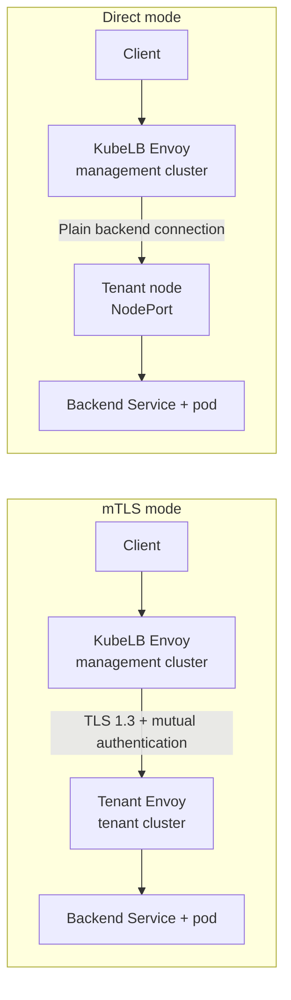

+++
title = "mTLS Backend Transport"
linkTitle = "mTLS Backend Transport"
description = "Encrypt KubeLB backend traffic between management and tenant clusters with mutual TLS."
date = 2026-05-07T10:00:00+02:00
weight = 45
enterprise = true
+++

## Overview

{}
mTLS backend transport is a **Beta / Technical Preview** feature (see [Kubermatic feature stages](https://docs.kubermatic.com/kubermatic/main/architecture/feature-stages/)). It is safe to enable and supported; the configuration surface may still change between releases with migration instructions. The stage applies to the feature as a whole, including the CONNECT-UDP tunnel.
{}

KubeLB can encrypt backend traffic between the management cluster and tenant clusters with mutual TLS (mTLS). When enabled, KubeLB deploys a tenant-local Envoy Proxy and routes management-to-tenant backend traffic through it.



Application teams keep using the same Kubernetes resources: `LoadBalancer` Services, `Ingress`, and Gateway API routes. The backend transport change is handled by KubeLB.

Use this feature when the management and tenant clusters communicate across a network path where backend traffic should not be plaintext.

{}
UDPRoute uses a CONNECT-UDP tunnel over the same mTLS tenant proxy port; see [UDP behavior](#udp-behavior).
{}

## Prerequisites

- A KubeLB Enterprise Edition license; the feature ships in the `kubelb-manager-ee` chart.
- The management cluster must be able to reach the tenant proxy. The required destination depends on how the proxy is exposed:
  - **NodePort (default):** tenant node addresses on the assigned NodePort. TCP backends and UDPRoute tunnels share this port.
  - **LoadBalancer:** the tenant proxy load balancer address on TCP port `15443`. See [Tenant proxy and UDP configuration](#tenant-proxy-and-udp-configuration).
  - **Static addresses:** every address configured on the CCM, using its configured port. See [Tenant-side exposure overrides](#tenant-side-exposure-overrides).

Check the tenant proxy Service:

```bash
kubectl --context <tenant> -n kubelb \
  get service kubelb-tenant-envoy -o wide
```

## Enable mTLS backend transport

Enable the feature on the KubeLB manager chart:

```yaml
kubelb:
  backendTransport:
    mode: MTLS
```

Upgrade the KubeLB manager release:

```bash
helm upgrade kubelb oci://quay.io/kubermatic/helm-charts/kubelb-manager-ee \
  --namespace kubelb \
  --reuse-values \
  --set kubelb.backendTransport.mode=MTLS
```

The chart writes the setting to the management cluster `Config` resource:

```yaml
apiVersion: kubelb.k8c.io/v1alpha1
kind: Config
metadata:
  name: default
  namespace: kubelb
spec:
  backendTransport:
    mode: MTLS
```

Tenants do not need a separate setting. The tenant CCM discovers the effective mode from `TenantState` and reconciles the tenant proxy automatically.

{}
Switching between `Direct` and `MTLS` changes the backend traffic path. Plan it like a network topology change and validate tenant traffic after rollout.
{}

### Confirm the mode change on an existing installation

Switching the mode re-plumbs the tenant dataplane and briefly disrupts tenant traffic.

{}
The flip is fleet-wide: there is no per-tenant canary in v1.5, so every tenant switches at once. Measured on real clusters, switching to `MTLS` costs from ~15 seconds up to a few minutes of hard failure per tenant — the duration is not deterministic (Layer 4 routes recover last, and a slow tenant apiserver extends the window). The switch also destroys every client keepalive connection pool: each in-flight request gets a 503 **and** a closed connection, so expect a connection-rate spike until pools rebuild. Switching back to `Direct` is close to hitless. Schedule a maintenance window and make sure clients have retry policies.
{}

{}
**Do not treat the `TenantState` conditions as a "switch complete" signal.** `TenantProxyReady` and the
other conditions report control-plane state and go `True` several seconds to a few minutes *before* traffic
actually flows through the new path (Layer 4 recovers last). An automation that runs `kubectl wait` on these
conditions and then proceeds will act during the outage. The only trustworthy "done" signal is a real
request succeeding end to end on a route in the affected tenant. There is no dataplane-convergence condition
in v1.5.
{}

On an installation with existing tenants, KubeLB holds the mode change until the `Config` carries a confirmation annotation with the target mode:

```bash
kubectl --context <management> -n kubelb annotate config default \
  kubelb.k8c.io/confirm-backend-transport-change=MTLS --overwrite
```

Until the change is confirmed, tenants keep running the previous mode and each `TenantState` reports the `BackendTransportChangePending` condition:

```bash
kubectl --context <management> -n <tenant-namespace> \
  get tenantstate default -o jsonpath='{.status.conditions[?(@.type=="BackendTransportChangePending")].message}{"\n"}'
```

The annotation is compared against the target mode and becomes inert after the change is applied. Remove it afterwards or leave it in place until the next mode change. New tenants always receive the configured mode without confirmation.

## Verify the rollout

Check the tenant state in the management cluster:

```bash
kubectl --context <management> -n <tenant-namespace> \
  get tenantstate -o jsonpath='{.items[*].status.conditions[?(@.type=="TenantProxyReady")].status}{"\n"}'
```

Expected result:

```text
True
```

Check the tenant proxy DaemonSet in the tenant cluster:

```bash
kubectl --context <tenant> -n kubelb \
  get daemonset kubelb-tenant-envoy
```

The DaemonSet should have ready pods on tenant nodes that can receive backend traffic.

## What KubeLB manages

KubeLB manages the certificate lifecycle for this transport:

- A KubeLB-owned root CA.
- A tenant-scoped intermediate CA.
- A management Envoy client certificate.
- A tenant proxy server certificate.

The management Envoy and tenant Envoy validate each other with tenant-specific identities and use TLS 1.3 for TCP connections. Certificate rotation is automatic and does not normally require a tenant proxy pod restart. Intermediate CA rotation is two-phase: KubeLB distributes the new trust bundle first and re-signs leaf certificates after a short propagation grace, so new connections keep working during rotation.

If a manually created certificate Secret conflicts with the KubeLB-managed one, KubeLB refuses to overwrite it and reports `BackendCertificateConflict` on the affected `Tenant`.

## Supported traffic

Traffic is encrypted between management Envoy and the tenant proxy for:

- `LoadBalancer` Services with TCP ports.
- `Ingress`.
- `HTTPRoute`.
- `GRPCRoute`.
- `TCPRoute`.
- `TLSRoute`.
- `UDPRoute`.

The tenant proxy forwards traffic to the backend Kubernetes Service inside the tenant cluster.

### UDP behavior

In `MTLS` mode, UDPRoute traffic is tunneled with CONNECT-UDP over the existing mTLS tenant proxy TCP port. The tenant proxy Service does not expose per-backend UDP NodePorts. To keep UDP on plain NodePorts instead, set `backendTransport.udp.mode: Direct` (see below).

Envoy marks CONNECT-UDP and raw UDP-over-HTTP tunneling as alpha upstream. Validate workload-specific MTU, burst, stream-count, and idle-timeout behavior before using it for production UDP traffic.

## Tenant proxy and UDP configuration

The MTLS topology can be tuned on the `Config` resource under `spec.backendTransport`:

```yaml
spec:
  backendTransport:
    mode: MTLS
    tenantProxy:
      serviceType: NodePort   # NodePort (default) or LoadBalancer
      workload: DaemonSet     # DaemonSet (default) or Deployment
      # replicas: 2           # Deployment only
    udp:
      mode: Tunnel            # Tunnel (default) or Direct
```

- `tenantProxy.serviceType`: With `NodePort` (default), the CCM publishes tenant node addresses plus the allocated NodePort. With `LoadBalancer`, the CCM publishes the Service's load balancer ingress IPs or hostnames, and the management Envoy dials the fixed tenant proxy port 15443 instead of a NodePort.
- `tenantProxy.workload`: `DaemonSet` (default) runs one proxy per node. `Deployment` runs a fixed number of replicas (`tenantProxy.replicas`, default 2) spread across nodes; the CCM then publishes only the node addresses that host proxy pods, so the management Envoy never dials a node without a local proxy.
- `udp.mode`: `Tunnel` (default) wraps each UDP session in CONNECT-UDP over the encrypted tenant proxy port. `Direct` is an escape hatch that keeps UDP on plain, unencrypted per-service NodePorts for workloads sensitive to the tunnel's MTU overhead or to Envoy's upstream CONNECT-UDP maturity.

### Tenant-side exposure overrides

How the tenant proxy is reachable is a property of the tenant cluster's network, so it can also be configured on the KubeLB CCM chart. CCM-side settings take precedence over the `Config` projection above:

```yaml
kubelb:
  tenantProxy:
    # Override the Service type (NodePort or LoadBalancer). Empty follows
    # the management cluster Config.
    serviceType: ""
    # Static IPs or hostnames published as the tenant proxy dial target
    # instead of node or load balancer addresses.
    staticAddresses: []
    # Port dialed together with staticAddresses.
    staticPort: 15443
```

- `serviceType`: same semantics as `tenantProxy.serviceType` on the `Config` resource, decided by the tenant cluster operator instead of the management cluster.
- `staticAddresses`: for tenant proxies fronted by an appliance, NAT, or a user-managed DNS record that the Service status cannot know about. The CCM publishes these addresses verbatim (with `staticPort`) and the management Envoy dials them directly; hostnames are resolved by the management Envoy via DNS. The management cluster must be able to reach every listed address on `staticPort`, and the address must forward to the tenant proxy Service.

Mutual TLS certificate verification is based on per-tenant SANs, not on the dialed address, so static addresses and DNS names require no certificate changes.

## Operations

These changes do not normally restart tenant proxy pods:

- Adding or removing backend Services or Routes.
- Backend configuration updates.
- Certificate rotation.

These changes may roll tenant proxy pods:

- Enabling or disabling mTLS backend transport.
- KubeLB upgrades that change tenant proxy bootstrap configuration.
- Pod-template-level settings such as image, node selector, tolerations, or image pull secrets.

Management Envoy runs active TCP health checks against the tenant proxy through the mTLS transport at a 60-second interval. A passing probe validates node reachability, certificates, and SNI routing for the backend. Between probes, passive outlier detection ejects tenant proxy endpoints after real request failures. `TenantProxyReady` reports DaemonSet readiness, not application health.

## Metrics to watch

Manager metrics:

| Metric | What to watch |
| --- | --- |
| `kubelb_manager_mtls_certificate_rotation_failures_total` | Any non-zero rate during rotation needs investigation. |
| `kubelb_manager_mtls_tenants` | Number of tenants with mTLS PKI material. |

CCM metrics:

| Metric | What to watch |
| --- | --- |
| `kubelb_ccm_tenant_proxy_daemonset_ready` | `1` means the tenant proxy DaemonSet is ready; `0` means it is not ready. |
| `kubelb_ccm_tenant_proxy_server_cert_verification_failures_total` | The tenant CCM rejected synced server certificate material. |

## Troubleshooting

### Tenant proxy is not ready

Inspect `TenantState` on the management cluster:

```bash
kubectl --context <management> -n <tenant-namespace> \
  get tenantstate -o yaml
```

Look for the `TenantProxyReady` condition and reason.

Then inspect the tenant proxy DaemonSet:

```bash
kubectl --context <tenant> -n kubelb \
  describe daemonset kubelb-tenant-envoy
```

### Certificate verification is failing

Check:

```text
kubelb_ccm_tenant_proxy_server_cert_verification_failures_total
```

Common causes include clock skew, stale certificate material, wrong tenant DNS names, wrong extended key usage, or a foreign `SyncSecret`.

If the affected `Tenant` has `BackendCertificateConflict=True`, remove the conflicting `kubelb-tenant-proxy-server-tls` `SyncSecret` from the tenant namespace on the management cluster and let KubeLB recreate it.

### Traffic fails after the proxy is ready

Verify management-to-tenant NodePort reachability first. The management cluster must be able to reach the NodePorts assigned to `kubelb-tenant-envoy`.

You can inspect the backend clusters loaded by the tenant proxy:

```bash
kubectl --context <tenant> -n kubelb \
  exec ds/kubelb-tenant-envoy -c envoy -- \
  wget -qO- http://localhost:19000/clusters
```

Port 19000 is the tenant proxy's Envoy admin interface; the mTLS listener that receives backend traffic listens on port 15443.

## Disable mTLS backend transport

Confirm the mode change on the `Config`:

```bash
kubectl --context <management> -n kubelb annotate config default \
  kubelb.k8c.io/confirm-backend-transport-change=Direct --overwrite
```

Switch back to `Direct`:

```bash
helm upgrade kubelb oci://quay.io/kubermatic/helm-charts/kubelb-manager-ee \
  --namespace kubelb \
  --reuse-values \
  --set kubelb.backendTransport.mode=Direct
```

Without the annotation, tenants keep running `MTLS` and `TenantState` reports `BackendTransportChangePending`. After the change is confirmed, the CCM cleans up tenant proxy resources. Plan for a brief traffic path change while traffic moves back to direct tenant NodePort routing.
