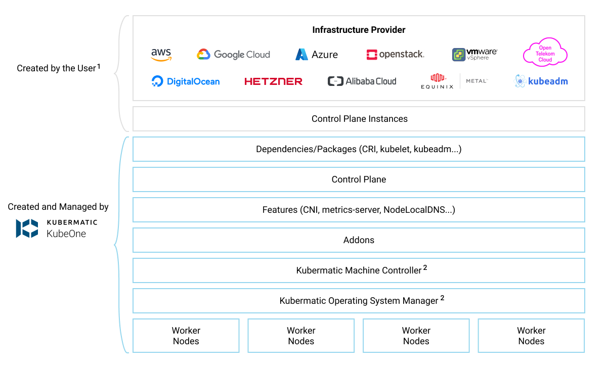

+++
title = "Architecture"
date = 2021-02-10T09:00:00+02:00
description = "Learn about the architecture of Kubermatic KubeOne and how you can automate cluster operations on all environments"
weight = 3
+++

Kubermatic KubeOne automates cluster operations on all your cloud, on-prem,
edge, and IoT environments. It comes as a CLI that allows you to manage the
full lifecycle of your clusters, including installing and provisioning,
upgrading, repairing, and unprovisioning them.

KubeOne utilizes [Kubernetes' kubeadm][kubeadm] for handling provisioning and
upgrading tasks. Kubeadm allows us to follow the best practices and create
conformant and production-ready clusters.

Most of the tasks are carried out by running commands over SSH, therefore
the SSH access to the control plane nodes is required. Such tasks include
installing and upgrading dependencies (such as container runtime and Kubernetes
binaries), generating and distributing configuration files and certificates,
running kubeadm, and more. The cluster components and addons are applied
programmatically using client-go and controller-runtime libraries.
By default, KubeOne deploys the Canal CNI plugin, metrics-server, NodeLocalDNS,
and Kubermatic machine-controller.

For officially supported providers, the worker nodes are managed by using the
Kubermatic machine-controller based on the Cluster-API. For other providers,
the worker nodes can be managed by using KubeOne Static Workers feature.

This approach allows us to manage clusters on any infrastructure, is it
cloud, on-prem, baremetal, Edge, or IoT.

The following diagram shows the KubeOne's architecture, including what
tasks should be done by the user, what tasks are done by KubeOne, and in
which particular order.
Additional details about concepts used by KubeOne can be found in the
[Concepts][concepts] document.

1 This diagram shows [officially supported providers][supported-providers].
KubeOne is not limited to those providers and is supposed to work on any
infrastructure out of the box, for example, on bare-metal.
Officially supported providers have additional features, such as Terraform
integration, example Terraform configurations that can be used to create
the initial infrastructure, and the machine-controller support.

2 [Kubermatic Machine Controller][machine-controller] and [Kubermatic Operating System Manager][operating-system-manager] are available
only for [officially supported providers][supported-providers]. For non-officially
supported providers, you can provision machines manually using KubeOne's
[Static Workers feature][static-workers].

[kubeadm]: https://kubernetes.io/docs/reference/setup-tools/kubeadm/kubeadm/
[concepts]: 
[supported-providers]: 
[terraform-integration]: 
[terraform-configs]: 
[machine-controller]: <https://github.com/kubermatic/machine-controller>
[operating-system-manager]: <https://github.com/kubermatic/operating-system-manager>
[static-workers]: 
