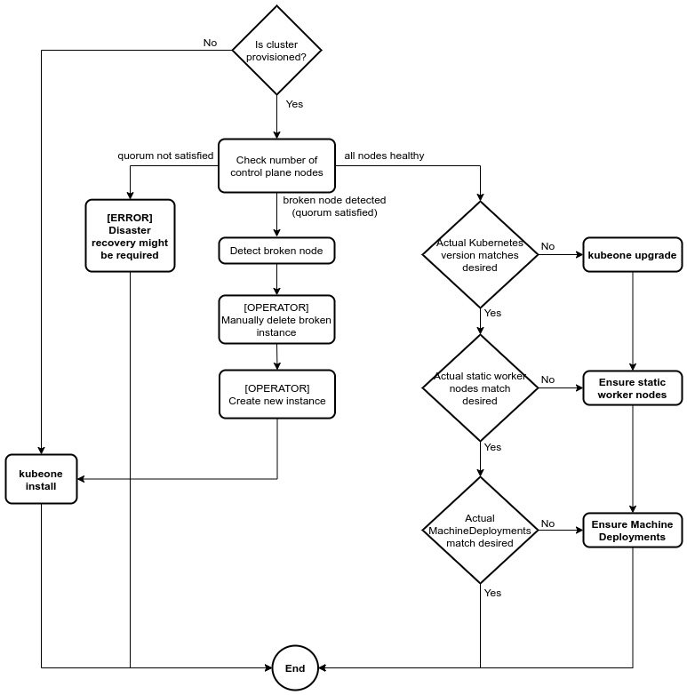

+++
title = "Cluster Reconciliation"
meta description = "In this section you learn reconciling your cluster with KubeOne"
date = 2021-02-10T12:00:00+02:00
weight = 3
enableToc = true
+++

## What is Cluster Reconciliation?

Cluster reconciliation is a process of determining the actual state of the
cluster and taking actions based on the difference between the actual and the
expected states. The cluster reconciliation is capable of automatically
installing, upgrading, and repairing the cluster. On top of that,
the reconciliation can change cluster properties, such as apply addons, create
new worker nodes, and/or enable/disable features.

## How it works?

The cluster reconciliation process is implemented as part of the `kubeone apply`
command. The `apply` command runs a set of predefined probes to determine the
actual state, while the expected state is defined as a KubeOne configuration
manifest. Generally, the predefined probes determine:

* Operating system and hostnames
* Container runtime
* Is a Kubernetes cluster already provisioned on given instances
* Are all given instances part of the cluster and healthy
* Is a cluster running the expected Kubernetes version
* Are all components and MachineDeployments up-to-date

Depending on the difference between the determined actual state and the
expected state, the `apply` command would take the following actions:

* If the cluster is **not provisioned** on given instances:
  * Run the **cluster provisioning process**
* If the cluster **is provisioned**:
  * If the **cluster is healthy**:
    * If **upgrade is needed** (mismatch between expected and actual Kubernetes
    versions), run the **upgrade process**
    * If there are **not provisioned** control plane or static worker instances
    try to **provision and join them a cluster** or **instruct** the operator
    about the needed steps.
    * If needed, update all **components** and create **new MachineDeployments**
  * If there are **unhealthy control plane nodes**:
    * Check is the etcd quorum satisfied:
      * An etcd cluster needs a majority of nodes, **a quorum**, to agree on
        updates to the cluster state
      * For a cluster with `n` members, quorum is `(n/2)+1`
      * If the **quorum is satisfied**:
        * **Repair** the cluster if possible or **instruct** the operator about
          the needed steps
      * If the **quorum is not satisfied**:
        * Instruct the operator about the
          [**disaster recovery** process][disaster-recovery]

The following flowchart describes the reconciliation process graphically:



### Repairing Unhealthy Clusters

The `apply` command has ability to detect is cluster in an unhealthy
state. The cluster is considered unhealthy if there's at least one node that's
unhealthy, which can happen if:

* container runtime is failing or not running
* kubelet is failing or not running
* API server is failing or unhealthy
* etcd is failing or unhealthy

In such a case, there are two options:

* the operator connects to the failing instance over SSH and tries to repair
  the node manually
* the operator manually deletes a broken instance, updates the KubeOne
  configuration file to remove the old instance and add a new one, and then run
  `kubeone apply` to join the new instance a cluster

{}
If there are multiple unhealthy instances, it might be required to replace
and repair instance by instance in order to maintain the etcd quorum. KubeOne
recommends which instances are safe to be deleted without affecting the quorum.
It's strongly advised to follow the order or otherwise you're risking losing
the quorum and all cluster data. If it's not possible to repair the cluster
without affecting the quorum, KubeOne will fail to repair the cluster. In that
case, [disaster recovery][manual-cluster-recovery] might be required.

[manual-cluster-recovery]: 
{}

### Reconciling Dynamic Worker Nodes (MachineDeployments)

The apply command doesn't modify or delete existing MachineDeployments.
Modifying existing MachineDeployments should be done by the operator either by
using kubectl or the Kubernetes API directly.

To make managing MachineDeployments easier, the operator can generate the
manifest containing all MachineDeployments defined in the KubeOne
configuration (or Terraform state) by using the following command:

```bash
kubeone config machinedeployments --manifest config.yaml -t tf.json
```

### Reconciling Static Worker Nodes

The `apply` command doesn't remove or unprovision the static worker
nodes. That can be done by removing the appropriate instance manually.
If there is CCM (cloud-controller-manager) running in the cluster, the Node
object for the removed worker node should be deleted automatically.
If there's no CCM running in the cluster, you can remove the Node object
manually using kubectl.

### Reconciling Features

Currently, the `apply` command doesn't reconcile features. If you
enable/disable any feature on already provisioned cluster, you have to
explicitly run the upgrade process for changes to be in the effect.
You don't have to change the Kubernetes version, instead, you can use the
`--force-upgrade` flag to force the upgrade process:

```bash
kubeone apply --manifest config.yaml -t . --force-upgrade
```

[disaster-recovery]: 
