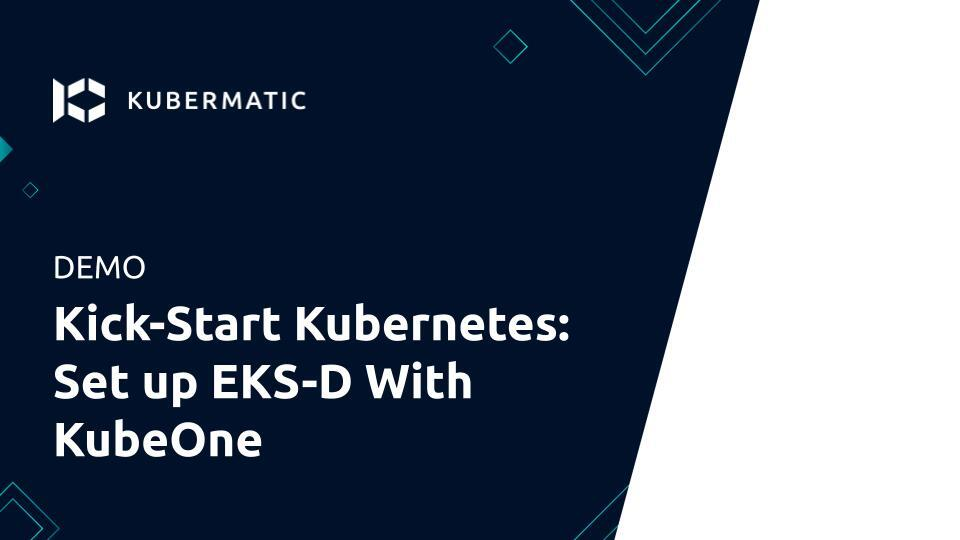

+++
title = "Creating an Amazon EKS-D Cluster on AWS"
date = 2021-02-10T12:00:00+02:00
weight = 4
enableToc = true
+++

[Amazon EKS Distro (EKS-D)][eks-d-intro] is a Kubernetes distribution based on
and used by Amazon EKS. Amazon EKS Distro enables operators to create reliable
and secure Kubernetes clusters using the same versions of Kubernetes and its
dependencies deployed by Amazon EKS. Thanks to Kubermatic KubeOne’s Terraform
integration and ease of use, users can install EKS Distro on AWS and 
Amazon Linux 2 with minimal operational effort.

In this tutorial, we're going to show how to use Kubermatic KubeOne to create
a highly-available Kubernetes cluster running
[Amazon EKS-D distro][eks-d-intro]. The tutorial covers downloading KubeOne
and setting up the environment, creating the infrastructure using example
Terraform configs, and finally, provisioning a cluster using KubeOne. As a
result, you'll get a production-ready and Kubernetes/CNCF conformant cluster,
running Amazon EKS-D distro on AWS.

{}
The Amazon EKS-D is currently only supported on AWS with Amazon Linux 2.
We're working on expanding the cloud provider and operating systems support for
EKS-D. In meanwhile, you can follow the [issue #1201][k1-issue-1201] for more details.

[k1-issue-1201]: https://github.com/kubermatic/kubeone/issues/1201
{}

{}
Currently it's not possible to upgrade EKS-D clusters from 1.18 to 1.19. We're
investigating the root cause of the issue and we hope to fix it in the future.
For more information, check out the [issue 1284][k1-issue-1284].

[k1-issue-1284]: https://github.com/kubermatic/kubeone/issues/1284
{}

We also have a recorded demo that covers all the steps of this tutorial:

[](https://youtu.be/ul1XdEKF01k)

## Prerequisites

This tutorial assumes that you're using Linux or macOS. KubeOne currently
doesn't release Windows binaries. If you're using Windows, we recommend
checking out the Windows Subsystem for Linux (WSL).

This tutorial requires Kubermatic KubeOne v1.2.1 or newer. We'll show how to
download the latest Kubermatic KubeOne release in this tutorial. If you already
have KubeOne installed, you can run `kubeone version` command to check which
version are you running.

## How Kubermatic KubeOne Works

Kubermatic KubeOne is a CLI tool for managing highly-available Kubernetes
clusters in any environment (cloud, on-prem, baremetal, edge...). Clusters
created by KubeOne are production-ready and Kubernetes/CNCF conformant out of
the box. Generally, KubeOne runs the following tasks:

* install dependencies and required packages (container runtime, kubelet, 
  kubeadm...)
* run Kubernetes' Kubeadm to provision a cluster
* deploy components such as CNI and metrics-server

### Infrastructure Management

The infrastructure for the control plane is created by the user. This allows
KubeOne to work with any provider out of the box. Once the infrastructure is
created, the user provides information about the instances that will be used,
the load balancer that's running in the front of the control plane nodes, and
the information that will be used later to provision the worker nodes.

To make this task easier, KubeOne integrates with Terraform by reading the
Terraform state, and provides example Terraform configs that can be used to
create the infrastructure. We'll use both the Terraform integration and the
example configs in this tutorial.

Generally, the infrastructure for the worker nodes can be managed in two ways: 

* automatically, by using Kubermatic machine-controller (deployed by default
  for supported providers)
* by creating the instances manually and using KubeOne to provision
  them

Running Amazon EKS-D clusters currently requires following the second approach,
as Kubermatic machine-controller doesn't support Amazon EKS-D. We'll create
instances for worker nodes using example Terraform configs, and then provision
them using the [KubeOne Static Workers][static-workers] feature.

The example Terraform configs that we'll be using satisfy all infrastructure
requirements out of the box. However, if you're planning on customizing configs
or using different approach, make sure to adhere to the requirements described
in the [Infrastructure Management document][infrastructure-management].

Below, you can find a diagram that shows how KubeOne works.



## Default Configuration

By default, KubeOne installs the following components:

* Container Runtime: Docker (containerd is supported as an alternative)
* CNI: Canal (based on Calico and Flannel) (WeaveNet and user-provided CNI are
  supported)
* [metrics-server][metrics-server] for collecting and exposing metrics from
  Kubelets
* [NodeLocal DNSCache][nodelocaldns] for caching DNS queries to improve the
  cluster performance
* [Kubermatic machine-controller][machine-controller], a Cluster-API based
  implementation for managing worker nodes

It's possible to configure which components are installed and how they are
configured by adjusting the KubeOne configuration manifest that we'll create
later in the Step 6 (Provisioning The Cluster). To see possible configuration
options, refer to the configuration manifest reference which can be obtained
by running `kubeone config print --full`.

## Step 1 — Downloading KubeOne

The easiest way to download KubeOne is to use our installation script.
The following command will download and run the script:

```shell
curl -sfL get.kubeone.io | sh
```

The script downloads the latest version of KubeOne from GitHub, and unpacks it
in the `/usr/local/bin` directory. Additionally, the script unpacks the example
Terraform configs, addons, and helper scripts in your current working
directory. At the end of the script output, you can find the path to the
unpacked files:

{}
The addons and helper scripts are supposed to be used for advanced deployments
and we will not use those in this tutorial. They're not required by KubeOne, so
you're not required to keep to them.
{}

```shell
...
Kubermatic KubeOne has been installed into /usr/local/bin/kubeone
Terraform example configs, addons, and helper scripts have been downloaded into the ./kubeone_1.2.1_linux_amd64 directory
```

You can confirm that KubeOne has been installed successfully by running the
`kubeone version` command. If you see an error, ensure that `/usr/local/bin` is
in your `PATH` or modify the script to install KubeOne in a different place.
You can also check the [Getting KubeOne guide][getting-kubeone] for alternative
installation methods.

## Step 2 — Downloading Terraform

As described in the How KubeOne Works section, we'll use Terraform to manage
the infrastructure for the control plane and worker nodes, therefore we need to
install it. Terraform has several installation methods: manually, using a
package manager such as `apt`, using Homebrew (for macOS users). In this
tutorial, we'll do it manually, but you can check out the
[official installation guide][install-terraform] for other options.

First, visit the [Terraform download page][download-terraform] and grab the
link for the latest version for your platform and architecture.
KubeOne requires Terraform 0.12.10 or newer. You can download it from the
browser, or use `cURL` such as:

```shell
curl -LO https://releases.hashicorp.com/terraform/0.14.7/terraform_0.14.7_linux_amd64.zip
```

Once you download the archive, unzip it:

```shell
unzip terraform_0.14.7_linux_amd64.zip
```

Finally, move the unpacked `terraform` binary to somewhere in your `PATH`.
We'll use `/usr/local/bin` for the purposes of this tutorial:

```shell
mv terraform /usr/local/bin
```

After that is done, Terraform is ready to be used. You can run
`terraform version` to check is it properly installed. If you see an error,
ensure that the directory where you moved the binary is in your `PATH`.

## Step 3 — Configuring The Environment

KubeOne and Terraform require you to have the cloud provider credentials
exported as the environment variables. You can find the environment variables
required for a cluster running on AWS in the table below.


{}
You need an [IAM account](https://docs.aws.amazon.com/IAM/latest/UserGuide/id_users_create.html)
with the appropriate permissions for Terraform to create the infrastructure
and for machine-controller to create worker nodes.

| Environment Variable    | Description                                                                                                                                               |
| ----------------------- | --------------------------------------------------------------------------------------------------------------------------------------------------------- |
| `AWS_ACCESS_KEY_ID`     | The AWS Access Key                                                                                                                                        |
| `AWS_SECRET_ACCESS_KEY` | The AWS Secret Access Key                                                                                                                                 |
| `AWS_PROFILE`           | Name of the profile defined in the `~/.aws/credentials` file. This variable is considered only if `AWS_ACCESS_KEY_ID` or `AWS_SECRET_ACCESS_KEY` is unset |

#

{}


{}
As credentials are deployed to the cluster, it's recommended to use
dedicated, non-administrator credentials whenever it's possible.
{}

To set the environment variable, use the `export` command such as:

```shell
export <VARIABLE_NAME>=<VARIABLE_VALUE>
```

## Step 4 — Creating The Infrastructure

With KubeOne installed and the environment configured, we're ready to create
the infrastructure for our cluster. We'll use the example Terraform configs for
this step.

First, move to the directory with the example Terraform configs that has been
created while installing KubeOne in the Step 1. For example (the directory
name depends on the latest KubeOne version):

```shell
cd ./kubeone_1.2.1_linux_amd64/examples/terraform
```

In this directory, you can find a subdirectory for each provider supported by
KubeOne. Since we'll be using AWS for this tutorial, move to the
`aws` directory:

```shell
cd ./aws
```

Before we can use Terraform, we need to initialize the directory structure and
download the required plugins. This is done by using the `init` command:

```shell
terraform init
```

In the same directory, create a file called `terraform.tfvars` which will
contain Terraform variables used to customize the infrastructure creation
process. Provisioning the Amazon EKS-D cluster requires setting the following
variables:

```terraform
cluster_name        = "kubeone-cluster"
ssh_public_key_file = "~/.ssh/id_rsa.pub"

# Currently, Kubermatic machine-controller doesn’t support Amazon Linux 2,
# so we will use KubeOne Static Worker nodes. The static worker nodes are
# managed by KubeOne, Terraform, and kubeadm, and are defined by the
# static_workers_count variable below.
initial_machinedeployment_replicas = 0

# This variable doesn't have any effect, as initial_machinedeployment_replicas
# is set to 0. Instead, static worker nodes running Amazon Linux 2 will be used
# (defined by static_workers_count and os variables).
# Setting this variable is required in order for validation to pass. This will
# be fixed in # the upcoming versions.
worker_os = "ubuntu"

# Number of static worker nodes to be created and provisioned.
static_workers_count = 3

# Currently, KubeOne supports EKS-D only on Amazon Linux 2.
# Support for other operating systems is planned for the future.
os           = "amazon_linux2"
ssh_username = "ec2-user"
bastion_user = "ec2-user"
```

The `cluster_name` variable is used as a prefix for cloud resources.
The `ssh_public_key_file` is a path to a SSH public key that will be deployed
on instances. KubeOne connects to instances over SSH to provision and configure
them. If you don't have an SSH key, you can generate one by running
`ssh-keygen`.

The `terraform.tfvars` files can also be used to customize properties such as
instances size. We'll use the default settings, but if you wish to customize
settings, you can check the
[Using Terraform Configs document][terraform-configs] for more details.

Once the `terraform.tfvars` file is created, run the `plan` command to see what
changes will be made:

```shell
terraform plan
```

If you agree with the proposed changes, you can apply them by running the
`apply` command. This command will create the infrastructure needed to get
started. You'll be asked to confirm your intention by typing `yes`.

```shell
terraform apply
```

Finally, we need to save the Terraform state in a format that can be parsed by
KubeOne for information about the infrastructure (security groups, IAM roles,
etc.), instances, and load balancer. This information will be used for
accessing the instances, provisioning the control plane and the worker nodes.
The format is already defined in a file called `output.tf` and everything
you need to do is to run the `output` command:

```shell
terraform output -json > tf.json
```

This command will create a file called `tf.json` with JSON representation of
the Terraform state that can be parsed by KubeOne. With that done, we're ready
to provision our cluster which will do in the next step.

## Step 5 — Downloading Amazon EKS-D Release Manifest

The Amazon EKS-D Release Manifest is a YAML-formatted manifest which contains
a list of available assets (images and binaries) along with their URLs. We'll
use the information from this manifest to create a KubeOne Cluster
manifest in the next step.

The links to the Amazon EKS-D Release Manifests for supported EKS-D versions
can be found in the [`aws/eks-distro` GitHub repository][eks-distro-github].
Download the manifest for the EKS-D release that you want to use.

Once you have the manifest, you can proceed to the next step where we'll use
KubeOne to provision the EKS-D cluster.

## Step 6 — Provisioning The Cluster

Now that we have the infrastructure, we can use KubeOne to provision an
Amazon EKS-D cluster.

The first step is to create a KubeOne configuration manifest that defines:

* The desired Kubernetes version in the EKS-D format, e.g. `v1.18.9-eks-1-18-1`
* The target cloud provider (in our case AWS)
* The asset configuration containing references to EKS-D images and binaries

The manifest can be saved in a file called `kubeone.yaml`. Below, you can find
a KubeOne configuration manifest template that you can use to build your own
manifest.

Other information, such as information about the control plane and worker
instances to be used, and information about the API server load balancer, are
taken from the Terraform output generated in the step 4.


{}
```yaml
apiVersion: kubeone.io/v1beta1
kind: KubeOneCluster
versions:
  kubernetes: "<kube-apiserver-tag>"
cloudProvider:
  aws: {}
assetConfiguration:
  kubernetes:
    imageRepository: "public.ecr.aws/eks-distro/kubernetes"
  pause:
    imageRepository: "public.ecr.aws/eks-distro/kubernetes"
    imageTag: "<pause-image-tag>"
  etcd:
    imageRepository: "public.ecr.aws/eks-distro/etcd-io"
    imageTag: "<etcd-image-tag>"
  coreDNS:
    imageRepository: "public.ecr.aws/eks-distro/coredns"
    imageTag: "<coredns-image-tag>"
  metricsServer:
    imageRepository: "public.ecr.aws/eks-distro/kubernetes-sigs"
    imageTag: "<metrics-server-image-tag>"
  cni:
    url: "<cni-plugins-url>"
  nodeBinaries:
    url: "<node-binaries-url>"
  kubectl:
    url: "<kubectl-binary-url>"
```
{}


Before proceeding, make sure to replace the placeholder values (values with 
`<>`) with the real values. You can find the real values in the EKS-D Release
Manifest that we downloaded in the previous step.

Find the entries with the following descriptions, note the image’s tag, and
replace the placeholder value in the KubeOne configuration manifest with the
image’s tag:

* `kube-apiserver container image` - replace placeholder `<kube-apiserver-tag>`
  (example value `v1.18.9-eks-1-18-1`)
* `pause container image` - replace placeholder `<pause-image-tag>`
  (example value `v1.18.9-eks-1-18-1`)
* `etcd container image` - replace placeholder `<etcd-image-tag>`
  (example value `v3.4.14-eks-1-18-1`)
* `coredns container image` - replace placeholder `<coredns-image-tag>`
  (example value `v1.7.0-eks-1-18-1`)
* `metrics-server container image` - replace placeholder
  `<metrics-server-image-tag>` (example value `v0.4.0-eks-1-18-1`)

Once done, find the entries with the following descriptions, note the
artifact’s URI (the `archive.uri` field), and replace the following placeholder
values in the KubeOne configuration manifest with the URI. Make sure to choose
the artifact for the correct architecture (by default `amd64`).

* `cni-plugins tarball for linux/amd64` - replace placeholder
  `<cni-plugins-url>` (example value `https://distro.eks.amazonaws.com/kubernetes-1-18/releases/1/artifacts/plugins/v0.8.7/cni-plugins-linux-amd64-v0.8.7.tar.gz`)
* `Kubernetes node tarball for linux/amd64` - replace placeholder 
  `<node-binaries-url>` (example value `https://distro.eks.amazonaws.com/kubernetes-1-18/releases/1/artifacts/kubernetes/v1.18.9/kubernetes-node-linux-amd64.tar.gz`)
* `kubectl binary for linux/amd64` - replace placeholder `<kubectl-binary-url>`
  (example value `https://distro.eks.amazonaws.com/kubernetes-1-18/releases/1/artifacts/kubernetes/v1.18.9/bin/linux/amd64/kubectl`)

Now that the manifest is complete, we're ready to provision the cluster! This
is done by running the `kubeone apply` command and providing it the
configuration manifest and the Terraform state file that we created in the
step 4.

```shell
kubeone apply -m kubeone.yaml -t tf.json
```

This command analyzes the provided instances by running a set of probes to
determine is it needed to provision a cluster or is there already a
Kubernetes/Amazon EKS-D cluster running. If the cluster is already there, the
probes will check is the cluster healthy and is the actual state matching the
expected state defined by the configuration manifest. This allows us to use one
single command for all operations (provision, upgrade, enable features, and
more). This process is called Cluster Reconciliation and is described with
additional details in the
[Cluster Reconciliation document][cluster-reconciliation].

The output will show steps that will be taken to provision a cluster. You'll be
asked to confirm the intention to provision a cluster by typing `yes`.

```
INFO[11:37:21 CEST] Determine hostname…
INFO[11:37:28 CEST] Determine operating system…
INFO[11:37:30 CEST] Running host probes…
The following actions will be taken:
Run with --verbose flag for more information.
	+ initialize control plane node "ip-172-31-220-51.eu-west-3.compute.internal" (172.31.220.51) using v1.18.9-eks-1-18-1
	+ join control plane node "ip-172-31-221-177.eu-west-3.compute.internal" (172.31.221.177) using v1.18.9-eks-1-18-1
	+ join control plane node "ip-172-31-222-48.eu-west-3.compute.internal" (172.31.222.48) using v1.18.9-eks-1-18-1
	+ ensure machinedeployment "marko-1-eu-west-3a" with 1 replica(s) exists
	+ ensure machinedeployment "marko-1-eu-west-3b" with 1 replica(s) exists
	+ ensure machinedeployment "marko-1-eu-west-3c" with 1 replica(s) exists

Do you want to proceed (yes/no):
```

After confirming your intention to provision the cluster, the provisioning will
start. It usually takes 5-10 minutes for cluster to be provisioned. At the end,
you should see output such as the following one:

```
...
INFO[11:46:54 CEST] Downloading kubeconfig…
INFO[11:46:54 CEST] Ensure node local DNS cache…
INFO[11:46:54 CEST] Activating additional features…
INFO[11:46:56 CEST] Applying canal CNI plugin…
INFO[11:47:10 CEST] Creating credentials secret…
INFO[11:47:10 CEST] Installing machine-controller…
INFO[11:47:17 CEST] Installing machine-controller webhooks…
INFO[11:47:17 CEST] Waiting for machine-controller to come up…
INFO[11:48:07 CEST] Creating worker machines…
```

At this point, your cluster is provisioned and ready to be used! In the next
step, we'll configure `kubectl` to access our newly-created cluster.

## Step 6 — Configuring The Cluster Access

KubeOne automatically downloads the Kubeconfig file for the cluster. It's named
as **\<cluster_name>-kubeconfig**, where **\<cluster_name>** is the name
provided in the `terraform.tfvars` file. You can use it with kubectl such as:

```shell
kubectl --kubeconfig=<cluster_name>-kubeconfig
```

or export the `KUBECONFIG` environment variable:

```shell
export KUBECONFIG=$PWD/<cluster_name>-kubeconfig
```

If you want to learn more about kubeconfig and managing access to your
clusters, you can check the
[Configure Access To Multiple Clusters][access-clusters] document.

You can try to list all nodes in the cluster to confirm that you can access
the cluster:

```shell
kubectl get nodes
```

You should see output such as the following one. You should have three control
plane node and three worker node.

```
NAME                                           STATUS   ROLES    AGE   VERSION
ip-172-31-220-166.eu-west-3.compute.internal   Ready    <none>   38m   v1.18.9-eks-1-18-1
ip-172-31-220-51.eu-west-3.compute.internal    Ready    master   43m   v1.18.9-eks-1-18-1
ip-172-31-221-177.eu-west-3.compute.internal   Ready    master   42m   v1.18.9-eks-1-18-1
ip-172-31-221-18.eu-west-3.compute.internal    Ready    <none>   38m   v1.18.9-eks-1-18-1
ip-172-31-222-211.eu-west-3.compute.internal   Ready    <none>   38m   v1.18.9-eks-1-18-1
ip-172-31-222-48.eu-west-3.compute.internal    Ready    master   41m   v1.18.9-eks-1-18-1
```

## Conclusion

Congratulations!!! You have successfully provisioned an Amazon EKS-D cluster
using Kubermatic KubeOne. You're now ready to run your workload on this
cluster. We recommend checking the following learn more section for additional
resources and recommendations.

## Learn More

* Learn how to upgrade your cluster by following the 
  [Upgrading Clusters][upgrading-clusters] tutorial
* If you don't need your cluster anymore, you can check the
  [Unprovisioning Clusters][unprovisioning-clusters] tutorial to find out
  how to unprovision the cluster and remove the infrastructure
* You can find additional production recommendations in the
  [Production Recommendations document][production-recommendations]
* Learn how to use KubeOne to set up a cluster with OIDC Authentication and
  Audit Logging in [the following tutorial][create-cluster-oidc]

[eks-d-intro]: https://aws.amazon.com/blogs/opensource/introducing-amazon-eks-distro/
[eks-distro-github]: https://github.com/aws/eks-distro#releases
[static-workers]: 
[infrastructure-management]: 
[metrics-server]: https://github.com/kubernetes-sigs/metrics-server
[nodelocaldns]: https://kubernetes.io/docs/tasks/administer-cluster/nodelocaldns/
[machine-controller]: 
[getting-kubeone]: 
[install-terraform]: https://learn.hashicorp.com/tutorials/terraform/install-cli
[download-terraform]: https://www.terraform.io/downloads.html
[terraform-configs]: 
[cluster-reconciliation]: 
[access-clusters]: https://kubernetes.io/docs/tasks/access-application-cluster/configure-access-multiple-clusters/
[upgrading-clusters]: 
[unprovisioning-clusters]: 
[production-recommendations]: 
[create-cluster-oidc]: 
