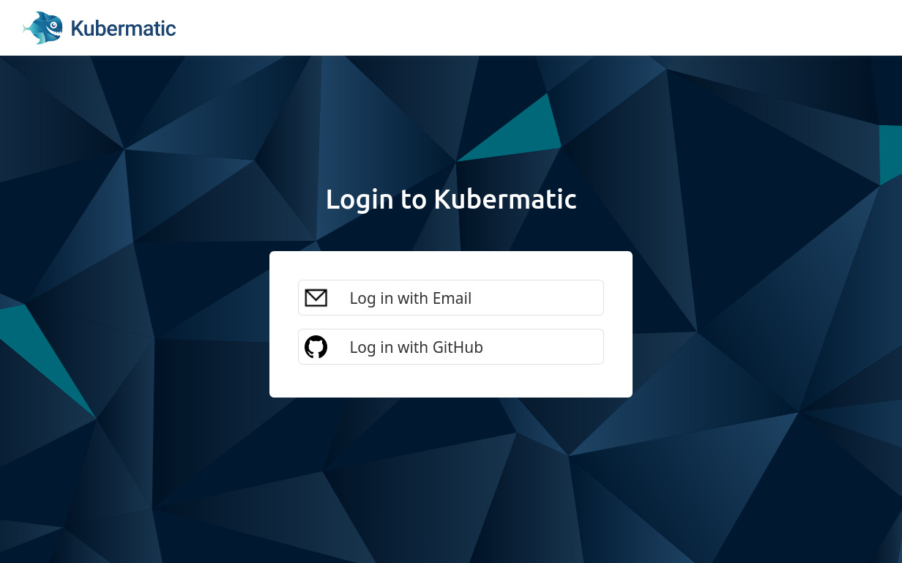

+++
title = "Setting up OIDC Authentication & Audit Logging"
date = 2021-02-17T12:00:00+02:00
enableToc = true
+++

In this article we're going to set up a Kubernetes cluster with OIDC authentication and audit logging enabled. We prefer to manage our team associations via GitHub Teams and we want to grant permissions inside the cluster based on these teams, so we will use [Dex](https://dexidp.io/) as a bridge between Kubernetes and GitHub. Dex also allows us to integrate with other providers like Google or Azure to give non-developers access to the same cluster.

## Our Toolchain

* [Terraform](https://www.terraform.io/) will provision three controlplane (master) nodes at Hetzner (but you can choose any provider supported by Kubermatic KubeOne (KK1)).
* [Kubermatic KubeOne](https://github.com/kubermatic/kubeone) will then install Kubernetes. The controlplane will be available at `controlplane.example.com`.
* [nginx-ingress](https://kubernetes.github.io/ingress-nginx/) and [cert-manager](https://cert-manager.io/) ensure that Dex can run securely inside the cluster.
* [Dex](https://dexidp.io/) runs inside the cluster and will be available on `dex.controlplane.example.com`. It also takes care of connecting to various providers; in our case, that's GitHub.
* The kubectl plugin [kubelogin](https://github.com/int128/kubelogin) is the final piece and will ensure that kubectl can obtain OIDC tokens automatically.

## Installation

So, without further ado, let's get started.

### Terraform

To begin with, we will use Terraform code to provision machines at Hetzner. Check out the [example repository](https://github.com/kubermatic-labs/kubeone-oidc-auditlog-example) for the full configuration. We can then apply it:

```bash
$ git clone https://github.com/kubermatic-labs/kubeone-oidc-auditlog-example
$ cd kubeone-oidc-auditlog-example

$ export HCLOUD_TOKEN="your Hetzner Cloud token"

$ cd terraform/
$ terraform init
$ terraform apply
$ cd ..
```

Once Terraform has finished, we are left with a number of VMs and a LoadBalancer in front of them. This LoadBalancer now needs a DNS record pointing to it. Our example cluster will use `controlplane.example.com`. Our development DNS is hosted at AWS, so in this case that means setting up an A record using Route53 that points to the LoadBalancer's IP.

**Note:** Having DNS set up is critical for the Kubernetes installation to succeed. If the record is missing, kubeadm will get stuck trying to set up the nodes.

### Kubermatic KubeOne

Kubermatic KubeOne will now take the output from Terraform and provision a Kubernetes cluster on it. Our KK1 configuration is rather simple at this stage, just as we like it:

```yaml
apiVersion: kubeone.io/v1beta1
kind: KubeOneCluster

versions:
  kubernetes: '1.19.3'

cloudProvider:
  hetzner: {}
  external: true
```

We now need to generate the Terraform output and run KK1:

```bash
$ terraform output -json terraform/ > output.json
$ kubeone apply --manifest kubeone.yaml --tfjson output.json
```

After a few minutes, the cluster will be up and running and KK1 will have produced a kubeconfig file in the current working directory, named after the cluster (so in our example, `example-kubeconfig`).

```bash
$ head example-kubeconfig
apiVersion: v1
clusters:
- cluster:
    certificate-authority-data: LS0tLS1CRUdJTiBDRVJUSUZJQ0FURS0t....
    server: https://controlplane.example.com:6443
  name: example
contexts:
```

### nginx & cert-manager

Next, we need to set up proper connectivity to the cluster. Dex requires HTTPS, so we need TLS certificates and this means we need cert-manager. For the ingress you can choose the ingress-controller of your choice; in this example, we're using the nginx-ingress-controller.

We will be using [Helm 3](https://helm.sh/) to install all software, mostly because it's convenient and the Kubermatic Kubernetes Platform (KKP) already has neat charts ready for everything we need.

Let's download the latest KKP release and use the bundled Helm charts:

```bash
$ wget https://github.com/kubermatic/kubermatic/releases/download/v2.15.5/kubermatic-ce-v2.15.5-linux-amd64.tar.gz
$ tar xzf kubermatic-ce-v2.15.5-linux-amd64.tar.gz charts
```

Install nginx first:

```bash
$ helm \
  --namespace nginx-ingress-controller \
  upgrade \
    --create-namespace \
    --install \
    nginx-ingress-controller \
    ./charts/nginx-ingress-controller
```

This will create a new LoadBalancer service inside the `ingress-nginx` namespace and this LoadBalancer will handle all traffic for our example.

```bash
$ kubectl -n ingress-nginx get svc nginx-ingress-controller
NAME                       TYPE           CLUSTER-IP     EXTERNAL-IP                  PORT(S)                      AGE
nginx-ingress-controller   LoadBalancer   10.107.95.30   1.2.3.4,192.168.0.9   80:31165/TCP,443:32548/TCP   2d3h
```

**Important:** On Hetzner, LoadBalancer Services need to be annotated with the desired location for the LoadBalancer. Add the annotation after installing nginx like so:

```bash
$ kubectl \
  --namespace nginx-ingress-controller \
  annotate \
    --overwrite \
    service nginx-ingress-controller \
    "load-balancer.hetzner.cloud/location=nbg1"
```

Once the annotation is setup, the `EXTERNAL-IP` column should switch from
`<Pending>` to the actual IP.

As we did for the controlplane, we now have to setup a DNS record for this LoadBalancer. Once again, this means Route53 in our case, pointing `dex.controlplane.example.com` to the LoadBalancer (`1.2.3.4` in the example above).

Now, we can setup cert-manager. Install the CRDs first, then the Helm chart:

```bash
$ kubectl apply -filename ./charts/cert-manager/crd/
$ helm \
  --namespace cert-manager \
  upgrade \
    --create-namespace \
    --install \
    cert-manager \
    ./charts/cert-manager
```

By default, the Helm chart will setup two ClusterIssuers: `letsencrypt-prod` and `letsencrypt-staging`. We will be using the `prod` variant for this example.

Our cluster is now ready to receive traffic and can provide certificates for these apps that need them. We can continue with the next step:

### Dex

Before we can install Dex, we need to create an OAuth application at GitHub. GitHub describes the process of [setting up an app](https://developer.github.com/apps/building-oauth-apps/creating-an-oauth-app/) in detail, so check out their documentation. Make sure to configure `https://dex.controlplane.example.com/dex/calback` as the callback URL for the app and when that's done, note down the client ID and client secret.

To configure the Helm chart for Dex, create a `values.yaml` like so:

```yaml
dex:
  ingress:
    host: dex.controlplane.example.com

  # This lists all the various login methods that should be available to
  # users. In our example this is only GitHub, but it can be extended to
  # include Google, Azure, static credentials, ...
  connectors:
    - type: github
      id: github
      name: GitHub
      config:
        clientID: <your app's client ID here>
        clientSecret: <your app's client secret here>
        redirectURI: https://dex.controlplane.example.com/dex/callback
        # you can configure the connector further, for example by
        # restricting it to only a certain org or team. These restrictions
        # depend on the provider; check the Dex documentation for more info.
        #orgs:
        #- name: exampleorg

  # This Dex installation will only have 1 client (consumer), the Kubernetes
  # cluster itself.
  clients:
    - # The ID is important and needs to match what we will later configure
      # for the kube-apiserver. Remember that we called it "kubernetes".
      id: kubernetes
      name: Kubernetes Cluster Authentication
      # generate a random secret here; note that this will be put into the
      # final kubeconfig, so it's not really that secret
      # `cat /dev/urandom | tr -dc A-Za-z0-9 | head -c32`
      secret: "...."
      RedirectURIs:
      # for authentication from kubectl oidc-login plugin
      - http://localhost:8000
```

Time to install Dex! As this Dex is most certainly a cluster service, we install it into `kube-system`. Note that for historical reasons, the chart is called `oauth` in the KKP distribution.

```bash
$ helm \
  --namespace kube-system \
  upgrade \
    --create-namespace \
    --install \
    dex \
    ./charts/oauth
```

If everything worked out, you should be able to see the Certificate for Dex turning from READY=False to True:

```bash
$ kubectl -n kube-system get certificates
NAME   READY   SECRET    AGE
dex    True    dex-tls   3m
```

Great success!

### kubelogin

So, let's summarize where we are: The cluster is running, Dex is running and we have an app at GitHub. There are two missing pieces:

* The kube-apiserver needs to be reconfigured to enable OIDC logins. Kubermatic KubeOne will take care of that for us.
* We need a way to generate OIDC tokens, so that we can use `kubectl` to interact with the cluster. There are a number of tools available for this, but for this article we chose `kubelogin`, a plugin for `kubectl`.

[kubelogin](https://github.com/int128/kubelogin) can be installed via [Krew](https://krew.sigs.k8s.io/) or by simply downloading the binary and making it available anywhere in your system's `PATH`. Choose whatever method you like.

Once the plugin is installed, it will offer a few new commands, most importantly `setup` and `get-token`. `setup` can not just be used to set things up, but is also super useful for testing things out.

What we want to achieve is that `kubectl` automatically runs kubelogin, which in turn will take care of getting a token from Dex, which will eventually redirect the user to GitHub. As the OIDC token is cached by kubelogin, the login workflow will only happen occasionally. If you have used GKE or EKS, this is similar to how Google's gcloud SDK or Amazon's `aws-iam-authenticator` work.

#### Our first Login

Let's run the first test and see if kubelogin works. We simulate a login by using the `setup` command like so:

```bash
$ kubectl oidc-login setup \
  --oidc-issuer-url=https://dex.controlplane.example.com/dex \
  --oidc-client-id=<the client ID from the values.yaml here> \
  --oidc-client-secret=<the client secret from the values.yaml here>
```

**Important:** Use the ID/secret for the client (most likely called "kubernetes") you defined yourself. This is not the ID/secret that GitHub generated for you.

When you run the command above, a browser window should open and Dex will present the login choices to you (note that the KKP login screen is branded by default):



Click on the GitHub link and you will be redirected again. Complete the login at GitHub and you will be redirected to Dex, which will then redirect you back to kubelogin with a temporary code. kubelogin now makes another request to Dex to exchange this temporary code for a JSON Web Token (JWT) and neatly enough, it will then show this token to us:

```bash
$ kubectl oidc-login setup ...
authentication in progress...

## 2. Verify authentication

You got a token with the following claims:

{
  "iss": "https://dex.controlplane.example.com/dex",
  "sub": "CdY6MjcaOpkSBdd8dGm1Ya",
  "aud": "kubernetes",
  "exp": 1607281944,
  "iat": 1607195544,
  "nonce": "6Cq8Vz-c-rjGkLjId8Qbr1sYqmxbkROsKcaRTHJHvEI",
  "at_hash": "qfvZuBmmp8XojkhqIE3AXg"
}

## 3. Bind a cluster role

Run the following command:

        kubectl create clusterrolebinding oidc-cluster-admin --clusterrole=cluster-admin --user='https://dex.controlplane.example.com/dex#CdY6MjcaOpkSBdd8dGm1Ya'
...
```

That's pretty cool, but as you can see from step 3 listed in the output above, kubelogin now shows how the username would look like for someone that authenticates via OIDC: `https://dex.controlplane.example.com/dex#CdY6MjcaOpkSBdd8dGm1Ya` -- this is certainly not a memorable identifier and I pity the soul who has to maintain these IDs in a cluster.

The issue stems from the fact that by default, Kubernetes uses the "Subject" field (`sub`) for identification. This is because this field is guaranteed to be unique and cannot be changed (you cannot change your own internal ID on GitHub, for example, but you _can_ rename yourself).

It is possible to reconfigure the kube-apiserver to use a different field, but which? There is nothing in the token that can meaningfully serve as user identification. This is where scopes come into play.

#### Scopes

It's important to remember that from Kubernetes/kubelogin's perspective, the OIDC provider is _Dex_, not GitHub. So whatever scope we configure in Kubernetes, _Dex_ needs to understand it and it has absolutely nothing to do with the scopes from GitHub.

The [Dex documentation](https://dexidp.io/docs/custom-scopes-claims-clients/) lists the scopes Dex understands. By default, kubelogin uses only the `openid` scope. However, we want `groups` and `profile` as well, which will give us team associations and the GitHub username.

Let's try the login again, but with the additional scopes (note the additional fourth CLI flag):

```bash
$ kubectl oidc-login setup \
  --oidc-issuer-url=https://dex.controlplane.example.com/dex \
  --oidc-client-id=<the client ID from the values.yaml here> \
  --oidc-client-secret=<the client secret from the values.yaml here> \
  --oidc-extra-scope=groups,profile

authentication in progress...

## 2. Verify authentication

You got a token with the following claims:

{
  "iss": "https://dex.controlplane.example.com/dex",
  "sub": "CdY6MjcaOpkSBdd8dGm1Ya",
  "aud": "kubernetes",
  "exp": 1607281944,
  "iat": 1607195544,
  "nonce": "6Cq8Vz-c-rjGkLjId8Qbr1sYqmxbkROsKcaRTHJHvEI",
  "at_hash": "qfvZuBmmp8XojkhqIE3AXg"
  "groups": [
    "kubermatic:sig-app-management",
    "kubermatic:sig-cluster-management"
  ],
  "name": "Christoph Mewes",
  "preferred_username": "xrstf"
}

...
```

Now, Dex reveals more information from the user identity it received from GitHub. We can now use `preferred_username` to identify users instead of their ID, and make use of the groups as well.

### Kubernetes OIDC

It's finally time to enable OIDC logins in Kubernetes. As mentioned previously, Kubermatic KubeOne does all the heavy lifting for us already, so the configuration is minimal:

```yaml
apiVersion: kubeone.io/v1beta1
kind: KubeOneCluster

versions:
  kubernetes: '1.19.3'

cloudProvider:
  hetzner: {}
  external: true

features:
  openidConnect:
    enable: true
    config:
      # The URL of the OpenID issuer, only HTTPS scheme will be accepted. If
      # set, it will be used to verify the OIDC JSON Web Token (JWT).
      issuerUrl: "https://dex.controlplane.example.com/dex"

      # Remember the ID we defined for the client in Dex? This is where it needs to
      # be put. It defaults to "kubernetes".
      clientId: "kubernetes"

      # This is the important piece. By default this is "sub", as it is the most secure.
      # In our cluster we rely on GitHub usernames being unique and stable enough, so we
      # switch to `preferred_username`.
      usernameClaim: "preferred_username"

      # The remaining fields are just the defaults from KubeOne and noted here just FYI
      # ===============================================================================

      # If provided, all usernames will be prefixed with this value. If not
      # provided, username claims other than 'email' are prefixed by the issuer
      # URL to avoid clashes. To skip any prefixing, provide the value '-'.
      usernamePrefix: "oidc:"

      # If provided, the name of a custom OpenID Connect claim for specifying
      # user groups. The claim value is expected to be a string or array of
      # strings. This flag is experimental in kubernetes, please see the
      # kubernetes authentication documentation for further details.
      groupsClaim: "groups"

      # If provided, all groups will be prefixed with this value to prevent
      # conflicts with other authentication strategies.
      groupsPrefix: "oidc:"
```

We can update the cluster by running KK1 again.

**Important:** Whenever you change a `feature`, you must perform a `--force-upgrade`!

```bash
$ kubeone apply --manifest kubeone.yaml --tfjson output.json --force-upgrade
```

The cluster is now ready to accept and validate tokens. Let's create a kubeconfig.

### kubeconfig

Start with the kubeconfig given by Kubermatic KubeOne, `example-kubeconfig`. We're going to replace the default context and user and instead inject our own context and configure kubectl to execute the kubelogin plugin. You will notice the similarity in the CLI flags from the `setup` command:

```bash
$ cp example-kubeconfig oidc-kubeconfig
(remove contexts, users)
```

Insert the following into the `oidc-kubeconfig`

```yaml
contexts:
# A new context that will use our oidc user when accessing the `example` cluster.
- context:
    cluster: example
    user: me-via-oidc
  name: default-context

users:
# Our new virtual user account.
- name: me-via-oidc
  user:
    exec:
      apiVersion: client.authentication.k8s.io/v1beta1
      command: kubectl
      args:
      - oidc-login
      - get-token
      - --oidc-issuer-url=https://dex.controlplane.example.com/dex
      - --oidc-client-id=<the client ID from the values.yaml here>
      - --oidc-client-secret=<the client secret from the values.yaml here>
      - --oidc-extra-scope=groups,profile
```

Save it, set it as your `$KUBECONFIG` and test it out:

```bash
$ export KUBECONFIG=oidc-kubeconfig
$ kubectl get ns
error: You must be logged in to the server (Unauthorized)
```

There is always something more, isn't there?

### RBAC

As a final step, we need to grant permissions. We can do this for individual users (called `oidc:<github username>`, e.g. `oidc:xrstf`) or based on teams (identified by `oidc:<org>:<team>`, e.g. `oidc:exampleorg:infra-team`).

Let's make everyone from the infra-team an admin:

```yaml
apiVersion: rbac.authorization.k8s.io/v1
kind: ClusterRoleBinding
metadata:
  name: infra-team-is-cluster-admin
roleRef:
  apiGroup: rbac.authorization.k8s.io
  kind: ClusterRole
  name: cluster-admin
subjects:
- apiGroup: rbac.authorization.k8s.io
   kind: Group
   name: "oidc:exampleorg:infra-team"
```

Apply this using the `example-kubeconfig` and now you will have access:

```bash
$ export KUBECONFIG=example-kubeconfig
$ kubectl apply --filename rbac.yaml

$ export KUBECONFIG=oidc-kubeconfig
$ kubectl get ns
NAME              STATUS   AGE
cert-manager      Active   2h
default           Active   2h
dex               Active   2h
kube-node-lease   Active   2h
kube-public       Active   2h
kube-system       Active   2h
nginx-ingress     Active   2h
```

### Audit Logging

Now that we have readable user identifiers, audit logging makes much more sense. Let's enable it. Once again, KK1 does all the work for us:

```yaml
apiVersion: kubeone.io/v1beta1
kind: KubeOneCluster

versions:
  kubernetes: '1.19.3'

cloudProvider:
  hetzner: {}
  external: true

features:
  # For demo purposes, static audit logging is enough. This will simply make
  # each kube-apiserver Pod write a JSON file on the node it is running on.
  # For a production setup, either dynamic audit logging or a log shipper
  # like fluentd should be used.
  staticAuditLog:
    enable: true
    config:
      # You _must_ define a policy. This file needs to exist on your local
      # disk and KubeOne will take care of uploading it to all controlplane
      # nodes and automatically set up mounts for the kube-apiserver Pods.
      policyFilePath: audit-policy.yaml

  openidConnect:
    enable: true
    config:
      issuerUrl: "https://dex.controlplane.example.com/dex"
      clientId: "kubernetes"
      usernameClaim: "preferred_username"
```

You can take the example AuditPolicy from the [Kubernetes documentation](https://kubernetes.io/docs/tasks/debug-application-cluster/audit/#audit-policy) as a starting point.

Let's run KK1 again (and remember to do a full upgrade, as we once again changed features):

```bash
$ kubeone apply --manifest kubeone.yaml --tfjson output.json --force-upgrade
```

Once done, we can check that the audit log is working by SSH'ing onto one of the controlplane nodes and checking `/var/log/kubernetes/audit.log`. If you then use your `oidc-kubeconfig` and are lucky that you are on the node that processed the request, you can find entries like this in the audit log (formatted for better readability):

```json
{
   "kind": "Event",
   "apiVersion": "audit.k8s.io/v1",
   "level": "RequestResponse",
   "auditID": "0c3X90aa-5R41-410S-8eT7-b617c012635F",
   "stage": "ResponseComplete",
   "requestURI": "/api/v1/namespaces/kube-system/pods?limit=500",
   "verb": "list",
   "user": {
      "username": "oidc:xrstf",
      "groups": [
         "oidc:kubermatic:infra-team",
         "oidc:kubermatic:cleanup-team",
         "system:authenticated"
      ]
   },
   "sourceIPs": [
      "192.168.0.2"
   ],
   "userAgent": "kubectl.bin/v1.19.2 (linux/amd64) kubernetes/f574309",
   "objectRef": {
      "resource": "pods",
      "namespace": "kube-system",
      "apiVersion": "v1"
   },
   "responseStatus": {
      "metadata": {},
      "code": 200
   }
}
```

And we can see: Username and groups are available, just as planned.

We can now go ahead and distribute the `oidc-kubeconfig` among team members and let all of them authenticate this way. :-)

## Conclusion

Setting up OIDC is easy, if you know what you're doing. Otherwise you might wrangle with Dex a bit until you understand which scope scopes which claim and who claims what and when.

As we will be granting permissions solely on groups (i.e. GitHub teams), it's not important for us that the GitHub username can potentially change. The user is mostly informational in the audit log.

kubelogin deserves a special mention, as it made the integration very smooth. The `setup` command is super helpful when debugging JWT claims, so we used the command much more for testing than for setting things up. Maybe `debug` or `simulate` would have been better names for the command.
