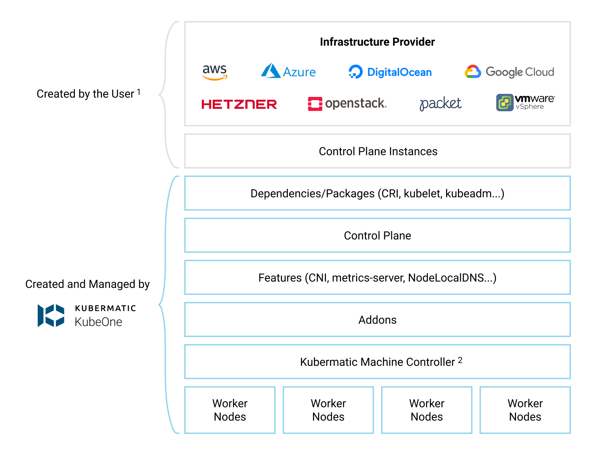

+++
title = "Architecture"
date = 2020-07-30T12:00:00+02:00
weight = 5
+++

## KubeOne Architecture

The following diagram shows the KubeOne's architecture, including what
tasks should be done by the user, what tasks are done by KubeOne and in
which particular order.
Additional details about concepts used by KubeOne can be found in the
[Concepts][concepts] document.

1 This diagram shows [officially supported providers][supported-providers].
KubeOne is not limited to those providers and is supposed to work on any 
infrastructure out of the box, for example, on bare-metal.
For officially supported providers, you can use our [Terraform
integration][terraform-integration] and [example configurations][terraform-configs]
to create the infrastructure.

2 [Kubermatic Machine Controller][machine-controller] is available
only for [officially supported providers][supported-providers]. For non-officially
supported providers, you can provision machines manually and use KubeOne's
[Static Workers feature][static-workers].

[concepts]: 
[supported-providers]: 
[terraform-integration]: 
[terraform-configs]: 
[machine-controller]: https://github.com/kubermatic/machine-controller
[static-workers]: 
