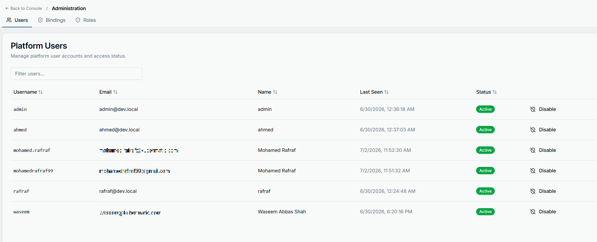
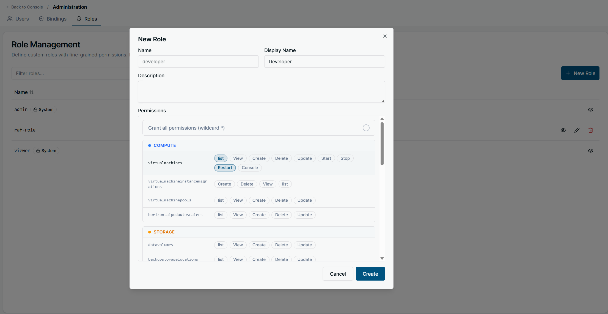

+++
title = "IAM Getting Started"
date = 2026-07-02T00:00:00+00:00
weight = 6
+++

This guide explains how access control works in Kubermatic Virtualization and
how to grant users access to platform resources. It's written for platform
administrators to manage users and permissions 

---

## Prerequisites: this only applies in OIDC mode

Kubermatic Virtualization supports three authentication modes, configured at
install time (`dashboardAuth.none` / `.basic` / `.oidc`):

| Mode | Effect on IAM |
|------|---------------|
| **OIDC** | Full IAM is active. Each logged-in user's access is determined by their role bindings, as described below. |
| **Basic** | Single-admin mode. Anyone who logs in gets full access. Roles and bindings are ignored. |
| **None** | No login at all. Every request gets full access. Roles and bindings are ignored. |

Everything in this guide — roles, bindings, per-user permissions — only takes
effect when the platform is running in **OIDC** mode. If you're on Basic or
None auth, there's nothing to configure: every user already has full access.

**In OIDC mode, nobody is admin by default — not even the first person to log
in.** Basic and None modes auto-seed an admin binding at startup because
there's only ever one identity to trust. OIDC can authenticate anyone your
identity provider lets through, so the platform never assumes trust: logging
in only creates a `User` record with zero permissions. Every single grant,
including the very first admin, has to be created explicitly. See
[Getting started](#getting-started-granting-your-first-admin) below.

---

## Getting started: granting your first admin

Follow this once, right after you point the platform at your OIDC provider,
to get from "nobody has access" to "one working admin."

**1. Have the intended admin log in once.**

Point them at the dashboard and have them complete the OIDC login flow. It
will look like nothing happened — no permissions, empty or forbidden pages.
That's expected: this step only exists to create their `User` record.

**2. Find their derived username.**

The platform names the `User` object after the local part of their login
email, lowercased (`alice@example.com` → `alice`; non `[a-z0-9-.]`
characters become `-`). Confirm the exact name with kubectl rather than
guessing:

```bash
kubectl -n kubermatic-virtualization get users
```

**3. Grant them the built-in `admin` role.**

As someone with kubectl access to the deployment namespace (e.g. whoever
just installed the platform), create a binding:

```yaml
apiVersion: virtualization.k8c.io/v1alpha1
kind: KubeVRoleBinding
metadata:
  name: alice-admin
  namespace: kubermatic-virtualization
spec:
  subject: alice
  roleRef: admin
```

```bash
kubectl apply -f alice-admin-binding.yaml
```

Access is immediate — no restart, no re-login. Alice can now use the
platform fully, and can grant everyone else access the same way — either
with her own `kubectl` access (see
[Managing access with kubectl](#managing-access-with-kubectl) below) or from
the dashboard's Administration panel (see
[The Administration panel](#the-administration-panel) below), whichever she
prefers. Bootstrapping the very first admin is the one time kubectl access
is required, since the Administration panel itself only opens once you're
already an admin.

> You don't strictly need step 1 first — binding matching is by username
> string, not by an existing `User` object, so pre-creating the binding
> before anyone logs in also works as long as you predict the derived name
> correctly. Logging in first and reading it back with `kubectl get users`
> avoids getting the sanitization rule wrong.

---

## The three building blocks

Access control is built from three objects. All of them live together in the
platform's deployment namespace (the same namespace the dashboard and API
server run in) — there's no separate per-team or per-project namespace to
manage.

- **User** — represents one login identity. Created and kept up to date
  automatically the first time someone signs in through your OIDC provider;
  you never create these by hand. A user can be disabled to block sign-in
  without deleting their history.
- **Role** (`KubeVRole`) — a named, reusable set of permissions. A role is
  just a list of rules saying "these actions are allowed on these resources."
  A role grants nothing by itself until it's bound to someone.
- **Role Binding** (`KubeVRoleBinding`) — grants one role to one user. This is
  the only object that actually gives a person access. One user can hold
  multiple bindings (e.g. `viewer` plus a custom `vm-operator` role); their
  effective permissions are the union of everything they're bound to.

Two roles are built in and always present:

| Role | Grants |
|------|--------|
| `admin` | Every action on every resource. Cannot be edited or deleted. |
| `viewer` | Read-only (`view` + `list`) on every resource. Cannot be edited or deleted. |

Everything else — day-to-day access for real users — is expressed with
custom roles you create yourself.

---

## How a permission rule reads

Each role's `rules` list is made of entries with three parts:

```json
{
  "resourceGroups": ["networking"],
  "resources": ["subnets"],
  "verbs": ["view", "list"]
}
```

Read it as: *"on resources named `subnets`, in the `networking` group, allow
`view` and `list`."* Leaving a field empty, or using `["*"]`, means "match
anything" for that field. So `{"verbs": ["*"]}` with no other fields set — as
the built-in `admin` role uses — matches every group, every resource, every
verb.

**Verbs** you can grant: `create`, `delete`, `update`, `view`, `list`,
`manage` (full lifecycle without implying read), `start`, `stop`, `restart`,
`console`. Not every resource supports every verb — see the table below.

**Resource groups and resources:**

| Group | Resources | Verbs available |
|-------|-----------|------------------|
| `compute` | `virtualmachines` | `list`, `view`, `create`, `delete`, `update`, `start`, `stop`, `restart`, `console` |
| `compute` | `virtualmachineinstancemigrations` | `list`, `view`, `create`, `delete` |
| `compute` | `virtualmachinepools` | `list`, `view`, `create`, `delete`, `update` |
| `compute` | `horizontalpodautoscalers` | `list`, `view`, `create`, `delete`, `update` |
| `storage` | `datavolumes` | `list`, `view`, `create`, `delete`, `update` |
| `networking` | `vpcs` | `list`, `view`, `delete`, `update` (**`create` is admin-only** — see below) |
| `networking` | `subnets`, `underlaysubnets`, `securitygroups`, `natgateways`, `elasticips` | `list`, `view`, `create`, `delete`, `update` |
| `networking` | `services`, `networkpolicies` | `list`, `view`, `create`, `delete`, `update` |
| `system` | `sshkeys`, `images` | `list`, `view`, `create`, `delete`, `update` |
| `system` | `configmaps`, `secrets` | `list`, `view`, `create`, `delete`, `update` |
| `iam` | `users` | `create`, `delete`, `update`, `view`, `manage` |
| `iam` | `kubevroles` | `create`, `delete`, `view` |
| `iam` | `kubevrolebindings` | `create`, `delete`, `view`, `manage` |

**Admin-only verbs:** a handful of actions (currently: creating a `vpcs`)
are reserved for the built-in `admin` role and can't be granted through a
custom role, even with `["*"]`.

---

## Managing access with kubectl

`User`, `KubeVRole`, and `KubeVRoleBinding` are plain namespaced Kubernetes
objects — you manage access the same way you'd manage any other Kubernetes
resource, with `kubectl apply`/`get`/`delete`. Everything lives in the
platform's deployment namespace.

```bash
kubectl -n kubermatic-virtualization get users
kubectl -n kubermatic-virtualization get kubevroles
kubectl -n kubermatic-virtualization get kubevrolebindings
```

### Create a custom role

Example — a "VM operator" who can fully manage VMs and see networking, but
not touch it:

```yaml
apiVersion: virtualization.k8c.io/v1alpha1
kind: KubeVRole
metadata:
  name: vm-operator
  namespace: kubermatic-virtualization
spec:
  displayName: VM Operator
  description: Full VM lifecycle, read-only networking
  rules:
    - resourceGroups: ["compute"]
      verbs: ["*"]
    - resourceGroups: ["networking"]
      verbs: ["view", "list"]
```

```bash
kubectl apply -f vm-operator-role.yaml
```

### Bind the role to a user

This is the step that actually grants access. `spec.subject` is the `User`
object's name; `spec.roleRef` is the `KubeVRole`'s name. Both must already
exist in the same namespace.

```yaml
apiVersion: virtualization.k8c.io/v1alpha1
kind: KubeVRoleBinding
metadata:
  name: alice-vm-operator
  namespace: kubermatic-virtualization
spec:
  subject: alice
  roleRef: vm-operator
```

```bash
kubectl apply -f alice-vm-operator-binding.yaml
```

A user can hold as many bindings as needed — grant `viewer` platform-wide and
layer `vm-operator` on top with a second `KubeVRoleBinding`, for example.
Changes take effect immediately; there's no restart or re-login required.

To revoke access, delete the binding, not the role:

```bash
kubectl delete kubevrolebinding alice-vm-operator -n kubermatic-virtualization
```

### Inspect what a user can do

There's no single "effective permissions" object — list the bindings for a
user, then read each referenced role's rules:

```bash
kubectl -n kubermatic-virtualization get kubevrolebindings -o jsonpath='{range .items[?(@.spec.subject=="alice")]}{.spec.roleRef}{"\n"}{end}'
kubectl -n kubermatic-virtualization get kubevrole vm-operator -o yaml
```

### Disable a user

```bash
kubectl -n kubermatic-virtualization patch user alice --type=merge -p '{"spec":{"disabled":true}}'
```

A disabled user's session is rejected immediately — no need to also remove
their bindings, though doing so keeps things tidy. Deleting the `User`
object entirely also removes their bindings and provisioned ServiceAccount.

### A note on the system roles

`admin` and `viewer` are seeded once, at platform start-up. The platform's
own dashboard/API layer refuses to edit or delete them — but that check does
not exist at the Kubernetes level, so a `kubectl edit`/`kubectl delete`
against `kubevrole admin` or `kubevrole viewer` directly will succeed and
won't be reverted until the platform restarts. Treat both as reserved and
manage access through bindings and custom roles instead.

---

## The Administration panel

Everything in the previous section can also be done from the dashboard,
without touching kubectl at all. Any admin sees an **Administration** entry
from the main console, with three tabs: **Users**, **Bindings**, and
**Roles**.

### Users



A table of every `User` on the platform — username, email, display name,
last-seen timestamp, and status. This is the UI for exactly what the kubectl
workflow above does by hand: the **Disable** button next to a user is the
same `spec.disabled` flag set by `kubectl patch user ... disabled:true`, and
disabling here takes effect immediately, same as via kubectl.

### Roles

The Roles tab lists every `KubeVRole`. Built-in roles (`admin`, `viewer`)
carry a **System** badge and only offer a view icon — no edit or delete —
matching the restriction described earlier: the dashboard won't let you
touch them, even though kubectl technically can. Custom roles get view, edit,
and delete actions instead.

**New Role** opens a form that builds a `KubeVRoleSpec` visually instead of
as YAML:



- **Name** / **Display Name** / **Description** map directly to the
  matching `KubeVRoleSpec` fields.
- **Grant all permissions (wildcard \*)** is the UI equivalent of a rule with
  `verbs: ["*"]` and no `resourceGroups`/`resources` restriction — the same
  full-access rule the built-in `admin` role uses. Leave it off to build a
  scoped role instead.
- Below it, every resource is grouped by category (Compute, Storage,
  Networking, System, IAM — the same groups from the
  [resource groups and resources](#how-a-permission-rule-reads) table), with
  one pill per verb that resource supports. Clicking a verb pill for
  `virtualmachines` under Compute, for instance, is equivalent to adding
  `{resourceGroups: ["compute"], resources: ["virtualmachines"], verbs: [...]}`
  to `spec.rules`. Admin-only verbs (like creating a `vpcs`) simply don't
  appear here — there's nothing to accidentally grant.

The **Bindings** tab is where a `User` and a `KubeVRole` get connected — the
dashboard equivalent of applying a `KubeVRoleBinding`.

### What users see without the right permission

When a user opens a page or resource their bound roles don't cover, they get
a dedicated screen rather than a broken page or a raw error:


This is what a user with, say, only the `viewer` role but no `compute` grant
would see on the Virtual Machines page — or what anyone sees the moment a
`view`/`list` verb for that resource isn't present in any role they're bound
to. It's the same authorization check either way, whether the request came
from the dashboard or from `kubectl` — the dashboard just renders it as a
page instead of returning a Kubernetes `Forbidden` error.

---

## kubectl access for end users

Each `User` gets a dedicated ServiceAccount that the platform keeps
synchronized with a native Kubernetes `Role`/`RoleBinding` mirroring their
`KubeVRoleBinding`s. Users download a personal kubeconfig for that
ServiceAccount from the platform's login session. In practice this means:
whatever a user is granted through `KubeVRoleBinding`s is exactly what their
`kubectl` token can do — no separate Kubernetes RBAC to configure. Change a
binding, and the next `kubectl` call reflects it immediately.

---

## Good practices

- **Grant through bindings, not by editing `admin`/`viewer`.** Those two are
  fixed on purpose so there's always a known-good full-access and read-only
  role available — and, per the note above, nothing at the cluster level
  stops you from breaking that guarantee if you edit them directly.
- **Prefer several narrow roles over one broad one.** `viewer` + `vm-operator`
  composes cleanly and is easier to reason about than a single custom role
  that tries to cover everything.
- **Use `resourceGroups` alone for broad grants, add `resources` to narrow
  them.** `{resourceGroups: ["compute"], verbs: ["view"]}` covers every
  current and future compute resource; pin down `resources` only when you
  need to exclude something in the group.
- **Disable, don't delete, departing users** if you want to preserve audit
  history.
