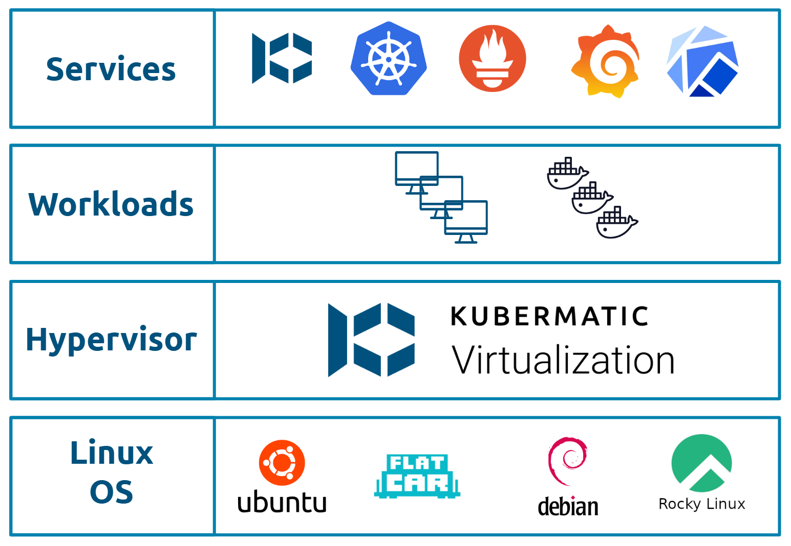

+++
title = "Architecture"
date = 2025-07-18T16:06:34+02:00
weight = 5

+++

## Architecture Overview
Kubermatic-Virtualization is an advanced platform engineered to construct private cloud infrastructures founded 
entirely on Kubernetes. Its core design principle is the seamless integration of Kubernetes-native workloads (containers) 
and traditional virtualized workloads (Virtual Machines - VMs) under a unified management umbrella. Kubermatic-Virtualization achieves this 
by building upon Kubernetes as its foundational layer and incorporating KubeVirt to orchestrate and manage VMs alongside 
containerized applications.

Here's a breakdown of the architecture and how these components interact:
### Host Nodes
Host nodes can operate on any popular Linux-based operating system such as Ubuntu and RockyLinux where nested virtualization
is enabled to run KVM based virtual machines. 

### Kubernetes
The foundation, providing the orchestration, scheduling, and management plane for all workloads. In addition to introduce 
declarative API and custom resources (CRDs). 

### KubeVirt
An extension to Kubernetes that enables running and managing VMs as native Kubernetes objects. It utilizes Kubernetes pods 
as the execution unit each running VM is encapsulated within a standard Kubernetes pod, specifically a virt-launcher pod. 

### OVN (Open Virtual Network)
The network fabric, providing advanced SDN (Software-Defined Networking) capabilities for VMs and Pods, replacing or 
augmenting the default CNI (Container Network Interface). The network fabric introduces VPCs(Virtual Private Cloud) as 
an operational and isolated ecosystem, through subnets and network policies.   

### CSI Drivers
A standardized interface that allows Kubernetes to connect to various storage systems, providing persistent storage for
VMs and containers. Kubermatic-Virtualization is agnostic about the storage of the underlying infrastructure where any CSI driver can be 
used to enabling dynamic provisioning, attachment, and management of persistent volumes for VMs and Pods.

