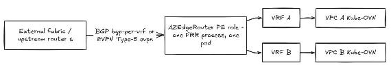
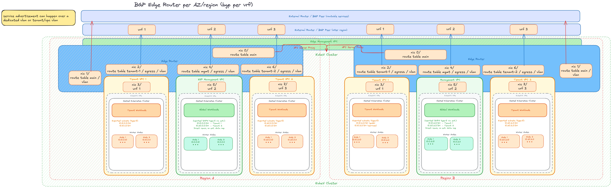
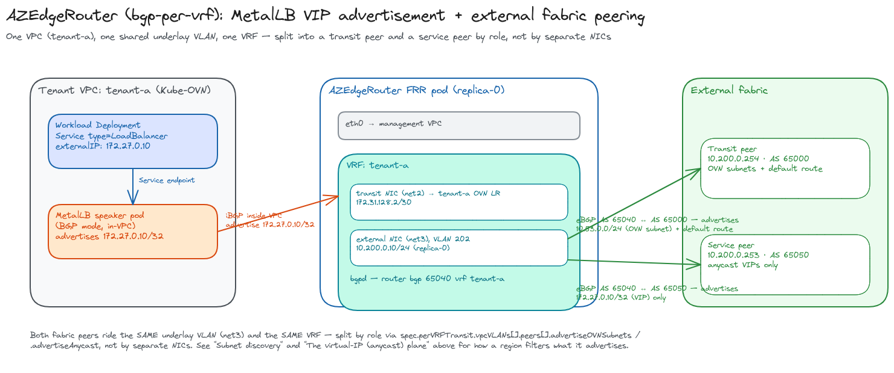

+++
title = "AZ Edge Router"
date = 2026-09-08T00:00:00+00:00
weight = 20
+++

Kubermatic Virtualization isolates every tenant into its own Kube-OVN VPC — its own routing
domain, with no data path to another VPC or to the node network by default. That isolation is
the point, but it leaves an open question: how does a VPC's workloads reach the outside world,
and how does traffic move between VPCs that live in different regions or availability zones?

The **`AZEdgeRouter`** answers that. It is a single custom resource that provisions a
multi-homed FRR gateway serving **many** tenant VPCs at once — one gateway per region/AZ,
rather than one gateway per VPC. Each VPC it serves gets its own dedicated transit interface
and its own isolated FRR VRF, so tenants stay isolated from each other end to end even though
they share one router.

## Why one router per region, not one per VPC

A gateway scoped to a single VPC is simple to isolate but does not scale operationally — every
new tenant needs its own router deployment, its own BGP session, its own set of external
addresses. `AZEdgeRouter` inverts that: one `AZEdgeRouter` custom resource per region serves
every VPC the operator discovers (by label selector) or is told to attach (an explicit list),
and isolation between those VPCs is enforced by Linux VRFs inside the router pod rather than by
having separate router deployments.

This matches how isolation already works one layer down: a Kube-OVN VPC *is* its own logical
router — a separate routing domain with no default path to another VPC, enforced by the switch
fabric itself. A VRF is the same idea (a separate routing domain, no default path across it)
applied inside the router pod, so the isolation primitive stays the same end to end instead of
switching to a different one (a Kubernetes pod, and so a separate network namespace, per VPC)
at just this one layer.

That alternative — one router pod per VPC, since a pod is already its own network namespace —
would still isolate correctly, but at a real cost that grows with tenant count rather than
staying flat:

- **Per-VPC pod overhead.** Every additional VPC would mean another FRR pod: another image
  pull, another scheduling decision, another process's worth of baseline memory, another set of
  objects for the operator (and whoever operates the cluster) to reconcile and watch. A VRF
  is a route table and a couple of interfaces — cheap to add to a pod that is already running.
- **External session count multiplies with tenant count — in `evpn` mode.** One
  `AZEdgeRouter` replica holds one set of EVPN sessions per region to the external fabric,
  no matter how many VPCs it serves. One pod per VPC would need that many *times* the
  sessions to the *same* fabric peers — more RIB/FIB state for the fabric side to hold too,
  and BGP peer/session limits become a real constraint well before VRF limits would. This
  advantage is specific to `evpn`: in `bgp-per-vrf` mode, each VPC still gets its own
  per-VRF BGP session over its own VLAN (see [below](#bgp-per-vrf)), so the external
  session count scales with tenant count much like the one-pod-per-VPC alternative would —
  the per-pod overhead and onboarding costs below are what `bgp-per-vrf` still saves on,
  not this one.
- **Onboarding a VPC is cheaper.** Attaching an existing VPC to a running router is a VRF
  creation, a transit NIC attach, and an FRR config reload. Standing up a whole new pod means
  scheduling, image pull, and a full BGP/EVPN session establishment from cold before that VPC
  has any connectivity at all.

## Where `AZEdgeRouter` sits in a network topology



### Switching vs. routing

`AZEdgeRouter` pushes the whole design toward **switching** — one device multiplexing many
tenants' isolated domains over shared infrastructure — rather than toward **routing** — one
dedicated router per tenant:

- **`evpn` mode goes furthest in that direction.** A single shared external NIC and a
  VNI-based identity replace a physical port per tenant, much like a switch trunking many
  VLANs/VNIs over one uplink.
- **`bgp-per-vrf` is a hybrid**, as the [session-count point](#why-one-router-per-region-not-one-per-vpc)
  above already shows: the isolation primitive inside the pod is still switch-like (VRFs
  sharing one FRR process), but each VPC keeps its own dedicated external VLAN and BGP
  session on the wire — closer to a chassis switch with one dedicated tenant port than to
  *N* independent routers, but not as flat as `evpn`'s shared-uplink model.

### PE, not leaf/spine

In fabric terms it is tempting to call `AZEdgeRouter` a leaf sitting below an external
spine — but that's not quite right, and this document deliberately avoids that language:

- A conventional **leaf switch** connects hosts, uplinks to every spine, and is a physical
  fabric element. `AZEdgeRouter` is none of those.
- `AZEdgeRouter` is a **logical router terminating one VRF per VPC**, importing/exporting
  that VPC's routes to the outside over BGP/EVPN — textbook **PE (provider-edge)**
  function, regardless of transit mode.
- The external side is called "the fabric" or "the upstream router(s)" throughout this
  document, never "the spine" — nothing here assumes the external network is a spine-leaf
  fabric at all; it could just as well be a traditional routed network or a WAN edge.
- **`EVPNRouteReflector` is not a spine either.** It relays EVPN Type-5 routes between
  regions' `AZEdgeRouter`s on the control plane only, with no data-plane traffic through
  it — it sits alongside the fabric rather than in the forwarding path.

## Regional topology

In a multi-region deployment, each region runs its own `AZEdgeRouter`. A tenant VPC typically
exists in more than one region (a management VPC plus one or more tenant VPCs, replicated per
region), and each region's router only ever advertises the VPCs pinned to its own zone —
`spec.vpcs.subnetLabelSelector` filters a shared VPC down to the subnets that belong to that
router's region, so multiple regional routers can serve the same logical VPC without
double-advertising each other's subnets.

Cross-region reachability between two instances of the same VPC is carried by the routers'
own external advertisement plane (EVPN Type-5 routes, or per-VRF BGP — see below), not by
joining the VPCs directly. Intra-region, intra-VPC traffic never leaves the OVN overlay at all
— it is only inter-region traffic, or traffic destined outside the platform, that transits an
edge router.

## Router pod architecture

Each `AZEdgeRouter` produces a `StatefulSet` of FRR pods. Every replica is multi-homed:

- **`eth0`** — the management VPC, the router's own control-plane attachment.
- **The external plane** (`net1`, and in `bgp-per-vrf` mode, additional per-VPC VLAN NICs) —
  where the router talks to the fabric.
- **One dedicated transit NIC per served VPC** — a Multus interface into that VPC's own
  Kube-OVN logical router, enslaved to a matching FRR VRF. Every VRF lives inside the *same*
  pod network namespace and is served by the *same* FRR process (see [above](#why-one-router-per-region-not-one-per-vpc)
  for why that, rather than one namespace per VPC, is the design).

By default the pod reaches the Kubernetes API server the same way any other in-cluster
workload would — through the node/apiserver IP, overridden onto `eth0`'s management-VPC
path. That assumes `eth0`'s management VPC actually has an L2 route to the node network,
which a custom management VPC (the common shape for an AZ router) does not. Setting
`spec.apiServerViaInternalProxy: true` switches the pod to the default in-cluster
`KUBERNETES_SERVICE_HOST`/ClusterIP path instead, reaching the API server through an
in-VPC apiserver proxy (a dual-homed nginx + `SwitchLBRule`, deployed separately from the
router itself) rather than the node-IP override. Leave it unset when the management VPC
does have that L2 path; set it whenever the router's management VPC is otherwise isolated
from the node network.

Because a VRF has no path to another VRF by default, two tenant VPCs served by the same
`AZEdgeRouter` replica stay isolated from each other even though they share a pod — including
when their address ranges overlap. No route leaking is configured or expected between VPC VRFs
on the same router; that is a separate concern from `bgp-per-vrf`'s own per-region VRF at the
external fabric layer, which *does* leak deliberately for cross-region reachability.

## Two transit modes for the external plane

`spec.ovnTransitMode` selects how a VPC's OVN subnets are advertised to the external fabric.
This choice does not affect VPC isolation (VRFs handle that either way) — it is about how the
external plane scales and what it costs on the wire.

### `evpn` (the default)

All VPCs share **one** external NIC (`net1`) acting as a VXLAN VTEP. Each VPC's subnets are
advertised as EVPN Type-5 (IP-prefix) routes carrying that VPC's own VNI, and an EVPN
relay/route-reflector distributes them between regions. Because isolation rides on the VNI
(24-bit — roughly 16 million tenants) rather than a NIC, adding another VPC costs nothing on
the external side; the router's NIC count only grows for the internal transit NIC each VPC
still needs.

This mode is backed by two additional CRDs, neither of which a tenant ever touches directly:

- **`EVPNPolicy`** — an admin-managed object that overrides the VNI/RD/import-export Route
  Targets an `AZEdgeRouter` VPC would otherwise auto-derive as a symmetric `<ASN>:<VNI>`.
  `spec.targets[].azEdgeRouterRef` binds it to one VPC (VRF) on one named `AZEdgeRouter`; the AZ
  controller resolves it directly into that VPC's `status.resolvedAZVPCs[]` entry — there is no
  separate `EVPNPolicy` controller. Reach for one only when two VPCs need asymmetric or
  hand-picked RTs (e.g. a one-way import from a shared services VPC); the auto-derived default
  is a correct, symmetric policy on its own.
- **`EVPNRouteReflector`** — a separate, admin-deployed FRR pod (or pods) that relays EVPN Type-5
  routes between every `AZEdgeRouter` matched by `spec.azEdgeRouterSelector`, using
  `bgp listen range` (`spec.peerListenRanges`) since AZ router pod IPs are dynamically
  IPAM-assigned rather than static. It writes its own replica IPs into each matched router's
  `status.resolvedEVPNPeers`, which `frr-config-watcher` merges in as EVPN-only neighbors — no
  manual peer configuration on the `AZEdgeRouter` side. This is the "operator-managed route
  reflector" referenced under [Choosing between them](#choosing-between-them) below; an
  externally-managed RR (a fabric device instead) is the other option and needs neither CRD.

### `bgp-per-vrf`

Each VPC gets its **own** underlay VLAN, attached as a dedicated external NIC and enslaved to
that VPC's VRF. FRR runs a per-VRF BGP session over it, advertising the VPC's subnets as plain
IPv4 unicast — no VXLAN encapsulation, routed natively on the wire. This trades the EVPN
control plane for simplicity, at the cost of one VLAN (and one NIC) per VPC on the external
side, capped by the platform's VLAN space per router.

Multiple VPCs can share a single advertisement VLAN in `bgp-per-vrf` mode when they don't need
separate external identities, each still keeping its own BGP AS number if required
(`spec.perVRFTransit.vpcVLANs[].localASN`) — so the one-VLAN-per-VPC cost is a default, not a
hard requirement.

#### External VLANs: `UnderlaySubnet` and the same-namespace rule

The usual way to give a VPC its external VLAN in `bgp-per-vrf` mode is
`spec.perVRFTransit.vpcVLANs[].underlaySubnet`, naming an `UnderlaySubnet` object rather than a
NAD directly. An `UnderlaySubnet` bundles a kube-ovn `ProviderNetwork` + `Vlan` + `Subnet` and the
Multus NAD attached to them into one CR, keyed by `spec.vlanID` and `spec.cidrBlock`; the operator
reads the VLAN tag authoritatively off `UnderlaySubnet.spec.vlanID`, so `vpcVLANs[].vlanID` only
matters for the alternate `nadName` form (an already-existing NAD instead of an `UnderlaySubnet`).

**This resolves in the `AZEdgeRouter`'s own namespace — the same rule already noted above for
`spec.vpcs.list`/`labelSelector`, extended to every other object the router reads.** There is no
cross-namespace reference anywhere in this operator: the `UnderlaySubnet`s named in `vpcVLANs`,
`spec.managementSubnet`, and every `VPC` the router discovers or lists must all live in the
`AZEdgeRouter`'s own namespace. Nothing here is namespace-qualifiable today — plan tenant/router
namespace layout around that rather than around it becoming configurable later.

A few things about `UnderlaySubnet` that are easy to get wrong when wiring up a new external VLAN
this way:

- **One VLAN ID per `ProviderNetwork`.** Each `UnderlaySubnet` creates a `Vlan` object scoped to
  its `ProviderNetwork`. Reusing a VLAN ID that's already owned by something else on that same
  `ProviderNetwork` — another `UnderlaySubnet`, or a hand-created `Vlan` — leaves one of the two in
  `CONFLICT`, and the VPC never gets a working logical switch on that VLAN. Repurposing an old
  VLAN means fully deleting whatever owned it first, not just adding the new object.
- **No built-in DHCP.** The `UnderlaySubnet` CRD has no DHCP field, and its generated kube-ovn
  `Subnet` comes up with DHCP off. That's irrelevant to the router itself (its `localIPs` are
  assigned directly), but matters for anything else that needs to self-configure on the same VLAN
  — a device with no annotation-based IPAM needs either `enableDHCP: true` patched onto the
  generated `Subnet` directly, or a static address of its own.
- **Static addresses need `excludeIPs`.** Anything statically addressed on the VLAN outside the
  `UnderlaySubnet`'s own IPAM should go in `spec.excludeIPs` — otherwise kube-ovn can hand that
  same address to a pod it manages, and that pod's CNI ADD fails with `IP address ... has already
  been used by host with MAC ...` until the conflict is cleared. The field is on the CRD, but the
  dashboard's `UnderlaySubnet` form doesn't expose it — set it via `kubectl`/YAML.

#### Attaching a VPC's external VLAN: spec vs. VPC annotations

[VPC discovery](#vpc-discovery-auto-discovery-vs-an-explicit-list) decides **whether** a
VPC is resolved by this router at all. It says nothing about **how** that VPC plugs into
the external plane once it is — for `bgp-per-vrf`, that means its NAD/VLAN, its local and
peer BGP addresses, and its accept-lists. That wiring — the equivalent of one
`spec.perVRFTransit.vpcVLANs[]` entry — has two independent sources, and a VPC can use
either:

- **`spec.perVRFTransit.vpcVLANs[]` on the `AZEdgeRouter` itself**, one entry per VPC,
  keyed by `vpc` (name).
- **Annotations on the `VPC` object itself**, prefixed `az-edge-router.virtualization.k8c.io/`.

A `vpcVLANs[]` entry for the same VPC and NAD as the annotation example further down looks
like this:

```yaml
apiVersion: routing.virtualization.k8c.io/v1alpha1
kind: AZEdgeRouter
metadata:
  name: az-edge-router-region-a
  namespace: edge-frr
spec:
  replicaCount: 2
  ovnTransitMode: bgp-per-vrf
  perVRFTransit:
    vpcVLANs:
      - vpc: tenant-b
        nadName: tenant-b-ext-nad        # or underlaySubnet — mutually exclusive with nadName
        localIPs:
          - "10.100.1.10"                # one per replica, replicaCount: 2 above
          - "10.100.1.11"
        peers:
          - ip: "10.100.1.1"
            advertiseOVNSubnets: true
            defaultRoute: true            # this peer carries tenant-b's egress default route
```

`peers[]` is where the per-neighbor axes from [Whether a VPC gets egress at
all](#whether-a-vpc-gets-egress-at-all-bgp-per-vrf) live — `advertiseOVNSubnets`,
`advertiseAnycast`, and `defaultRoute` are set per entry here exactly as described there,
letting one VPC mix a transit peer, a service peer, a receive-only peer, and a SNAT-only
peer on the same VLAN. The annotation surface has no equivalent of `peers[]` as a list:
`peer-ip` (plus `peer-asn`) covers the common single-peer case, and `service-peer-ip`
(plus `service-peer-asn`) adds a second, anycast-only one — two peers is the ceiling
annotations can express; anything with more roles on one VLAN needs `vpcVLANs[]`.

Auto-discovery's whole premise is that onboarding a tenant is "label the VPC, done" — but
the external-VLAN wiring has to live *somewhere*, and none of it can be inferred from a
label alone. Without annotations, `autoDiscovery: true` would only get a VPC as far as
being *counted*; a human would still have to go edit the `AZEdgeRouter`'s
`perVRFTransit.vpcVLANs[]` by hand to actually give it a working session — onboarding
would never really be one step. VPC annotations close that gap: with both a matching
label and the right annotations on it, a VPC onboards itself for `bgp-per-vrf` completely,
with no `AZEdgeRouter` edit at all. `spec.perVRFTransit.vpcVLANs[]` remains the better fit
when that wiring should instead be a deliberate, router-owned, reviewed change — the same
tradeoff as [auto-discovery vs. an explicit
list](#vpc-discovery-auto-discovery-vs-an-explicit-list), one level down.

{}
These annotations are a **platform automation surface, not a tenant-facing one**. `nad-name`
picks the underlay VLAN a VPC attaches to — the actual `bgp-per-vrf` isolation boundary —
and `accept-prefixes` bounds what the router learns from that VPC's own speakers and
re-advertises to the fabric. A tenant who can freely annotate their own `VPC` object could
attach it to another tenant's VLAN, or widen what it advertises to hijack another tenant's
anycast block. Don't expose write access to the `VPC` object to tenants without capping
these against a platform-defined ceiling first.
{}

**Precedence is per field, not per entry.** When a VPC is named in both places, only the
fields actually *set* on its `vpcVLANs[]` entry override what the annotations say — a
field the spec entry leaves unset still falls through to the VPC's own annotation. This is
also what makes a **policy-only** `vpcVLANs[]` entry valid: one that names the VPC but sets
neither `underlaySubnet` nor `nadName` — e.g. only `advertiseOVNSubnets` or
`acceptPrefixes` — while the VLAN attachment itself still comes entirely from the VPC's
annotations.

The annotation keys, all under the `az-edge-router.virtualization.k8c.io/` prefix:

| Key (after the prefix) | Populates | Required? |
|---|---|---|
| `nad-name` | the external NAD | Part of a required triple |
| `peer-ip` | the fabric peer's IP (workload/transit plane) | Part of a required triple |
| `local-ips` | this replica's IP(s) on the VLAN, comma-separated — **one per `replicaCount`** | Part of a required triple |
| `vlan-id` | the physical VLAN tag, for grouping VPCs that share a wire across separate NADs | Optional |
| `accept-prefixes` | what this router accepts *from* the VPC's own in-VPC speakers | Optional |
| `fabric-accept-prefixes` | the inverse — what the *external fabric peer* may inject into this VPC's VRF | Optional |
| `service-peer-ip` | a second, anycast-only peer on the same VLAN | Optional |
| `default-peer-ip` | which `peer-ip` entry carries the VRF default route, when there's more than one | Optional |
| `peer-asn` / `service-peer-asn` | remote ASN for the `peer-ip` / `service-peer-ip` peers | Optional |
| `local-asn` | this VPC's own local BGP ASN, overriding `spec.asn` for its VRF (mutually exclusive with EVPN VNI on the same VPC) | Optional |
| `apiserver-proxy` | set to `"true"` to allow-list this VPC for `spec.apiServerViaInternalProxy` | Optional |
| `apiserver-proxy-subnets` | restrict the proxy allow-list to specific subnets, comma-separated; empty = every subnet | Optional |

`nad-name`, `peer-ip`, and `local-ips` are a triple: set all three or none of them. A VPC
with only one or two of the three is a configuration error, not a partial attachment.

```bash
kubectl -n edge-frr annotate vpc tenant-b --overwrite \
  az-edge-router.virtualization.k8c.io/nad-name=tenant-b-ext-nad \
  az-edge-router.virtualization.k8c.io/peer-ip=10.100.1.1 \
  az-edge-router.virtualization.k8c.io/local-ips=10.100.1.10,10.100.1.11
```

With `replicaCount: 2` and a matching `labelSelector` already in place, that one command is
the entire onboarding: no `AZEdgeRouter` edit, no `perVRFTransit.vpcVLANs[]` entry.

##### Zone-scoped annotations, for a VPC shared across regions

The plain keys above describe **one** attachment. That's a problem the moment more than one
regional `AZEdgeRouter` — each with its own `spec.zone` — attaches the *same* VPC: they may
share the underlay VLAN and fabric peer, but each needs its own address per replica on it,
and a second router reading the same plain `local-ips` would claim addresses the first
already holds. Prefixing a key with the router's own zone name resolves that:

```
az-edge-router.virtualization.k8c.io/<zone>.nad-name
az-edge-router.virtualization.k8c.io/<zone>.local-ips
az-edge-router.virtualization.k8c.io/<zone>.peer-ip
az-edge-router.virtualization.k8c.io/<zone>.accept-prefixes
```

```bash
kubectl -n edge-frr annotate vpc tenant-b --overwrite \
  az-edge-router.virtualization.k8c.io/region-a.nad-name=tenant-b-region-a-nad \
  az-edge-router.virtualization.k8c.io/region-a.peer-ip=10.101.0.254 \
  az-edge-router.virtualization.k8c.io/region-a.local-ips=10.101.0.10,10.101.0.11

kubectl -n edge-frr annotate vpc tenant-b --overwrite \
  az-edge-router.virtualization.k8c.io/region-b.nad-name=tenant-b-region-b-nad \
  az-edge-router.virtualization.k8c.io/region-b.peer-ip=10.102.0.254 \
  az-edge-router.virtualization.k8c.io/region-b.local-ips=10.102.0.10,10.102.0.11
```

Each region's `AZEdgeRouter` (with `spec.zone: region-a` / `region-b` set to match) then
resolves only its own zone's keys, completely independent of the other's.

Not every key needs zone-scoping the same way:

- **`nad-name`, `vlan-id`, `local-ips`, `peer-ip`, `service-peer-ip`** are exclusive-attachment
  fields and **never fall back** to the plain key once a VPC carries *any* zone-scoped key
  for one of them — the VPC is "zone-aware" from that point on. A router with `spec.zone`
  unset reading a zone-aware VPC is a hard error: it has no way to tell which zone's values
  are its own, and guessing would attach it to another zone's VLAN and claim that zone's
  addresses. A zoned router simply skips (not errors on) a VPC that carries no keys for its
  own zone — that VPC just isn't onboarded to it.
- **`default-peer-ip`, `peer-asn`, `service-peer-asn`, `local-asn`, `fabric-accept-prefixes`,
  and `accept-prefixes`** are policy, not attachment, and keep falling back to the plain key
  even on a zone-aware VPC — there's rarely a reason for these to differ per zone, and
  forcing a per-zone copy would only be two places to keep in sync instead of one.

Leaving `spec.zone` unset entirely — the single-region case — means the plain,
unprefixed keys are the whole answer; zone-scoping only exists for the multi-region case
above.

{}
None of this applies to `evpn` mode. There, a VPC's identity on the external plane is
carried by its `virtualization.k8c.io/vni` label (and optionally an `EVPNPolicy` binding
for RD/RT overrides) rather than by any of the annotations here — `bgp-per-vrf`'s per-VPC
VLAN attachment has no `evpn`-mode equivalent because `evpn` has no per-VPC external NIC to
attach in the first place.
{}

### Choosing between them

`evpn` is the right default when a router manages many VPCs, or when avoiding per-tenant
external VLAN/VRF wiring on the fabric matters — its EVPN relay can be an in-cluster,
operator-managed route reflector, with no dependency on external fabric configuration.
`bgp-per-vrf` is simpler to reason about (no encapsulation) and fits a small, fixed set of
VPCs where the fabric already has VLAN capacity to spare. Both modes give the same isolation
guarantees, including for VPCs with overlapping address ranges.

## The virtual-IP (anycast) plane

Independent of which transit mode is active, `AZEdgeRouter` carries a second advertisement
plane for service virtual IPs. In-VPC speakers (for example MetalLB or FRR) advertise static
anycast blocks into the router's per-VPC VRF; the router re-advertises them, region-local, to
a **separate** external peer than the one carrying OVN subnets — so a VIP advertised in one
region is never confused with the same VIP's advertisement in another. This plane, and how it
is filtered so a region only ever advertises its own VIPs, works identically in both transit
modes.

### Splitting the anycast plane onto its own VLAN (`evpn` mode only)

The "separate external peer" above just means `spec.bgpPeers` names different peer IPs
than the EVPN relay — nothing stops those peers from sitting on the *same* `net1` NAD as
the EVPN underlay, and that is the default shape: one NIC, two peer sets, each to its own
peer IPs. `spec.serviceVlan` is for going a step further and putting the anycast session
on a **second, physically separate** NAD as well, not merely a different peer IP: when it
names a NAD that differs from `spec.vlan`, the operator attaches it as its own Multus NIC
(`net2`, pushing per-VPC transit NICs to `net3+`) and pins `spec.bgpPeers` to it, so
region-transit (EVPN) and service-advertisement (anycast) traffic ride physically
different VLANs end to end. Leaving `serviceVlan` empty, or set to the same NAD as `vlan`,
keeps both planes sharing `net1` as before — no extra NIC.

`spec.serviceVlanGateway` only matters once the two planes are split this way, and only
when the anycast peers are **off-subnet** on the service VLAN: it installs a `/32` static
route to each anycast peer via that gateway. It is not a default route — the pod's default
route stays on the region-transit VLAN regardless. When the anycast peers sit directly on
the service VLAN's own subnet, the connected route is enough and `serviceVlanGateway` can
stay unset.

Reach for this split when the anycast/BGP session needs to live on hardware, a VRF, or an
ACL boundary separate from the EVPN underlay — for example a dedicated "services" fabric
peer that should never see region-transit traffic. It has no effect in `bgp-per-vrf` mode,
where the anycast and OVN-subnet peers already share each VPC's own dedicated VLAN instead.

## Per-VPC egress control

### Whether a VPC gets egress at all (`bgp-per-vrf`)

In `bgp-per-vrf` mode, egress is not a separate toggle — it falls out of which fabric peer(s) on
a VPC's own VLAN are marked as **default-route candidates**
(`spec.perVRFTransit.vpcVLANs[].peers[].defaultRoute`). A peer defaults to being a candidate
unless explicitly set `false`; every candidate gets installed as an ECMP default route inside the
VPC's VRF. Setting `defaultRoute: false` on **every** peer for a VPC means no default route is
ever installed, so there is no egress path at all for that VPC — nothing to masquerade or SNAT
against, deliberately. This is the receive-only / transit-only shape: a VPC that only needs its
subnets or anycast blocks advertised outward, with no path back to the internet.

`defaultRoute` is independent from `advertiseOVNSubnets` / `advertiseAnycast` on purpose: a
**SNAT-only transit peer** — one that advertises neither the VPC's subnets nor its anycast
blocks, but is still the default-route candidate — is a real, supported shape (egress works,
nothing about the VPC is reachable from the fabric), and is exactly as valid as the more common
"advertises everything and is the default route" peer. The three axes (`advertiseOVNSubnets`,
`advertiseAnycast`, `defaultRoute`) are set independently per peer, so a VPC can mix a transit
peer, a service peer, a receive-only peer, and a SNAT-only peer on the same shared VLAN as
needed — see [Choosing between them](#choosing-between-them) and the
[`bgp-per-vrf`](#bgp-per-vrf) section above for the shared-VLAN mechanics this builds on.

### Which source address egress uses

A VPC's outbound traffic normally leaves masqueraded to the router's own address (whichever peer
carries the default route). Two optional overrides narrow that further — orthogonal to whether
egress exists at all, above; these only matter once it does:

- **`spec.vpcs.list[].egressToSource`** — a single fixed source IP for the whole VPC.
- **`spec.vpcs.list[].egressToSourceBySubnet`** — a distinct source IP **per subnet**, with one
  address per router replica. This is the one to reach for once a router runs more than one
  replica: because a flow's request and its reply are not guaranteed to land on the same
  replica, a single shared address cannot always be un-NATed correctly on return — a per-replica
  address can.

## Sharing a VPC between two AZEdgeRouters (`peerAZEdgeRouters`)

`spec.peerAZEdgeRouters` lists other `AZEdgeRouter` CRs **in the same namespace** whose
resolved VPCs this router should also learn about. This is for a VPC that is deliberately
served by **two** `AZEdgeRouter`s at once **in the same region** — for example splitting
region-transit duty from service-advertisement duty across two router objects. It is not
how cross-region sharing works: a VPC is not split per region at the VPC level at all — the
same `VPC` object stretches across every region of the cluster, and each region's router
resolves it the same way (same namespace, same object). What differs per region is only
*which subnets* of that VPC get advertised, via `subnetLabelSelector` (see
[Regional topology](#regional-topology) above) — `peerAZEdgeRouters` has nothing to do
with that split.

Each reconcile, the operator reads every listed peer's `status.resolvedAZVPCs` and copies
it into this router's own `status.peerResolvedAZVPCs`. For any VPC that shows up in both
this router's own `status.resolvedAZVPCs` **and** a peer's, the operator:

- gives this router a transit NIC/VRF for that VPC exactly as it would for one it
  discovered itself, and
- installs OVN policy routes between the two routers' transit logical router ports for
  that VPC's subnets, so traffic between the two routers' transit ports takes the
  intended path instead of looping.

A VPC that only one of the two routers actually serves (not present in that router's own
`resolvedAZVPCs`) is skipped for that router — listing a peer does not, by itself, pull in
every VPC the peer serves, only the ones this router also serves.

```yaml
# az-router-a.yaml — also learns about az-router-b's resolved VPCs, in the same namespace
spec:
  peerAZEdgeRouters:
    - az-router-b
```

## Regional topology, visualized

The diagram below shows a two-region `bgp-per-vrf` deployment: two `AZEdgeRouter` instances
(one per region), each serving three VPCs over their own dedicated external VLAN and internal
transit VRF, plus the external/inter-region peers each router advertises to.



## MetalLB + external fabric peering, visualized

The diagram below zooms into one VPC (`tenant-a`) on one `AZEdgeRouter`, in `bgp-per-vrf` mode,
to show how the two BGP planes described above actually share one VLAN and one VRF: a MetalLB
speaker inside the VPC advertises an anycast VIP over an in-VPC iBGP session into the router's
`VRF: tenant-a`, and the router re-advertises it — separately from the VPC's OVN subnets — to two
external fabric peers on the *same* underlay VLAN, split purely by the peer's
`advertiseOVNSubnets` / `advertiseAnycast` flags (`spec.perVRFTransit.vpcVLANs[].peers[]`).



## Configuration examples (k8c backend)

The examples below use the `virtualization.k8c.io` wrapper `VPC` object (the k8c backend) —
`spec.vpcs.list[].name` and `spec.vpcs.labelSelector` resolve directly against `VPC` objects
in the **same namespace** as the `AZEdgeRouter` itself; there is no name translation to worry
about.

### VPC discovery: auto-discovery vs. an explicit list

**Auto-discovery** attaches every `VPC` matching a label selector, so onboarding a new tenant
is just labeling its `VPC` object — no `AZEdgeRouter` edit required:

```yaml
apiVersion: routing.virtualization.k8c.io/v1alpha1
kind: AZEdgeRouter
metadata:
  name: az-edge-router-region-a
  namespace: edge-frr
spec:
  replicaCount: 2
  ovnTransitMode: bgp-per-vrf
  vpcs:
    autoDiscovery: true
    labelSelector:
      matchLabels:
        virtualization.k8c.io/az-router: "true"
    # Restrict which of each VPC's subnets THIS region's router advertises —
    # required whenever the same VPC is served by more than one regional router.
    subnetLabelSelector:
      matchLabels:
        topology.kubernetes.io/zone: region-a
  # ... perVRFTransit / transitSubnet / image, omitted for brevity
---
apiVersion: virtualization.k8c.io/v1alpha1
kind: VPC
metadata:
  name: tenant-a
  namespace: edge-frr
  labels:
    virtualization.k8c.io/az-router: "true"
spec: {}
```

**An explicit list** is the better fit when VPC attachment should be a deliberate, reviewed
change rather than implicit from a label — for example a small, fixed set of tenants:

```yaml
apiVersion: routing.virtualization.k8c.io/v1alpha1
kind: AZEdgeRouter
metadata:
  name: az-edge-router-region-a
  namespace: edge-frr
spec:
  replicaCount: 2
  ovnTransitMode: bgp-per-vrf
  vpcs:
    autoDiscovery: false
    list:
      - name: tenant-a
      - name: tenant-b
```

### Subnet discovery: `subnetLabelSelector`

VPC discovery decides *which VPCs* a router attaches to; `spec.vpcs.subnetLabelSelector`
decides *which of that VPC's subnets* the router actually advertises. The two are
independent — it applies the same way whether the VPC itself was found via
`autoDiscovery` or listed explicitly, and it is evaluated **per VPC, every reconcile**,
against the labels on each of that VPC's wrapper `Subnet` objects (in the same namespace
as the VPC).

This is what lets more than one regional `AZEdgeRouter` serve the *same* VPC without
double-advertising each other's routes: a VPC that spans two regions has some subnets
labelled `topology.kubernetes.io/zone: region-a` and others `region-b`; each region's
router only installs FRR static routes for the subnets matching its own
`subnetLabelSelector`, even though both routers resolve the VPC itself.

```yaml
apiVersion: routing.virtualization.k8c.io/v1alpha1
kind: AZEdgeRouter
metadata:
  name: az-edge-router-region-a
  namespace: edge-frr
spec:
  vpcs:
    autoDiscovery: true
    labelSelector:
      matchLabels:
        virtualization.k8c.io/az-router: "true"
    subnetLabelSelector:
      matchLabels:
        topology.kubernetes.io/zone: region-a
---
apiVersion: virtualization.k8c.io/v1alpha1
kind: Subnet
metadata:
  name: tenant-a-workloads
  namespace: edge-frr
  labels:
    topology.kubernetes.io/zone: region-a   # advertised by az-edge-router-region-a
spec:
  vpc: tenant-a
---
apiVersion: virtualization.k8c.io/v1alpha1
kind: Subnet
metadata:
  name: tenant-a-workloads-b
  namespace: edge-frr
  labels:
    topology.kubernetes.io/zone: region-b   # NOT advertised by az-edge-router-region-a
spec:
  vpc: tenant-a
```

{}
Omitting `subnetLabelSelector` entirely includes every subnet of the VPC — there is no implicit
"unset = advertise nothing" behavior, so a single-region deployment can simply leave it out.
{}

{}
A VPC with zero matching subnets still resolves. It still gets a transit `/30` (or larger, see
below) and a `status.resolvedAZVPCs` entry — the entry's `subnets` field is just empty. This is
deliberate: it keeps the transit NIC and VRF wiring in place even during a rollout where subnets
are being relabelled one at a time, rather than flapping the VPC's attachment.
{}

The selector matches labels on the `Subnet` object itself, not on the VPC. Two subnets of the
same VPC can be labelled for different regions (as above) or left unlabelled to be picked up by
every router that has no `subnetLabelSelector` at all.

### Egress SNAT

By default a VPC's outbound traffic leaves masqueraded to the router replica's own address.
Two optional overrides narrow that, both set per VPC in `spec.vpcs.list[]`:

**`egressToSource`** — one fixed address for the whole VPC, identical on every replica.

{}
Only safe with `replicaCount: 1`. It is a plain secondary address assigned to an interface, not
a BGP-advertised route — with more than one replica, a reply is not guaranteed to land back on
the replica that sent the original request, and there is no routing mechanism to fix that up.
See [Per-VPC egress control](#per-vpc-egress-control) above, and prefer
`egressToSourceBySubnet` once `replicaCount > 1`.
{}

```yaml
spec:
  vpcs:
    autoDiscovery: false
    list:
      - name: tenant-a
        egressToSource: "10.200.0.70"
```

**`egressToSourceBySubnet`** — a distinct source address **per subnet**, with one address per
replica, keyed by the subnet's own canonical CIDR. This is the compliance/allowlisting case: one
specific subnet needs a stable, distinct external identity without giving it its own dedicated
egress VLAN. With `replicaCount: 2`, each entry needs exactly two addresses:

```yaml
spec:
  replicaCount: 2
  vpcs:
    autoDiscovery: false
    list:
      - name: tenant-a
        egressToSourceBySubnet:
          "10.53.2.0/24":       # must be one of tenant-a's own subnets
            - "10.202.0.20"     # replica 0
            - "10.202.0.21"     # replica 1
```

{}
Every address used here must also be excluded from the relevant Subnet's own IPAM pool
(`spec.excludeIps`) so it can never be handed out to an unrelated NIC — the operator does not
do this for you.
{}

## Where to go next

- The full field-by-field specification lives in the
  [CRD reference](../../../../references/crds/#azedgerouter).
- For the network models `AZEdgeRouter` builds on, see [VPCs and Subnets](../vpc-subnets/) and
  [VM Network Assignment](../vms-networks-assignment/).
