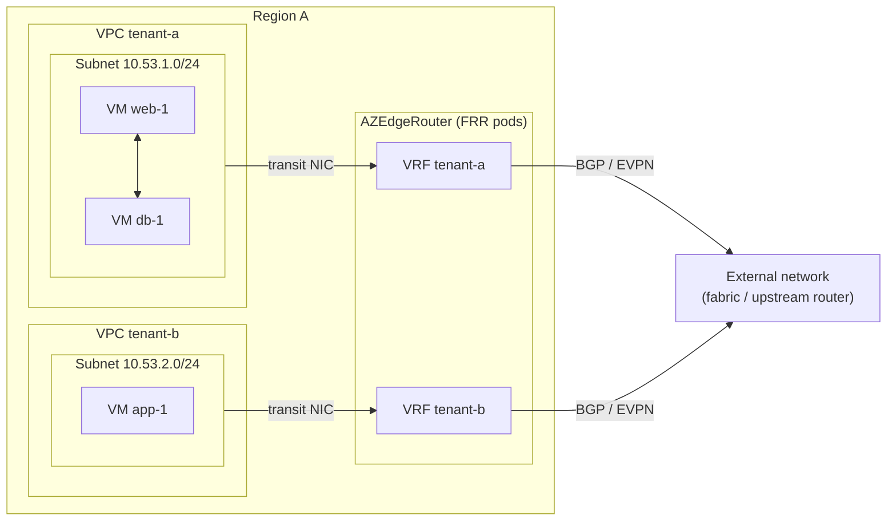
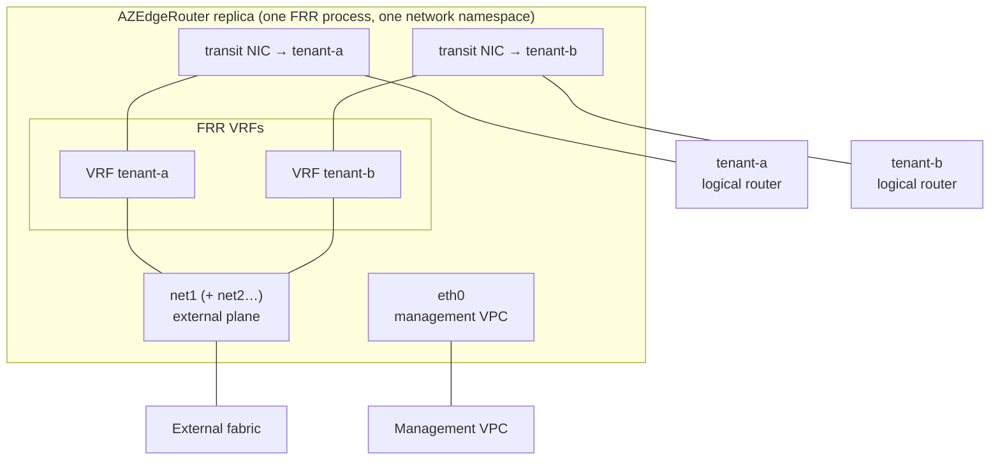
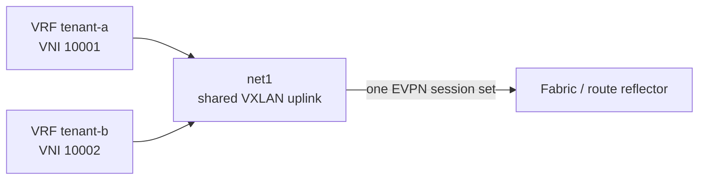
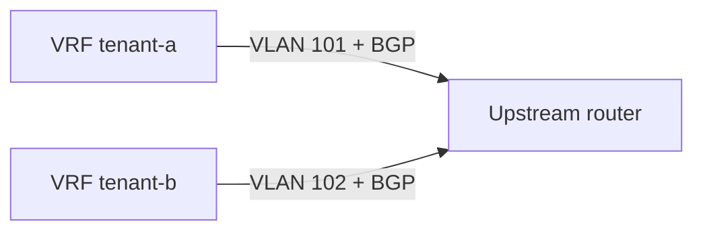

+++
title = "AZ Edge Router"
date = 2026-09-08T00:00:00+00:00
weight = 20
+++

Kubermatic Virtualization isolates every tenant into its own Kube-OVN VPC — its own routing
domain, with no data path to another VPC or to the node network by default. That isolation is
the point, but it leaves an open question: how do a VPC's workloads reach the outside world,
and how does traffic move between VPCs that live in different regions or availability zones?

The **`AZEdgeRouter`** answers that. It is a single custom resource that provisions a
multi-homed [FRR](https://frrouting.org/) gateway serving **many** tenant VPCs at once — one
gateway per region/AZ, rather than one gateway per VPC. Each VPC it serves gets its own
dedicated transit interface and its own isolated FRR VRF, so tenants stay isolated from each
other end to end even though they share one router.

## Where the edge router lives

The edge router sits **between the VPCs and the outside network**. Inside a VPC, VMs sit on
subnets and talk to each other over the OVN overlay; that traffic never touches the edge router.
Only traffic that leaves the VPC — to the internet or to a published service's clients — passes
through it. Traffic to the same VPC's subnets in another region stays in OVN too, unless you
opt in to [routing it over the fabric](fabric-routing/).


```mermaid
flowchart LR
  subgraph region["Region A"]
    subgraph vpcA["VPC tenant-a"]
      subgraph subA["Subnet 10.53.1.0/24"]
        vmA1["VM web-1"]
        vmA2["VM db-1"]
      end
    end
    subgraph vpcB["VPC tenant-b"]
      subgraph subB["Subnet 10.53.2.0/24"]
        vmB1["VM app-1"]
      end
    end
    subgraph router["AZEdgeRouter (FRR pods)"]
      vrfA["VRF tenant-a"]
      vrfB["VRF tenant-b"]
    end
  end
  fabric["External network<br/>(fabric / upstream router)"]

  vmA1 <--> vmA2
  subA -- "transit NIC" --> vrfA
  subB -- "transit NIC" --> vrfB
  vrfA -- "BGP / EVPN" --> fabric
  vrfB -- "BGP / EVPN" --> fabric
```

- `web-1` and `db-1` talk to each other inside the VPC: no router involved.
- `web-1` to the internet, or an outside client to a service in `tenant-a`: through
  `VRF tenant-a`, then out to the fabric.
- `tenant-a` and `tenant-b` have **no** path to each other through the router, even if their
  address ranges overlap — their VRFs are separate routing tables.

### In networking terms

If you know software routers such as **OPNsense** or **pfSense**, think of the edge router as a
multi-tenant version of one: a router/firewall VM at the edge of your network, with one
interface towards the inside and one towards the uplink. The difference is that a single
`AZEdgeRouter` does this for many isolated tenants at once, using one VRF (a separate routing
table) per tenant, much like VRF-Lite on a physical router. In provider-network vocabulary it
is a **PE (provider-edge) router**: it terminates one VRF per tenant and exchanges that tenant's
routes with the outside over BGP or EVPN.

It is not a leaf or spine switch, and this documentation avoids calling the external side "the
spine". The external side is simply **the fabric** or **the upstream router** — it could be a
spine-leaf data center fabric, a traditional routed network, or a WAN edge.

## Why one router per region, not one per VPC

A gateway scoped to a single VPC is simple to isolate but does not scale operationally — every
new tenant needs its own router deployment, its own BGP session, its own set of external
addresses. One `AZEdgeRouter` per region instead serves every VPC the operator discovers (by
label selector) or is told to attach (an explicit list), with Linux VRFs inside the router pod
enforcing isolation. This is the same primitive Kube-OVN already uses one layer down, where each
VPC is its own logical router: a separate routing domain with no default path to another.

The alternative — one router pod per VPC — would also isolate correctly, but its cost grows
with every tenant:

- **Per-VPC pod overhead.** Another image pull, scheduling decision, baseline of memory, and
  set of objects to reconcile for every tenant. A VRF is a route table and a couple of
  interfaces — cheap to add to a pod that is already running.
- **External session count (`evpn` mode).** One router holds one set of EVPN sessions per region
  no matter how many VPCs it serves. One pod per VPC would multiply sessions to the same
  fabric peers. In `bgp-per-vrf` mode each VPC still gets its own BGP session, so this
  particular advantage applies to `evpn` only.
- **Cheaper onboarding.** Attaching a VPC to a running router is a VRF creation, a NIC attach,
  and an FRR config reload — not a cold pod start plus a fresh BGP/EVPN session.

## Router pod architecture

Each `AZEdgeRouter` produces a `StatefulSet` of FRR pods. Every replica is multi-homed:


```mermaid
flowchart TB
  subgraph pod["AZEdgeRouter replica (one FRR process, one network namespace)"]
    eth0["eth0<br/>management VPC"]
    net1["net1 (+ net2…)<br/>external plane"]
    subgraph vrfs["FRR VRFs"]
      vrfA["VRF tenant-a"]
      vrfB["VRF tenant-b"]
    end
    tA["transit NIC → tenant-a"]
    tB["transit NIC → tenant-b"]
  end
  mgmt["Management VPC"]
  fabric["External fabric"]
  lrA["tenant-a<br/>logical router"]
  lrB["tenant-b<br/>logical router"]

  eth0 --- mgmt
  net1 --- fabric
  tA --- vrfA
  tB --- vrfB
  tA --- lrA
  tB --- lrB
  vrfA --- net1
  vrfB --- net1
```

| Interface | Purpose |
|---|---|
| `eth0` | the management VPC — the router's own control-plane attachment |
| external plane (`net1`, and in `bgp-per-vrf` mode additional per-VPC VLAN NICs) | where the router talks to the fabric |
| one transit NIC per served VPC | a Multus interface into that VPC's own Kube-OVN logical router, enslaved to a matching FRR VRF |

Because a VRF has no path to another VRF by default, two VPCs served by the same replica stay
isolated even when their address ranges overlap. No route leaking between VPC VRFs is configured
or expected on a single router.

By default the pod reaches the Kubernetes API server through the node/apiserver IP, overridden
onto `eth0`'s management-VPC path. That assumes the management VPC has an L2 route to the node
network, which a custom management VPC (the common shape for an AZ router) does not. Set
`spec.apiServerViaInternalProxy: true` to reach the API server through an in-VPC apiserver proxy
instead — leave it unset when the management VPC does have that L2 path, set it whenever the
management VPC is otherwise isolated from the node network.

## Two transit modes

`spec.ovnTransitMode` selects how a VPC's subnets are advertised to the external fabric. This
choice does not affect VPC isolation (VRFs handle that either way); it decides how the external
side scales and what it costs on the wire.

### `evpn` (default): one shared uplink, one VNI per VPC

All VPCs share **one** external NIC acting as a VXLAN tunnel endpoint. Each VPC's subnets are
advertised as EVPN Type-5 routes carrying that VPC's own VNI.


```mermaid
flowchart LR
  vrfA["VRF tenant-a<br/>VNI 10001"] --> nic["net1<br/>shared VXLAN uplink"]
  vrfB["VRF tenant-b<br/>VNI 10002"] --> nic
  nic -- "one EVPN session set" --> fabric["Fabric / route reflector"]
```

Adding a VPC costs nothing on the external side. → [EVPN mode details](evpn/)

### `bgp-per-vrf`: one VLAN and one BGP session per VPC

Each VPC gets its **own** underlay VLAN and its own plain BGP session, routed natively on the
wire with no VXLAN encapsulation.


```mermaid
flowchart LR
  vrfA["VRF tenant-a"] -- "VLAN 101 + BGP" --> fabric["Upstream router"]
  vrfB["VRF tenant-b"] -- "VLAN 102 + BGP" --> fabric
```

Simpler to reason about, at the cost of one VLAN per VPC on the external side.
→ [`bgp-per-vrf` mode details](bgp-per-vrf/)

### Which one?

| | `evpn` | `bgp-per-vrf` |
|---|---|---|
| External NICs | one, shared | one VLAN per VPC (can be shared) |
| External sessions | constant | one per VPC |
| Encapsulation | VXLAN | none |
| Fits | many VPCs per router; avoiding per-tenant VLAN work on the fabric | a small, fixed set of VPCs; fabric has VLAN capacity |
| Needs on the fabric | EVPN support, or the operator-managed [route reflector](evpn/#route-reflector) | per-VRF BGP peering and (for multi-region) route leaking |

Both give the same isolation guarantees, including for VPCs with overlapping address ranges.

## Documentation map

Start with the use case closest to yours; each page opens with a diagram, then explains and
shows a complete configuration.

| I want to… | Read |
|---|---|
| attach VPCs and subnets to a router (applies to every setup) | [Attaching VPCs and Subnets](vpc-attachment/) |
| run per-tenant VLANs with plain BGP | [`bgp-per-vrf` mode](bgp-per-vrf/) |
| provision the external VLAN for a VPC | [`UnderlaySubnet`](../vpc-subnets/underlay-subnet/) |
| run EVPN with one shared uplink | [EVPN mode](evpn/) |
| span more than one region | [Multi-region](multi-region/) |
| advertise service virtual IPs (MetalLB, anycast) | [Virtual-IP plane](virtual-ip-plane/) |
| control egress and source addresses | [Egress control](egress-control/) |
| send cross-region traffic over the fabric instead of OVN | [Routing over the fabric](fabric-routing/) |

For complete platform layouts that show how the router fits in, see the
[Reference Design](../reference-design/). The full field-by-field specification lives in the
[CRD reference](../../../../references/crds/#azedgerouter).

## Quick start

A minimal single-region router in `bgp-per-vrf` mode. Replace the names, addresses and ASNs with
values from your environment; the VLAN NADs (`ext-region-a-nad`, `svc-region-a-nad`) and the
management subnet must already exist. Everything below must live in **one namespace**
(`edge-frr` here) — the router, its VPCs, subnets, and the objects it references.

```yaml
apiVersion: routing.virtualization.k8c.io/v1alpha1
kind: AZEdgeRouter
metadata:
  name: az-edge-router-region-a
  namespace: edge-frr
spec:
  replicaCount: 2
  image:
    frr: quay.io/frrouting/frr:10.6.0
    netshoot: nicolaka/netshoot:latest
    configWatcher: quay.io/kubermatic/frr-config-watcher:latest   # pin to a released tag
  nodeSelector:
    topology.kubernetes.io/region: region-a
  managementSubnet: az-mgmt-a
  apiServerViaInternalProxy: true

  # net1: service/anycast VLAN
  vlan:
    name: svc-region-a-nad
    namespace: edge-frr
  vlanGateway: 10.210.0.253

  asn: 65040                       # must match what the upstream router expects
  ovnTransitMode: bgp-per-vrf
  perVRFTransit:
    peerASN: 65000
    vpcVLANs:
      - vpc: tenant-a
        nadName: ext-region-a-nad  # pre-existing VLAN NAD
        localIPs:                  # one per replica
          - 10.200.0.10
          - 10.200.0.11
        peerIP: 10.200.0.254

  transitSubnet:
    subnetName: az-transit-a
    cidr: 172.31.191.0/24

  vpcs:
    autoDiscovery: true
    labelSelector:
      matchLabels:
        virtualization.k8c.io/edge-router-attach: "true"
---
apiVersion: virtualization.k8c.io/v1alpha1
kind: VPC
metadata:
  name: tenant-a
  namespace: edge-frr
  labels:
    virtualization.k8c.io/edge-router-attach: "true"   # picked up by autoDiscovery
spec: {}
```

Onboarding another tenant is creating its `VPC` with the label (plus its external VLAN wiring —
see [`bgp-per-vrf` mode](bgp-per-vrf/#attaching-a-vpcs-external-vlan)); the router is not edited.

For VMs on a subnet of that VPC, see [VM Network Assignment](../vms-networks-assignment/).
