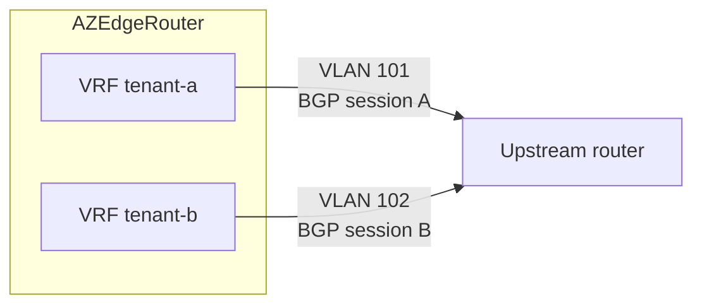
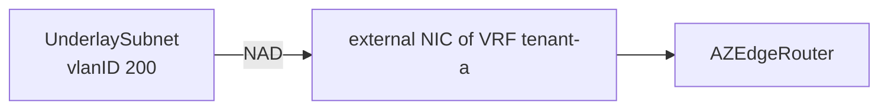

+++
title = "bgp-per-vrf Mode"
date = 2026-09-08T00:00:00+00:00
weight = 20
+++

In `bgp-per-vrf` mode each VPC gets its **own** underlay VLAN, attached as a dedicated external
NIC and enslaved to that VPC's VRF. FRR runs a per-VRF BGP session over it, advertising the
VPC's subnets as plain IPv4 unicast — no VXLAN, routed natively on the wire.



It trades the EVPN control plane for simplicity, at the cost of one VLAN (and one NIC) per VPC
on the external side, capped by the platform's VLAN space per router. VPCs that don't need
separate external identities can share one VLAN, each still keeping its own BGP AS number if
required (`spec.perVRFTransit.vpcVLANs[].localASN`). The VLAN itself is usually provisioned with
an [`UnderlaySubnet`](../../vpc-subnets/underlay-subnet/). For when to prefer this over EVPN, see
[Which one?](../#which-one).

## Complete example

Two-region pair, per-VPC VLANs, MetalLB-style anycast on a separate service VLAN. Adjust ASNs,
NAD names, gateways and CIDRs to your fabric. The VLAN NADs and management subnets must exist
beforehand.

```yaml
apiVersion: routing.virtualization.k8c.io/v1alpha1
kind: AZEdgeRouter
metadata:
  name: az-edge-router-region-a
  namespace: edge-frr
spec:
  replicaCount: 2
  # Hot-plug per-VPC transit NICs so onboarding a VPC does not roll the router pods.
  # Requires thick Multus + multus-dynamic-networks-controller.
  dynamicTransitNICs: true
  image:
    frr: quay.io/frrouting/frr:10.6.0
    netshoot: nicolaka/netshoot:latest
    configWatcher: quay.io/kubermatic/frr-config-watcher:latest   # pin to a released tag
  # imagePullSecrets: [{name: registry-credentials}]              # private registries only
  nodeSelector:
    topology.kubernetes.io/region: region-a
  zone: region-a
  managementSubnet: az-mgmt-a
  apiServerViaInternalProxy: true

  # net1: service VLAN, used for anycast advertisement
  vlan:
    name: svc-region-a-nad
    namespace: edge-frr
  vlanGateway: 10.210.0.253

  asn: 65040                        # must match the upstream router's expected neighbor ASN
  ovnTransitMode: bgp-per-vrf
  perVRFTransit:
    peerASN: 65000
    vpcVLANs:
      - vpc: tenant-a
        nadName: ext-region-a-nad   # pre-existing VLAN NAD
        localIPs:                   # one per replica
          - 10.200.0.10
          - 10.200.0.11
        peerIP: 10.200.0.254

  # Anycast blocks advertised on net1 to the regional service peer
  bgpPeers:
    - ip: 10.210.0.253
      asn: 65010
  internalPeers:
    enabled: true
    acceptPrefixes:
      - 172.25.0.0/24
    multihopTTL: 5
    bfd: true

  transitSubnet:
    subnetName: az-transit-a
    cidr: 172.31.191.0/24
  vpcs:
    autoDiscovery: true
    labelSelector:
      matchLabels:
        virtualization.k8c.io/edge-router-attach: "true"
    subnetLabelSelector:
      matchLabels:
        topology.kubernetes.io/zone: region-a

  bfd:
    minTx: 300
    minRx: 300
    multi: 3
    internal:
      enabled: true
    external:
      enabled: false
  netshoot:
    enabled: true
  configWatcher:
    enabled: true
    interval: 30
```

For region B, copy the object and change the name, `zone`, `nodeSelector`, `managementSubnet`,
NADs, gateways, IPs, ASNs, `transitSubnet`, and the `subnetLabelSelector` zone. See
[Multi-region](../multi-region/) for how the two fit together.

## External VLANs: `UnderlaySubnet`

The usual way to give a VPC its external VLAN is `spec.perVRFTransit.vpcVLANs[].underlaySubnet`,
naming an [`UnderlaySubnet`](../../vpc-subnets/underlay-subnet/) object rather than a NAD
directly. The operator reads the VLAN tag authoritatively off `UnderlaySubnet.spec.vlanID`, so
`vpcVLANs[].vlanID` only matters for the alternate `nadName` form (an already-existing NAD
instead of an `UnderlaySubnet`).



```yaml
apiVersion: virtualization.k8c.io/v1alpha1
kind: UnderlaySubnet
metadata:
  name: tenant-a-ext
  namespace: edge-frr
spec:
  cidrBlock: 10.200.0.0/24
  gateway: 10.200.0.254
  defaultInterface: eth1
  vlanID: 200
  excludeIPs:
    - 10.200.0.254
---
apiVersion: routing.virtualization.k8c.io/v1alpha1
kind: AZEdgeRouter
metadata:
  name: az-edge-router-region-a
  namespace: edge-frr
spec:
  ovnTransitMode: bgp-per-vrf
  perVRFTransit:
    vpcVLANs:
      - vpc: tenant-a
        underlaySubnet: tenant-a-ext   # instead of nadName
        localIPs: ["10.200.0.10", "10.200.0.11"]
        peerIP: 10.200.0.254
```

**This resolves in the `AZEdgeRouter`'s own namespace** — the same rule as for
`spec.vpcs.list`/`labelSelector` (see [Attaching VPCs](../vpc-attachment/#one-namespace-for-everything)),
extended to every other object the router reads. The `UnderlaySubnet`s named in `vpcVLANs`,
`spec.managementSubnet`, and every `VPC` the router discovers or lists must all live in that one
namespace. Nothing here is namespace-qualifiable today.

Router-specific notes on the pitfalls listed on the
[`UnderlaySubnet`](../../vpc-subnets/underlay-subnet/#things-that-are-easy-to-get-wrong) page:

- **No DHCP is irrelevant to the router itself** — its `localIPs` are assigned directly. It only
  matters for other devices that need to self-configure on the same VLAN.
- **The fabric peer's address and any other static address on the VLAN** (such as an
  `egressToSourceBySubnet` address) belong in `spec.excludeIPs`, or kube-ovn may hand them to a pod.

## Attaching a VPC's external VLAN

[VPC discovery](../vpc-attachment/) decides **whether** a VPC is resolved by the router. It says
nothing about **how** the VPC plugs into the external plane — its NAD/VLAN, its local and peer
BGP addresses, its accept-lists. That wiring has two independent sources, and a VPC can use
either:

- **`spec.perVRFTransit.vpcVLANs[]` on the `AZEdgeRouter`**, one entry per VPC, keyed by `vpc`.
- **Annotations on the `VPC` object**, prefixed `az-edge-router.virtualization.k8c.io/`.

Auto-discovery alone would only get a VPC *counted*; without annotations someone would still
have to edit `vpcVLANs[]` by hand. With both a matching label and the right annotations, a VPC
onboards itself completely, with no `AZEdgeRouter` edit. `vpcVLANs[]` remains the better fit
when the wiring should be a deliberate, router-owned, reviewed change.

### With `vpcVLANs[]`

```yaml
apiVersion: routing.virtualization.k8c.io/v1alpha1
kind: AZEdgeRouter
metadata:
  name: az-edge-router-region-a
  namespace: edge-frr
spec:
  replicaCount: 2
  ovnTransitMode: bgp-per-vrf
  perVRFTransit:
    vpcVLANs:
      - vpc: tenant-b
        nadName: tenant-b-ext-nad        # or underlaySubnet — mutually exclusive with nadName
        localIPs:
          - "10.100.1.10"                # one per replica
          - "10.100.1.11"
        peers:
          - ip: "10.100.1.1"
            advertiseOVNSubnets: true
            defaultRoute: true           # this peer carries tenant-b's egress default route
```

`peers[]` carries the per-neighbor axes described in [Egress control](../egress-control/):
`advertiseOVNSubnets`, `advertiseAnycast`, and `defaultRoute`, set independently per entry.

### With VPC annotations

```bash
kubectl -n edge-frr annotate vpc tenant-b --overwrite \
  az-edge-router.virtualization.k8c.io/nad-name=tenant-b-ext-nad \
  az-edge-router.virtualization.k8c.io/peer-ip=10.100.1.1 \
  az-edge-router.virtualization.k8c.io/local-ips=10.100.1.10,10.100.1.11
```

With `replicaCount: 2` and a matching `labelSelector` in place, that one command is the entire
onboarding. `nad-name`, `peer-ip`, and `local-ips` are a triple: set all three or none — one or
two of three is a configuration error, not a partial attachment.

{}
These annotations are a **platform automation surface, not a tenant-facing one**. `nad-name`
picks the underlay VLAN a VPC attaches to — the actual `bgp-per-vrf` isolation boundary — and
`accept-prefixes` bounds what the router re-advertises to the fabric. A tenant who can freely
annotate their own `VPC` could attach it to another tenant's VLAN or hijack another tenant's
anycast block. Don't give tenants write access to the `VPC` object without capping these against
a platform-defined ceiling first.
{}

The annotation surface has no equivalent of the `peers[]` list: `peer-ip` (plus `peer-asn`)
covers the single-peer case and `service-peer-ip` (plus `service-peer-asn`) adds a second,
anycast-only peer. Two peers is the ceiling; anything with more roles on one VLAN needs
`vpcVLANs[]`.

**Precedence is per field, not per entry.** When a VPC is named in both places, only the fields
actually *set* on its `vpcVLANs[]` entry override the annotations; unset fields fall through to
the VPC's annotation. That also makes a **policy-only** entry valid — one naming the VPC but
setting neither `underlaySubnet` nor `nadName`, e.g. only `advertiseOVNSubnets` — while the
attachment still comes from the annotations.

All annotation keys, under the `az-edge-router.virtualization.k8c.io/` prefix:

| Key (after the prefix) | Populates | Required? |
|---|---|---|
| `nad-name` | the external NAD | Part of a required triple |
| `peer-ip` | the fabric peer's IP (workload/transit plane) | Part of a required triple |
| `local-ips` | this replica's IP(s) on the VLAN, comma-separated — **one per `replicaCount`** | Part of a required triple |
| `vlan-id` | the physical VLAN tag, for grouping VPCs that share a wire across separate NADs | Optional |
| `accept-prefixes` | what this router accepts *from* the VPC's own in-VPC speakers | Optional |
| `fabric-accept-prefixes` | the inverse — what the *external fabric peer* may inject into this VPC's VRF | Optional |
| `service-peer-ip` | a second, anycast-only peer on the same VLAN | Optional |
| `default-peer-ip` | which `peer-ip` entry carries the VRF default route, when there's more than one | Optional |
| `peer-asn` / `service-peer-asn` | remote ASN for the `peer-ip` / `service-peer-ip` peers | Optional |
| `local-asn` | this VPC's own local BGP ASN, overriding `spec.asn` for its VRF (mutually exclusive with EVPN VNI on the same VPC) | Optional |
| `apiserver-proxy` | `"true"` allow-lists this VPC for `spec.apiServerViaInternalProxy` | Optional |
| `apiserver-proxy-subnets` | restrict the proxy allow-list to specific subnets, comma-separated; empty = every subnet | Optional |

### Zone-scoped annotations, for a VPC shared across regions

The plain keys describe **one** attachment. When more than one regional `AZEdgeRouter` — each
with its own `spec.zone` — attaches the *same* VPC, they may share the underlay VLAN and fabric
peer, but each needs its own address per replica on it. Prefix a key with the router's zone name:

```
az-edge-router.virtualization.k8c.io/<zone>.nad-name
az-edge-router.virtualization.k8c.io/<zone>.local-ips
az-edge-router.virtualization.k8c.io/<zone>.peer-ip
az-edge-router.virtualization.k8c.io/<zone>.accept-prefixes
```

```bash
kubectl -n edge-frr annotate vpc tenant-b --overwrite \
  az-edge-router.virtualization.k8c.io/region-a.nad-name=tenant-b-region-a-nad \
  az-edge-router.virtualization.k8c.io/region-a.peer-ip=10.101.0.254 \
  az-edge-router.virtualization.k8c.io/region-a.local-ips=10.101.0.10,10.101.0.11

kubectl -n edge-frr annotate vpc tenant-b --overwrite \
  az-edge-router.virtualization.k8c.io/region-b.nad-name=tenant-b-region-b-nad \
  az-edge-router.virtualization.k8c.io/region-b.peer-ip=10.102.0.254 \
  az-edge-router.virtualization.k8c.io/region-b.local-ips=10.102.0.10,10.102.0.11
```

Each regional router (with `spec.zone: region-a` / `region-b`) resolves only its own zone's keys.

- **`nad-name`, `vlan-id`, `local-ips`, `peer-ip`, `service-peer-ip`** are exclusive-attachment
  fields and **never fall back** to the plain key once a VPC carries *any* zone-scoped key for
  one of them. A router with `spec.zone` unset reading such a VPC is a hard error — it cannot
  tell which zone's values are its own. A zoned router simply skips a VPC with no keys for its
  zone.
- **`default-peer-ip`, `peer-asn`, `service-peer-asn`, `local-asn`, `fabric-accept-prefixes`,
  and `accept-prefixes`** are policy and keep falling back to the plain key.

Leave `spec.zone` unset in the single-region case; the plain keys are then the whole answer.

{}
None of this applies to `evpn` mode. There, a VPC's external identity is its
`virtualization.k8c.io/vni` label (plus an optional [`EVPNPolicy`](../evpn/#evpnpolicy)), because
`evpn` has no per-VPC external NIC to attach.
{}
