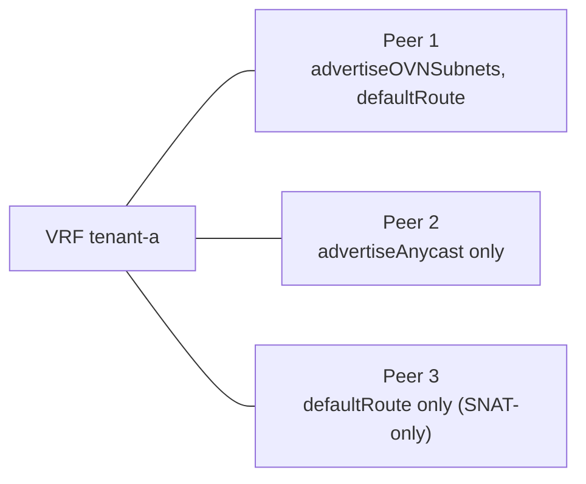

+++
title = "Advanced: Egress Control"
date = 2026-09-08T00:00:00+00:00
weight = 60
+++

Egress is configured per VPC in two independent steps: whether the VPC has an egress path at
all, and which source address that traffic uses.

## Whether a VPC gets egress at all (`bgp-per-vrf`)

Egress is not a separate toggle — it falls out of which fabric peers on a VPC's VLAN are marked
as **default-route candidates** (`spec.perVRFTransit.vpcVLANs[].peers[].defaultRoute`). A peer
is a candidate unless set to `false`; every candidate is installed as an ECMP default route in
the VPC's VRF.



- **Receive-only / transit-only**: `defaultRoute: false` on **every** peer installs no default
  route, so the VPC has no egress at all — nothing to masquerade against, deliberately. The VPC's
  subnets or anycast blocks can still be advertised outward.
- **SNAT-only**: a peer that advertises neither the VPC's subnets nor its anycast blocks but is
  still a default-route candidate. Egress works; nothing about the VPC is reachable from the
  fabric.

The three axes `advertiseOVNSubnets`, `advertiseAnycast`, and `defaultRoute` are set
independently per peer, so one VPC can mix a transit peer, a service peer, a receive-only peer
and a SNAT-only peer on the same VLAN. See [`bgp-per-vrf` mode](../bgp-per-vrf/).

## Which source address egress uses

Outbound traffic is normally masqueraded to the router replica's own address. Two optional
overrides narrow that, both set per VPC in `spec.vpcs.list[]`:

### `egressToSource`: one address for the whole VPC

```yaml
spec:
  vpcs:
    autoDiscovery: false
    list:
      - name: tenant-a
        egressToSource: "10.200.0.70"
```

{}
Only safe with `replicaCount: 1`. It is a plain secondary address on an interface, not a
BGP-advertised route: with more than one replica, a reply is not guaranteed to land on the
replica that sent the request, and nothing routes it back. Use `egressToSourceBySubnet` once
`replicaCount > 1`.
{}

### `egressToSourceBySubnet`: one address per subnet, per replica

The compliance/allowlisting case: one subnet needs a stable, distinct external identity without
its own egress VLAN. Entries are keyed by the subnet's canonical CIDR and need **one address per
replica**. Because a per-replica address can be un-NATed correctly on return, this is the one to
use with more than one replica.

```yaml
spec:
  replicaCount: 2
  vpcs:
    autoDiscovery: false
    list:
      - name: tenant-a
        egressToSourceBySubnet:
          "10.53.2.0/24":        # must be one of tenant-a's own subnets
            - "10.202.0.20"      # replica 0
            - "10.202.0.21"      # replica 1
```

{}
Every address used here must also be excluded from the relevant Subnet's own IPAM pool
(`spec.excludeIps`) so it can never be handed to an unrelated NIC. The operator does not do this
for you.
{}
