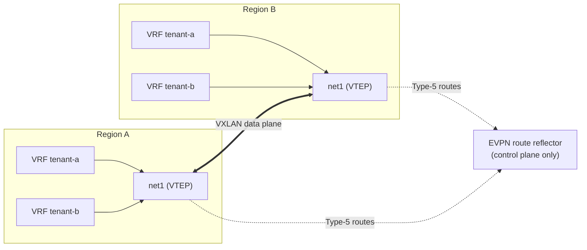
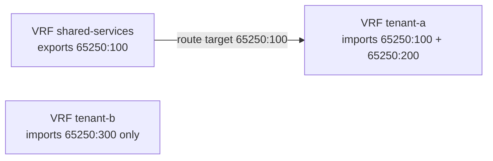

+++
title = "EVPN Mode"
date = 2026-09-08T00:00:00+00:00
weight = 30
+++

`evpn` is the default transit mode. All VPCs share **one** external NIC, which acts as a VXLAN
tunnel endpoint (VTEP). Each VPC's subnets are advertised as EVPN Type-5 (IP-prefix) routes
carrying that VPC's own VNI, and an EVPN route reflector distributes them between regions.



Isolation rides on the VNI (24-bit — roughly 16 million tenants) rather than on a NIC, so
adding another VPC costs nothing on the external side. The router's NIC count only grows by the
internal transit NIC each VPC still needs.

The route reflector relays routes only; VXLAN traffic flows directly between the routers' VTEPs.
It sits alongside the fabric rather than in the forwarding path.

A VPC's external identity in this mode is its `virtualization.k8c.io/vni` label. There are no
per-VPC VLANs or BGP sessions to wire up, and none of the `bgp-per-vrf` annotations apply.

## Two supporting CRDs

Neither is ever touched by a tenant.

### `EVPNPolicy`

An admin-managed object that overrides the VNI, RD and import/export Route Targets an
`AZEdgeRouter` VPC would otherwise auto-derive as a symmetric `<ASN>:<VNI>`.
`spec.targets[].azEdgeRouterRef` binds it to one VPC (VRF) on one named `AZEdgeRouter`; the AZ
controller resolves it directly into that VPC's `status.resolvedAZVPCs[]` entry — there is no
separate `EVPNPolicy` controller.

Reach for one only when two VPCs need asymmetric or hand-picked RTs, for example a one-way
import from a shared services VPC. The auto-derived default is a correct, symmetric policy on its
own.



The example below gives `tenant-a` a one-way import of a shared services VPC. Each policy
overrides the auto-derived `<ASN>:<VNI>` values for one VPC on one router; `rd` and `vni` are
required. The policies live in an admin namespace, and `azEdgeRouterRef` names the router and
the VPC they apply to:

```yaml
apiVersion: virtualization.k8c.io/v1alpha1
kind: EVPNPolicy
metadata:
  name: shared-services
  namespace: network-admin
spec:
  vni: 100
  rd: "65250:100"
  exportRTs:
    - "65250:100"            # everything that imports this RT sees the services prefixes
  importRTs:
    - "65250:100"
  targets:
    - azEdgeRouterRef:
        name: az-edge-router-region-a
        namespace: edge-frr
        vpc: shared-services
---
apiVersion: virtualization.k8c.io/v1alpha1
kind: EVPNPolicy
metadata:
  name: tenant-a
  namespace: network-admin
spec:
  vni: 200
  rd: "65250:200"
  exportRTs:
    - "65250:200"
  importRTs:
    - "65250:200"
    - "65250:100"            # one-way import of the shared services VPC
  targets:
    - azEdgeRouterRef:
        name: az-edge-router-region-a
        namespace: edge-frr
        vpc: tenant-a
```

`tenant-a` now imports the shared services routes, while `shared-services` does not import
`tenant-a`'s. A VPC without a policy keeps its auto-derived, symmetric values. See the
[CRD reference](../../../../../references/crds/) for the full schema.

### `EVPNRouteReflector` {#route-reflector}

A separate, admin-deployed FRR pod (or pods) that relays EVPN Type-5 routes between every
`AZEdgeRouter` matched by `spec.azEdgeRouterSelector`. It uses `bgp listen range`
(`spec.peerListenRanges`) because AZ router pod IPs are dynamically assigned. It writes its own
replica IPs into each matched router's `status.resolvedEVPNPeers`, which `frr-config-watcher`
merges in as EVPN-only neighbors — no manual peer configuration on the `AZEdgeRouter` side.

If your fabric already has an EVPN route reflector, use that instead: then `spec.evpnPeers`
points at it and neither CRD is needed.

## Complete example: operator-managed route reflector

Two regions exchanging VPC subnets via EVPN Type-5, reflected by an in-cluster
`EVPNRouteReflector`. Anycast/service advertisement rides a separate service VLAN (`net2`).
Adjust ASNs, NAD names, gateways, subnets and CIDRs to your fabric.

```yaml
apiVersion: virtualization.k8c.io/v1alpha1
kind: EVPNRouteReflector
metadata:
  name: az-evpn-rr
  namespace: edge-frr
spec:
  asn: 65250                  # must match the AZ routers' ASN (iBGP, same AS)
  replicaCount: 1
  ips:
    - 10.60.12.10
  subnet: az-mgmt-rr          # overlay subnet in the management VPC, no VLAN needed
  multihopTTL: 3
  image:
    frr: quay.io/frrouting/frr:10.6.0
    configWatcher: quay.io/kubermatic/frr-config-watcher:latest   # pin to a released tag
  azEdgeRouterSelector:       # reflect for routers carrying this label
    matchLabels:
      evpn-rr-client: "true"
  peerListenRanges:           # the AZ routers' management subnets (their eth0)
    - 10.60.10.0/24
    - 10.60.11.0/24
---
apiVersion: virtualization.k8c.io/v1alpha1
kind: AZEdgeRouter
metadata:
  name: az-edge-router-region-a
  namespace: edge-frr
  labels:
    evpn-rr-client: "true"    # selected by the EVPNRouteReflector above
spec:
  replicaCount: 2
  dynamicTransitNICs: true    # needs thick Multus + multus-dynamic-networks-controller
  image:
    frr: quay.io/frrouting/frr:10.6.0
    netshoot: nicolaka/netshoot:latest
    configWatcher: quay.io/kubermatic/frr-config-watcher:latest
  nodeSelector:
    topology.kubernetes.io/region: region-a
  zone: region-a
  managementSubnet: az-mgmt-a
  apiServerViaInternalProxy: true

  # net1: region-transit VLAN (EVPN VTEP underlay); gateway = the underlay forwarder
  vlan:
    name: ext-region-a-nad
    namespace: edge-frr
  vlanGateway: 10.200.0.254
  # net2: dedicated service-advertisement VLAN (anycast), separate from region transit
  serviceVlan:
    name: svc-region-a-nad
    namespace: edge-frr
  serviceVlanGateway: 10.210.0.253

  asn: 65250
  ovnTransitMode: evpn
  evpnPeers: []               # none — the in-cluster route reflector injects itself
  evpnUnderlayPrefixes:       # VTEP reachability between the two region VLANs
    - 10.200.0.0/24
    - 10.201.0.0/24

  bgpPeers:                   # anycast, advertised to the regional service peer on net2
    - ip: 10.210.0.253
      asn: 65010
  internalPeers:
    enabled: true
    acceptPrefixes:
      - 172.25.0.0/24
    multihopTTL: 5
    bfd: true

  transitSubnet:
    subnetName: az-transit-a
    cidr: 172.31.191.0/24
  vpcs:
    autoDiscovery: true
    labelSelector:
      matchLabels:
        virtualization.k8c.io/edge-router-attach: "true"
    subnetLabelSelector:
      matchLabels:
        topology.kubernetes.io/zone: region-a

  bfd:
    minTx: 300
    minRx: 300
    multi: 3
    internal:
      enabled: true
    external:
      enabled: false
  netshoot:
    enabled: true
  configWatcher:
    enabled: true
    interval: 30
```

For region B, copy the `AZEdgeRouter` and change the name, `zone`, `nodeSelector`,
`managementSubnet`, both NADs and gateways, `bgpPeers`, `internalPeers.acceptPrefixes`,
`transitSubnet`, and the zone in `subnetLabelSelector`. Keep `asn`, `ovnTransitMode`, the
`evpn-rr-client` label and `evpnUnderlayPrefixes` identical.

Label each VPC with `virtualization.k8c.io/edge-router-attach: "true"` (and its
`virtualization.k8c.io/vni`) and it is onboarded; see [Attaching VPCs](../vpc-attachment/).

## Splitting the anycast plane onto its own VLAN

The example above uses `spec.serviceVlan` to put service advertisement on a second NIC. That is
specific to `evpn` mode and is explained, together with the single-NIC default, in
[Virtual-IP plane](../virtual-ip-plane/#splitting-the-anycast-plane-onto-its-own-vlan-evpn-mode-only).
