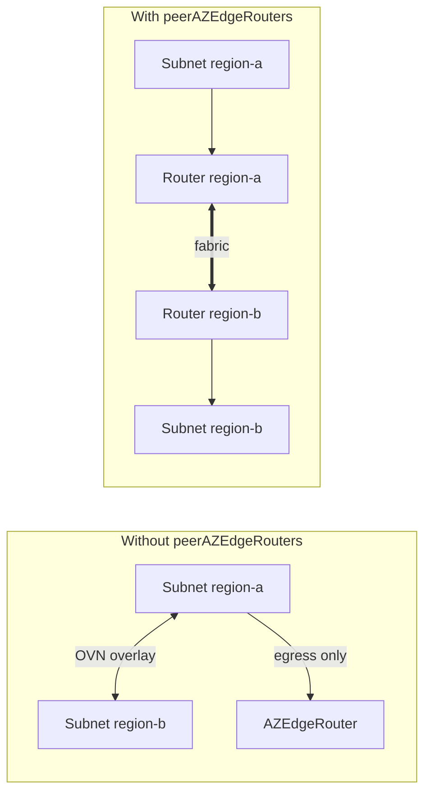

+++
title = "Advanced: Routing Over the Fabric"
date = 2026-09-08T00:00:00+00:00
weight = 70
+++

By default, traffic that stays inside a VPC stays inside OVN — including traffic between that
VPC's subnets in different regions. The edge router only carries traffic that **leaves** the
platform: egress.

`spec.peerAZEdgeRouters` changes that for traffic that **leaves a region**. It lists other
`AZEdgeRouter` CRs **in the same namespace** — typically the routers of the other regions — and
makes this router send that VPC's cross-region traffic out over the external fabric instead of
keeping it in OVN.



Use it when traffic between regions should be carried — and controlled — by the external fabric
rather than by the OVN overlay. How the fabric carries it depends on the
[transit mode](../#two-transit-modes); see [Multi-region](../multi-region/).

## What the operator does

Each reconcile, the operator reads every listed peer's `status.resolvedAZVPCs` and copies it
into this router's own `status.peerResolvedAZVPCs`. For any VPC present in both this router's
`status.resolvedAZVPCs` **and** a peer's, the operator:

- gives this router a transit NIC/VRF for that VPC exactly as for one it discovered itself, and
- installs OVN policy routes between the two routers' transit logical router ports for that
  VPC's subnets, so traffic between them takes the intended path instead of looping.

A VPC that only one of the two routers serves is skipped for the other — listing a peer does not
pull in every VPC the peer serves, only the ones this router also serves.

## Configuration

List the other regions' routers on each router. Both routers must be in the same namespace.

```yaml
# az-edge-router-region-a
spec:
  peerAZEdgeRouters:
    - az-edge-router-region-b
---
# az-edge-router-region-b
spec:
  peerAZEdgeRouters:
    - az-edge-router-region-a
```

Complete examples with this setting in context are in
[`bgp-per-vrf` mode](../bgp-per-vrf/#complete-example) and
[EVPN mode](../evpn/#complete-example-operator-managed-route-reflector).
