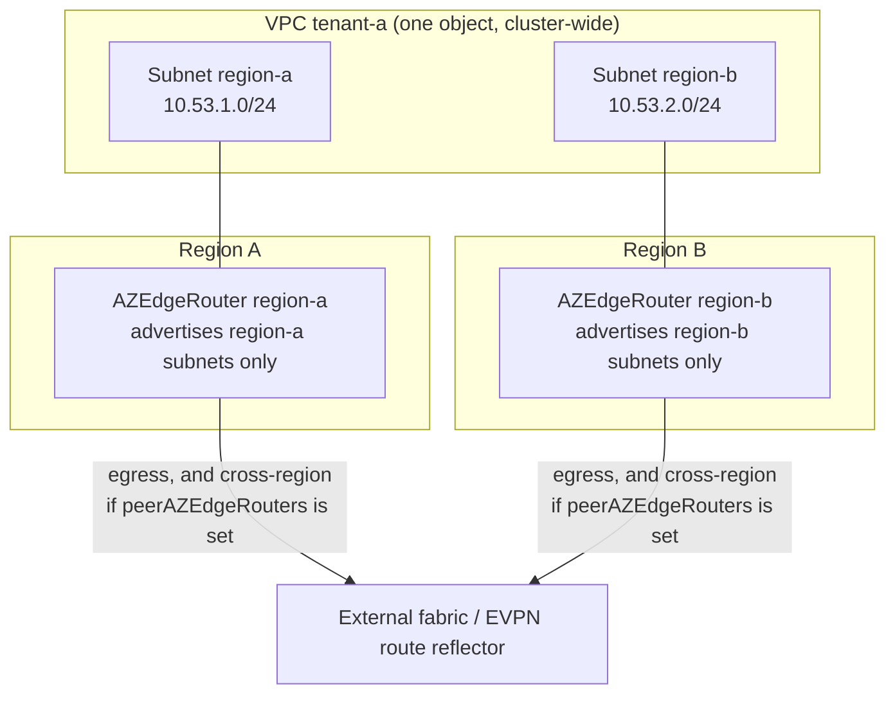
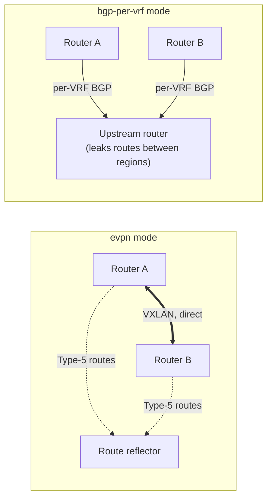

+++
title = "Multi-Region"
date = 2026-09-08T00:00:00+00:00
weight = 40
+++

In a multi-region deployment, each region runs its own `AZEdgeRouter`. A tenant VPC typically
exists in more than one region: **VPCs are global, Subnets are regional** (see
[VPCs and Subnets](../../vpc-subnets/#vpcs-are-global-subnets-are-regional)). The same `VPC`
object spans every region, and each region's router resolves it the same way.

What differs per region is only **which subnets** each router advertises, via
`spec.vpcs.subnetLabelSelector` (see [Attaching VPCs](../vpc-attachment/#subnet-discovery-subnetlabelselector)).
That is how several regional routers serve the same logical VPC without double-advertising each
other's subnets.

## How traffic crosses regions

By default, traffic between a VPC's regional subnets stays in the OVN overlay, and the routers
carry only egress. To route it over the fabric when it leaves a region instead, list the other
regions' routers in
[`spec.peerAZEdgeRouters`](../fabric-routing/). How the fabric then carries that traffic
depends on the [transit mode](../#two-transit-modes):

- **`evpn`**: a private EVPN Type-5 relay between the routers. The data path runs router to
  router and does not touch the external fabric.
- **`bgp-per-vrf`**: there is no router-to-router peer. Each region's router advertises the VPC's
  subnets to its own external fabric peer, and that peer carries the traffic between regions —
  so it genuinely transits the external fabric. The upstream router must leak routes between
  the regions' VRFs (for example with `import vrf`).

Either way, nothing here joins VPCs: a VPC stays unreachable from every other VPC in both
regions.

## Configuration

Per region, one `AZEdgeRouter` with its own `zone`, `nodeSelector`, management subnet and
`subnetLabelSelector`, plus `peerAZEdgeRouters` if cross-region traffic should use the fabric;
everything else follows the transit mode.

| Transit mode | Complete two-region example |
|---|---|
| `bgp-per-vrf` | [`bgp-per-vrf` mode — complete example](../bgp-per-vrf/#complete-example) |
| `evpn` | [EVPN mode — complete example](../evpn/#complete-example-operator-managed-route-reflector) |

Checklist for the second region:

- label subnets with `topology.kubernetes.io/zone: <region>` and set the matching
  `subnetLabelSelector` on each router;
- set `spec.zone` on each router — required whenever a VPC carries
  [zone-scoped annotations](../bgp-per-vrf/#zone-scoped-annotations-for-a-vpc-shared-across-regions);
- label nodes with `topology.kubernetes.io/region` so the router pods land in the right region,
  and pin VMs to the region of their subnet with [Regional Scheduling](../../regional-scheduling/).
