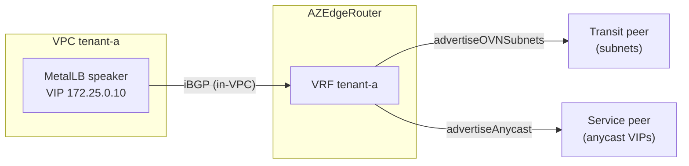
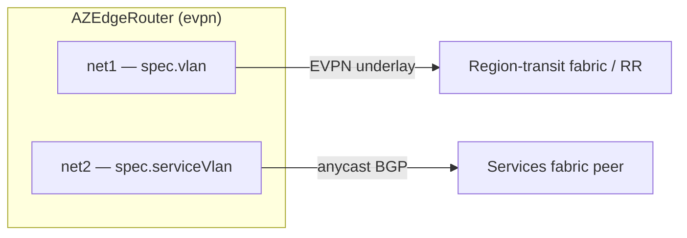

+++
title = "Advanced: Virtual-IP Plane"
date = 2026-09-08T00:00:00+00:00
weight = 50
+++

Independent of the transit mode, `AZEdgeRouter` carries a second advertisement plane for
**service virtual IPs**. In-VPC speakers (for example MetalLB or FRR) advertise static anycast
blocks into the router's per-VPC VRF; the router re-advertises them, region-local, to a
**separate** external peer than the one carrying the VPC's subnets. A VIP advertised in one
region is therefore never confused with the same VIP's advertisement in another. This plane, and
how it is filtered so a region only advertises its own VIPs, works identically in both modes.



In `bgp-per-vrf` mode both external peers sit on the VPC's one VLAN and are split purely by their
`advertiseOVNSubnets` / `advertiseAnycast` flags in `spec.perVRFTransit.vpcVLANs[].peers[]`:

```yaml
spec:
  perVRFTransit:
    vpcVLANs:
      - vpc: tenant-a
        nadName: tenant-a-ext-nad
        localIPs: ["10.100.1.10", "10.100.1.11"]
        peers:
          - ip: 10.100.1.1          # carries the VPC's subnets
            advertiseOVNSubnets: true
            advertiseAnycast: false
          - ip: 10.100.1.2          # carries only the anycast VIPs
            advertiseOVNSubnets: false
            advertiseAnycast: true
            defaultRoute: false
```

The set of addresses a speaker may announce is bounded by the router's accept-list for that VPC
(`spec.internalPeers.acceptPrefixes`, or the `accept-prefixes` VPC annotation). What a tenant can
publish is therefore bounded by the platform, not by the tenant.

## Splitting the anycast plane onto its own VLAN (`evpn` mode only)

The "separate external peer" above only means `spec.bgpPeers` names different peer IPs than the
EVPN relay. By default those peers sit on the *same* `net1` NAD as the EVPN underlay: one NIC,
two peer sets.

`spec.serviceVlan` goes a step further and puts the anycast session on a **second, physically
separate** NAD. When it names a NAD that differs from `spec.vlan`, the operator attaches it as
its own Multus NIC (`net2`, pushing per-VPC transit NICs to `net3+`) and pins `spec.bgpPeers` to
it, so region transit (EVPN) and service advertisement (anycast) ride different VLANs end to end.
Leaving `serviceVlan` empty, or equal to `vlan`, keeps both planes on `net1`.



`spec.serviceVlanGateway` only matters once the planes are split, and only when the anycast
peers are **off-subnet** on the service VLAN: it installs a `/32` static route to each peer via
that gateway. It is not a default route — the pod's default route stays on the region-transit
VLAN. When the peers sit on the service VLAN's own subnet, leave it unset.

Use the split when the anycast session needs separate hardware, a separate VRF, or a separate
ACL boundary from the EVPN underlay — for example a dedicated "services" fabric peer that should
never see region-transit traffic. It has no effect in `bgp-per-vrf` mode.
