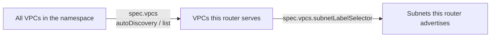

+++
title = "Attaching VPCs and Subnets"
date = 2026-09-08T00:00:00+00:00
weight = 10
+++

Two independent settings decide what an `AZEdgeRouter` serves:



- **VPC discovery** decides *which VPCs* the router attaches to.
- **Subnet discovery** decides *which of each VPC's subnets* the router advertises.

Both apply the same way in every transit mode. The examples use the `virtualization.k8c.io`
wrapper `VPC` and `Subnet` objects; `spec.vpcs.list[].name` and `spec.vpcs.labelSelector` resolve
against them directly, with no name translation.

## One namespace for everything

{}
The router resolves everything in **its own namespace**. `spec.vpcs.list`/`labelSelector`, the
`UnderlaySubnet`s named in `vpcVLANs`, `spec.managementSubnet`, and every `VPC` the router
discovers must all live in the `AZEdgeRouter`'s namespace. There is no cross-namespace
reference anywhere in this operator, so plan the tenant/router namespace layout around that.
{}

## VPC discovery: auto-discovery vs. an explicit list

**Auto-discovery** attaches every `VPC` matching a label selector, so onboarding a tenant is
labeling its `VPC` object — no `AZEdgeRouter` edit:

```yaml
apiVersion: routing.virtualization.k8c.io/v1alpha1
kind: AZEdgeRouter
metadata:
  name: az-edge-router-region-a
  namespace: edge-frr
spec:
  vpcs:
    autoDiscovery: true
    labelSelector:
      matchLabels:
        virtualization.k8c.io/edge-router-attach: "true"
    # Required whenever the same VPC is served by more than one regional router.
    subnetLabelSelector:
      matchLabels:
        topology.kubernetes.io/zone: region-a
  # ... remaining spec as in the quick start
---
apiVersion: virtualization.k8c.io/v1alpha1
kind: VPC
metadata:
  name: tenant-a
  namespace: edge-frr
  labels:
    virtualization.k8c.io/edge-router-attach: "true"
spec: {}
```

An **explicit list** fits when attachment should be a deliberate, reviewed change — for example
a small, fixed set of tenants:

```yaml
spec:
  vpcs:
    autoDiscovery: false
    list:
      - name: tenant-a
      - name: tenant-b
```

Discovery only decides whether a VPC is *resolved*. How it plugs into the external plane is
mode-specific: see [`bgp-per-vrf`](../bgp-per-vrf/#attaching-a-vpcs-external-vlan) and
[EVPN](../evpn/).

## Subnet discovery: `subnetLabelSelector`

`spec.vpcs.subnetLabelSelector` is evaluated **per VPC, every reconcile**, against the labels on
each of that VPC's wrapper `Subnet` objects. It applies the same whether the VPC was found via
`autoDiscovery` or listed explicitly.

This is what lets several regional routers serve the *same* VPC without double-advertising: a
VPC spanning two regions has subnets labelled `topology.kubernetes.io/zone: region-a` and
`region-b`, and each router only installs routes for the subnets matching its own selector.

```yaml
apiVersion: virtualization.k8c.io/v1alpha1
kind: Subnet
metadata:
  name: tenant-a-workloads
  namespace: edge-frr
  labels:
    topology.kubernetes.io/zone: region-a   # advertised by az-edge-router-region-a
spec:
  vpc: tenant-a
---
apiVersion: virtualization.k8c.io/v1alpha1
kind: Subnet
metadata:
  name: tenant-a-workloads-b
  namespace: edge-frr
  labels:
    topology.kubernetes.io/zone: region-b   # NOT advertised by az-edge-router-region-a
spec:
  vpc: tenant-a
```

The selector matches labels on the `Subnet` object itself, not on the VPC.

{}
Omitting `subnetLabelSelector` includes every subnet of the VPC — there is no "unset =
advertise nothing" behavior, so a single-region deployment can simply leave it out.
{}

{}
A VPC with zero matching subnets still resolves: it keeps its transit `/30` (or larger) and a
`status.resolvedAZVPCs` entry with an empty `subnets` field. This keeps the transit NIC and VRF
in place while subnets are relabelled one at a time, instead of flapping the attachment.
{}

## Where to go next

- [`bgp-per-vrf` mode](../bgp-per-vrf/) or [EVPN mode](../evpn/): wire the attached VPCs to the fabric.
- [Multi-region](../multi-region/): the same VPC served from several regions.
