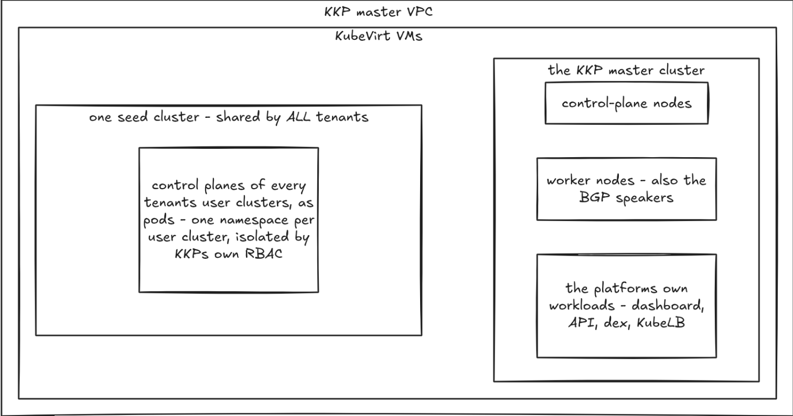
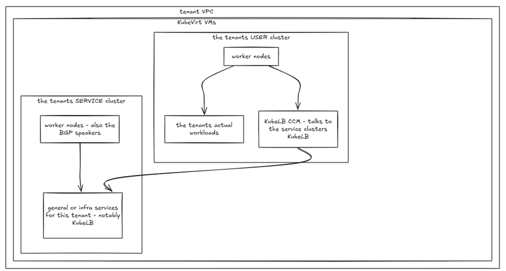
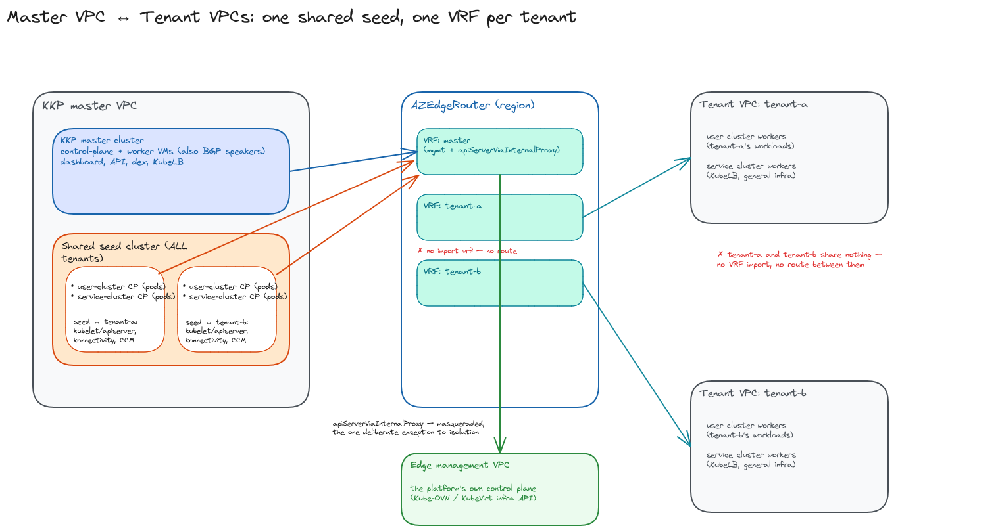
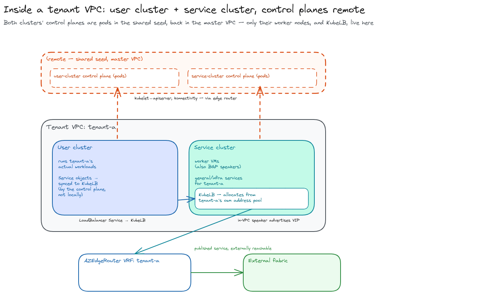

+++
title = "KKP Multi-Tenant Reference Design"
date = 2026-09-08T00:00:00+00:00
weight = 25
draft = true
+++

This page describes a complete reference design for running the **Kubermatic Kubernetes
Platform (KKP)** as a multi-tenant workload on top of Kubermatic Virtualization: one stretched
cluster, tenants isolated into their own VPCs, and [AZ Edge Routers](../az-edge-router/)
providing egress, service advertisement, and cross-region reachability. It puts the edge router
in context — how the VPCs it serves fit into the rest of the platform, and what runs inside
them. The multi-tenancy pattern here is specific to hosting KKP; it is not a generic multi-tenant
blueprint for arbitrary workloads.

## The layers

| Layer | What it is |
|---|---|
| **Platform** | **one** Kubermatic Virtualization cluster, stretched across regions: Kube-OVN for networking, KubeVirt for compute, and the operators that drive both. Regions are locality inside it, not separate installations. |
| **Tenancy** | one Kube-OVN VPC per tenant, plus a management VPC and the VPC holding the platform's own control plane. A VPC is a routing domain of its own — isolated by default, with no path to the node network or to another VPC. |
| **Interconnect** | one [AZ Edge Router](../az-edge-router/) per region, multi-homed into every VPC it serves, holding a separate routing table and VRF for each. |
| **Workload** | inside each VPC, KubeVirt VMs form nested Kubernetes clusters: the KKP master **and one seed, shared by every tenant**, in the master VPC; in each tenant VPC, that tenant's **user cluster** (worker nodes running the tenant's actual workloads) and a separate **service cluster** (worker nodes running general/infra services, notably KubeLB). |

The design's central choice is that **a VPC is isolated, and stays isolated**. There is no data
path from one VPC to another — not between two tenants, and not between a tenant and the
platform's own. What a VPC offers to the outside it offers as a **published service**, reached
through the fabric and subject to whatever the external firewall permits.

The edge router does not soften that. Its jobs are egress, service advertisement, and carrying
a VPC's traffic **between regions** — not joining VPCs to each other. See
[AZ Edge Router](../az-edge-router/) for how it does that.

## What lives inside a VPC

A VPC holds KubeVirt VMs that form nested Kubernetes clusters. What those clusters are differs
by the VPC's role, and the two shapes are not the same.

**The KKP master VPC** holds the master **and one seed shared by every tenant**:

**A tenant VPC** holds two separate nested clusters, neither with control-plane pods or a seed
of its own:

Both clusters therefore span two VPCs by design: their control planes are pods in the one shared
seed **in the master VPC**, their worker nodes are VMs **in the tenant VPC**. That is not an
accident of layout — the seed is what KKP orchestrates directly, so keeping it next to the master
keeps that reconciliation path inside one VPC; only the seed-to-worker path (kubelet↔apiserver,
konnectivity, the cloud-controller-manager provisioning VMs and volumes for that tenant) crosses
between the master VPC and the tenant VPC — carried directly by the edge router between the two
VRFs it holds for that tenant, **never out over the external fabric**. Each nested cluster is
otherwise an ordinary Kubernetes cluster whose nodes happen to be VMs on the platform.

### How KKP maps onto the VPCs

| VPC | Contains |
|---|---|
| **master VPC** | the KKP master: control-plane VMs, its own workers, dashboard, API, dex, the master controllers — **and one seed, shared by every tenant**, holding every tenant's user-cluster **and** service-cluster control planes as pods. |
| **tenant VPC** | one per tenant: that tenant's **user cluster** (worker nodes running the tenant's workloads) and **service cluster** (worker nodes running general/infra services, notably KubeLB). No control-plane pods, no seed. |

Each VPC is attached to the edge router identically: its own transit subnet and VRF, its own
routing table for egress and service advertisement, and its own speakers on its own worker
nodes. Onboarding a tenant means adding a VPC (its user cluster and service cluster worker
nodes) and pointing the shared seed at it — the seed gets one more VRF-scoped transit NIC, into
that one new tenant VPC, and widens no other tenant's reachability.

Isolation therefore no longer means "self-contained" the way it would if a tenant's clusters had
their own seed inside the tenant VPC — control-plane traffic genuinely crosses from the master
VPC to each tenant VPC, in that tenant's own VRF, carried directly by the edge router itself —
**not out over the external fabric and back**; a tenant never needs the fabric to reach its own
control plane. What stays true is the isolation guarantee itself: the shared seed reaches a
given tenant VPC only over the transit NIC/VRF dedicated to that tenant, never over another
tenant's — the seed being one cluster does not mean its network reachability into tenant VPCs is
shared between them.

### Reaching the platform's API from inside

Components that act on the platform — creating VMs, attaching volumes for a tenant's user or
service cluster — run in the shared **seed**, which now lives in the master VPC alongside the
master itself, not out in any tenant VPC. They reach the platform's API through an **API server
proxy** — a dual-homed nginx that republishes the platform's own Kubernetes `ClusterIP` address,
so the address, and therefore its certificate, stays valid.

The proxy lives in the **KKP master VPC**, alongside the platform's own control plane. The
KKP master VPC — where the shared seed runs — reaches it through the edge router: the router
carries that one address into the master VPC and masquerades it, so the reply comes back
through the router rather than requiring the master VPC to know anything about tenant
addressing.

That is the single, deliberate exception to VPC isolation, worth seeing as exactly that — one
address, enabled per VPC, carried by the router. It is not a route between VPCs: nothing else
crosses, and two tenants with overlapping addressing are unaffected because the traffic is
masqueraded. This is what `spec.apiServerViaInternalProxy` on the `AZEdgeRouter` enables.

Neither a tenant's user cluster nor its service cluster has an equivalent need: their worker
nodes act on their own control plane (the shared seed, in the master VPC) over the ordinary
seed-to-tenant-VRF path described above, not on the platform's own API — so
`apiServerViaInternalProxy` is enabled on the master VPC's `AZEdgeRouter`, not on a tenant VPC's.

### Published services

Service exposure repeats per VPC rather than being centralized. **Each VPC runs its own load
balancer control plane** (KubeLB), and a service address never leaves the VPC that owns it:

| VPC | Publishes |
|---|---|
| master VPC | the platform's own endpoints — dashboard, API, dex |
| tenant VPC | that tenant's user-cluster services |

A user cluster's control plane neither speaks BGP nor holds an address itself. Its agent syncs
`LoadBalancer` Services **across the edge router, into the tenant VPC** to the KubeLB instance
running there — the tenant's own service cluster — which allocates from **that VPC's** pool and
programs the data plane locally. From there the announcement is entirely that VPC's own: in-VPC
speakers (MetalLB/FRR) advertise the address into the edge router's per-VPC VRF, which
re-advertises it externally (see
[the virtual-IP plane](../az-edge-router/#the-virtual-ip-anycast-plane)).

Both VPCs peer the **same edge router**, each over its own transit subnet and into its own VRF,
and the address pool a cluster may announce is the router's accept-list for that VPC. So what a
tenant can publish is bounded by the platform, and **published-service traffic never transits
the master VPC** — it terminates directly in the tenant VPC that owns it. What does cross,
between the master VPC and each tenant VPC, is the seed-to-worker control-plane traffic already
described above.

### Access from outside

No VPC has an inbound administrative path, by construction — not the master VPC, not a tenant
VPC. `SwitchLBRule` exists for one narrow purpose here: giving the **API server proxy** an
in-VPC L4 endpoint that points at the platform's own apiserver by its `ClusterIP`, so that
address (and its certificate) stays valid from inside the VPC. It attaches only to that **one
VPC's own logical router** — reachable from inside that VPC, never from another VPC — so it is
not a general-purpose cross-VPC exposure mechanism.

Tenant clusters are operated through KKP — the master's shared seed reconciles them — and
everything a tenant or its users consume is a published service, reached through the fabric and
gated by the external firewall. There is no administrative back door into any VPC, which is what
keeps the isolation claim true in practice rather than only in the routing tables.

## Regions

There is one Kubermatic Virtualization cluster, and it spans the regions. A region is therefore
a **placement domain inside that cluster**, not an installation of its own. The load-bearing
fact behind everything above: **VPCs are global, Subnets are regional** (see
[VPCs and Subnets](../vpc-subnets/#vpcs-are-global-subnets-are-regional)) — a tenant is one VPC
cluster-wide, with one Subnet per region it's present in:

| Cluster-wide | Per region |
|---|---|
| the cluster and its operators | the hypervisors that contribute capacity |
| the VPCs — a tenant has one VPC, not one per region | the **subnets** of that VPC, one set per region |
| | one [AZ Edge Router](../az-edge-router/), serving that region's subnets |

A VM's region is decided by the subnet it is attached to, so a tenant present in two regions has
two subnets in the same VPC, and an edge router in each region serving the local one.

Traffic between those two subnets is traffic **inside one VPC**, carried between the regions
by the edge routers' own cross-region advertisement, in that VPC's VRF — but *how* it's
carried depends on the transit mode: in `evpn` mode it rides a private EVPN Type-5 relay
between the routers (the "inter-region peer"), never touching the external fabric; in
`bgp-per-vrf` mode there is no such peer — each region's router advertises the VPC's subnets
to its own external fabric peer instead, and that peer is what carries the traffic between
regions, so it genuinely transits the external fabric rather than a private router-to-router
path (see [Two transit modes](../az-edge-router/#two-transit-modes-for-the-external-plane) and
[Choosing between them](../az-edge-router/#choosing-between-them)). Either way, it does not
join VPCs, and that single global VPC stays reachable from no other VPC, in either region.

## Summary of the moving parts

| Component | Role |
|---|---|
| Kube-OVN VPC | the isolation boundary; one logical router per VPC |
| [AZ Edge Router](../az-edge-router/) (FRR pod) | multi-homed: one routing table and VRF per VPC, VLAN uplink, BGP per VRF or EVPN |
| transit subnet | the point-to-point attachment between a VPC's logical router and the edge router |
| external router | the fabric peer: publishes services, and joins regions |
| `SwitchLBRule` | in-VPC L4 rule giving the API server proxy something pointing at the platform's own apiserver by its `ClusterIP`; attached only to the owning VPC's own logical router, never reachable from another VPC |
| API server proxy | republishes the platform API inside the master VPC (where the shared seed runs), keeping the certificate valid |
| KubeLB (one per tenant VPC, in that tenant's service cluster) | allocates a service address from that VPC's pool and programs its data plane; the shared seed syncs a user cluster's `LoadBalancer` Services down to its tenant's service-cluster KubeLB instance |
| MetalLB + Gateway API | how a nested cluster publishes a service address that its own speakers then advertise to the router |
| KubeVirt VMs | the nodes of every nested cluster |
