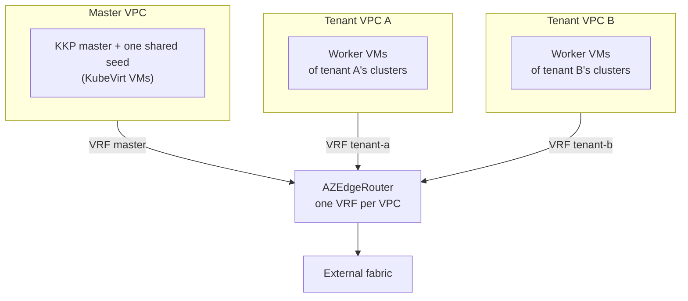

+++
title = "KKP Multi-Tenant"
date = 2026-09-08T00:00:00+00:00
weight = 20
draft = true
+++

This page shows how the [AZ Edge Router](../../az-edge-router/) fits into a platform that hosts
**Kubermatic Kubernetes Platform (KKP)** for several tenants on one Kubermatic Virtualization
cluster. Only the router's role is described here.

{}
Setting up KKP, KubeLB, their certificates and DNS, and the iBGP sessions of in-VPC speakers is
**out of scope**. See the
[KKP KubeVirt provider documentation](/kubermatic/main/architecture/supported-providers/kubevirt/)
and the [KubeLB documentation](/kubelb/main/) for those. This page covers the network the router
provides underneath them.
{}

## Layout

| VPC | Holds |
|---|---|
| **master VPC** | the KKP master, and **one seed shared by every tenant** that runs the tenants' control planes as pods |
| **tenant VPC** | one per tenant: the worker-node VMs of that tenant's clusters, with no control-plane pods and no seed |

## The router's role

| Role | Detail |
|---|---|
| **Seed-to-worker path** | a tenant's control plane runs in the master VPC, its workers in the tenant VPC. That traffic is carried **by the edge router between the two VRFs** and never goes out over the external fabric. The seed gets one VRF-scoped transit NIC per tenant, and never reaches a tenant over another tenant's NIC. |
| **Egress** | each VPC reaches the outside through its own VRF; see [Egress control](../../az-edge-router/egress-control/) |
| **Service advertisement** | in-VPC speakers advertise a published address into the VPC's VRF; the router re-advertises it to the fabric. A published service terminates in the VPC that owns it and **never transits the master VPC**. The router's accept-list for that VPC bounds what can be published. See [Virtual-IP plane](../../az-edge-router/virtual-ip-plane/) |
| **Platform API access** | components in the master VPC reach the platform's Kubernetes API through an in-VPC API server proxy that the router carries and masquerades. This is the single, deliberate exception to VPC isolation: one address, enabled for the master VPC only (`spec.apiServerViaInternalProxy`). |
| **Cross-region** | a tenant present in two regions is one VPC with a subnet per region; cross-region traffic stays in OVN unless routed over the fabric, see [Multi-region](../../az-edge-router/multi-region/) |

Isolation holds throughout: there is no data path between tenant VPCs, and no administrative
inbound path into any VPC. Everything a tenant consumes is a published service, reached through
the fabric and gated by the external firewall.

## Onboarding a tenant

1. Create the tenant VPC and its regional subnets.
2. Label the VPC (and annotate it for [`bgp-per-vrf`](../../az-edge-router/bgp-per-vrf/#attaching-a-vpcs-external-vlan),
   or give it a VNI for [EVPN](../../az-edge-router/evpn/)). The router picks it up with no edit.
3. Point the shared seed at the new VPC. The seed gains one more transit NIC into that VPC and
   widens no other tenant's reachability.

## Components

| Component | Role |
|---|---|
| Kube-OVN VPC | the isolation boundary; one logical router per VPC |
| [AZ Edge Router](../../az-edge-router/) | multi-homed FRR pod: one VRF per VPC, uplink to the fabric via BGP per VRF or EVPN |
| transit subnet | the point-to-point attachment between a VPC's logical router and the edge router |
| external fabric | the upstream peer: publishes services, and joins regions |
| API server proxy | republishes the platform API inside the master VPC, keeping its certificate valid |
| `SwitchLBRule` | the in-VPC L4 rule behind the API server proxy; attached only to the owning VPC's own logical router |
