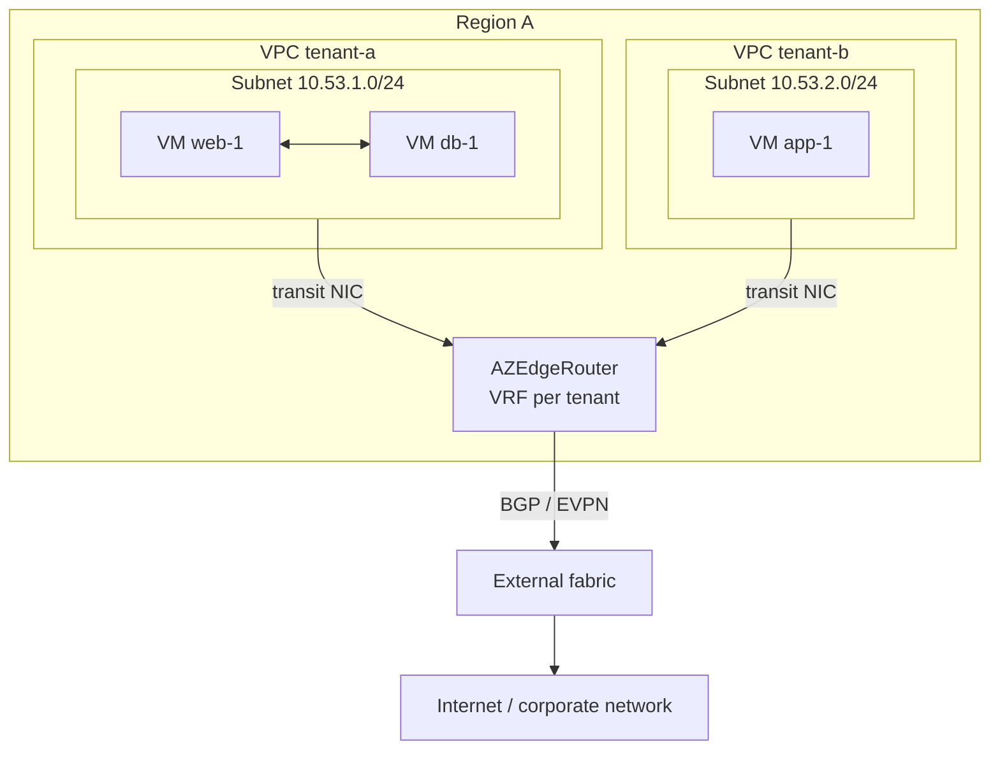

+++
title = "VM Workloads"
date = 2026-09-08T00:00:00+00:00
weight = 10
draft = true
+++

The simplest layout: tenants run ordinary virtual machines, each tenant in its own VPC, and one
[AZ Edge Router](../../az-edge-router/) per region provides everything that leaves a VPC.

## What the router does here

| Need | How the edge router meets it |
|---|---|
| VMs reach the internet | masquerades the VPC's egress to the router's address, or to a fixed address — see [Egress control](../../az-edge-router/egress-control/) |
| VMs are reachable from outside | advertises the VPC's subnets, or only a published virtual IP, to the fabric — see [Virtual-IP plane](../../az-edge-router/virtual-ip-plane/) |
| a tenant spans two regions | can carry the inter-region leg of that one VPC over the fabric (otherwise it stays in OVN) — see [Multi-region](../../az-edge-router/multi-region/) |
| tenants stay isolated | one VRF per VPC; overlapping address ranges are fine |

VM-to-VM traffic inside a VPC stays in OVN and never touches the router, unless
[cross-region routing over the fabric](../../az-edge-router/fabric-routing/) is enabled.

## Putting it together

1. Create one VPC per tenant and a subnet per region; label each subnet with
   `topology.kubernetes.io/zone`.
2. Deploy one `AZEdgeRouter` per region. Pick the [transit mode](../../az-edge-router/#two-transit-modes);
   a complete configuration is in the [`bgp-per-vrf`](../../az-edge-router/bgp-per-vrf/#complete-example)
   and [EVPN](../../az-edge-router/evpn/#complete-example-operator-managed-route-reflector) pages.
3. Label each VPC so the router [discovers it](../../az-edge-router/vpc-attachment/).
4. Attach VMs to the subnet as described in [VM Network Assignment](../../vms-networks-assignment/)
   and pin them to their subnet's region with [Regional Scheduling](../../regional-scheduling/).
