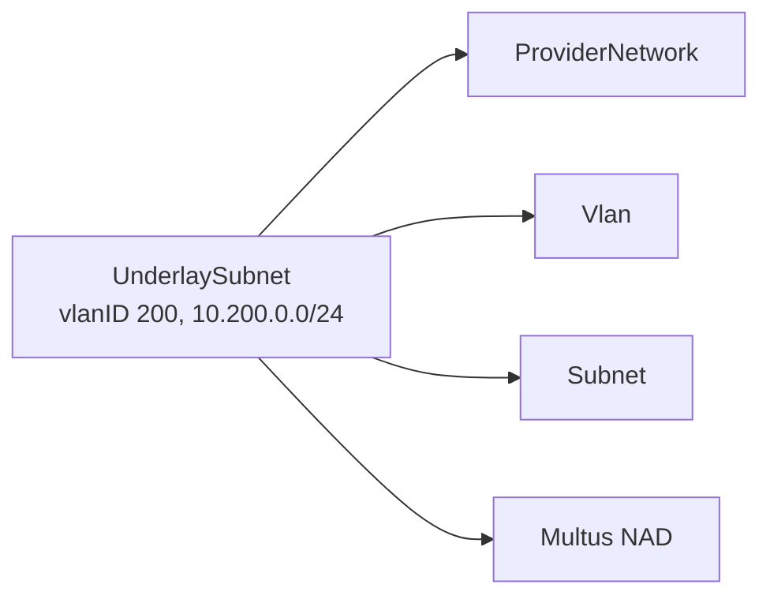

+++
title = "UnderlaySubnet"
date = 2026-09-08T00:00:00+00:00
weight = 10
+++

An `UnderlaySubnet` provisions a VLAN-backed network on the physical (underlay) network in one
step. It bundles a kube-ovn `ProviderNetwork` + `Vlan` + `Subnet` and the Multus
NetworkAttachmentDefinition (NAD) attached to them into a single CR, keyed by `spec.vlanID` and
`spec.cidrBlock`, so workloads can attach directly to an existing VLAN without creating those
four objects by hand.



```yaml
apiVersion: virtualization.k8c.io/v1alpha1
kind: UnderlaySubnet
metadata:
  name: tenant-a-ext
spec:
  cidrBlock: 10.200.0.0/24
  gateway: 10.200.0.254
  defaultInterface: eth1        # host NIC carrying the VLAN
  vlanID: 200
  excludeIPs:                   # statically addressed hosts, e.g. the gateway
    - 10.200.0.254
```

For the full field list, see the [CRD reference](../../../../../references/crds/).

## Things that are easy to get wrong

- **One VLAN ID per `ProviderNetwork`.** Each `UnderlaySubnet` creates a `Vlan` object scoped to
  its `ProviderNetwork`. Reusing a VLAN ID that's already owned by something else on that same
  `ProviderNetwork` — another `UnderlaySubnet`, or a hand-created `Vlan` — leaves one of the two in
  `CONFLICT`, and the network never gets a working logical switch on that VLAN. Repurposing an old
  VLAN means fully deleting whatever owned it first, not just adding the new object.
- **No built-in DHCP.** The `UnderlaySubnet` CRD has no DHCP field, and its generated kube-ovn
  `Subnet` comes up with DHCP off. Anything that needs to self-configure on the VLAN and has no
  annotation-based IPAM needs either `enableDHCP: true` patched onto the generated `Subnet`
  directly, or a static address of its own.
- **Static addresses need `excludeIPs`.** Anything statically addressed on the VLAN outside the
  `UnderlaySubnet`'s own IPAM should go in `spec.excludeIPs` — otherwise kube-ovn can hand that
  same address to a pod it manages, and that pod's CNI ADD fails with `IP address ... has already
  been used by host with MAC ...` until the conflict is cleared. The field is on the CRD, but the
  dashboard's `UnderlaySubnet` form doesn't expose it — set it via `kubectl`/YAML.

## Used by the AZ Edge Router

In `bgp-per-vrf` mode, the [AZ Edge Router](../../az-edge-router/bgp-per-vrf/#external-vlans-underlaysubnet)
uses an `UnderlaySubnet` as the external VLAN of a VPC.
