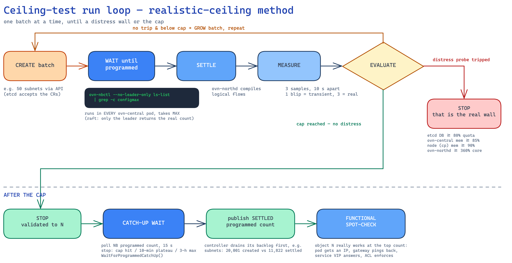

+++
title = "Ceiling Methodology"
date = 2026-06-11T09:00:00+02:00
weight = 1
+++

> **Ceiling of resource X = the maximum count that stays FULLY PROGRAMMED and
> VERIFIED-FUNCTIONAL at once.** We push X up to a configured cap that sits above the published
> vSphere comparable. The run stops cleanly at the cap, or earlier if a real distress signal
> trips. We report "validated to N — fully functional, no distress."

**Why this definition.** We previously published API-accepted counts. A controlled experiment on
2026-06-08 showed why that is deceptive: a run pushed **92,046 subnets** into the API, but the
network controller had **programmed only ~4,000** of them into OVN by the time it was cancelled —
a pod in subnet #5,000 would never have received an IP. The API accepts nearly unlimited objects;
only the *programmed* count describes capacity a customer can use. This mirrors the NSX/Broadcom
configuration-maximums methodology ("tested and supported", control-plane-bound numbers), so the
vSphere comparison reads like-for-like.

**The run loop:**

**Functional verification.** Per resource: a throwaway network-debug pod (`netshoot`) is dropped
into a freshly created subnet and must get an IP and ping its gateway; a service VIP must answer
with live backends; a firewall rule must demonstrably allow/deny. For datapath surety we
additionally spot-check with the kube-ovn `kubectl ko` plugin (`ko diagnose subnet <name>` creates
temporary pods and tests real connectivity; `ko trace` proves allow/drop decisions in the
datapath pipeline).

**Hygiene.** Full cleanup of all benchmark objects before every run, so one test's leftovers
cannot skew the next test's baseline. Programmed counts are read from the OVN northbound **leader**
(followers return 0 — an early parser read followers and reported zero).

## Distress probes

A run stops early only on **real** resource distress, sustained for **3 consecutive samples**
taken 10 s apart:

| Signal | Danger line | What exceeding it means |
|---|---|---|
| etcd DB size | 80 % of quota (2 GiB → ~1.6 GB) | at 100 % etcd goes read-only → cluster-wide write outage |
| ovn-central memory | 85 % of limit (16 GiB → ~14.4 GiB) | OOM-kill → southbound-DB replay → minutes of network-control-plane disruption |
| Control-plane node memory | 90 % | kernel OOM-kills pods (apiserver risk) |
| ovn-northd CPU | 360 % of one core, sustained | steady compile saturation — new-workload programming lags |
| Southbound-DB size | watched for services runs | OVN load-balancer table growth |
| ovs-ovn memory (worst pod per node) | 80 % of the DaemonSet limit (8 GiB → ~6.6 GiB) | each node's `ovn-controller` holds the whole cluster's logical-flow set; an OOM-kill here is a per-node datapath wall — no pod on that node can wire until it recovers |
| kube-ovn-controller restarts | ≥ 1 new restart above the run-start baseline | the controller crashed or was killed mid-run — programming throughput from that run is no longer trustworthy (a Go data race at 20 k security groups produced exactly this) |

Probe history that shaped this list:

- **Fail-closed redesign (2026-06-05).** Three probes were silently returning "healthy" because
  their metrics endpoints are unreachable on this kube-ovn build. A probe that cannot read now
  reports *unknown* and the run flags it — it never pretends health.
- **`kubeovn-reconcile-errors` removed (2026-06-08)** — false-tripped security groups at 125
  objects.
- **ovn-northd threshold recalibrated (2026-06-07)** from 120 % to 360 % sustained. The old line
  tripped on per-batch compile *spikes*, not steady saturation, and produced a campaign of
  false-low ceilings (e.g. "250 VPCs"); the recalibrated threshold passed 1,000+ VPCs with a flat
  settled curve.
- **Gaps closed (2026-06-12).** The two previously missing probes now exist and are active in
  every run: a per-node `ovs-ovn` **memory** probe (the ~7.7 k subnet OOM wall of 2026-06-09 was
  found manually; the probe watches the worst pod across all nodes against the DaemonSet limit)
  and a **kube-ovn-controller restart/crash** probe (the security-group data-race crash — 15
  restarts — was invisible to every earlier probe; this one baselines pre-existing restart counts
  at run start and trips on any new restart). Both were validated two ways before first use: a
  forced-trip run (threshold set below idle usage — the probe stopped the run with the worst pod
  named in the stop reason) and a full 10,000-VPC ceiling re-run where they sampled for the entire
  hour with zero false trips and an identical settled count to the pre-probe baseline run. Both
  thresholds are tunable per run via `distressOverrides` (`ovsOvnMemoryPct`,
  `kubeovnControllerRestarts`).
