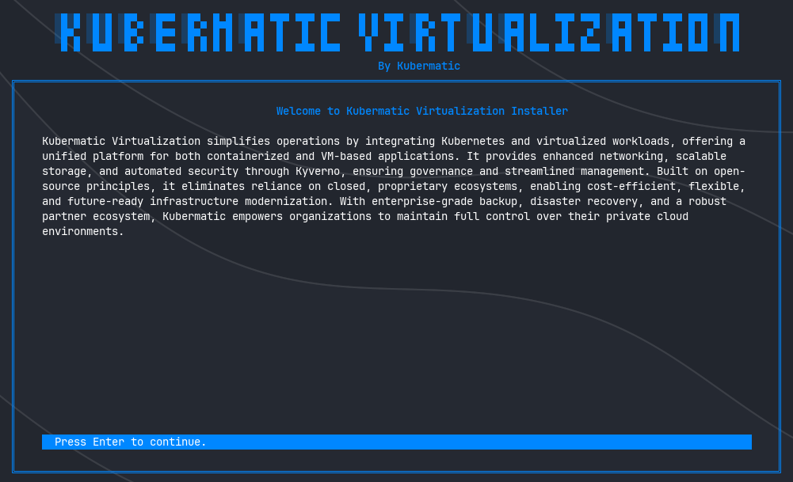
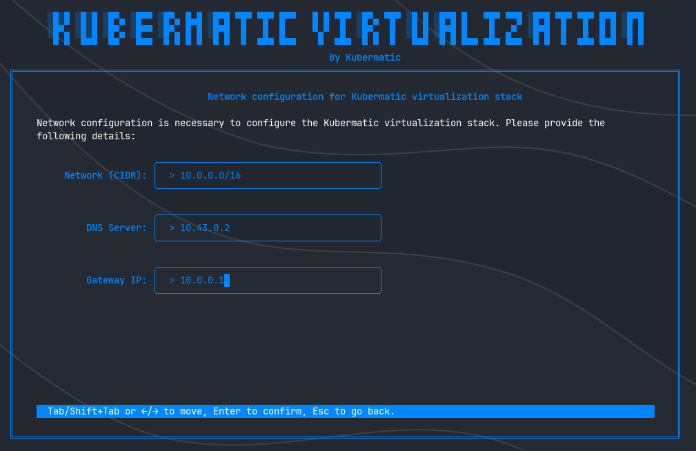
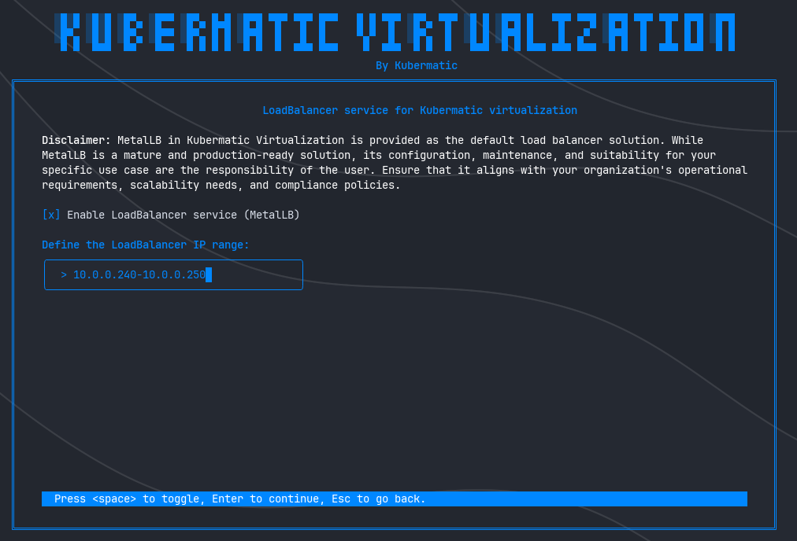
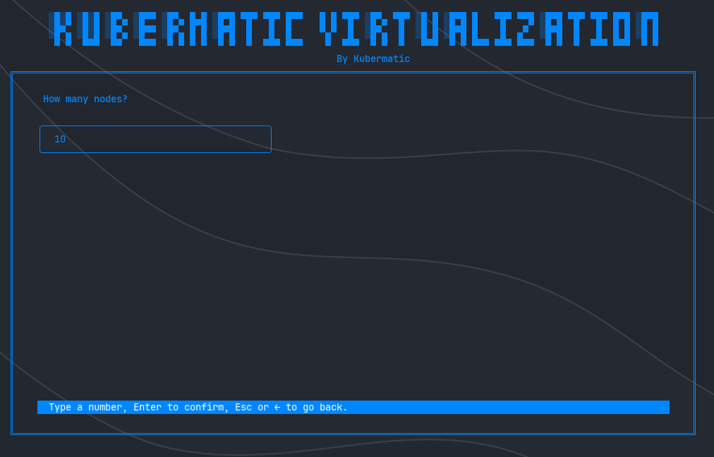
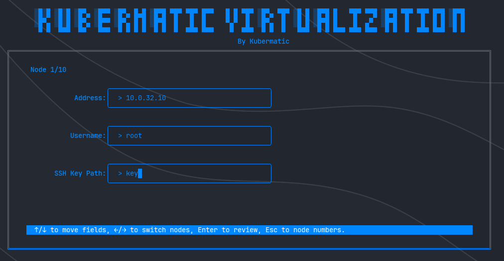
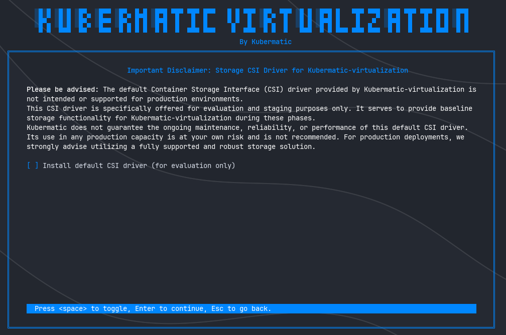
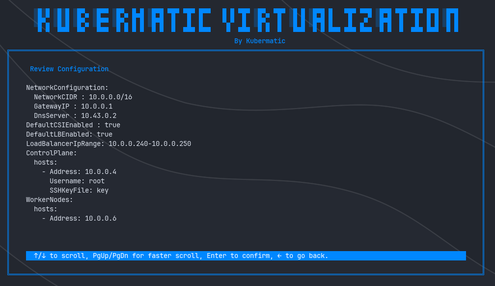

+++
title = "Installation"
date = 2025-06-28T12:07:15+02:00
weight = 15
+++

This chapter offers guidance on how to install Kubermatic Virtualization 

## Installing Kubermatic Virtualization with CLI 

Kubermatic Virtualization comes with an interactive installer, a CLI tool that helps administrators and users provision the entire platform easily. With just a few inputs, you can deploy and configure the stack in no time.

{}
To get started with the CLI, you will first need a Kubermatic Virtualization license. This license grants you access to the necessary resources, including the CLI. Please [contact sales](mailto:sales@kubermatic.com) to obtain your license.
{}

### **1. Navigating the Interactive CLI Installer**

The Kubermatic Virtualization installer is an interactive CLI that guides you through the installation process with clear instructions and prompts for user input. Each page contains important information and features a help bar at the bottom to assist with navigation.

---

### **2. Configuring the Network Stack**

One of the foundational steps in setting up Kubermatic Virtualization is defining the network configuration. This step ensures that your virtual machines and containerized workloads have a dedicated IP range to operate within, similar to a default VPC. Proper network configuration is crucial for seamless communication and resource management.

#### **Key Components**
- **Network (CIDR)**: Specify the IP range where your virtual machines and containerized workloads will reside. This defines the subnet they will use by default.
- **DNS Server**: Provide the DNS server address to ensure proper name resolution for your workloads.
- **Gateway IP**: Define the gateway IP to facilitate network routing and connectivity.

{}

When setting up your network configuration, it is crucial to provide a working DNS server address to ensure proper name resolution for your virtual machines and containerized workloads, as failure to do so can result in issues like the inability to resolve domain names, failed connections to external services, or degraded functionality due to unresolved hostnames; if you do not have an internal DNS server configured, it is recommended to use a public and trusted DNS server such as Google Public DNS (`8.8.8.8` or `8.8.4.4`) or Cloudflare DNS (`1.1.1.1` or `1.0.0.1`) to ensure smooth operation and connectivity for your workloads.

{}

---

### **3. Configuring the Load Balancer Service**

In this step, you can enable Kubermatic Virtualization’s default Load Balancer service, **MetalLB**, to simplify the creation of load balancers for your workloads. MetalLB is ideal for evaluation and non-production environments but should not be used in production scenarios without proper enterprise-grade solutions.

#### **Key Steps**
- **Enable MetalLB**: Toggle the checkbox to enable the Load Balancer service.
- **Define IP Range**: If MetalLB is enabled, specify the IP range that will be used by the Load Balancer.

{}

When defining the IP range for MetalLB, ensure that the range is valid and exists within your network infrastructure. This range will be reserved for load balancer IP addresses, and any misconfiguration or overlap with existing IPs can lead to network conflicts, service disruptions, or inaccessible workloads. Always verify the availability and uniqueness of the IP range before proceeding.

{}

By configuring these settings, you ensure that your workloads have access to a simple yet effective Load Balancer solution for testing and development purposes. Let’s move on to the next configuration step!

---

### **4. Configuring Nodes**

In this section, you will define the number of nodes in your Kubermatic Virtualization cluster and provide detailed information about each node, including their IP addresses, usernames, and SSH key paths. Accurate configuration is crucial for ensuring smooth communication and management of your cluster.

#### **Step 1: Specify the Number of Nodes**

The first step is to determine how many nodes you want in your cluster. This number will dictate the scale of your infrastructure and influence the subsequent configuration steps.

- **Input**: Enter the total number of nodes you plan to use.

#### **Step 2: Configure Each Node**

After specifying the number of nodes, you will be prompted to configure each node individually. For each node, you need to provide the following details:

1. **Node Address**: The IP address of the node.
2. **Username**: The username used to access the node via SSH.
3. **SSH Key Path**: The path to the SSH private key file used to authenticate with the node.

Repeat this process for each node until all nodes are configured.

#### **Why Accurate Configuration Matters**
- **Node Addresses**: Ensure that the IP addresses are correct and reachable within your network.
- **Usernames and SSH Keys**: Provide secure access to the nodes, enabling proper communication and management.

By carefully configuring the number of nodes and providing accurate details for each node, you lay the foundation for a robust and manageable Kubermatic Virtualization environment. Let’s proceed to the next configuration step!

---
### **5. Configuring the Storage CSI Driver**

In this step, you will decide whether to use the default Container Storage Interface (CSI) driver provided by Kubermatic Virtualization. The default CSI driver is designed for evaluation and staging environments and is not recommended for production use.

#### **Key Information**
- **Default CSI Driver**: The default CSI driver (e.g., Longhorn) is included for testing purposes only.
- **Purpose**: It provides baseline storage functionality during evaluation and staging phases.
- **Recommendation**: For production environments, it is strongly advised to use a fully supported and robust storage solution.

#### **Disclaimer**
Please be advised:
- The default CSI driver is **not intended or supported** for production environments.
- Its use in production is at your own risk and is not recommended.
- Kubermatic does not guarantee ongoing maintenance, reliability, or performance of the default CSI driver.

By making an informed decision about the CSI driver, you ensure that your environment is configured appropriately for its intended purpose—whether it’s for testing or production. Let’s proceed to the next configuration step!

---

### **6. Reviewing the Configuration**

Before proceeding with the installation, it is crucial to review the full configuration to ensure all settings are correct. This step allows you to verify details such as Control Plane nodes, Worker nodes, network configurations, and other critical parameters. Once confirmed, the installation process will begin, and you will not be able to go back.

#### **Key Information**
- **Purpose**: Confirm that all configurations are accurate before applying them.
- **Irreversible Step**: After confirming this page, the installation process will start, and changes cannot be made without restarting the entire setup.

#### **What to Review**
- **Cluster Nodes**:
   - Addresses
   - Usernames
   - SSH key file paths

- **Other Configurations**:
   - Network settings (CIDR, DNS server, Gateway IP)
   - Load Balancer configuration (if enabled)
   - Storage CSI driver selection

{}
**No Going Back**: Once you confirm this page, the installation process will begin, and you cannot modify the configuration without starting over.
By carefully reviewing the configuration, you ensure that your Kubermatic Virtualization environment is set up correctly from the start. Proceed with confidence when you’re ready!

{}

---

### **8. Finalizing the Installation**

Once you confirm the configuration, the installation process will begin, and you’ll be able to monitor its progress in real-time through detailed logs displayed on the screen. These logs provide transparency into each step of the deployment, ensuring you stay informed throughout the process.

#### **What Happens During Installation**
- **Progress Monitoring**: Watch as the installer provisions the Control Plane, Worker Nodes, and other components.
- **Health Checks**: After deployment, the installer verifies that all parts of the stack are healthy and running as expected.
- **Completion**: Upon successful installation, the installer will generate and display the **kubeconfig** file for your Kubermatic Virtualization cluster.

### **Congratulations!**
Your Kubermatic Virtualization environment is now up and running. With the kubeconfig file in hand, you’re ready to start managing your cluster and deploying workloads. Enjoy the power of seamless virtualization on Kubernetes! 🚀