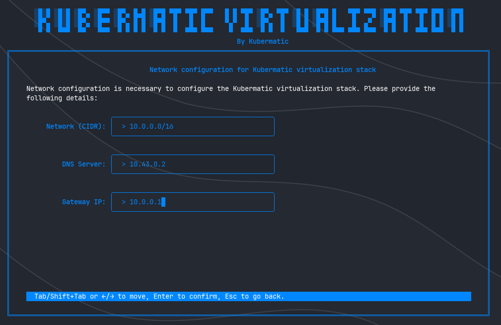
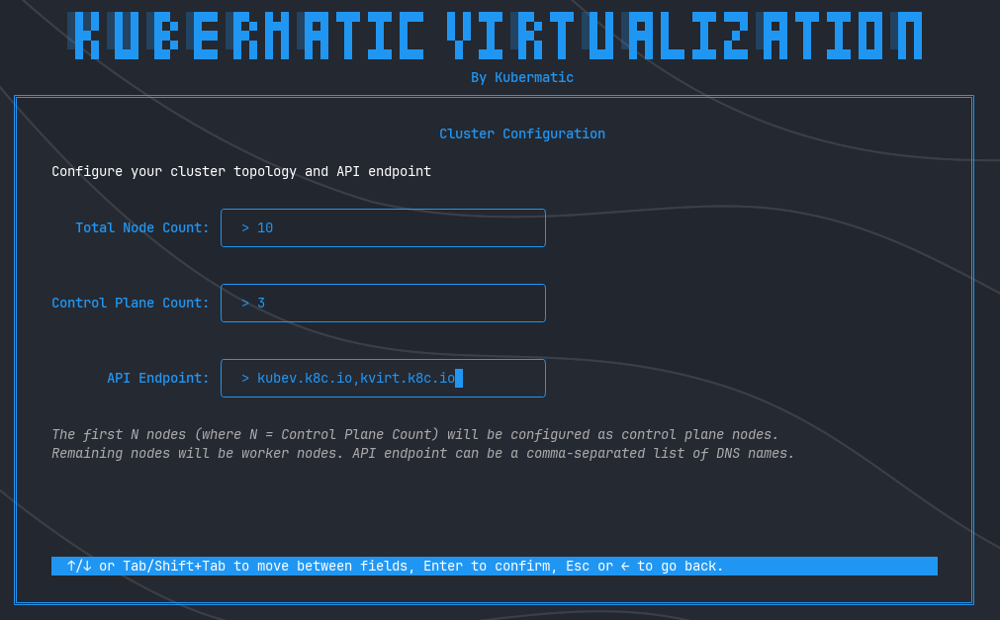
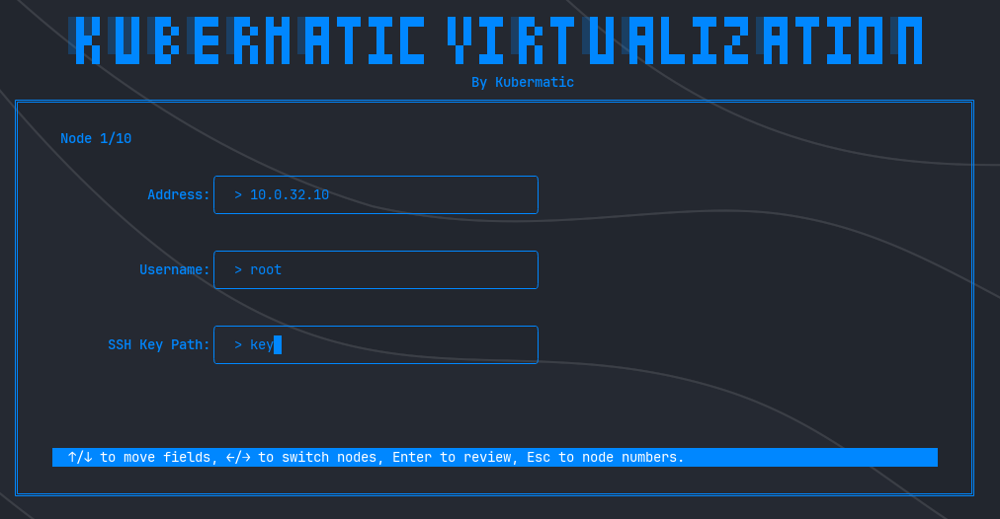
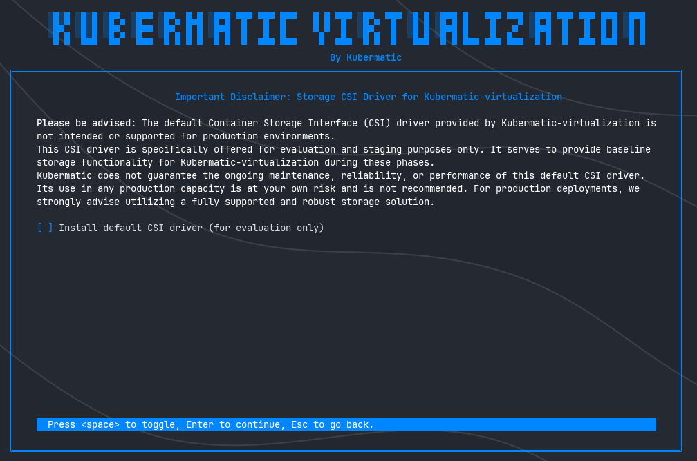

+++
title = "Interactive Installation (TUI)"
date = 2025-06-28T12:07:15+02:00
weight = 15
+++

This guide provides comprehensive instructions for deploying Kubermatic Virtualization using the interactive command-line interface (CLI) installer.

## Overview

The Kubermatic Virtualization interactive installer streamlines the deployment process through a guided, step-by-step approach. The installer automates cluster provisioning while ensuring proper configuration of critical components including networking, load balancing, storage, and node management.

### Prerequisites

Before beginning the installation process, ensure you have:

- A valid Kubermatic Virtualization license (contact [sales@kubermatic.com](mailto:sales@kubermatic.com) to obtain licensing)
- Administrative access to target infrastructure
- SSH connectivity to all designated cluster nodes
- Network planning documentation including CIDR blocks and IP ranges

## Installation Procedure

### Step 1: Launch the Interactive Installer

Running `kubermatic-virtualization install` command launches an interactive terminal-based interface that walks you through the configuration with contextual help and clear navigation at every step.

Navigate through the installer using the controls displayed in the bottom help bar. Each screen provides detailed explanations and validation for required inputs.

---

### Step 2: Network Configuration

Network configuration establishes the fundamental connectivity layer for your virtualization environment. This defines the IP address space for virtual machines and containerized workloads, analogous to a Virtual Private Cloud (VPC) in cloud environments.

#### Configuration Parameters

**Network CIDR**  
Define the IP address range and subnet mask for the virtualization network. This CIDR block determines the available address space for all workloads within the cluster.

**DNS Server**  
Specify the DNS resolver address for name resolution services. This is critical for service discovery and external connectivity.

**Gateway IP**  
Configure the default gateway address for network routing and external communication.

#### DNS Configuration Requirements

Proper DNS configuration is essential for cluster functionality. DNS failures can result in:

- Inability to resolve internal and external domain names
- Failed connections to external services and APIs
- Degraded cluster functionality due to unresolved service endpoints

**Recommended DNS Providers:**

For environments without dedicated internal DNS infrastructure, utilize public DNS services:

- **Google Public DNS:** `8.8.8.8`, `8.8.4.4`
- **Cloudflare DNS:** `1.1.1.1`, `1.0.0.1`

For production deployments, enterprise DNS infrastructure is strongly recommended to ensure compliance, performance, and security requirements are met.

---

### Step 3: Load Balancer Configuration

This step configures the cluster's load balancing capabilities. Kubermatic Virtualization includes MetalLB as the default load balancer implementation, providing Layer 2 and BGP-based load balancing for Kubernetes services in bare-metal and on-premises environments.

#### Configuration Options

**Enable MetalLB**  
Select this option to deploy the integrated MetalLB load balancer service.

**IP Address Range**  
When MetalLB is enabled, specify a dedicated IP range for load balancer address allocation. This range must be:

- Routable within your network infrastructure
- Non-overlapping with existing IP allocations
- Sufficient in size to accommodate anticipated load balancer services

#### Production Considerations

Misconfigured IP ranges can cause:

- Network routing conflicts
- Service inaccessibility
- Cluster-wide connectivity issues

Always validate IP range availability with your network operations team before proceeding.

---

### Step 4: Node Configuration

Node configuration defines the cluster topology and establishes secure communication channels between the installer and target infrastructure.

#### Phase 1: Define Cluster Size

Specify the following node configuration for your Kubermatic Virtualization cluster:

* **Total number of nodes**: The overall number of machines in the cluster.
* **Number of control plane nodes**: The number of dedicated master (control plane) nodes. This value must be less than or equal to the total number of nodes and is typically set to 1, 3, or 5 for high availability.
* **API endpoint(s) (optional)**: A comma-separated list of external IP addresses or hostnames that clients will use to access the Kubernetes API server. If omitted, the installer will derive a suitable endpoint automatically.

This configuration directly influences your cluster’s capacity, fault tolerance, and scalability.

#### Phase 2: Configure Individual Nodes

For each node in the cluster, provide the following authentication and connectivity information:

**Node IP Address**  
The static IPv4 address assigned to the node. Ensure addresses are:

- Statically assigned (DHCP reservations are not recommended)
- Accessible from the installer host
- Within the appropriate network segment

**SSH Username**  
The username with administrative privileges on the target node. This account must have:

- Sudo or root access
- Permission to install software packages
- Ability to modify system configurations

**SSH Private Key Path**  
The filesystem path to the SSH private key file used for passwordless authentication. Verify:

- Key file permissions are set correctly (typically `600`)
- The corresponding public key is authorized on the target node
- The key is not passphrase-protected (or ensure proper passphrase handling)

Repeat this configuration for each cluster node. Accurate configuration is critical for successful cluster deployment and ongoing management operations.

---

### Step 5: Storage Configuration

Select the Container Storage Interface (CSI) driver for persistent volume management within the cluster.

#### Default CSI Driver

Kubermatic Virtualization includes a default CSI implementation (such as Longhorn), which is perfect for your first installation or initial setup, ideal for getting your stack up and running quickly in a test environment. This driver provides:

- Basic persistent volume functionality
- Snapshot capabilities
- Volume replication for development/testing scenarios

#### Production Storage Requirements

**Critical Advisory:** The default CSI driver is explicitly not designed, tested, or supported for production workloads. Production environments require enterprise storage solutions that provide:

- High availability and fault tolerance
- Performance guarantees and SLAs
- Backup and disaster recovery integration
- Vendor support and maintenance commitments
- Compliance with organizational data protection policies

Use of the default CSI driver in production is undertaken at your own risk. Kubermatic provides no warranty, support, or maintenance commitments for the default storage implementation in production scenarios.

Consult with your storage team to integrate appropriate enterprise storage solutions for production deployments.

---

### Step 6: Configuration Review and Validation

This critical checkpoint allows verification of all configuration parameters before initiating the installation process. Once confirmed, the installation begins and configuration changes require restarting the entire process.

#### Review Checklist

Carefully verify the following configuration elements:

**Cluster Topology**
- Node IP addresses and hostnames
- SSH usernames and key file paths
- Node role assignments (control plane, worker)

**Network Settings**
- CIDR block allocation
- DNS server addresses
- Gateway configuration

**Service Configuration**
- Load balancer status and IP range
- Storage CSI driver selection

**Security Credentials**
- SSH key file accessibility
- Node access permissions

#### Final Confirmation

**Warning:** This is the last opportunity to modify configuration parameters. After confirming this screen, the installation process begins immediately and cannot be interrupted without losing progress. Any configuration changes require restarting the installation from the beginning.

Proceed only when you have thoroughly validated all settings and obtained necessary approvals from your infrastructure and security teams.

---

### Step 7: Installation Execution and Monitoring

Upon confirmation, the installer initiates the deployment process and provides real-time progress monitoring through detailed logging output.

#### Installation Phases

The installer executes the following operations:

1. **Infrastructure Validation**: Verifies connectivity and prerequisites on all target nodes
2. **Component Deployment**: Installs control plane services and worker node components
3. **Network Provisioning**: Configures pod networking and service mesh
4. **Storage Initialization**: Deploys and configures the selected CSI driver
5. **Load Balancer Setup**: Provisions MetalLB services (if enabled)
6. **Health Validation**: Executes comprehensive health checks across all cluster components

#### Progress Monitoring

Real-time log output displays:
- Current installation phase and progress
- Component initialization status
- Warning and error messages (if any)
- Estimated time to completion

#### Installation Completion

Upon successful deployment, the installer:

1. Performs final health validation across all cluster services
2. Generates the cluster `kubeconfig` file
3. Displays connection credentials and access instructions

### Post-Installation

Your Kubermatic Virtualization cluster is now operational. The generated `kubeconfig` file enables cluster management through `kubectl` and other Kubernetes tooling.

#### Next Steps

- Verify cluster health: `kubectl get nodes`
- Review deployed components: `kubectl get pods --all-namespaces`
- Configure RBAC policies for cluster access
- Integrate with organizational monitoring and logging systems
- Proceed with workload deployment as per your operational requirements

For additional configuration options, troubleshooting guidance, and operational best practices, consult the complete [Kubermatic Virtualization documentation](https://docs.kubermatic.com/kubermatic-virtualization/).

---

## Support and Resources

For technical assistance, licensing inquiries, or enterprise support options, contact Kubermatic at [sales@kubermatic.com](mailto:sales@kubermatic.com).