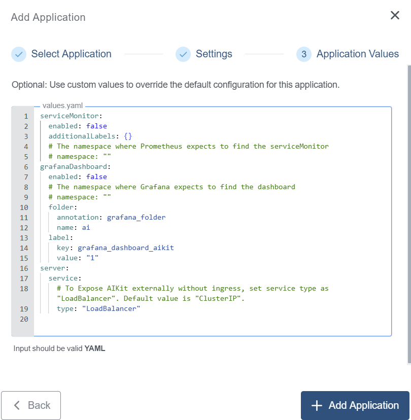

+++
title = "AIKit Application"
linkTitle = "AIKit"
enterprise = true
date = 2025-02-07T12:38:00+02:00
weight = 1

+++

# What is AIKit?
AIKit is a comprehensive platform to quickly get started to host, deploy, build and fine-tune large language models (LLMs).

AIKit offers two main capabilities:

**Inference**: AIKit uses LocalAI, which supports a wide range of inference capabilities and formats. LocalAI provides a drop-in replacement REST API that is OpenAI API compatible, so you can use any OpenAI API compatible client, such as Kubectl AI, Chatbot-UI and many more, to send requests to open LLMs!

**Fine Tuning**: AIKit offers an extensible fine tuning interface. It supports Unsloth for fast, memory efficient, and easy fine-tuning experience.

For more information on AIKit, please refer to the [official documentation](https://sozercan.github.io/aikit/docs/)

# How to deploy?

AIKit is available as part of the KKP's default application catalog. 
It can be deployed to the user cluster either during the cluster creation or after the cluster is ready (existing cluster) from the Applications tab via UI.

* Select the AIKit application from the Application Catalog.

* Under the Settings section, select and provide appropriate details and click `-> Next` button.

* Under the Application values page section, check the default values and add values if any required to be configured explicitly. Finally click on the `+ Add Application` to deploy the AIKit application to the user cluster.

To further configure the values.yaml, find more information on the [AIKit Helm Chart Configuration](https://github.com/sozercan/aikit/tree/main/charts/aikit)