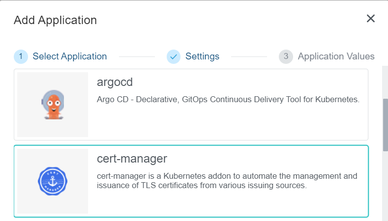
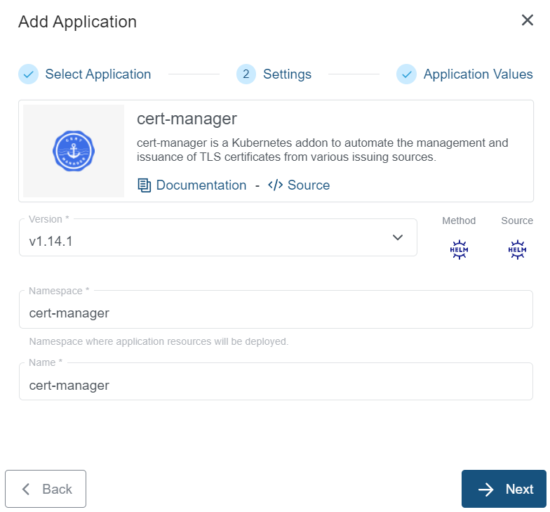
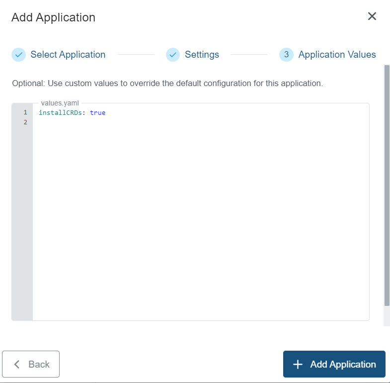

+++
title = "cert-manager Application"
linkTitle = "cert-manager"
enterprise = true
date = 2024-01-16T12:57:00+02:00
weight = 3

+++

# What is cert-manager?

cert-manager adds certificates and certificate issuers as resource types in Kubernetes clusters. It simplifies the process of obtaining, renewing and using certificates.

It can issue certificates from a variety of supported sources, including Let's Encrypt, HashiCorp Vault, and Venafi as well as private PKI.

It will ensure certificates are valid and up to date, and attempt to renew certificates at a configured time before expiry.

For more information on the cert-manager, please refer to the [official documentation](https://cert-manager.io/)

# How to deploy?

cert-manager is available as part of the KKP's default application catalog.
It can be deployed to the user cluster either during the cluster creation or after the cluster is ready(existing cluster) from the Applications tab via UI.

* Select the cert-manager application from the Application Catalog.

* Under the Settings section, select and provide appropriate details and clck `-> Next` button.

* Under the Application values page section, check the default values and add values if any required to be configured explicitly. Finally click on the `+ Add Application` to deploy the cert-manager application to the user cluster.

A full list of available Helm values is on [cert-manager's ArtifactHub page](https://artifacthub.io/packages/helm/cert-manager/cert-manager).
