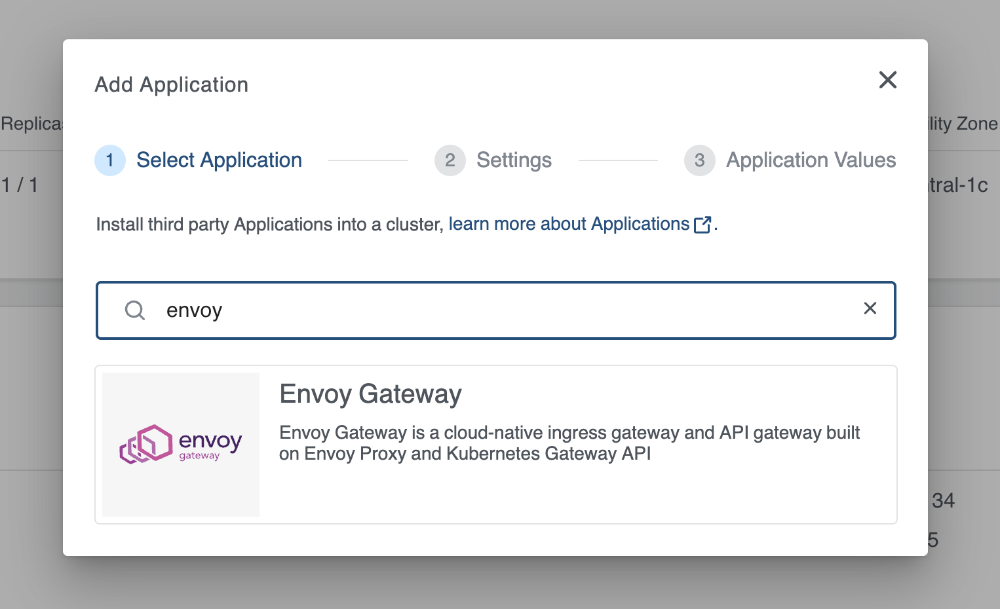
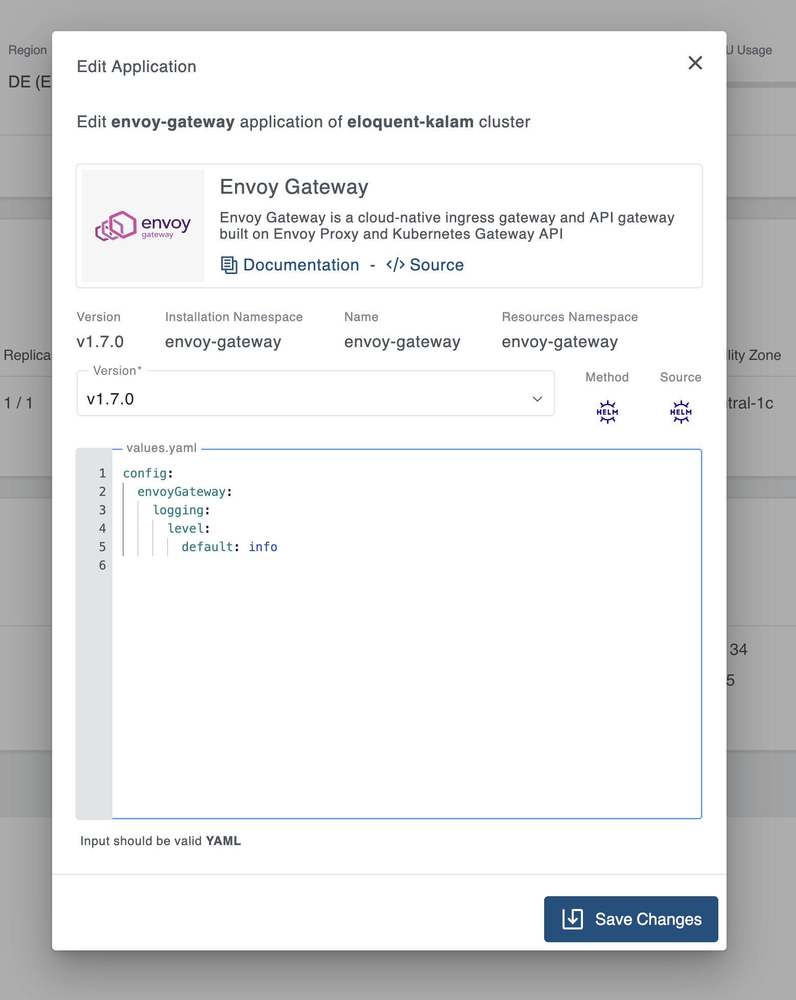

+++
title = "Envoy Gateway Application"
linkTitle = "Envoy Gateway"
enterprise = true
date = 2025-02-20T12:00:00+02:00
weight = 6

+++

## What is Envoy Gateway?

Envoy Gateway is a cloud-native ingress gateway and API gateway built on Envoy Proxy and Kubernetes Gateway API. It provides a robust, feature-rich solution for managing external access to services in a Kubernetes cluster.

Envoy Gateway implements the Kubernetes Gateway API specification, offering advanced traffic management capabilities including HTTP routing, TLS termination, load balancing, and more. It serves as a modern replacement for traditional ingress controllers.

For more information on Envoy Gateway, please refer to the [official documentation](https://gateway.envoyproxy.io/)

## How to deploy?

Envoy Gateway is available as part of the KKP's default application catalog.
It can be deployed to the user cluster either during the cluster creation or after the cluster is ready(existing cluster) from the Applications tab via UI.

- Select the Envoy Gateway application from the Application Catalog.

- Under the Settings section, select and provide appropriate details and click `-> Next` button.

- Under the Application values page section, check the default values and add values if any required to be configured explicitly. Finally click on the `+ Add Application` to deploy the Envoy Gateway application to the user cluster.

To further configure the values.yaml, find more information on the [Envoy Gateway Helm chart documentation](https://github.com/envoyproxy/gateway/tree/main/charts/gateway-helm).
