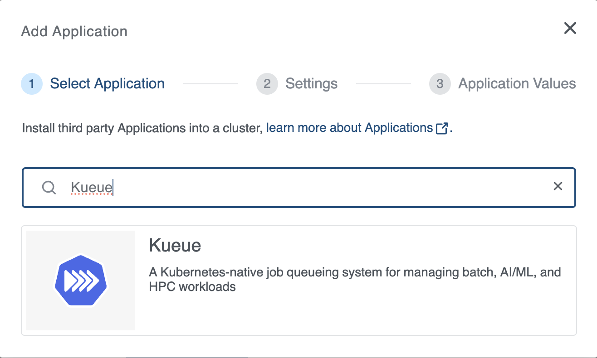
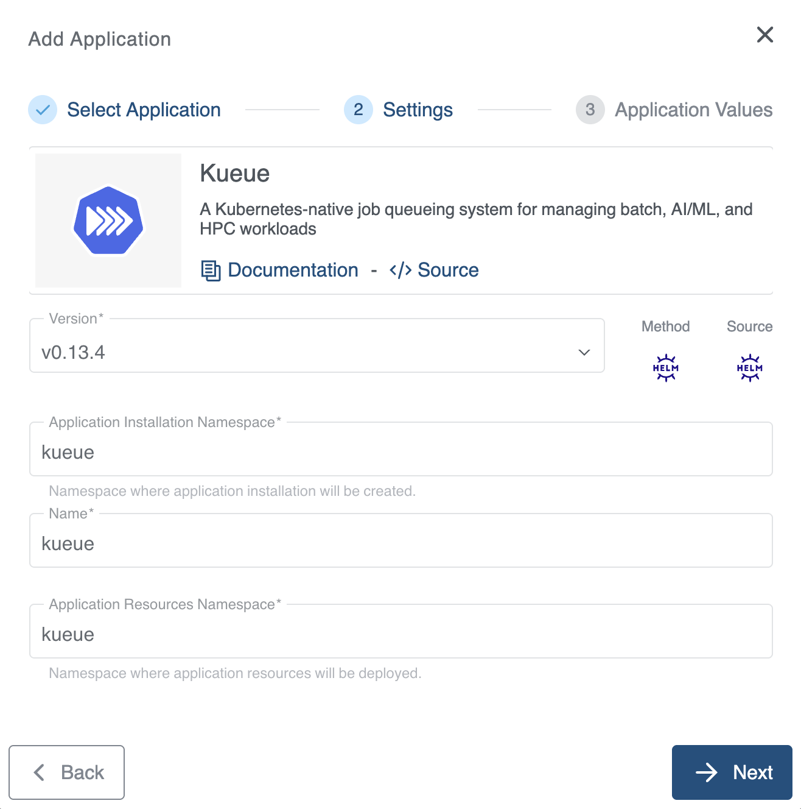
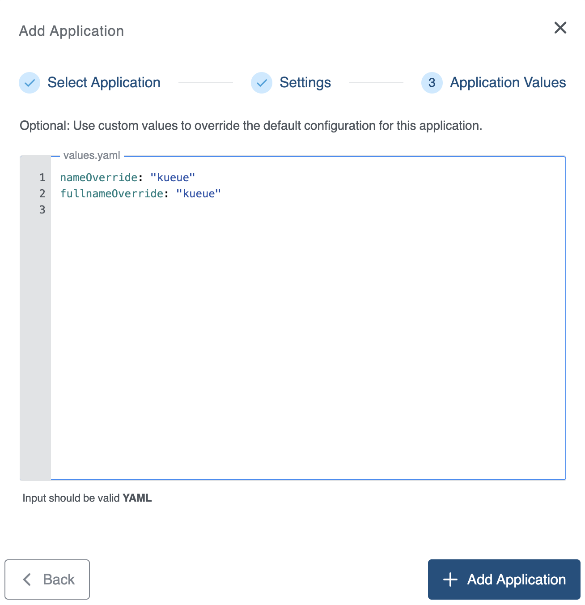

+++
title = "Kueue Application"
linkTitle = "Kueue"
enterprise = true
date = 2025-09-19
weight = 10
+++

# What is Kueue?

Kueue is a cloud-native job queueing system for batch, HPC, AI/ML, and similar applications in a Kubernetes cluster.

For more information on the Kueue, please refer to the [official documentation](https://kueue.sigs.k8s.io/).

# How to deploy?

Kueue is available as part of the KKP's default application catalog.
It can be deployed to the user cluster either during the cluster creation or after the cluster is ready(existing cluster) from the Applications tab via UI.

* Select the Kueue application from the Application Catalog.

* Under the Settings section, select and provide appropriate details and click `-> Next` button.

* Under the Application values page section, check the default values and add values if any required to be configured explicitly. Finally click on the `+ Add Application` to deploy the Kueue application to the user cluster.

To further configure the values.yaml, find more information on the [official documentation](https://kueue.sigs.k8s.io/)

Due to current limitations of the Kueue Helm Chart, Kueue ApplicationDefinition only supports versions v0.13.4 and newer.
Additionally, please ensure that the `nameOverride` and `fullnameOverride` configurations are specified within the values.yaml file.
