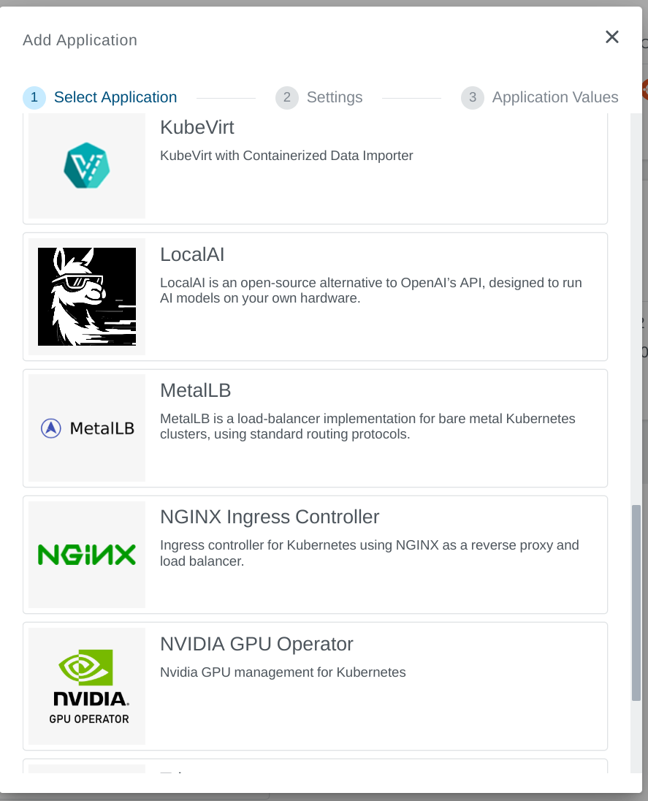
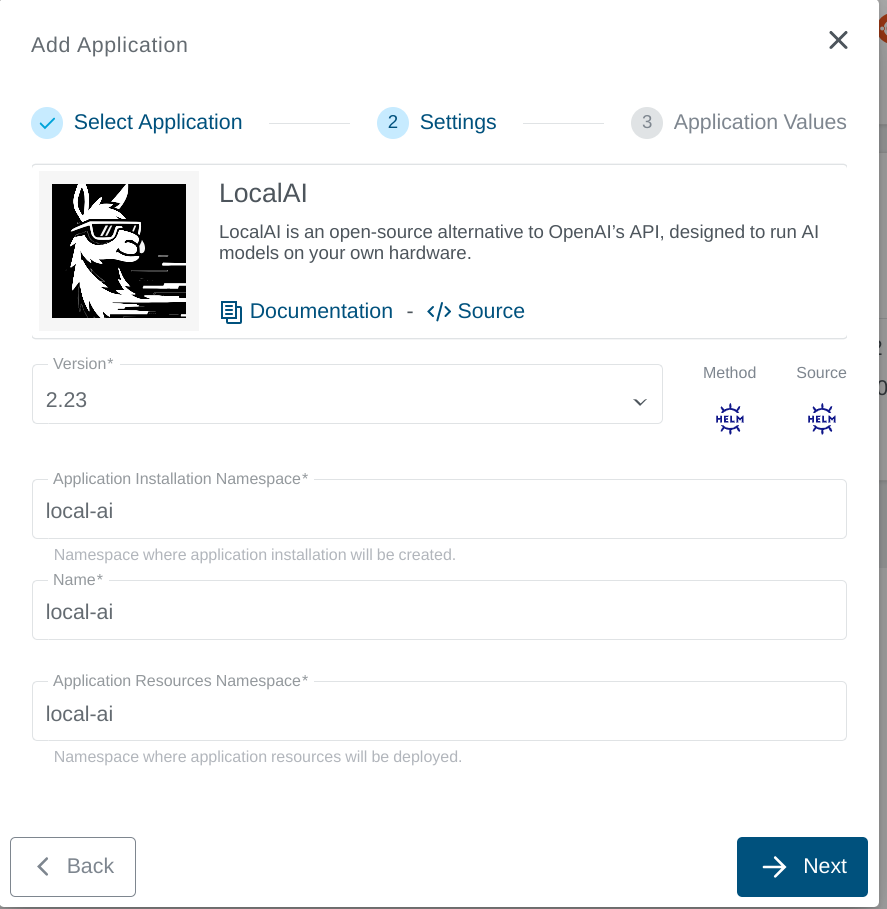
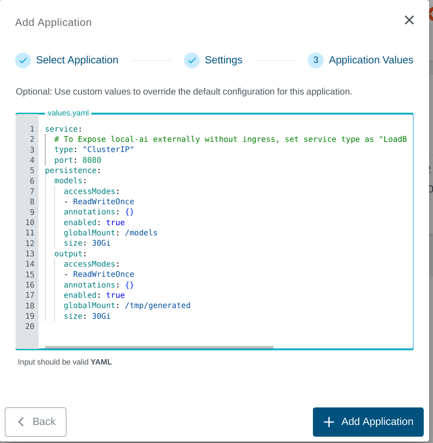

+++
title = "Local AI Application"
linkTitle = "Local AI"
enterprise = true
date = 2025-02-07T12:38:00+02:00
weight = 1

+++

## What is Local AI?

LocalAI is an open-source alternative to OpenAI’s API, designed to run AI models on your own hardware. LocalAI act as a drop-in replacement REST API that's compatible with OpenAI (Elevenlabs, Anthropic... ) API specifications for local AI inferencing. It allows you to run LLMs, generate images, audio (and not only) locally or on-prem with consumer grade hardware, supporting multiple model families.

## How to deploy?

Local AI is available as part of the KKP's default application catalog. It can be deployed to the user cluster either during the cluster creation or after the cluster is ready (existing cluster) from the Applications tab via UI.

* Select the Local AI application from the Application Catalog.

* Under the Settings section, select and provide appropriate details and click `-> Next` button.

* Under the Application values page section, check the default values and add values if any required to be configured explicitly. Finally click on the `+ Add Application` to deploy the LocalAI application to the user cluster.

To further configure the `values.yaml`, find more information on the [LocalAI Helm Chart Configuration](https://github.com/go-skynet/helm-charts/tree/main/charts/local-ai)

Please take care about the size of the default models which can vary from the default configuration.