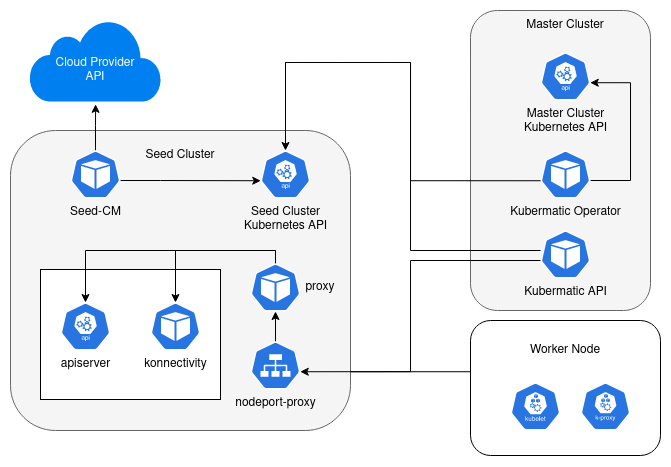

+++
title = "Reference Setup"
date = 2024-11-11T00:00:00
weight = 1
+++

# **Documentation**

To respect the latest requirements and instructions, follow the installation as described at:

<https://docs.kubermatic.com/kubermatic/main/installation> 

Any further environment-specific details, will get described later in this document.

# **Infrastructure Requirements**

To ensure the quality of service, Kubermatic Kubernetes Platform (KKP) relies on the basic availability and setup of the dependent infrastructure as defined at [KKP Documentation > Requirements](https://docs.kubermatic.com/kubermatic/main/architecture/requirements/cluster-requirements/).

For the installation of KPP ensure that the mentioned requirements are fulfilled. Besides of the mentioned minimal requirements, it’s recommended that the provided infrastructure ensures the following criteria for the managing master/seed cluster as well as for the user clusters:

- High Availability setup of the public or/and private cloud infrastructure: 

  - Multiple availability zones are accessible, routed, and compatible with Kubernetes as described in the multi-zone best practices: [Kubernetes - Running in multiple zones](https://kubernetes.io/docs/setup/best-practices/multiple-zones/) 

  - The target network for master and user clusters follows the recommended Kubernetes networking concept: [Kubernetes Cluster Networking](https://kubernetes.io/docs/concepts/cluster-administration/networking/) 

  - The infrastructure is compatible with the recommended architecture of the HA Kubernetes cluster as defined at [kubernetes.io > High-Availability Kubernetes Masters](https://kubernetes.io/docs/setup/production-environment/tools/kubeadm/ha-topology/https://kubernetes.io/docs/tasks/administer-cluster/highly-available-master/) 

- A storage layer needs to be provided, that is compatible with Kubernetes and provides a storage class, see [Kubernetes - Storage Classes](https://kubernetes.io/docs/concepts/storage/storage-classes/), and respects the customer's expected requirements on data reliability and backup.

- A Kubernetes-compatible load balancing solution is available at the target cloud environment(s), see [Kubernetes - Services, Load Balancing, and Networking](https://kubernetes.io/docs/concepts/services-networking/service/#loadbalancer) - An adjustable public or private DNS service is usable.

#  **Access to Installer**

The installation is done by deploying a set of Helm charts or Kubermatic Operator. For downloading CE/EE Version you can visit since 2.14: <https://github.com/kubermatic/kubermatic/releases>

For the EE version, an additional image pull secret is required. Your Kubermatic contact person will provide this for the installation.

# **Config Repo**

- To ensure the configuration is stored and properly versioned, we would recommend setting up a proper git repository, to which Kubermatic engineers and the customer have access.

- To store the secrets, we would recommend some secret key stores like [Vault](https://www.vaultproject.io/).

  - An alternative could be the usage of [git-crypt](https://github.com/AGWA/git-crypt)

# **Access to Target Environment**

To install KKP in customer environment, we need access from external to (direct or by a bastion host):

- Linux env with SSH

- Target cloud provider APIs

- Load Balancer (API Servers, Ingress, etc.), Master / Worker Nodes network for testing and potential debugging 

- Access to potentially used DNS servers and firewall settings

- Install helper tools: kubeone, git, kubectl, helm, terraform - optional: yq, jq, [fubectl](https://github.com/kubermatic/fubectl)

A helpful shortcut, could be our KubeOne tooling container, which contains all the needed tooling:

<https://github.com/kubermatic/community-components/tree/master/container/kubeone-tool-container> 

# **Load Balancer**

Kubermatic exposes an NGINX server and user clusters API servers via Load Balancers. Therefore, KKP is using the native Kubernetes Service Type `LoadBalancer` implementation. More details about the different expose points you find at the next chapter “DHCP/Networking”

\

## **On-Premise/Bring-your-own Load Balancer**

If no external load balancer is provided for the setup, we recommend [KubeLB](https://docs.kubermatic.com/kubelb) for Multi-Tenant Load Balancing. 

As frontend IPAM solution and IP announcement, KubeLB could use on-premise non-multi-tenant LB implementations like Cilium or MetalLB in Layer 2 ARP or BGP mode. (Also commercial Kubernetes conform implementation like [F5 Big IP](https://clouddocs.f5.com/products/connectors/k8s-bigip-ctlr/v1.0/#) would work). KubeLB will add the multi-tenant plus central DNS, Certificate and Ingress management. KubeLB deliver for each Kubernetes Cluster one tenant separated authentication token, what get used via the so called [KubeLB CCM](https://docs.kubermatic.com/kubelb/v1.1/installation/tenant-cluster/), what automatically get configured for KKP clusters. The KubeLB CCM is then handling service and node announcements.  For Setups where multi-tenant automated LB is not required, direct [MetalLB](https://metallb.universe.tf/) or [Cilium](https://docs.cilium.io/) setups could be used as well. For the best performance and stability of the platform, we recommend to talk with our consultants to advise you what is the best fit for your environment.

### **Layer 2 ARP Announcement**

If you choose to use Layer 2 ARP Announcements, you require a set of usable IP addresses in the target Layer 2 network segment, that are not managed by DHCP (at least 2 for Kubermatic itself + your workload load balancers). For deeper information about how Layer 2 ARP works, take a look at [MetalLB in layer 2 mode](https://metallb.universe.tf/concepts/layer2/).  The role of this LB is different from e.g. go-between, which is only used to access the master clusters API server. Some Reference for the settings you find at:

- [MetalLB L2 Configuration](https://metallb.universe.tf/configuration/_advanced_l2_configuration/)

- [Cilium L2 Announcements](https://docs.cilium.io/en/stable/network/l2-announcements/)

### **BGP Advertisement (recommended)**

It’s recommend to use BGP for IP announcement as BGP can handle failovers and Kubernetes node updates way better as the L2 Announcement. Also, BGP supports dedicated load balancing hashing algorithm, for more information see [MetalLB in BGP Mode](https://metallb.io/concepts/bgp/).  A load balancer in BGP mode advertises each allocated IP to the configured peers with no additional BGP attributes. The peer router(s) will receive one /32 route for each service IP, with the BGP localpref set to zero and no BGP communities. For the different configurations take a look at the reference settings at:

- [MetalLB BGP Configuration](https://metallb.io/configuration/_advanced_bgp_configuration/)

- [Cilium BGP Control Plane](https://docs.cilium.io/en/stable/network/bgp-control-plane/bgp-control-plane/) 

## **Public/Private Cloud Load Balancers**

For other Load Balancer scenarios we strongly recommend to use cloud environment specific Load Balancer that comes with the dedicated cloud CCM. These native cloud LBs can interact dynamically with Kubernetes to provide updates for service type Load Balancer or Ingress objects. For more detail see [Kubernetes - Services, Load Balancing, and Networking](https://kubernetes.io/docs/concepts/services-networking/service/#loadbalancer).

\

# **DHCP / Networking**

- DHCP for worker nodes is required

- Verify what Load Balancing Options your target environment has, see section “Load Balancing”

- Direct Node-to-Node communication is needed on each cluster level (master/seed and user cluster level) based on generic Kubernetes requirements: [Kubernetes - Cluster Networking](https://kubernetes.io/docs/concepts/cluster-administration/networking/)

- Check the more detailed requirements of the network at:

  - [****KKP Documentation > Concepts > Networking****](https://docs.kubermatic.com/kubermatic/main/architecture/concept/kkp-concepts/networking)

  - [****KKP Documentation > Networking > Control Plane Expose Strategy****](https://docs.kubermatic.com/kubermatic/main/tutorials-howtos/networking/expose-strategies/)

\

# **DNS**

Kubermatic requires DNS entries for NGINX and user clusters API servers. These have to be created after the Load Balancers, see [EE Installation - DNS Records](https://docs.kubermatic.com/kubermatic/main/installation/install-kkp-ce/#dns-records) and [EE Seed Cluster - DNS Records](https://docs.kubermatic.com/kubermatic/main/installation/install-kkp-ce/add-seed-cluster-ce/#dns-record).

The NGINX server provides access to the Kubermatic UI and the logging and monitoring services (Prometheus, Kibana, etc.). It requires a DNS name like `kubermatic.example.com` and `\*.kubermatic.example.com` (e.g. for `prometheus.kubermatic.example.com`). Optional: if no wildcard DNS can be provided, dedicated DNS entries per exposed Service need to get entered (\~5 services).

To access a user cluster via API, a wildcard DNS entry per seed cluster (in your case the master cluster is the only seed) has to be provided. E.g., `\*.cluster-1.kubermatic.example.com`. User clusters would be accessible via `\[cluster-id].cluster-1.kubermatic.example.com`. 

Optional: An alternative expose strategy Load Balancer can be chosen. Therefore, every control plane gets its own Load Balancer with an external IP, see [Expose Strategy](https://docs.kubermatic.com/kubermatic/main/tutorials-howtos/networking/expose-strategies/).

## **Example of DNS Entries for KKP Services**

Root DNS-Zone: `\*.kubermatic.example.com`

| **Service**                                    | **DNS**                                                                                                                                                                                                                                                                            | **IP**                                                                                         |
| ---------------------------------------------- | ---------------------------------------------------------------------------------------------------------------------------------------------------------------------------------------------------------------------------------------------------------------------------------- | ---------------------------------------------------------------------------------------------- |
| KKP UI                                         | kubermatic.example.com                                                                                                                                                                                                                                                             | Ingress IP: dynamic or static (virtual IP)                                                     |
| Management Monitoring / Logging UI - Grafana   | grafana.kubermatic.example.com                                                                                                                                                                                                                                                     | Ingress IP: dynamic or static (virtual IP)                                                     |
| Management Monitoring - Prometheus             | prometheus.kubermatic.example.com                                                                                                                                                                                                                                                  | Ingress IP: dynamic or static (virtual IP)                                                     |
| Management Monitoring - Alertmanager           | alertmanager.kubermatic.example.com                                                                                                                                                                                                                                                | Ingress IP: dynamic or static (virtual IP)                                                     |
| Seed cluster - Kubernetes API Expose Service   | Expose Strategy - **NodePort**: \*.seed.kubermatic.example.comExpose Strategy - **LoadBalancer**: NONE(will be done by independent IPs per cluster see - [expose strategy LoadBalancer](https://docs.kubermatic.com/kubermatic/master/concepts/expose-strategy/expose_strategy/)). | NodePort Proxy: dynamic or static (virtual IP)**Or** one virtual IP per user cluster in a CIDR |
| User Cluster Monitoring - Alertmanager         | alertmanager.seed.kubermatic.example.com                                                                                                                                                                                                                                           | Ingress IP: dynamic or static (virtual IP)                                                     |
| User Cluster Monitoring / Logging UI - Grafana | grafana.seed.kubermatic.example.com                                                                                                                                                                                                                                                | Ingress IP: dynamic or static (virtual IP)                                                     |

It is also possible to use [external-dns](https://github.com/kubernetes-sigs/external-dns) as automatic way to manage DNS Entries for you. Therefor checkout if your DNS provider is supported: [external-dns provider](https://github.com/kubernetes-sigs/external-dns?tab=readme-ov-file#externaldns)

# **Certificates**

Certificates are required for the Kubermatic UI, as well as logging and monitoring services. As automatic creation via cert-manager is not an option, please create in advance. According to the DNS example, this has to be valid for `kubermatic.example.com`, `prometheus.kubermatic.example.com`, `grafana.kubermatic.example.com`, `alertmanager.kubermatic.example.com`, and `kibana.kubermatic.example.com`. Our Helm charts require a single certificate file to be valid for these names (wildcard is fine). Any supported cert-manager automation (like e.g. let’s encrypt) could get configured out of the box, so please check  [Issuer Configuration - cert-manager Documentation](https://cert-manager.io/docs/configuration/) 

If you provide your own CA bundle with all intermediate certificates, cert-manager and KKP is also supporting this use case, please check for this: [KKP Documentation > Configuration > Custom Certificate](https://docs.kubermatic.com/kubermatic/main/tutorials-howtos/kkp-configuration/custom-certificates). Using a let's encrypt certificate would be preferable over your own CA, as this would not require trusting your CA in ALL pods that talk to DEX. For private networks, you can request let’s encrypt certs via DNS-based validation, see [cert-manager - Configuring DNS01 Challenge Provider](https://cert-manager.io/docs/configuration/acme/dns01/).

Alternatively, you could also create self-signed certificates and add the CA to our own CA-Distribution mechanism, but ensure that all clients need to have the CA included. For KKP follow as well [KKP Documentation > Configuration > Custom Certificate](https://docs.kubermatic.com/kubermatic/main/tutorials-howtos/kkp-configuration/custom-certificates).

#  **Authentication**

We use DEX for authentication. Pick a supported connector from [Dex Connectors](https://github.com/dexidp/dex#connectors) and make the necessary preparations. Static users or your Github Org / Gitlab instance might be an option as well. 

Alternatively, KKP supports “bring-your-own ID provider” like e.g. [Keycloak](https://www.keycloak.org/) as well, see [OIDC Provider Configuration](https://docs.kubermatic.com/kubermatic/main/tutorials-howtos/oidc-provider-configuration/).

# **Proxy / Internet-Access**

For provisioning the master/seed/user clusters with their components, KKP needs access to a few resources, see [Proxy Whitelisting](https://docs.kubermatic.com/kubermatic/main/tutorials-howtos/networking/proxy-whitelisting/). Please ensure that you have internet access at your provided platform or any proxy, which allows the download of the mentioned artifacts.

An alternative approach that requires a few more configurations, therefore take a look at the [Offline Mode](https://docs.kubermatic.com/kubermatic/main/installation/offline-mode/). As an EE Version customer, your technical consultant or our service Desk could also give you access to our [Offline & Air Gapped Setup Guide](https://docs.google.com/document/d/16wznO5yhQpldzyqYr2T32yN8T9BiOUJ61z5IZjv5wzA/edit#heading=h.gjdgxs) with [Reference Setup](https://github.com/kubermatic/offline-reference-setup).

# **Provisioning of seed cluster**

We recommend setting up your seed cluster based on KubeOne. Please check the prerequisites therefore as well [KubeOne Prerequisites](https://docs.kubermatic.com/kubeone/main/architecture/).

# **Storage Classes**

As a reference for compatible Kubernetes storage classes, see [Kubernetes - Storage Classes](https://kubernetes.io/docs/concepts/storage/storage-classes/). For KKP two different storage classes are needed and provided by the target infrastructure:

## **Kubermatic storage class kubermatic-fast**

The configuration of the storage class kubermatic-fast is needed to cater for the creation of persistent volume claims (PVCs) for some of the components of Kubermatic. The following components need a persistent storage class assigned:

- User cluster ETCD statefulset

- Prometheus/Thanos/Cortex and Alertmanager (monitoring)

- Loki (logging)

It’s highly recommended to use SSD-based volumes, as etcd is very sensitive to slow disk I/O. If your cluster already provides a default SSD-based storage class, you can copy and re-create it as kubermatic-fast.

## **Cluster Backup Storage Class kubermatic-backup**

The storage class kubermatic-backup is an optional requirement, as it also could use the default storage class of a cluster, but customers need to be aware that backup may not need as high quality storage as other KKP backups.

Anyhow Kubermatic performs regular backups of user clusters by snapshotting the etcd of each cluster. By default, these backups are stored in any S3-compatible storage location. At on-prem setups (or non-available S3 storage possibility), KKP will use an in-cluster S3 location provided by a PVC. The in-cluster storage is provided by [Minio S3 instance](https://docs.min.io/) via a helm chart.

It’s recommended to configure a class explicitly for Minio. Minio does not need kubermatic-fast because it does not require SSD speeds. A larger HDD is preferred. The availability and data protection of the backup is dependent on the chosen storage location and setting.

# **Performance Requirements**

Besides the already above-mentioned performance requirements, any additional performance of the system is highly dependent on the provided infrastructure performance. Therefore, Kubermatic KKP and KubeOne get checked on every release to be fully compliant with the [Certified Kubernetes Conformance Program](https://github.com/cncf/k8s-conformance#certified-kubernetes-conformance-program). To ensure the performance criteria also at the target infrastructure, the conformance test can be executed. Potential performance bottlenecks will be analyzed and need to be addressed individually together with the responsible infrastructure provider.

## **Performance for etcd(s)**

The performance of the underlying storage is highly important to host Kubernetes in a production-grade way. As etcd is the only persistence layer where Kubernetes stores its state, it’s very important to ensure the etcd performance - see [Performance | etcd](https://etcd.io/docs/v3.5/op-guide/performance/). Summarizing the etcd storage requirements, in this example for a medium-sized KKP setup, the environment needs to  be fulfilled on the following levels:

- Master / Seed Cluster etcd’s: Virtual or Bare Metal host file system (mostly KubeOne master nodes):\
  [Hardware recommendations | etcd - Medium Cluster](https://etcd.io/docs/v3.5/op-guide/hardware/#medium-cluster)

- Seed Cluster storage class kubermatic-fast:\
  [Hardware recommendations | etcd - Large Cluster](https://etcd.io/docs/v3.5/op-guide/hardware/#large-cluster)

Note: If user clusters get very very big or has a lot of operators, it could be required to tune individual control planes of user cluster during operation. You will see Alerts in the MLA Stack, this could get tuned via [KKP - Scaling the control plane.](https://docs.kubermatic.com/kubermatic/main/tutorials-howtos/operation/control-plane/scaling-the-control-plane/)

## **MLA Performance Requirements**

In addition to the storage performance, there is a requirement for MLA to tune based on the workload as it is described at [KKP - User Cluster MLA - Admin Guide](https://docs.kubermatic.com/kubermatic/main/tutorials-howtos/monitoring-logging-alerting/user-cluster/admin-guide/) with a link to [cortex planning](https://cortexmetrics.io/docs/guides/capacity-planning/).

For a production environment, it's recommended to do some performance and capacity estimation for the production workload. As this individual on amount of logs and metrics of your users, it requires some optimization based on the expected workload, as also described in the documentation.

Anyhow, a performant backend storage is required to handle MLA and etcd workloads. If storage can't handle all workloads, we recommend splitting up the storage backend of etcds and MLA workload. To ensure the stability of the MLA stack, we recommend using dedicated MLA Nodes if possible (delegation via node affinity) and regularly optimizing the MLA options as they may change over time. This task is considered to be part of a continuous operation, see [KKP - User Cluster MLA - Operation](https://docs.kubermatic.com/kubermatic/main/tutorials-howtos/monitoring-logging-alerting/user-cluster/admin-guide/#operation). 

# **Additional Requirements per Cloud Provider**

For each cloud provider, the requirements may change. Within <https://docs.kubermatic.com/> the latest requirements are updated for each release (p.e. <https://docs.kubermatic.com/kubermatic/main/installation/install-kkp-ce/add-seed-cluster-ce>). The requirements mentioned in the documentation apply for the Managed Service as well. 

For each Cloud Provider there will be some requirements and Todo’s (e.g. creating an Account with correct permissions) what you find at <https://docs.kubermatic.com/kubermatic/main/architecture/supported-providers/> 

In the following section, you find SOME examples of setups, that don’t need to match 100% to your use case. Please reach out to your technical contact person at Kubermatic, who could provide you with a tailored technical solution for your use case.

## **Cloud Provider vSphere**

### **Access to vSphere API**

For dynamic provisioning of nodes, Kubermatic needs access to the vSphere API endpoint and depending on the chosen permission concept at least the following permissions:

- [Doc Permissions](https://docs.kubermatic.com/kubermatic/main/architecture/supported-providers/vsphere/)

- Alternative for managing via terraform [kubermatic-vsphere-permissions-terraform](https://github.com/kubermatic-labs/kubermatic-vsphere-permissions-terraform) (outdated)

### **User Cluster / Network separation**

The separation and multi-tenancy of KKP and their created user clusters is highly dependent on the provided network and user management of the vSphere Infrastructure. Due to the individuality of such setups, it’s recommended to create a dedicated concept per installation together with Kubermatic engineering team. Please provide at least one separate network CIDR and technical vSphere user for the management components and each expected tenant.

### **Routable virtual IPs (for metalLB)**

To set up Kubermatic behind [MetalLB](https://metallb.universe.tf/), we need a few routable address ranges. This could be sliced into one CIDR. The CIDR should be routed to the target network, but not used for machines.

### **Master/Seed Cluster(s)**

CIDR for

- Ingress: 1 IP

- Node-Port-Proxy: 1 IP (if expose strategy NodePort or Tunneling), multiple IPs at expose strategy LoadBalancer (for each cluster one IP)

### **User Cluster**

Depending on the concept of how the application workload gets exposed, IPs need to be reserved for exposing the workload at the user cluster side. As a recommendation, at least one virtual IP need is needed e.g. the [MetalLB user cluster addon](https://docs.kubermatic.com/kubermatic/main/tutorials-howtos/networking/ipam/#metallb-addon-integration) + NGINX ingress. Note: during the provisioning of the user cluster, the IP must be entered for the MetalLB addon or you need to configure a [Multi-Cluster IPAM Pool](https://docs.kubermatic.com/kubermatic/main/tutorials-howtos/networking/ipam/). On manual IP configuration, the user must ensure that there will be no IP conflict.

### **(if no DHCP) Machine CIDRs**

Depending on the target network setup, we need ranges for:

- 3 master nodes of the seed cluster

- n worker nodes of seed cluster

- user clusters without DCHP are not supported as KKP uses highly dynamical provisioning

To provide a “cloud native” experience to the end user of KKP, we recommend the usage of a DHCP at all layers, otherwise, the management layer (master/seed cluster) could not breathe with the autoscaler. 

### **Integration**

#### Option I - Workers only in vSphere Datacenter(s)

- Worker Node IP Range needs to reach seed cluster user control plan endpoints, see [Expose Strategy](https://docs.kubermatic.com/kubermatic/main/tutorials-howtos/networking/expose-strategies/)

- KKP will create then a secure GRPC tunnel via [Kubernetes Konnectivity proxy](https://docs.kubermatic.com/kubermatic/main/architecture/concept/kkp-concepts/networking/#kubernetes-konnectivity-proxy) between the worker and control plan, so no way back connection needs to be opened

- Existing seed cluster(s) need to reach their attached vSphere API endpoints for the machine provisioning, see [Seed - Datacenter vSphere Spec](https://docs.kubermatic.com/kubermatic/main/references/crds/#datacenterspecvsphere)

- Application traffic get exposed at vSphere workers by the chosen ingress/load balancing solution

#### Option II - Additional Seed at vSphere Datacenter(s)

- Seed Cluster Kubernetes API endpoint at the dedicated vSphere seed cluster (provisioned by e.g. KubeOne) needs to be reachable

  - Kubernetes API Load Balancer https endpoint

- Worker Node IP Range needs to talk to additional node-port load balancer endpoint at the seed cluster, see [Expose Strategy](https://docs.kubermatic.com/kubermatic/main/tutorials-howtos/networking/expose-strategies/)

  - Additional DNS entry for dedicated vSphere datacenter seed(s) is needed, e.g. \*.vsphere-dc-seed.kubermatic.example.com

  - Workers <-> Seed communication is in the data center network only

- User Cluster users need to reach the vSphere datacenter seed cluster load balancer node-port service:

  - IP/DNS of node-port LoadBalancer

- Application traffic get exposed at vSphere workers by the chosen ingress/load balancing solution

- Host for Seed provisioning (KubeOne setup) needs to reach the base network (e.g. a bastion host) by SSH

## **Cloud Provider OpenStack**

### **Access to OpenStack API**

For dynamic provisioning of nodes, Kubermatic needs access to the OpenStack API endpoint with the following information (or OpenStack RC File) for operator access at the dedicated Open Stack Projects:

- Authentication URL

- Project Name

- Project ID

- User / Password or Application Credential ID / Secret

### **User Cluster / Network separation**

The separation and multi-tenancy of KKP and their created user clusters is dependent on the provided network and project structure. Due to the individuality of such setups, it’s recommended to create a dedicated concept per installation together with Kubermatic engineering team. Please provide at least for the management components and for each expected tenant:

- Target region and availability zones

- Domain

- Separate network with

  - Network Name

  - CIDR (DHCP Range if possible)

  - Subnet ID 

  - Floating IP Pool

- DNS Server IPs

- OpenStack user or application credentials

### **Further Information**

Additional information about the usage of Open Stack within in Kubernetes you could find at:

- Kubermatic 

  - Seed Datacenter Options for OpenStack:\
    <https://docs.kubermatic.com/kubermatic/main/references/crds/#datacenterspecopenstack> 

  - Preset Configuration:\
    <https://docs.kubermatic.com/kubermatic/main/tutorials-howtos/administration/admin-panel/presets-management/> 

- KubeOne 

  - <https://docs.kubermatic.com/kubeone/main/tutorials/creating-clusters/> 

  - OpenStack Terraform variables: <https://github.com/kubermatic/kubeone/blob/main/examples/terraform/openstack/variables.tf> 

- Kubernetes General

  - OpenStack Cloud Controller Manager: <https://github.com/kubernetes/cloud-provider-openstack/blob/master/docs/openstack-cloud-controller-manager/using-openstack-cloud-controller-manager.md> 

### **Integration**

#### Option I - Workers only in OpenStack Datacenter(s)

- Worker Node IP Range needs to reach seed cluster user control plan endpoints, see [Expose Strategy](https://docs.kubermatic.com/kubermatic/main/tutorials-howtos/networking/expose-strategies/)

- KKP will create then a secure GRPC tunnel via [Kubernetes Konnectivity proxy](https://docs.kubermatic.com/kubermatic/main/architecture/concept/kkp-concepts/networking/#kubernetes-konnectivity-proxy) between the worker and control plan, so no way back connection needs to be opened

- Existing seed cluster(s) need to reach their attached OpenStack API endpoints for the machine provisioning, see [Seed - Datacenter OpenStack Spec](https://docs.kubermatic.com/kubermatic/main/references/crds/#datacenterspecopenstack)

- Application traffic get exposed at OpenStack workers by the chosen ingress/load balancing solution

#### Option II - Additional Seed at vSphere Datacenter(s)

- Seed Cluster Kubernetes API endpoint at the dedicated OpenStack seed cluster (provisioned by e.g.[ KubeOne](https://docs.kubermatic.com/kubeone/main/tutorials/creating-clusters/)) needs to be reachable

  - Kubernetes API Load Balancer https endpoint

- Worker Node IP Range needs to talk to additional node-port load balancer endpoint at the seed cluster, see [Expose Strategy](https://docs.kubermatic.com/kubermatic/main/tutorials-howtos/networking/expose-strategies/)

  - Additional DNS entry for dedicated OpenStack datacenter seed(s) is needed, e.g. \*.opestack-dc-seed.kubermatic.example.com

  - Workers <-> Seed communication is in the data center network only

- User Cluster users need to reach the OpenStack datacenter seed cluster load balancer node-port service:

  - IP/DNS of node-port LoadBalancer

- Application traffic get exposed at OpenStack workers by the chosen ingress/load balancing solution

- Host for Seed provisioning (KubeOne setup) needs to reach the base network (e.g. a bastion host) by SSH

## **Additional Requirements for Azure**

### **General Requirements**

Azure Account described at [Kubermatic Docs > Supported Provider > Azure](https://docs.kubermatic.com/kubermatic/main/architecture/supported-providers/azure/)

- Azure Network

  - Regions (which are routed and accessible over Kubermatic)

  - VNet with attached Subnet(s) with a big enough IP range for all planned VMs (management or/and user cluster machines):

    - for a small setup,/24 should be enough

    - subnet with expected routing needs to be set as well

- Azure Cloud Resources managed by [Kubernetes Azure Cloud Provider](https://github.com/kubernetes-sigs/cloud-provider-azure)

  - Kubermatic will create on-demand resources like volumes and LoadBalancer, and ensure the permissions and infrastructure setup are enabled for it, see [SIG - Cloud Provider Azure - Permissions](https://kubernetes-sigs.github.io/cloud-provider-azure/topics/azure-permissions/)

  - Also, ensure that API is reachable from the seed and worker node network, see [Azure API Docs](https://docs.microsoft.com/en-us/rest/api/azure/)

- Azure Machine Deployment information:

  - If additional Seed at Azure is planned

    - Ensure for the KubeOne seed the initial terraform module can be applied [Azure Quickstart Terraform configs](https://github.com/kubermatic/kubeone/tree/master/examples/terraform/azure) by using the [Terraform Azure Provider](https://www.terraform.io/docs/providers/azurerm/index.html)

  - Ensure to share the needed parameter of [Azure - machine.spec.providerConfig.cloudProviderSpec](https://github.com/kubermatic/machine-controller/blob/main/docs/cloud-provider.md#azure)

### **Integration Option to existing KKP**

#### Option I - Workers only in Azure

- Worker Node IP Range needs to reach seed cluster user control plan endpoints, see [Expose Strategy](https://docs.kubermatic.com/kubermatic/main/tutorials-howtos/networking/expose-strategies/)

- KKP will create then a secure GRPC tunnel via [Kubernetes Konnectivity proxy](https://docs.kubermatic.com/kubermatic/main/architecture/concept/kkp-concepts/networking/#kubernetes-konnectivity-proxy) between worker and control plan, so no way back connection needs to be opened

- Existing seed cluster(s) need to reach [Azure API endpoints](https://docs.microsoft.com/en-us/rest/api/azure/) for the machine provisioning

- Application traffic gets exposed at Azure workers (Cloud LBs)

#### Option II - Additional Seed at Azure + Worker in Azure

- The Seed Cluster Kubernetes API endpoint at Azure needs to be reachable

  - Azure Load Balancer with https endpoint, managed Azure CCM

- Worker Node IP Range needs to talk to an additional node-port load balancer at the Azure seed cluster

  - Additional DNS entry for Azure seed is needed e.g. \*.azure-seed.kubermatic.example.com

  - Workers <-> Seed communication is in the Azure Net only

- User Cluster users need to reach the Azure seed cluster load balancer node-port

  - IP/DNS of Azure LoadBalancer

- Application traffic gets exposed to Azure workers (Cloud LBs managed by Azure CCM)

- Host for Seed provisioning (KubeOne setup) needs to reach the Azure network VMs by SSH
