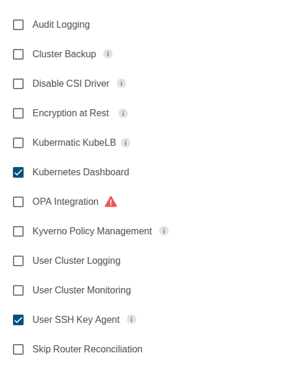

+++
title = "Skip router reconciliation - Openstack"
date = 2025-10-09T10:07:15+02:00
weight = 15
+++

# Disabling Router Reconciliation in OpenStack Clusters
In some scenarios, you may want to disable the automatic router reconciliation performed by the Kubermatic controllers for OpenStack clusters — for example, when you prefer to manage networking resources manually or through custom automation.

You can disable router reconciliation in **two ways**:

## 1. Using the Kubermatic Dashboard (UI)

When creating or editing an OpenStack cluster in the Kubermatic Dashboard, simply enable the “Skip Router Reconciliation” checkbox under the Cluster Settings section.
This prevents the controller from creating or modifying routers automatically for this cluster.




## 2. Using an Annotation on the Cluster Object

If you manage clusters declaratively (e.g., through GitOps or direct API access), you can achieve the same effect by adding the following annotation to your cluster object:
```yaml
metadata:
  annotations:
    reconciliation.kubermatic.k8c.io/skip-router: "true"
```
This annotation instructs the controller to skip any router reconciliation logic for the given cluster.

{}
Disabling router reconciliation means that you are fully responsible for ensuring that network connectivity (including routers, subnets, and routing tables) is correctly configured and maintained in your OpenStack project.
{}