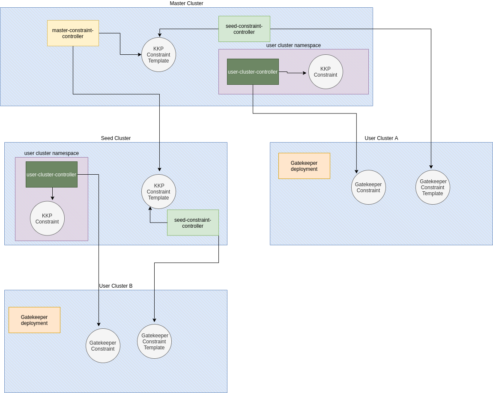
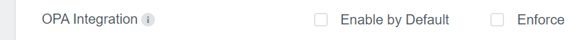
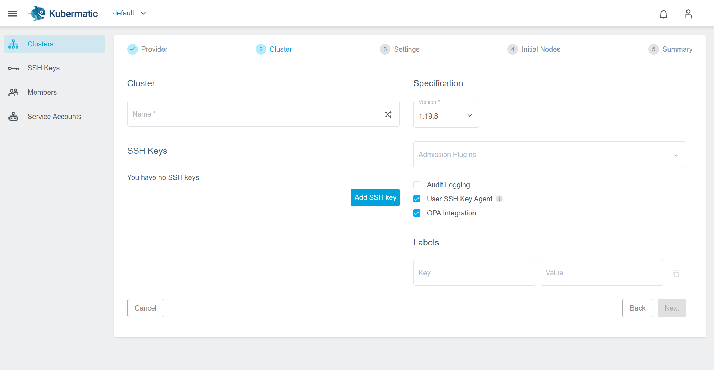
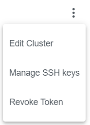
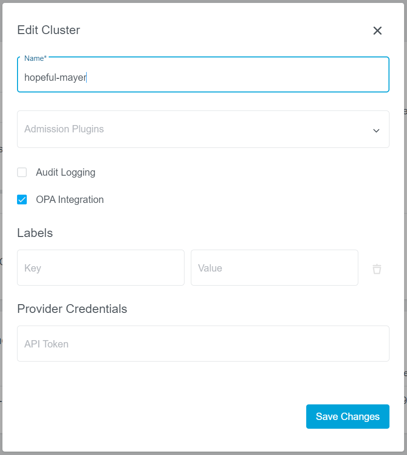

+++
title = "OPA integration"
date = 2021-04-09T12:07:15+02:00
weight = 10

+++

## OPA Integration concept

[Open Policy Agent](https://www.openpolicyagent.org/) (OPA) is an open-source, general-purpose policy engine that unifies policy enforcement across the stack. We are integrating it with using [Gatekeeper](https://github.com/open-policy-agent/gatekeeper), which is an OPA's Kubernetes-native policy engine. 

More info about OPA and Gatekeeper can be read from their docs and tutorials, but the general idea is that by using the
Constraint Template CRD the users can create rule templates whose parameters are then filled out by the corresponding Constraints.


## How OPA integration works in Kubermatic

Kubermatic introduces 2 new CRD's which are related to OPA. Constraint Templates and Constraints. They are mostly wrapping up
the Gatekeeper Constraint Templates and Constraints, but with some additions to make them easier to handle. 



Kubermatic admins can manage the Constraint Templates on the Kubermatic master cluster, and they are automatically synchronized to the Seed clusters,
and then to the User clusters which have OPA-integration enabled. Kubermatic Constraint Templates are cluster-scoped resources.

When a Kubermatic Constraint Template exists, cluster admins and editors can manage the specific Constraints for those Constraint Templates.
The created Kubermatic Constraints for a cluster reside in the user cluster related namespace on the Seed cluster. They are automatically synced
to the user cluster as Gatekeeper Constraints. 

The Gatekeeper Config resource does not have a related CRD on the Kubermatic side and is managed directly on the user cluster.

### Managing Constraint Templates

Constraint Templates are managed by the Kubermatic platform admins. Kubermatic introduces a Kubermatic Constraint Template
wrapper CRD through which the users can interact with the OPA CT's. The Kubermatic master clusters contain the
Kubermatic CT's which designated controllers reconcile to the seed and to user cluster with activated OPA integration as
Gatekeeper CT's.

Example of a Kubermatic Constraint Template:
```yaml
apiVersion: kubermatic.k8s.io/v1
kind: ConstraintTemplate
metadata:
  name: k8srequiredlabels
spec:
  crd:
    spec:
      names:
        kind: K8sRequiredLabels
      validation:
        # Schema for the `parameters` field
        openAPIV3Schema:
          properties:
            labels:
              type: array
              items: 
                type: string
  targets:
    - target: admission.k8s.gatekeeper.sh
      rego: |
        package k8srequiredlabels
        violation[{"msg": msg, "details": {"missing_labels": missing}}] {
          provided := {label | input.review.object.metadata.labels[label]}
          required := {label | label := input.parameters.labels[_]}
          missing := required - provided
          count(missing) > 0
          msg := sprintf("you must provide labels: %v", [missing])
        }
  selector:
    providers:
      - "azure"
      - "aws"
    labelSelector:
      matchLabels:
        filtered: "true"
```

Kubermatic Constraint Template corresponds to the Gatekeeper Constraint Template except the `selector` field which is used for filtering clusters to which the CT will be applied.

#### Constraint Template filtering

Filtering is an EE only feature that allows admins to choose which to which user clusters the Constraint Template will be applied to. 
The selection can be made based on the cluster provider or/and the cluster labels using the label selector.

By default, the Constraint Templates get applied to all clusters with OPA integration enabled. 

#### Deleting Constraint Templates

Deleting Kubermatic Constraint Templates causes all Gatekeeper Constraint Templates on user clusters to be deleted as well.

### Managing Constraints

Constraints are managed similarly to Constraint Templates through Kubermatic CRD wrappers around the Gatekeeper Constraints,
the difference being that Constraints are managed on the user cluster level. Furthermore, due to the way Gatekeeper works,
Constraints need to be associated with a Constraint Template.

Kubermatic Constraint controller reconciles the Kubermatic Constraints on the seed clusters as Gatekeeper Constraints on
the user cluster.

Example of a Kubermatic Constraint:

```yaml
apiVersion: kubermatic.k8s.io/v1
kind: Constraint
metadata:
  name: ns-must-have-gk
  namespace: cluster-zdljwf8j7h
spec:
  constraintType: K8sRequiredLabels
  match:
    kinds:
      - apiGroups: [""]
        kinds: ["Namespace"]
  parameters:
    rawJSON: '{"labels":["gatekeeper"]}'
```

- `constraintType` - must be equal to the name of an existing Constraint Template
- `match` - works the same as [Gatekeeper Constraint matching](https://github.com/open-policy-agent/gatekeeper#constraints)
- `parameters` - holds the rawJSON parameters that are used in Constraints. As in Gatekeeper this can be basically anything,
  Kubermatic just uses it as a raw json string to be able to structure it.
  
### Managing Config

Gatekeeper [Config](https://github.com/open-policy-agent/gatekeeper#replicating-data) can also be managed through Kubermatic.
As Gatekeeper treats it as a kind of singleton CRD resource, Kubermatic just manages this resource directly on the user cluster.

### How to activate OPA integration 

#### Admin Panel for OPA Options

As an admin you will find a few options in the `Admin Panel`. You can access this panel by clicking on the account icon on the top right and select `Admin Panel`.


In here you can see the `OPA Options` with two checkboxes attached.
- `Enable by Default`: Set `OPA Integration` checkbox on cluster creation to enabled by default.
- `Enforce`: Enable to make users unable to edit the checkbox.



#### Activating OPA for specific cluster

To create a new cluster with OPA enabled you only have to enable the `OPA Integration` checkbox during the cluster creation process. It is placed in Step 2 `Cluster` and can be enabled by default as mentioned in the [Admin Panel for OPA Options]() section.
If you don't know how to create a cluster using the Kubermatic Kubernetes Platform follow our [Project and cluster management]() tutorial.



It is also possible to enable - or disable - OPA for an existing cluster. In the cluster detail view simply click on the vertical ellipsis menu and select `Edit Cluster`.



In the appearing dialog you can now enable/disable the OPA Integration.



Or it can be done by editing the Cluster resource directly.

```yaml
apiVersion: kubermatic.k8s.io/v1
kind: Cluster
metadata:
  name: crh4xbxz5f
spec:
...
  humanReadableName: suspicious-mcnulty
  oidc: {}
  opaIntegration: 
    enabled: true
  openshift: {}
...
```

More info on how to work with OPA Integration in the KKP UI can be found in the [OPA Tutorial]()
