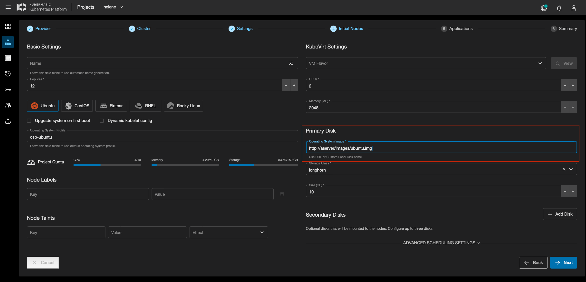
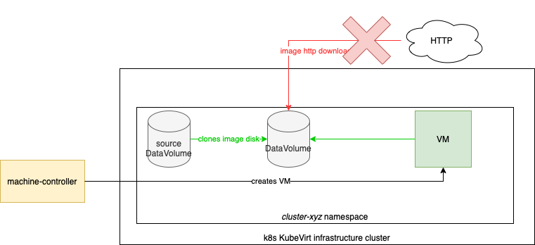
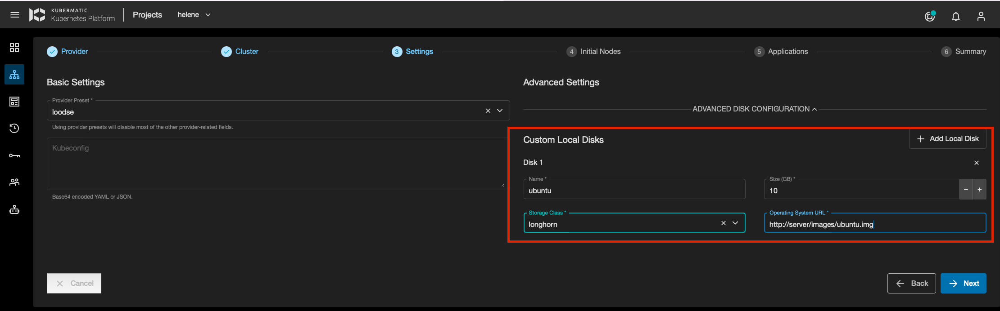

+++
title = "KubeVirt"
date = 2021-02-01T14:46:15+02:00
weight = 7

+++

## KubeVirt (Technology Preview)
Once KubeVirt is installed as what the [official documentation](https://kubevirt.io/quickstart_cloud/) guides, a few
steps should be followed in order to use KubeVirt with KKP.

### StorageClass Requirements
KKP uses [Containerized Data Importer](https://github.com/kubevirt/containerized-data-importer) (CDI) to import images and
provision volumes to launch the VMs. CDI provides the ability to populate PVCs with VM images or other data upon creation.
The data can come from different sources: a URL, a container registry, another PVC (clone), or an upload from a client.
For more information about the requirements of Kubernetes in general and CDI in specific, please follow the documentation
for PV,PVC and DV [here](https://github.com/kubevirt/containerized-data-importer/blob/master/doc/basic_pv_pvc_dv.md).

To initialize a storage class from the KubeVirt infrastructure cluster on a user cluster, add `kubevirt-initialization.k8c.io/initialize-sc: 'true'` annotation to the storage class of your choice. 
This action has to take place before user cluster creation.

### KubeVirt Operator and Containerized Data Importer Version
KKP supports KubeVirt Operator >= 0.19.0 and the Containerized Data Importer >= v1.19.0. There are no hard requirements
to run KubeVirt, however a Kubernetes cluster consists of 3 nodes with 2 CPUs, 4GB of RAM and 30GB of storage, to have a
minimal installation.

### KubeVirt Configuration Requirements
KubeVirt requires the following configuration to be used with KKP.
- In case your KubeVirt namespace has the ConfigMap 'kubevirt-config' then use this ConfigMap for adding the feature gates to it. Look at the path `{.data.feature-gates}`
- Otherwise, add the feature gate to the resource of type `KubeVirt`. There should be a single resource of this type and its name can be chosen arbitrarily.

The configuration KKP requires:
```yaml
apiVersion: kubevirt.io/v1
kind: KubeVirt
metadata:
  name: kubevirt
  namespace: kubevirt
spec:
  configuration:
    developerConfiguration:
      featureGates:
      - DataVolumes
      - SRIOV
      - LiveMigration
      - CPUManager
      - CPUNodeDiscovery
      - Sidecar
      - Snapshot
      - HotplugVolumes
```

More information on the KubeVirt feature gates can be found [here: KubeVirt Feature Gates](https://kubevirt.io/user-guide/operations/activating_feature_gates/#how-to-activate-a-feature-gate)

### Use KKP with KubeVirt
In order to allow KKP to provision VMs(worker nodes) in KubeVirt, users provide the kubeconfig of the Kubernetes cluster
where the KubeVirt cluster is running. Users can add the content of the kubeconfig file in the third step of the cluster
creation. The content should be base64 encoded.

### KKP MachineDeployment Sample
Here is a sample of a MachineDeployment that can be used to provision a VM:

```yaml
apiVersion: "cluster.k8s.io/v1alpha1"
kind: MachineDeployment
metadata:
  name: my-kubevirt-machine
  namespace: kube-system
spec:
  paused: false
  replicas: 1
  strategy:
    type: RollingUpdate
    rollingUpdate:
      maxSurge: 1
      maxUnavailable: 0
  minReadySeconds: 0
  selector:
    matchLabels:
      name: my-kubevirt-machine
  template:
    metadata:
      labels:
        name: my-kubevirt-machine
    spec:
      providerSpec:
        value:
          sshPublicKeys:
            - "<< YOUR_PUBLIC_KEY >>"
          cloudProvider: "kubevirt"
          cloudProviderSpec:
            auth:
              kubeconfig:
                value: '<< KUBECONFIG >>'
            virtualMachine:
              template:
                cpus: "1"
                memory: "2048M"
                primaryDisk:
                  osImage: "<< YOUR_IMAGE_SOURCE >>"
                  size: "10Gi"
                  storageClassName: "<< YOUR_STORAGE_CLASS_NAME >>"
            affinity:
              podAffinityPreset: "" # Allowed values: "", "soft", "hard"
              podAntiAffinityPreset: "" # Allowed values: "", "soft", "hard"
              nodeAffinityPreset:
                type: "" # Allowed values: "", "soft", "hard"
                key: "foo"
                values:
                  - bar
          operatingSystem: "ubuntu"
          operatingSystemSpec:
            distUpgradeOnBoot: false
            disableAutoUpdate: true
      versions:
        kubelet: "1.18.10"
```
#### Node assignment for VMs
To constrain a VM to run on specific KubeVirt cluster nodes, affinity and anti-affinity rules can be used. See above given MachineDeployment example.

#### Creating VM from Presets
To create a VM from existing `VirtualMachineInstancePresets`, add the following configuration under `cloudProviderSpec.virtualMachine` in MachineDeployment:
```yaml
virtualMachine:
  flavor:
    name: "<< VirtualMachineInstancePresets_NAME >>"
  template:
    primaryDisk:
      osImage: "<< YOUR_IMAGE_SOURCE >>"
      size: "10Gi"
      storageClassName: "<< YOUR_STORAGE_CLASS_NAME >>"
```

---
**NOTE**

All the resources related to VM on the KubeVirt cluster will be created in a dedicated namespace.

---

### Advanced disk configuration

For the basic configuration, disk images are imported from a web server, via HTTP download, by specifying a URL when creating a cluster, at the `Inital Nodes` step, in the `Primary Disk` section as shown in the screenshot below.



#### Usage of Custom Local Disk Name instead of URL for disk image

However, it's possible to specify a Custom Local Disk name instead of a URL. This should be the name of a DataVolume that already exists in the cluster dedicated namespace of the KubeVirt infrastructure cluster (*cluster-zyz* namespace).
When specifying a DataVolume name instead of a URL, **the image disk will be cloned** instead of being downloaded from the HTTP source URL.  

**NOTE:** the source DataVolume must exist in the *cluster-xyz* namespace where the VM is created. Cloning across namespaces is not allowed.




The source DataVolume can be created *manually* (not from KKP) by the user in the *cluster-xyz* namespace, or it can also be created using KKP when creating the cluster at the `Settings` step, with the `Advanced Disk configuration` panel.



In this panel, the user can add several Custom Local Disks (DataVolumes).
For each of them, the user must specify:
- the disk name (DataVolume name, must be compliant with [Kubernetes object names constraints](https://kubernetes.io/docs/concepts/overview/working-with-objects/names/))
- the Storage Class from a dropdown list
- the disk size
- the image disk URL for image download.

The same Custom Local Disk can be used as source of cloning for all the VMs (same MachineDeployment or not) in the same cluster.

---


### Enable KubeVirt monitoring
Install [prometheus-operator](https://github.com/prometheus-operator/prometheus-operator) on KubeVirt cluster.
Then update `KubeVirt` resource similar to this example:
```yaml
apiVersion: kubevirt.io/v1
kind: KubeVirt
metadata:
  name: kubevirt
spec:
  monitorNamespace: "<<PROMETHEUS_NAMESPACE>>"
  monitorAccount: "<<PROMETHEUS_SERVICE_ACCOUNT_NAME>>"
```
For more details refer this [document](https://kubevirt.io/user-guide/operations/component_monitoring/).

After completing the above setup, you can import this [KubeVirt-Dasboard](https://github.com/kubevirt/monitoring/tree/main/dashboards/grafana) in Grafana to monitor `KubeVirt` components.

Follow the below steps to import the dashboard in Grafana:
- Download this [KubeVirt-Dasboard](https://github.com/kubevirt/monitoring/tree/main/dashboards/grafana).
- Open Grafana and click on `+` icon on the left side of the application. After that select `Import` option.
- In the below window you can upload the [KubeVirt-Dasboard](https://github.com/kubevirt/monitoring/tree/main/dashboards/grafana) `json` file.
 


