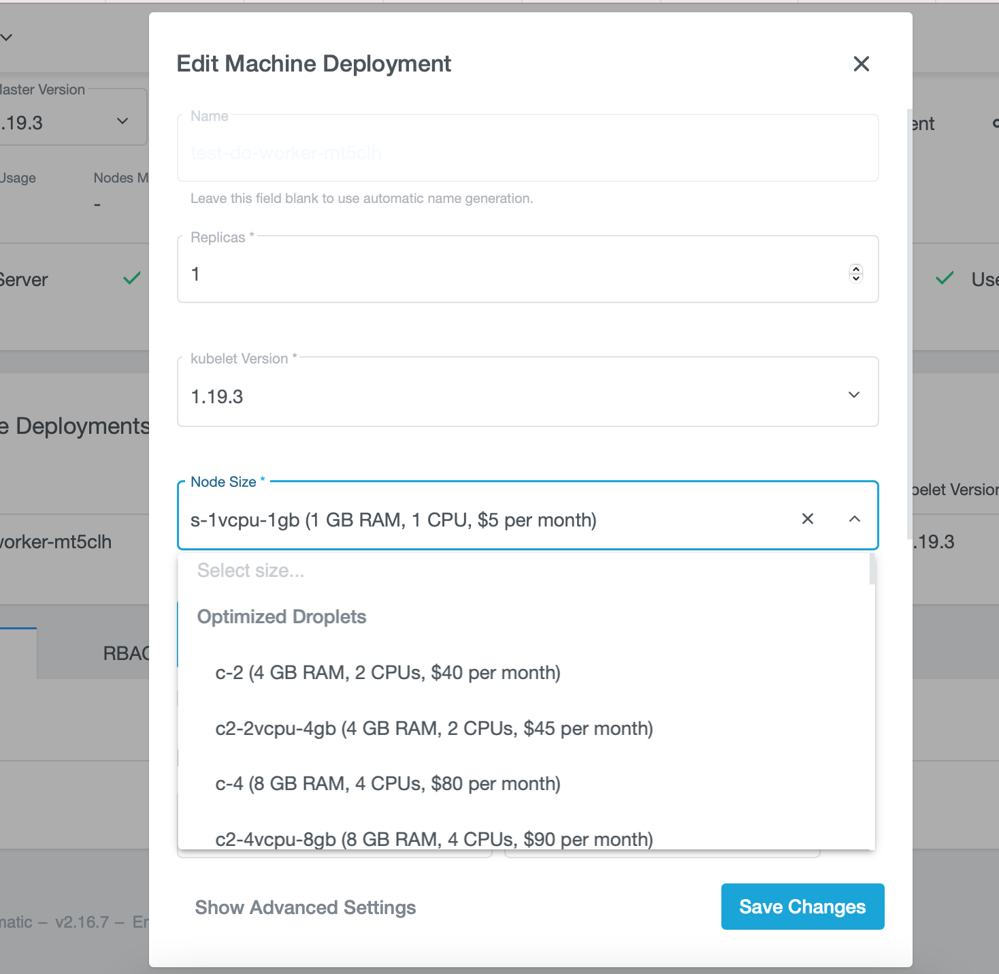

# Manage Worker Nodes via UI

## Edit the Machine Deployment

To add or delete a worker node you can easily edit the machine deployment in your cluster. Navigate to the cluster overview, scroll down and hover over `Machine Deployments` and click on the edit icon next to the deployment you want to edit.

In the popup dialog you can now change the worker nodes.

## Edit labels and taints 

If you scroll down in the dialog, you can also edit node labels and taints.

