+++
title = "Open Policy Agent (OPA) via UI"
date = 2021-02-10T12:07:15+02:00
weight = 10

+++

## Open Policy Agent (OPA)

[Open Policy Agent](https://www.openpolicyagent.org/) (OPA) is an open-source, general-purpose policy engine that unifies policy enforcement across the stack. We are integrating it with using [Gatekeeper](https://github.com/open-policy-agent/gatekeeper), which is an OPA's Kubernetes-native policy engine. More info about OPA and Gatekeeper can be read from their docs and tutorials.


### Admin Panel for OPA Options

As an admin you will find a few options in the `Admin Panel`. You can access this panel by clicking on the account icon on the top right and select `Admin Panel`.

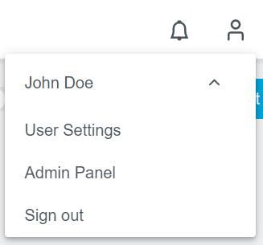

In here you can see the `OPA Options` with two checkboxes attached.
- `Enable by Default`: Set `OPA Integration` checkbox on cluster creation to enabled by default. 
- `Enforce`: Enable to make users unable to edit the checkbox.

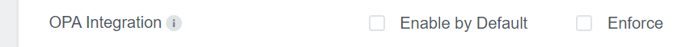

The Admin Panel also offers you the possibility to specify Constraint Templates.

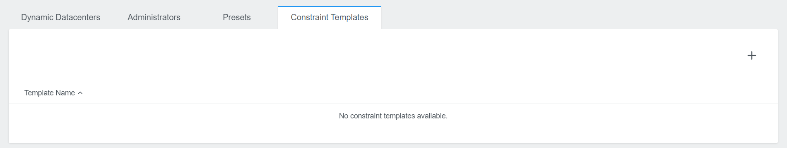


### Cluster Details View

The cluster details view is extended by some more information if OPA is enabled.
- `OPA Integration` in the top area is indicating if OPA is enabled or not.
- `OPA Gatekeeper Controller` and `OPA Gatekeeper Audit` provide information about the status of those controllers.
- `OPA Constraints` and `OPA Gatekeeper Config` are added to the tab menu on the bottom. More details in the following sections.

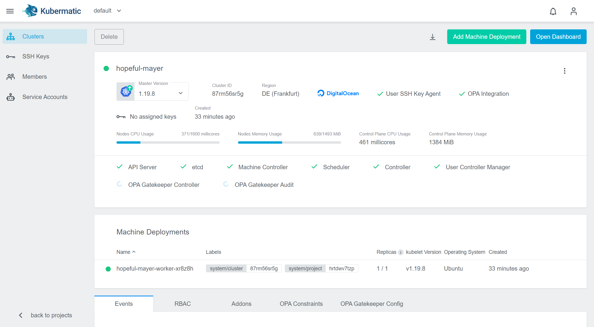


### Activating OPA

To create a new cluster with OPA enabled you only have to enable the `OPA Integration` checkbox during the cluster creation process. It is placed in Step 2 `Cluster` and can be enabled by default as mentioned in the [Admin Panel for OPA Options]() section. 
If you don't know how to create a cluster using the Kubermatic Kubernetes Platform follow our [Project and cluster management]() tutorial.

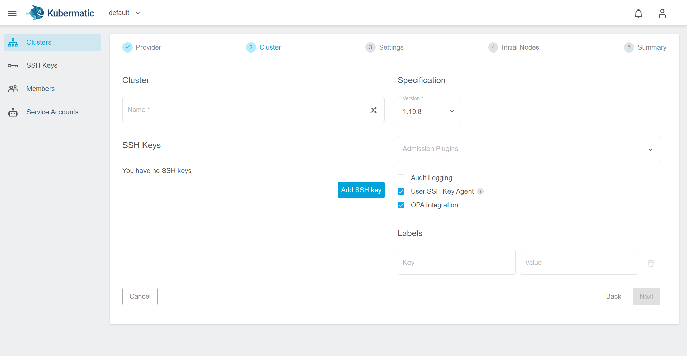

It is also possible to enable - or disable - OPA for an existing cluster. In the cluster detail view simply click on the vertical ellipsis menu and select `Edit Cluster`.


In the appearing dialog you can now enable/disable the OPA Integration. 

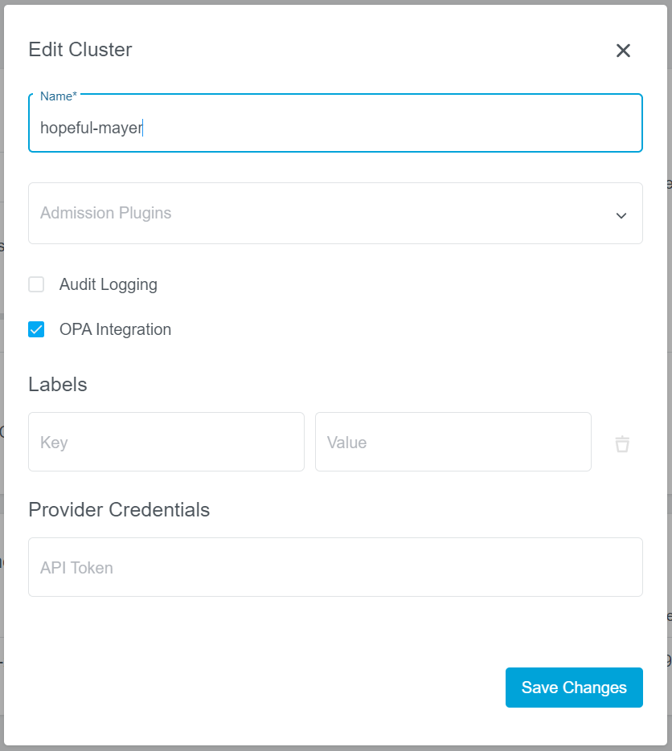


### Operating OPA

#### Constraint Templates

Constraint Templates allow you to declare new Constraints. They are intended to work as a schema for constraint parameters and enforce their behavior.
To add a new constraint template click on the `+` icon on the right. A new dialog will appear, where you can specify the spec of the template:

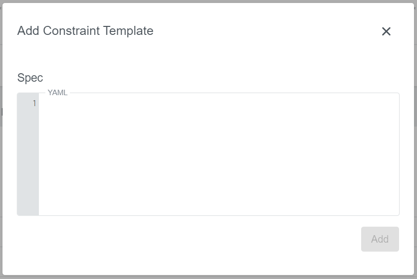

Following example requires all labels that are described by the constraint to be present:
```
crd:
  spec:
    names:
      kind: K8sRequiredLabels
    validation:
      # Schema for the `parameters` field
      openAPIV3Schema:
        properties:
          labels:
            type: array
            items: string
targets:
  - target: admission.k8s.gatekeeper.sh
    rego: |
      package k8srequiredlabels

      violation[{"msg": msg, "details": {"missing_labels": missing}}] {
        provided := {label | input.review.object.metadata.labels[label]}
        required := {label | label := input.parameters.labels[_]}
        missing := required - provided
        count(missing) > 0
        msg := sprintf("you must provide labels: %v", [missing])
      }
```

Just click on `Add` to create the constraint template. In this table you can also edit or delete it again if needed.

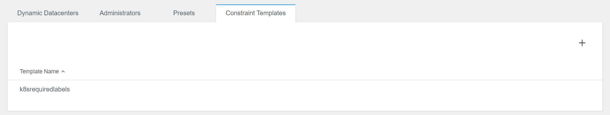


#### Constraints

Constraints are the filler for rules that are defined by the constraint templates. Constraints provide the parameters which are used in the Constraint Template rule. 

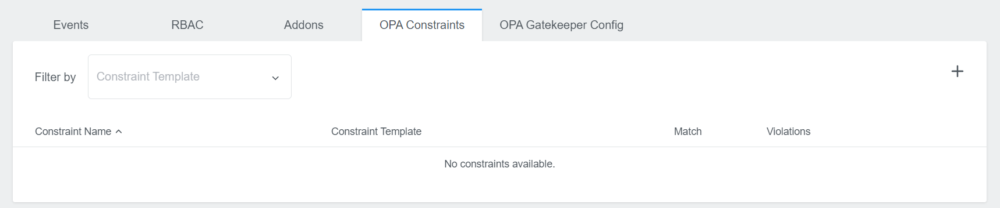

To add a new constraint template click on the `+` icon on the right. A new dialog will appear, where you can specify the name, the constraint template and the spec:

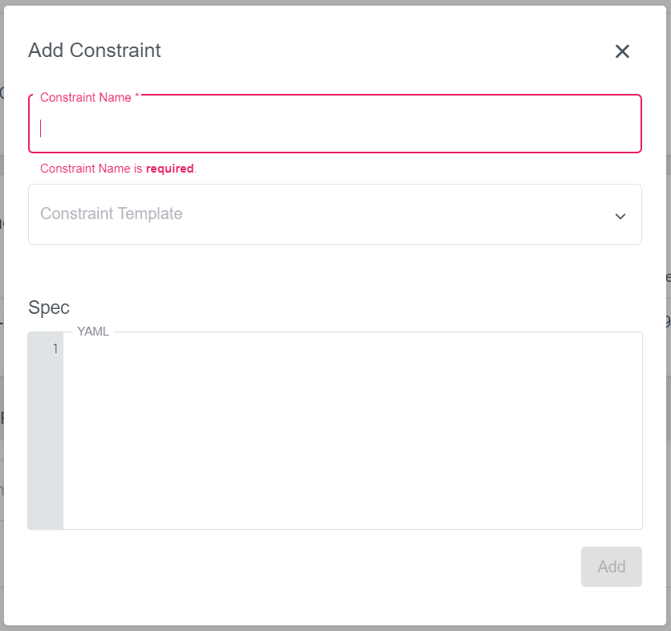

Following example will make sure that the gatekeeper label is defined on all namespaces, if you are using the `K8sRequiredLabels` constraint template from above:
```
match:
  kinds:
    - apiGroups: [""]
      kinds: ["Namespace"]
parameters:
  rawJSON: '{"labels":["gatekeeper"]}'
```

Just click on `Add` to create the constraint. In this table you can also edit or delete it again if needed.

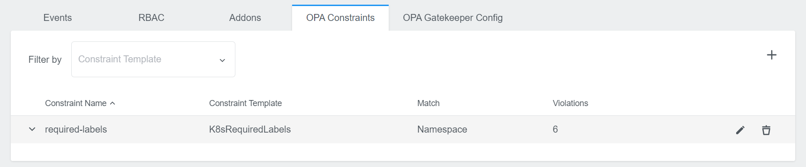

It also shows you possible violations. Click on the row to expand the view and to see all violations in detail.

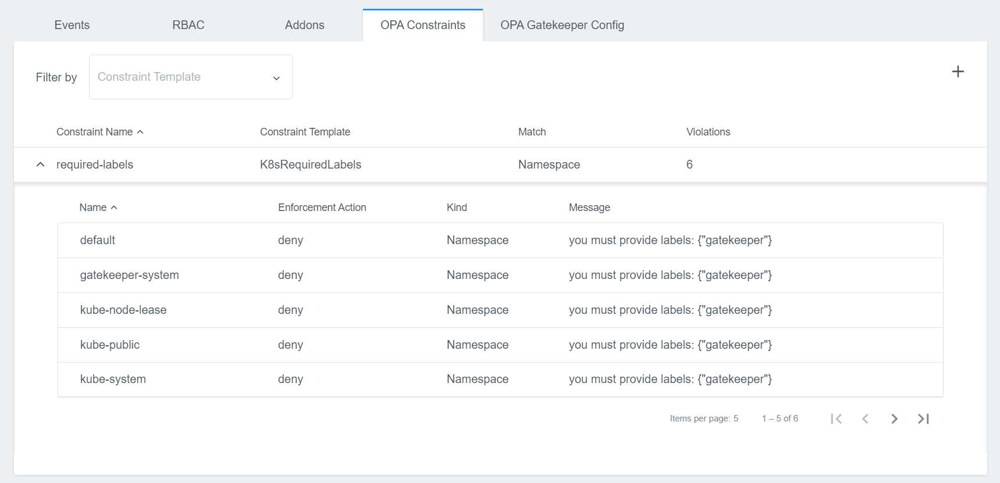


#### Gatekeeper Config

In this area you have the possibility to define a Gatekeeper Config. It is not required, but might be needed for some constraints that need more access.
Initially you will only see the `Add Gatekeeper Config` button. 
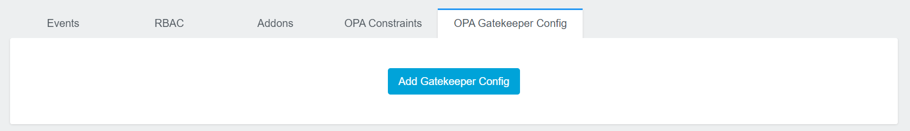

Click on this button to create a config. A new dialog will appear, where you can insert your spec:
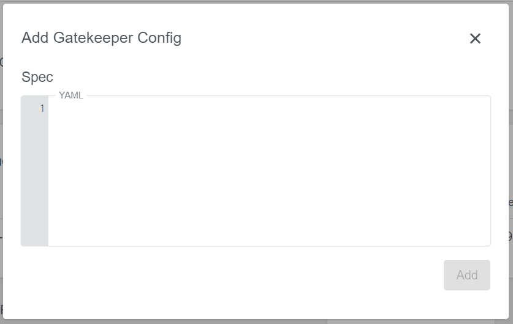

Following example will dynamically update what objects are synced:
```
sync:
  syncOnly:
    - group: ""
      version: "v1"
      kind: "Namespace"
    - group: ""
      version: "v1"
      kind: "Pod"
```

Just click on `Add` to create the config. The view then displays the config parts you specified. You can also edit and delete it later.
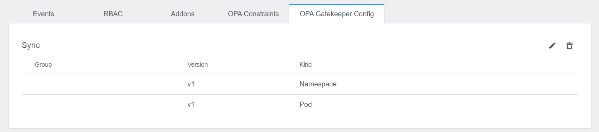
