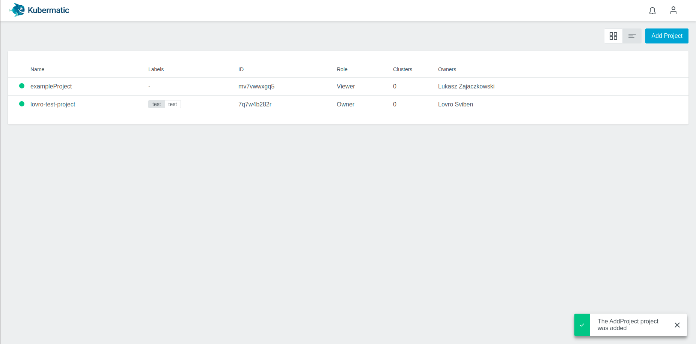
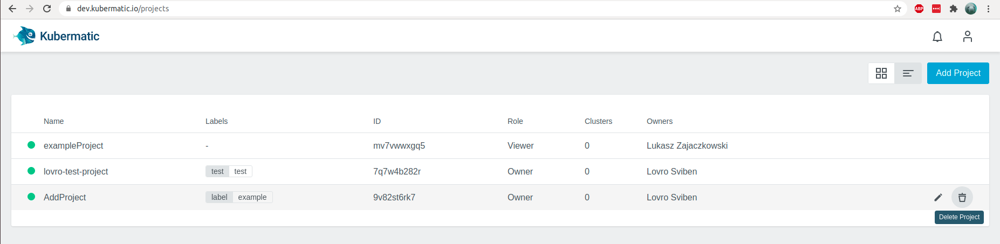
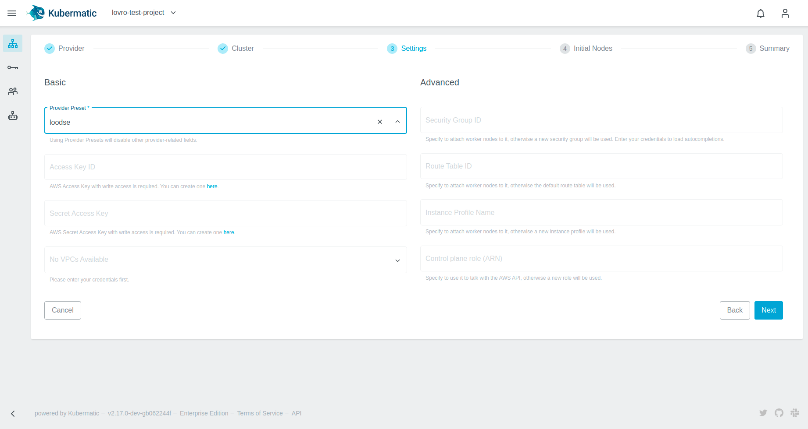
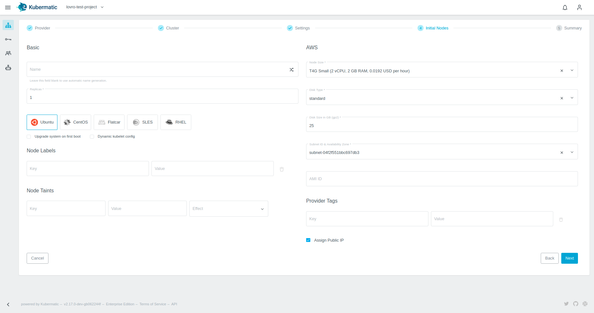
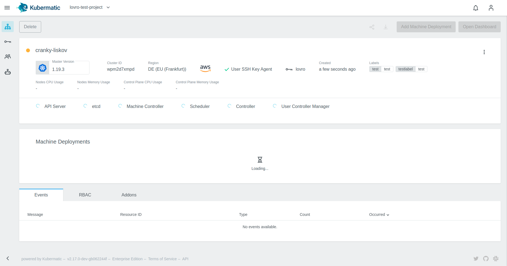
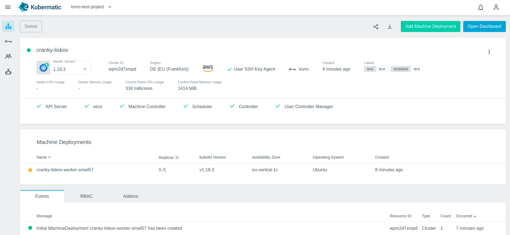

+++
title = "Project and cluster management"
date = 2021-02-10T12:07:15+02:00
weight = 10

+++

## Project Management

### Create a New Project

Clusters are assigned to projects, so in order to create a cluster, you must create a project first. In the Kubermatic Kubernetes Platform (KKP) dashboard, choose `Add Project`:

Assign your new project a name:

You can assign key-label pairs to your projects. These will be inherited by the clusters and cluster nodes in this project. You can assign multiple key-label pairs to a project.

After you click `Save`, the project will be created. If you click on it now, you will see options for adding clusters, managing project members, service accounts and SSH keys.

### Delete a Project

To delete a project, move the cursor over the line with the project name and click the trash bucket icon.

### Add an SSH key

If you want to ssh into the project VMs, you need to provide your SSH public key. SSH keys are tied to a project. During cluster creation you can choose which SSH keys should be added to nodes. To add an SSH key, navigate to `SSH Keys` in the Dashboard and click on `Add SSH Key`:

This will create a pop up. Enter a unique name and paste the complete content of the SSH key into the respective field:

After you click on `Add SSH key`, your key will be created and you can now add it to clusters in the same project.

## Manage clusters

### Create cluster

To create a new cluster, open the Kubermatic Kubernetes Platform (KKP) dashboard, choose a project, select the menu entry `Clusters` and click the button `Add Cluster` on the top right.

Choose the cloud provider and the datacenter:

Enter a name for your cluster and click Next. Here you can also activate [Audit Logging](https://kubernetes.io/docs/tasks/debug-application-cluster/audit/) and [Pod Security Policy](https://kubernetes.io/docs/concepts/policy/pod-security-policy/), assign labels and SSH keys to your cluster, and choose a Kubernetes version.

**Note:**
Disabling the User SSH Key Agent at this point can not be reverted after the cluster creation, which means that ssh key management after creation for this cluster will have to be done manually. More info in [`User SSH Key Agent`]() 

In the next step of the installer, enter the credentials for the chosen provider. A good option is to use Kubermatic Presets here, to putting in credentials for every cluster creation:

In the Initial nodes section of the wizard you can setup the size, settings and amount of nodes your cluster will start with. Also you can assign labels to your nodes. You can also set [node taints](https://kubernetes.io/docs/concepts/configuration/taint-and-toleration/) which is a property that allows your node to repel certain pods.

Lastly, a cluster summary screen will be presented so that you can check out if everything looks ok.

You will then be forwarded to the cluster page where you can view the cluster creation process:

After all of the master components are ready, your cluster will create the configured number of worker nodes. Fully created nodes will be marked with a green dot, pending ones with a yellow circle. Clicking on the download icon lets you download the kubeconfig to be able to use `kubectl` with your cluster.

### Upgrade Cluster

When an upgrade for the cluster is available, a little dropdown arrow will be shown besides the Master Version on the cluster's page:

To start the upgrade, just click on the link and choose the desired version:

After the update is initiated, the master components will be upgraded in the background. Check the checkbox for `Upgrade Machine Deployments` if you wish to upgrade the existing worker nodes as well.

### Edit Cluster

Clusters can edited by pressing the ellipsis button on the right:

### Delete Cluster

To delete a cluster, navigate to `Clusters` and choose the cluster that you would like to delete. On the top left is a button `Delete`:

To confirm the deletion, type the name of the cluster into the text box:

The cluster will switch into deletion state afterwards, and will be removed from the list when the deletion succeeds.

## Add a New Machine Deployment

To add a new machine deployment navigate to your cluster view and click on the `Add Machine Deployment` button:

In the popup you can then choose the number of nodes (replicas), kubelet version, etc for your newly created machine deployment. All nodes created in this machine deployment will have the chosen settings.

## Edit the Machine Deployment

To add or delete a worker node you can easily edit the machine deployment in your cluster. Navigate to the cluster overview, scroll down to `Machine Deployments` and click on the edit icon next to the machine deployment you want to edit:

In the popup dialog you can now in- or decrease the number of worker nodes which are managed by this machine deployment, as well as their operating system, used image etc.:

