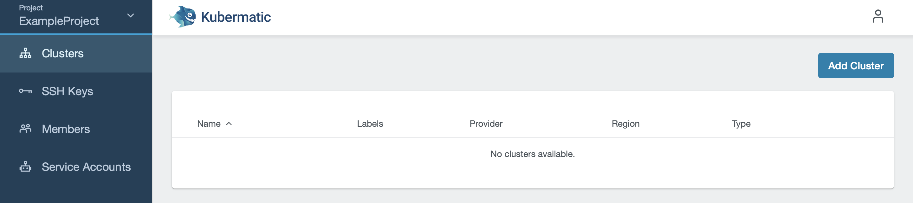
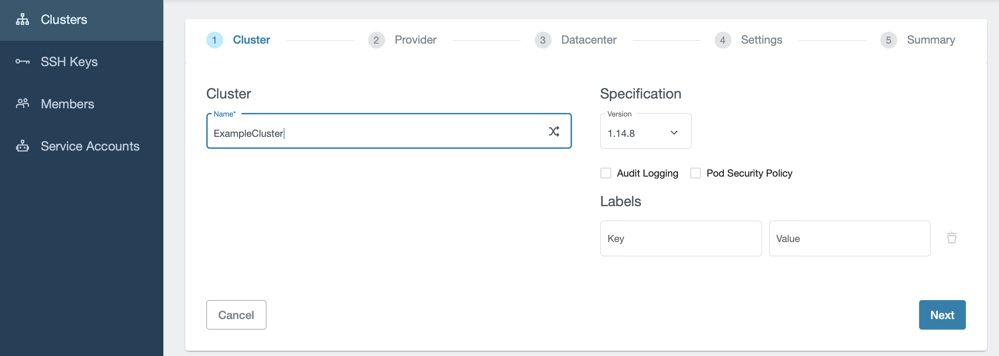
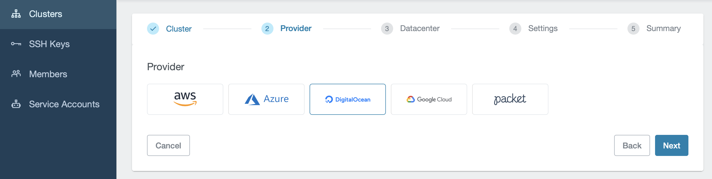
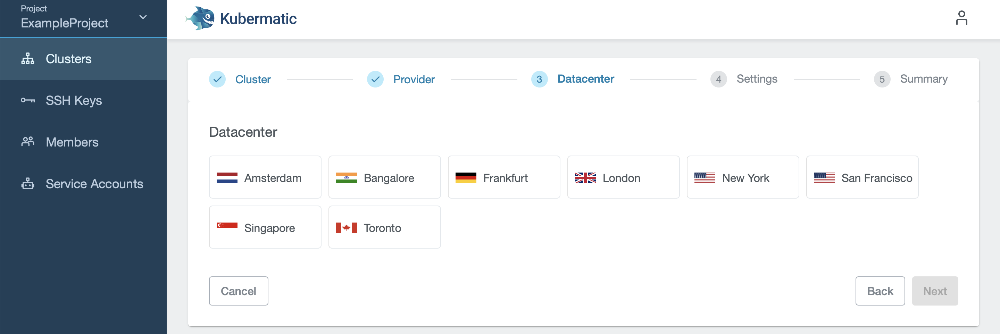
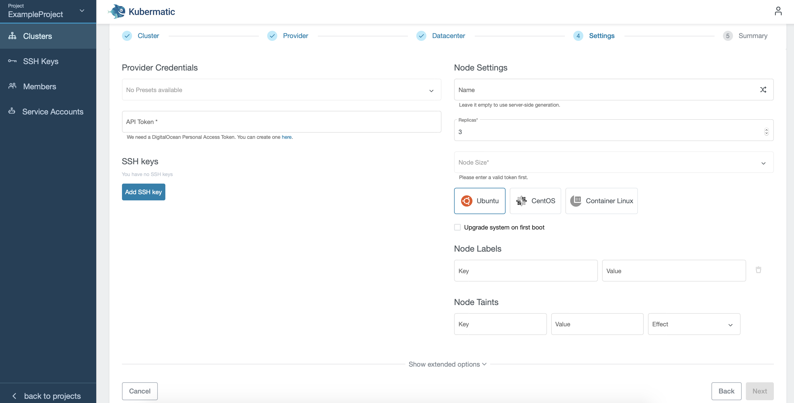
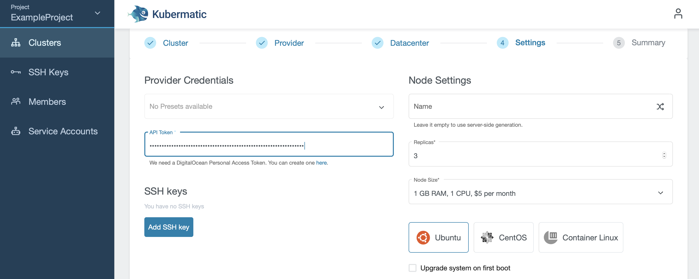
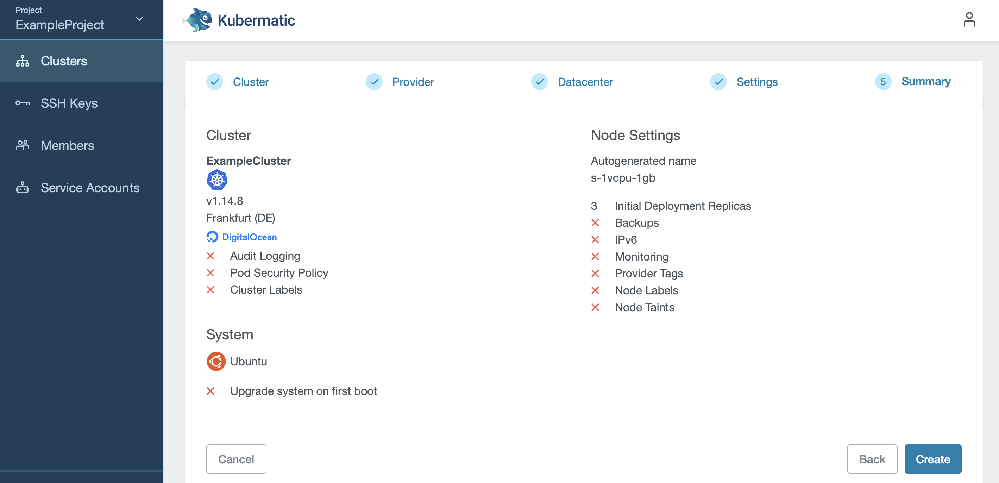
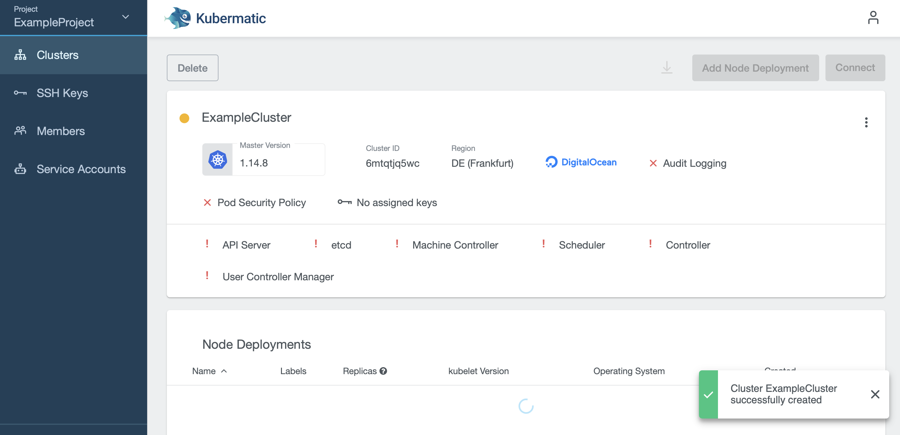

+++
title = "Create a New Cluster"
date = 2019-10-23T12:07:15+02:00
weight = 30
pre = "<b></b>"
+++

To create a new cluster, open the Kubermatic dashboard, choose a project, select the menu entry `Clusters` and click the button `Add Cluster` on the top right.

 Enter a name for your cluster and click Next. Here you can also activate [Audit Logging](https://kubernetes.io/docs/tasks/debug-application-cluster/audit/) and [Pod Security Policy](https://kubernetes.io/docs/concepts/policy/pod-security-policy/), assign labels to your cluster, and choose a Kubernetes version.

Choose the cloud provider:

and the datacenter region closest to you:

In the next step of the installer, enter the API token into the `Provider credentials` field. If you chose DigitalOcean, your view will look like this:

If you entered a valid API token, your node settings will be pre-filled:

Scroll down to choose or add an SSH key. You can choose one of the keys you already created for the project, or create a new one.

You can assign labels to your nodes. You can also set [node taints](https://kubernetes.io/docs/concepts/configuration/taint-and-toleration/) which is a property that allows your node to repel certain pods.

The chosen SSH key will be used for authentication for the default user (e.g. `ubuntu` for Ubuntu images) on all worker nodes. When you click on `Next`, you will see a summary and the cluster creation will start after you confirm by clicking `Create`. 

You will then be forwarded to the cluster creation page where you can view the cluster creation process:

After all of the master components are ready, your cluster will create the configured number of worker nodes. Fully created nodes will be marked with a green dot, pending ones with a yellow circle. Clicking on the download icon lets you download the kubeconfig to be able to use `kubectl` with your cluster.
