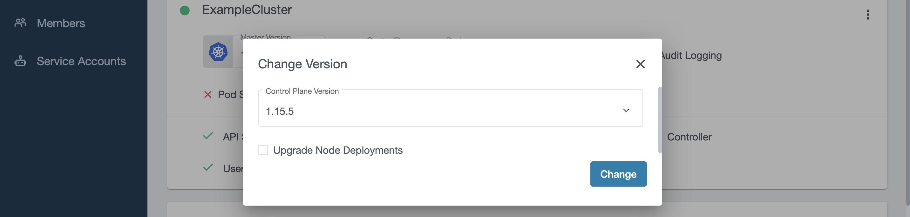

+++
title = "Upgrade a Cluster"
date = 2019-11-06T12:07:15+02:00
weight = 40
pre = "<b></b>"
+++

## Upgrade Master Components

When an upgrade for the master components is available, a little dropdown arrow will be shown besides the Master Version on the cluster's page:

To start the upgrade, just click on the link and choose the desired version:

After the update is initiated, the master components will be upgraded in the background. Check the checkbox for `Upgrade Node Deployments` if you wish to upgrade the existing worker nodes as well.
