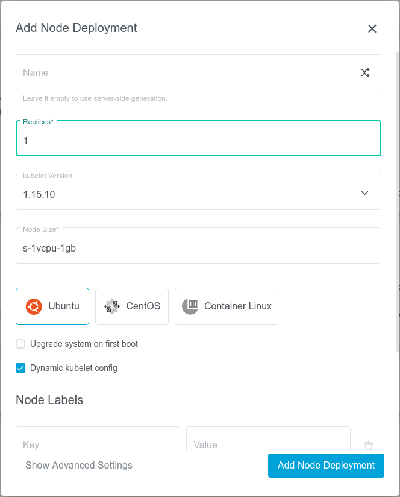

+++
title = "Dynamic Kubelet configuration"
date = 2020-04-01T12:00:00+02:00
weight = 5
pre = "<b></b>"
+++

Dynamic kubelet configuration allows for live reconfiguration of some or all nodes' kubelet options.

### See Also
* https://kubernetes.io/blog/2018/07/11/dynamic-kubelet-configuration/</li>
* https://kubernetes.io/docs/tasks/administer-cluster/reconfigure-kubelet/</li>
* https://github.com/kubernetes/enhancements/issues/281</li>

### Enabling

To enable dynamic kubelet configuration, mark the `Dynamic kubelet config` checkbox when creating a Machine Deployment. Nodes created by such a deployment will be automatically configured to look for a configmap named `kubelet-config-<k8s-version>` (e.g. `kubelet-config-1.17`) in the `kube-system` namespace.

Normally these configmaps for different versions are created with a set of healthy default options by Kubermatic's default `kubelet-configmap` addon. However, if you want to customize the settings, you can replace the default addon with your own. You can also alter the `configSource` parameter of the Machine Deployment to point the kubelet to another config map - that way you can have multiple configurations for multiple sets of nodes.

{}
The dynamic kubelet configuration is a beta feature in both Kubernetes and Kubermatic. Refer to the Kubenetes documentation for more information.
{}