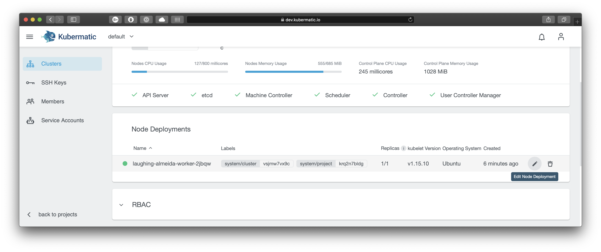
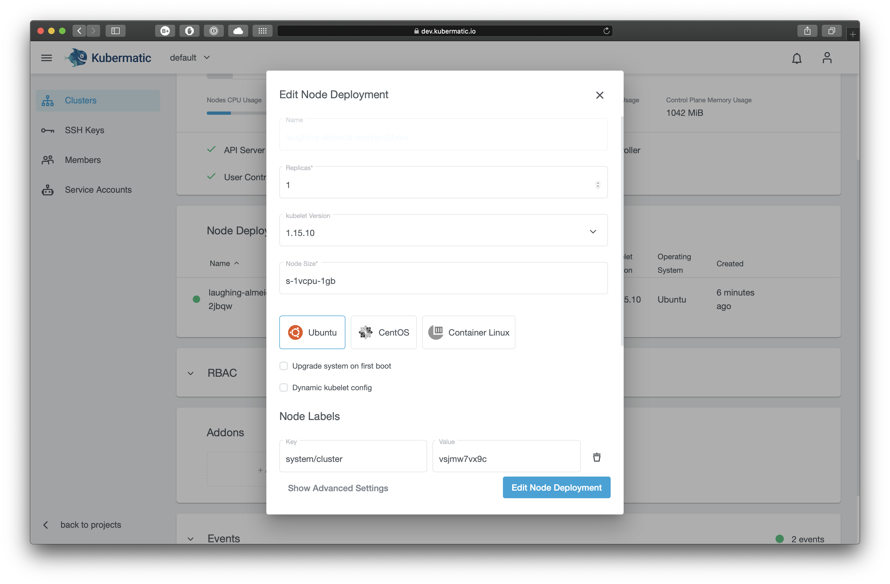

+++ 
title = "Node deployments" 
date = 2019-12-16T12:07:15+02:00 
weight = 80 
+++

## Add a New Node Deployment

To add a new node deployment navigate to your cluster view and click on the `Add Node Deployment` button:

In the popup you can then choose the number of nodes (replicas), kubelet version, etc for your newly created node deployment. All nodes created in this node deployment will have the chosen settings.

## Edit the Node Deployment

To add or delete a worker node you can easily edit the node deployment in your cluster. Navigate to the cluster overview, scroll down to `Node Deployments` and click on the edit icon next to the node deployment you want to edit:

In the popup dialog you can now in- or decrease the number of worker nodes which are managed by this node deployment, as well as their operating system, used image etc.:

