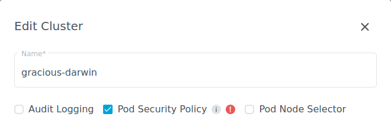

+++
title = "Pod Security Policy"
date = 2020-04-02T12:07:15+02:00
weight = 130
+++

[Pod Security Policy](https://kubernetes.io/docs/concepts/policy/pod-security-policy/), (PSP), is a key security feature in Kubernetes. It allows cluster administrators to set [granular controls](https://kubernetes.io/docs/concepts/policy/pod-security-policy/#policy-reference) over security sensitive aspects of pod and container specs.

PSP is implemented using an optional admission controller that's disabled by default. It's important to have an initial authorizing policy on the cluster _before_ enabling the PSP admission controller.
This is also true for existing clusters. Without an authorizing policy, the controller will prevent all pods from being created on the cluster.

PSP objects are cluster-level objects. They define a set of conditions that a pod must pass to be accepted by the PSP admission controller. The most common way to apply this is using RBAC. For a pod to use a specific Pod Security Policy, the pod should run using a Service Account or a User that has `use` permission to that particular Pod Security policy.

## Kubermatic Support

### User Cluster Level Support

Kubermatic provides support for enabling PSP during cluster creation using a simple switch:

For existing clusters, it's also possible to enable/disable PSP:

{}
Activating Pod Security Policy will mean that a lot of Pod specifications, Operators and Helm charts will not work out of the box. Kubermatic will apply a default authorizing policy to prevent this. Additionally, all Kubermatic user-clusters are configured to be compatible with enabled PSPs. Make sure that you know the consequences of activating this feature on your workloads.
{}

### Datacenter Level Support
It is also possible to enforce enabling Pod Security Policies on the datacenter level. In this case, user cluster level configuration will be ignored, and PSP will be enabled for all user clusters in the datacenter.

To enable this, you will need to update your [Seed Cluster CRD](), and set `enforcePodSecurityPolicy` to `true` in the datacenter spec.

{}
For legacy versions of Kubermatic you will need to edit the [datacenters.yaml]() file instead, and set `enforcePodSecurityPolicy` to `true` in the datacenter spec.
{}

#### Using Pod Security Policies

See the [official Pod Security Policy documentation](https://kubernetes.io/docs/concepts/policy/pod-security-policy/#example) for a detailed usage example.
