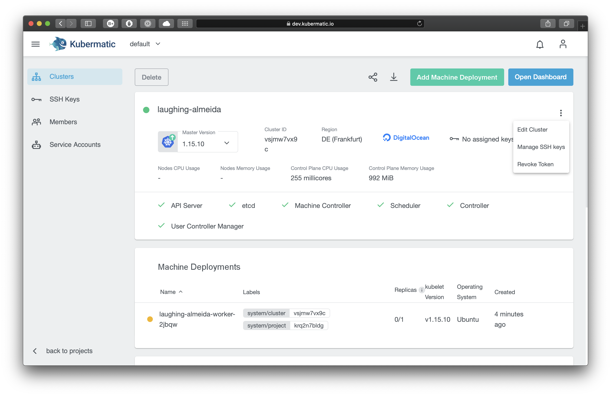
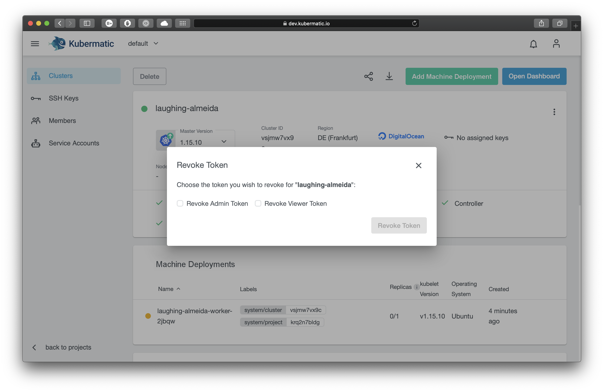

+++
title = "Download the kubeconfig"
date = 2019-11-13T12:07:15+02:00
weight = 60
+++

To download the kubeconfig, navigate to `Clusters` and select the correct cluster. On the top right you can find a download button:

You can revoke access for already downloaded kubeconfigs by revoking the token on the cluster detail page. To do so, click on the three-dot settings icon on the right to see the option `Revoke Token`:

Users in the groups `Owner` and `Editor` have an admin token in their kubeconfig. Users in the group `Viewer` have a viewer token. Revoking the token for a user group means the kubeconfig becomes unusable for users in this group and they need to download it again. Using `kubectl` with the invalid kubeconfig will result in an error message. You can see which group every project member belongs to on the `Members` page.

